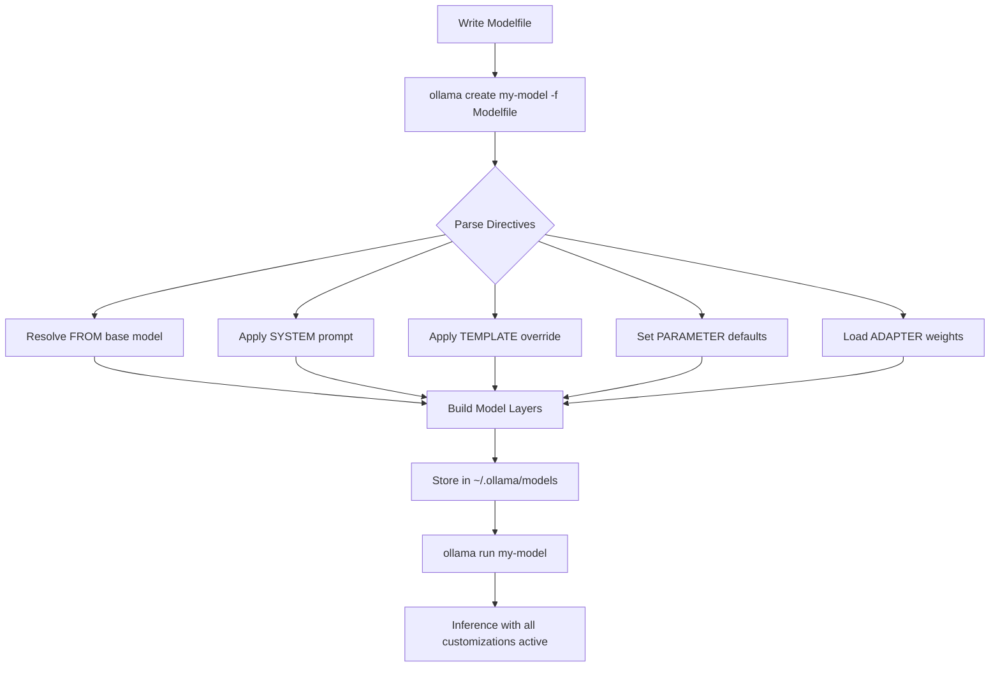

# Chapter 5: Modelfiles, Templates, and Custom Models

Welcome to **Chapter 5: Modelfiles, Templates, and Custom Models**. In this part of **Ollama Tutorial: Running and Serving LLMs Locally**, you will build an intuitive mental model first, then move into concrete implementation details and practical production tradeoffs.


> Build tailored models with custom system prompts, templates, parameters, and adapters.

One of the most powerful features of Ollama is the ability to create custom models from a simple text file called a **Modelfile**. Think of it as a Dockerfile, but for language models: you declare a base model, layer on your own system prompt, tweak sampling parameters, and optionally apply fine-tuned adapter weights. The result is a reusable, shareable, versioned model that anyone on your team can run with a single command.

In this chapter we will walk through every Modelfile directive, build three complete persona models from scratch, explore LoRA adapter integration, master the template syntax, and learn how to test and validate your custom builds before shipping them to production.

## How the Modelfile Build Process Works

The diagram below shows what happens when you run `ollama create`.



Every directive you add becomes a layer in the final model. The base weights come from `FROM`, and everything else is metadata and configuration that Ollama applies at load time.

## Modelfile Directive Reference

Here is the complete list of directives you can use in a Modelfile.

### FROM -- The Base Model

Every Modelfile must start with `FROM`. This tells Ollama which pre-existing model to use as the foundation.

```
FROM llama3
FROM mistral:7b-instruct
FROM codellama:13b
FROM ./my-local-weights.gguf
```

You can reference a model already pulled into Ollama by name, pin a specific tag for reproducibility, or point to a local GGUF file on disk.

### SYSTEM -- The System Prompt

The `SYSTEM` directive sets a default system prompt that is prepended to every conversation. This is the single most impactful customization you can make.

```
SYSTEM "You are a senior Python developer. Always include type hints and docstrings."
```

For multi-line system prompts, use triple quotes:

```
SYSTEM """
You are a helpful data analyst.
- Always respond with well-formatted tables when presenting numbers.
- Cite your reasoning step by step.
- If you are unsure, say so rather than guessing.
"""
```

### TEMPLATE -- Prompt Formatting

The `TEMPLATE` directive controls how the user prompt, system message, and assistant response are assembled into the raw text that the model sees. Different model families expect different prompt formats.

```
TEMPLATE """
{{ if .System }}<|system|>
{{ .System }}<|end|>
{{ end }}{{ if .Prompt }}<|user|>
{{ .Prompt }}<|end|>
{{ end }}<|assistant|>
{{ .Response }}<|end|>
"""
```

We cover template syntax in detail later in this chapter.

### PARAMETER -- Runtime Defaults

Set default inference parameters that take effect every time the model is loaded. Users can still override these at request time via the API.

```
PARAMETER temperature 0.3
PARAMETER num_ctx 8192
PARAMETER top_p 0.9
PARAMETER top_k 40
PARAMETER repeat_penalty 1.1
PARAMETER num_predict 1024
PARAMETER stop "<|end|>"
PARAMETER stop "<|user|>"
```

### ADAPTER -- LoRA and Fine-Tune Weights

Apply adapter weights on top of the base model. We cover this in depth in the LoRA section below.

```
ADAPTER ./adapters/my-lora.gguf
```

### Metadata Directives

These do not affect inference, but help you document and organize models.

```
LICENSE "MIT"
```

## Complete Worked Examples -- Three Personas

Let us build three practical, production-ready persona models step by step. Each example includes the full Modelfile, the build command, example prompts, and expected behavior.

### Persona 1: Code Reviewer

This model acts as a meticulous code reviewer. It reads code snippets and returns structured feedback with severity levels.

Create a file named `Modelfile.code-reviewer`:

```
FROM llama3

SYSTEM """
You are a senior staff engineer conducting a code review.
For every piece of code the user submits, respond with:

1. **Summary** -- one sentence describing what the code does.
2. **Issues** -- a numbered list. Each item has:
   - Severity: critical / warning / nit
   - Line reference (if possible)
   - Description of the problem
   - Suggested fix with a short code snippet
3. **Positives** -- things the author did well.
4. **Verdict** -- Approve, Request Changes, or Needs Discussion.

Be constructive, specific, and concise. Never be rude.
"""

PARAMETER temperature 0.2
PARAMETER num_ctx 8192
PARAMETER top_p 0.9
PARAMETER repeat_penalty 1.1
PARAMETER num_predict 2048
```

Build and test it:

```bash
# Build the model
ollama create code-reviewer -f Modelfile.code-reviewer

# Test with a sample prompt
ollama run code-reviewer <<'EOF'
Review this Python function:

def calc(x,y,op):
    if op == "add": return x+y
    elif op == "sub": return x-y
    elif op == "mul": return x*y
    elif op == "div": return x/y
EOF
```

You should see structured feedback mentioning missing type hints, no handling for division by zero, magic strings instead of an enum, and positive notes about simplicity.

### Persona 2: Data Analyst

This model specializes in answering data questions with tables, SQL, and step-by-step statistical reasoning.

Create a file named `Modelfile.data-analyst`:

```
FROM llama3

SYSTEM """
You are a senior data analyst with deep expertise in SQL, pandas, and statistics.

Rules:
- When the user asks a data question, reason step by step.
- Present numerical results in Markdown tables.
- When writing SQL, use standard ANSI SQL and add comments.
- When writing Python, use pandas idioms and include column names.
- If a question is ambiguous, state your assumptions before answering.
- Always suggest a follow-up analysis the user might find useful.
"""

PARAMETER temperature 0.3
PARAMETER num_ctx 8192
PARAMETER top_p 0.85
PARAMETER repeat_penalty 1.05
PARAMETER num_predict 2048

FORMAT json
```

Build and test it:

```bash
# Build
ollama create data-analyst -f Modelfile.data-analyst

# Test
ollama run data-analyst "I have a table called orders with columns: order_id, customer_id, amount, order_date. Write a query to find the top 5 customers by total spend in the last 90 days, and explain the query."
```

The model should produce a well-commented SQL query, a sample output table, and a suggestion for further analysis such as cohort retention.

### Persona 3: Writing Editor

This model is a professional copy editor that improves prose clarity, grammar, and tone.

Create a file named `Modelfile.writing-editor`:

```
FROM llama3

SYSTEM """
You are a professional copy editor with 20 years of experience at major publications.

When the user submits text, respond with:

1. **Edited version** -- the improved text with changes in-line.
2. **Change log** -- a bullet list of every change you made and why.
3. **Readability score** -- estimate the Flesch-Kincaid grade level before and after.
4. **Tone check** -- describe the tone and suggest adjustments if needed.

Principles:
- Prefer active voice over passive voice.
- Eliminate filler words (very, really, just, actually).
- Keep sentences under 25 words when possible.
- Preserve the author's voice -- improve, don't rewrite.
"""

PARAMETER temperature 0.4
PARAMETER num_ctx 8192
PARAMETER top_p 0.9
PARAMETER repeat_penalty 1.15
PARAMETER num_predict 2048
```

Build and test it:

```bash
# Build
ollama create writing-editor -f Modelfile.writing-editor

# Test
ollama run writing-editor "Edit this paragraph: The thing is that basically our team has been actually working very hard on the new product and we are really excited to announce that it will be launched in the very near future and we think it will be very popular with our customers who have been waiting for it."
```

The model should tighten the prose dramatically, flag the filler words, and report improved readability.

## LoRA Adapter Walkthrough

LoRA (Low-Rank Adaptation) lets you apply lightweight fine-tuned weights on top of a base model without replacing the full model weights. This is ideal when you have trained a domain-specific adapter using tools like Hugging Face PEFT, Axolotl, or Unsloth.

### Step 1: Obtain or Train a LoRA Adapter

After training, you will have adapter files. For Ollama, you need the adapter in GGUF format. If your adapter is in safetensors format, convert it first:

```bash
# Example: convert a safetensors LoRA to GGUF using llama.cpp tooling
python convert-lora-to-ggml.py --input ./lora-adapter --output ./lora-adapter.gguf
```

Many community LoRA adapters on Hugging Face Hub are already available in GGUF format.

### Step 2: Create a Modelfile with the Adapter

```
FROM llama3:8b

ADAPTER ./lora-adapter.gguf

SYSTEM "You are a medical coding assistant trained on ICD-10 and CPT codes."

PARAMETER temperature 0.1
PARAMETER num_ctx 4096
PARAMETER repeat_penalty 1.05
```

### Step 3: Build and Test

```bash
ollama create medical-coder -f Modelfile.medical-coder

# Test with a domain-specific prompt
ollama run medical-coder "What is the ICD-10 code for type 2 diabetes mellitus with diabetic chronic kidney disease?"
```

### Step 4: Validate Against the Base Model

Run the same prompt against both the base model and the adapted model. The adapter should produce noticeably more accurate, domain-specific responses.

```bash
# Base model for comparison
ollama run llama3:8b "What is the ICD-10 code for type 2 diabetes mellitus with diabetic chronic kidney disease?"
```

### Important Notes on Adapters

- The adapter must be compatible with the base model architecture. A LoRA trained on Llama 3 will not work on Mistral.
- Adapter file sizes are typically 50-500 MB, compared to multi-gigabyte base models.
- You can share the Modelfile plus the adapter file without redistributing the base weights, keeping distribution lightweight.
- Only one `ADAPTER` directive is supported per Modelfile.

## Template Syntax Reference

Ollama templates use Go's `text/template` syntax. Here is a practical reference for the variables and patterns you will use most often.

### Available Variables

| Variable | Description | Example Value |
|----------|-------------|---------------|
| `.System` | The system prompt text | "You are a helpful assistant." |
| `.Prompt` | The user's current message | "Hello, how are you?" |
| `.Response` | The assistant's response (used during generation) | "" (filled during inference) |
| `.First` | Boolean -- true if this is the first message | true / false |

### Conditional Blocks

```
{{ if .System }}System message: {{ .System }}{{ end }}
```

You can nest conditions and combine them:

```
{{ if and .System .First }}
<|system|>{{ .System }}<|end|>
{{ end }}
```

### Common Template Patterns

**Llama 2 / Code Llama style:**

```
TEMPLATE """
{{ if .System }}[INST] <<SYS>>
{{ .System }}
<</SYS>>

{{ end }}{{ .Prompt }} [/INST]
{{ .Response }}
"""
```

**ChatML style (used by many models):**

```
TEMPLATE """
{{ if .System }}<|im_start|>system
{{ .System }}<|im_end|>
{{ end }}<|im_start|>user
{{ .Prompt }}<|im_end|>
<|im_start|>assistant
{{ .Response }}<|im_end|>
"""
```

**Phi-3 / Phi-4 style:**

```
TEMPLATE """
{{ if .System }}<|system|>
{{ .System }}<|end|>
{{ end }}<|user|>
{{ .Prompt }}<|end|>
<|assistant|>
{{ .Response }}<|end|>
"""
```

**Minimal / raw style (for base models):**

```
TEMPLATE """
{{ .Prompt }}
{{ .Response }}
"""
```

### Stop Tokens

Always pair your template with appropriate stop tokens so the model knows when to stop generating:

```
PARAMETER stop "<|im_end|>"
PARAMETER stop "<|end|>"
PARAMETER stop "<|user|>"
```

## Model Testing and Validation

Before shipping a custom model to your team or deploying it to production, you should test it systematically. Here is a practical methodology.

### Step 1: Smoke Test with Typical Prompts

Run 3 to 5 representative prompts that cover your model's intended use case. Check that the output format matches your system prompt instructions.

```bash
# Quick interactive test
ollama run code-reviewer "Review: def hello(): print('hi')"
```

### Step 2: Validate Output Format

If your model is expected to produce structured output (JSON, tables, numbered lists), test edge cases:

```bash
# Test JSON output mode
curl -s http://localhost:11434/api/generate \
  -d '{
    "model": "data-analyst",
    "prompt": "List the top 3 SQL aggregate functions",
    "stream": false
  }' | python -m json.tool
```

### Step 3: Compare Against the Base Model

Run identical prompts on both the custom model and the base model. Document the differences.

```bash
echo "Explain binary search in 3 steps" | ollama run llama3 > base_output.txt
echo "Explain binary search in 3 steps" | ollama run code-reviewer > custom_output.txt
diff base_output.txt custom_output.txt
```

### Step 4: Boundary Testing

Push the model outside its intended domain. A well-configured model should either stay in character or gracefully decline.

```bash
# A code reviewer should not give medical advice
ollama run code-reviewer "What medication should I take for a headache?"
```

### Step 5: Performance Check

Verify that your customizations have not degraded speed significantly:

```bash
ollama run code-reviewer "Review this function: def add(a,b): return a+b" --verbose
```

Look at the `eval rate` in the verbose output. It should be similar to the base model since you are only adding prompt configuration, not changing the weights (unless you used an adapter).

### Step 6: Automated Test Script

For teams, consider a simple shell script that runs a suite of test prompts and checks for expected patterns:

```bash
#!/bin/bash
MODEL="code-reviewer"
PASS=0
FAIL=0

run_test() {
    local prompt="$1"
    local expected_pattern="$2"
    local result
    result=$(ollama run "$MODEL" "$prompt" 2>/dev/null)
    if echo "$result" | grep -qi "$expected_pattern"; then
        echo "PASS: $prompt"
        ((PASS++))
    else
        echo "FAIL: $prompt (expected pattern: $expected_pattern)"
        ((FAIL++))
    fi
}

run_test "Review: def f(x): return x" "Summary"
run_test "Review: def f(x): return x" "Issues"
run_test "Review: def f(x): return x" "Verdict"

echo "Results: $PASS passed, $FAIL failed"
```

## Versioning and Promotion

Use tags to manage model versions just like container image tags.

```bash
# Create a versioned model
ollama create code-reviewer:v1.0 -f Modelfile.code-reviewer

# After testing, promote to production
ollama cp code-reviewer:v1.0 code-reviewer:prod

# Your application always references :prod
# When v1.1 is ready, test it, then update the :prod tag
ollama create code-reviewer:v1.1 -f Modelfile.code-reviewer-v2
ollama cp code-reviewer:v1.1 code-reviewer:prod

# Clean up old versions
ollama rm code-reviewer:v1.0
```

## Inspecting Models

Always verify what is baked into a model before using it:

```bash
# Show full model details
ollama show code-reviewer

# Show only the Modelfile
ollama show code-reviewer --modelfile

# Show the license
ollama show code-reviewer --license

# Show the template
ollama show code-reviewer --template

# Show parameters
ollama show code-reviewer --parameters
```

## Distributing Custom Models

When sharing models with your team, you have several options:

1. **Share the Modelfile** -- The lightest option. Team members already have the base model pulled, and the Modelfile is just a text file.
2. **Share Modelfile plus adapter** -- If you have a LoRA adapter, bundle the Modelfile and the `.gguf` adapter file.
3. **Push to a registry** -- Ollama supports pushing to `ollama.com` registries if you have an account.
4. **Back up the model directory** -- Copy `~/.ollama/models` for full offline portability.

```bash
# Push to Ollama registry (requires account)
ollama push yourname/code-reviewer:v1.0
```

## Best Practices

- **Keep system prompts specific.** Vague prompts like "be helpful" add nothing. Specify the format, tone, and boundaries you expect.
- **Pin base model versions.** Use `FROM llama3:8b` instead of `FROM llama3` to avoid unexpected behavior when a new version is released.
- **Use FORMAT json for structured pipelines.** When your application parses model output programmatically, JSON mode reduces parsing failures.
- **Separate personas into distinct models.** Do not overload one model with multiple roles. Create a model per use case.
- **Document your Modelfile.** Add comments (lines starting with `#`) to explain why you chose specific parameters.
- **Version everything.** Use tags, store Modelfiles in Git, and track which version is deployed where.
- **Test before promoting.** Always run your validation suite before updating the `:prod` tag.
- **Keep adapters compatible.** When the base model updates, your LoRA adapter may need retraining.

---

| Navigation | |
|---|---|
| Previous | [Chapter 4: Embeddings & RAG](./04-embeddings-rag.md) |
| Next | [Chapter 6: Performance & Hardware Tuning](./06-performance.md) |
| Index | [Ollama Tutorial Home](./index.md) |

## Depth Expansion Playbook

<!-- depth-expansion-v2 -->

This chapter is expanded to v1-style depth for production-grade learning and implementation quality.

### Strategic Context

- tutorial: **Ollama Tutorial: Running and Serving LLMs Locally**
- tutorial slug: **ollama-tutorial**
- chapter focus: **Chapter 5: Modelfiles, Templates, and Custom Models**
- system context: **Ollama Tutorial**
- objective: move from surface-level usage to repeatable engineering operation

### Architecture Decomposition

1. Define the runtime boundary for `Chapter 5: Modelfiles, Templates, and Custom Models`.
2. Separate control-plane decisions from data-plane execution.
3. Capture input contracts, transformation points, and output contracts.
4. Trace state transitions across request lifecycle stages.
5. Identify extension hooks and policy interception points.
6. Map ownership boundaries for team and automation workflows.
7. Specify rollback and recovery paths for unsafe changes.
8. Track observability signals for correctness, latency, and cost.

### Operator Decision Matrix

| Decision Area | Low-Risk Path | High-Control Path | Tradeoff |
|:--------------|:--------------|:------------------|:---------|
| Runtime mode | managed defaults | explicit policy config | speed vs control |
| State handling | local ephemeral | durable persisted state | simplicity vs auditability |
| Tool integration | direct API use | mediated adapter layer | velocity vs governance |
| Rollout method | manual change | staged + canary rollout | effort vs safety |
| Incident response | best effort logs | runbooks + SLO alerts | cost vs reliability |

### Failure Modes and Countermeasures

| Failure Mode | Early Signal | Root Cause Pattern | Countermeasure |
|:-------------|:-------------|:-------------------|:---------------|
| stale context | inconsistent outputs | missing refresh window | enforce context TTL and refresh hooks |
| policy drift | unexpected execution | ad hoc overrides | centralize policy profiles |
| auth mismatch | 401/403 bursts | credential sprawl | rotation schedule + scope minimization |
| schema breakage | parser/validation errors | unmanaged upstream changes | contract tests per release |
| retry storms | queue congestion | no backoff controls | jittered backoff + circuit breakers |
| silent regressions | quality drop without alerts | weak baseline metrics | eval harness with thresholds |

### Implementation Runbook

1. Establish a reproducible baseline environment.
2. Capture chapter-specific success criteria before changes.
3. Implement minimal viable path with explicit interfaces.
4. Add observability before expanding feature scope.
5. Run deterministic tests for happy-path behavior.
6. Inject failure scenarios for negative-path validation.
7. Compare output quality against baseline snapshots.
8. Promote through staged environments with rollback gates.
9. Record operational lessons in release notes.

### Quality Gate Checklist

- [ ] chapter-level assumptions are explicit and testable
- [ ] API/tool boundaries are documented with input/output examples
- [ ] failure handling includes retry, timeout, and fallback policy
- [ ] security controls include auth scopes and secret rotation plans
- [ ] observability includes logs, metrics, traces, and alert thresholds
- [ ] deployment guidance includes canary and rollback paths
- [ ] docs include links to upstream sources and related tracks
- [ ] post-release verification confirms expected behavior under load

### Source Alignment

- [Ollama Repository](https://github.com/ollama/ollama)
- [Ollama Releases](https://github.com/ollama/ollama/releases)
- [Ollama Website and Docs](https://ollama.com/)

### Cross-Tutorial Connection Map

- [Open WebUI Tutorial](../open-webui-tutorial/)
- [LiteLLM Tutorial](../litellm-tutorial/)
- [Llama.cpp Tutorial](../llama-cpp-tutorial/)
- [VLLM Tutorial](../vllm-tutorial/)
- [Chapter 1: Getting Started](01-getting-started.md)

### Advanced Practice Exercises

1. Build a minimal end-to-end implementation for `Chapter 5: Modelfiles, Templates, and Custom Models`.
2. Add instrumentation and measure baseline latency and error rate.
3. Introduce one controlled failure and confirm graceful recovery.
4. Add policy constraints and verify they are enforced consistently.
5. Run a staged rollout and document rollback decision criteria.

### Review Questions

1. Which execution boundary matters most for this chapter and why?
2. What signal detects regressions earliest in your environment?
3. What tradeoff did you make between delivery speed and governance?
4. How would you recover from the highest-impact failure mode?
5. What must be automated before scaling to team-wide adoption?

## What Problem Does This Solve?

Most teams struggle here because the hard part is not writing more code, but deciding clear boundaries for `PARAMETER`, `code`, `ollama` so behavior stays predictable as complexity grows.

In practical terms, this chapter helps you avoid three common failures:

- coupling core logic too tightly to one implementation path
- missing the handoff boundaries between setup, execution, and validation
- shipping changes without clear rollback or observability strategy

After working through this chapter, you should be able to reason about `Chapter 5: Modelfiles, Templates, and Custom Models` as an operating subsystem inside **Ollama Tutorial: Running and Serving LLMs Locally**, with explicit contracts for inputs, state transitions, and outputs.

Use the implementation notes around `reviewer`, `System`, `Modelfile` as your checklist when adapting these patterns to your own repository.

## How it Works Under the Hood

Under the hood, `Chapter 5: Modelfiles, Templates, and Custom Models` usually follows a repeatable control path:

1. **Context bootstrap**: initialize runtime config and prerequisites for `PARAMETER`.
2. **Input normalization**: shape incoming data so `code` receives stable contracts.
3. **Core execution**: run the main logic branch and propagate intermediate state through `ollama`.
4. **Policy and safety checks**: enforce limits, auth scopes, and failure boundaries.
5. **Output composition**: return canonical result payloads for downstream consumers.
6. **Operational telemetry**: emit logs/metrics needed for debugging and performance tuning.

When debugging, walk this sequence in order and confirm each stage has explicit success/failure conditions.

## Source Walkthrough

Use the following upstream sources to verify implementation details while reading this chapter:

- [Ollama Repository](https://github.com/ollama/ollama)
  Why it matters: authoritative reference on `Ollama Repository` (github.com).
- [Ollama Releases](https://github.com/ollama/ollama/releases)
  Why it matters: authoritative reference on `Ollama Releases` (github.com).
- [Ollama Website and Docs](https://ollama.com/)
  Why it matters: authoritative reference on `Ollama Website and Docs` (ollama.com).

Suggested trace strategy:
- search upstream code for `PARAMETER` and `code` to map concrete implementation paths
- compare docs claims against actual runtime/config code before reusing patterns in production

## Chapter Connections

- [Tutorial Index](index.md)
- [Previous Chapter: Chapter 4: Embeddings and RAG with Ollama](04-embeddings-rag.md)
- [Next Chapter: Chapter 6: Performance, GPU Tuning, and Quantization](06-performance.md)
- [Main Catalog](../../README.md#-tutorial-catalog)
- [A-Z Tutorial Directory](../../discoverability/tutorial-directory.md)
