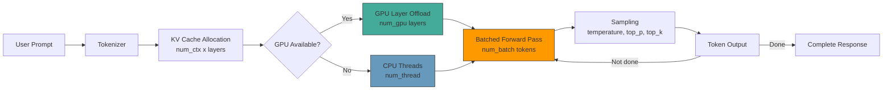

# Chapter 6: Performance, GPU Tuning, and Quantization

Welcome to **Chapter 6: Performance, GPU Tuning, and Quantization**. In this part of **Ollama Tutorial: Running and Serving LLMs Locally**, you will build an intuitive mental model first, then move into concrete implementation details and practical production tradeoffs.


> Get faster, more reliable inference by tuning hardware usage, context, and sampling.

Ollama makes it easy to run models with a single command, but getting the best performance out of your hardware requires understanding the inference pipeline, how memory is consumed, and which knobs to turn. This chapter covers everything from basic parameter tuning to advanced multi-GPU setups, Apple Silicon optimization, and systematic benchmarking methodology.

Whether you are running on a laptop CPU or a multi-GPU server, the techniques here will help you maximize tokens per second while staying within your memory budget.

## The Inference Pipeline

Understanding how a prompt flows through the system helps you identify where bottlenecks occur and which settings to adjust.



Each box in the diagram represents a stage you can tune:

- **Tokenizer**: Fixed per model. No tuning needed.
- **KV Cache**: Controlled by `num_ctx`. Larger context windows consume more memory.
- **GPU Offload**: Controlled by `num_gpu`. More layers on GPU means faster inference.
- **CPU Threads**: Controlled by `num_thread`. Match your physical core count.
- **Batching**: Controlled by `num_batch`. More tokens per forward pass improves throughput.
- **Sampling**: Controlled by `temperature`, `top_p`, `top_k`. Minimal performance impact.

## Key Performance Levers

Here is a quick reference of the main settings that affect speed and memory usage.

| Setting | What It Controls | Speed Impact | Memory Impact |
|---------|-----------------|--------------|---------------|
| Model size (7B vs 70B) | Number of parameters | Huge | Huge |
| Quantization (Q3 vs Q6) | Precision of weights | Large | Large |
| `num_ctx` | Context window size | Medium | Large |
| `num_gpu` | Layers offloaded to GPU | Large | GPU VRAM |
| `num_batch` | Tokens per forward pass | Medium | Small |
| `num_thread` | CPU threads | Medium (CPU only) | None |
| `num_predict` | Max output tokens | None (just caps output) | None |

## Memory Calculator

One of the most common questions is "will this model fit on my machine?" Here is how to estimate memory requirements.

### The Formula

```
RAM Needed (GB) = Model Parameters (B) x Bytes per Parameter + KV Cache Overhead
```

Bytes per parameter depends on quantization:

| Quantization | Bits per Weight | Bytes per Parameter | Relative Quality |
|-------------|----------------|--------------------|-----------------|
| Q2_K | ~2.5 | 0.31 | Poor |
| Q3_K_S | ~3.0 | 0.38 | Below average |
| Q3_K_M | ~3.4 | 0.43 | Fair |
| Q4_K_S | ~4.2 | 0.53 | Good |
| Q4_K_M | ~4.6 | 0.58 | Good (default) |
| Q5_K_S | ~5.0 | 0.63 | Very good |
| Q5_K_M | ~5.3 | 0.66 | Very good |
| Q6_K | ~6.4 | 0.80 | Excellent |
| Q8_0 | ~8.0 | 1.00 | Near-original |
| F16 | 16.0 | 2.00 | Original |

### Quick Reference Table

| Model | Q4_K_M | Q5_K_M | Q6_K | Q8_0 |
|-------|--------|--------|------|------|
| Phi-3 Mini (3.8B) | ~2.5 GB | ~2.8 GB | ~3.3 GB | ~4.1 GB |
| Llama 3 8B | ~5.0 GB | ~5.6 GB | ~6.6 GB | ~8.5 GB |
| Mistral 7B | ~4.4 GB | ~4.9 GB | ~5.8 GB | ~7.5 GB |
| Llama 3 70B | ~40 GB | ~46 GB | ~55 GB | ~70 GB |
| Mixtral 8x7B | ~26 GB | ~30 GB | ~36 GB | ~47 GB |

These estimates include a small overhead for the KV cache at a 4096 context window. Larger context windows add approximately:

```
KV Cache (GB) = num_ctx x num_layers x hidden_size x 2 (keys+values) x 2 (bytes for FP16) / 1e9
```

For a 7B model with 32 layers and 4096 hidden size at 8192 context:

```
8192 x 32 x 4096 x 2 x 2 / 1e9 = ~4.3 GB additional
```

This is why cranking `num_ctx` to 32768 on a model that barely fits in memory will cause out-of-memory errors.

### Rule of Thumb

- Your available RAM/VRAM should be at least 10-20% more than the model size estimate to account for runtime overhead.
- If the model barely fits, reduce `num_ctx` to 2048 or 4096.
- If you need a large context window, drop to a smaller quantization or a smaller model.

## Recommended Settings by Hardware

| Hardware | Suggested Quant | Models That Fit | Tips |
|----------|-----------------|-----------------|------|
| 8 GB RAM, CPU-only | Q3_K_M, Q4_K_S | Phi-3 Mini, Gemma 2B | `num_ctx 2048`, `num_thread` to physical cores |
| 16 GB RAM, CPU-only | Q4_K_M | Llama 3 8B, Mistral 7B | `num_ctx 4096`, `num_batch 256` |
| Apple M1/M2 16 GB | Q4_K_M | Llama 3 8B, Mistral 7B | GPU offload auto, `num_ctx 4096` |
| Apple M2/M3 Pro 32 GB | Q5_K_M, Q6_K | Llama 3 8B, Mixtral | `num_ctx 8192`, high quality quants |
| Apple M2/M3 Max 64 GB | Q6_K, Q8_0 | Llama 3 70B (Q4) | `num_ctx 8192`, fit larger models |
| NVIDIA 8-12 GB VRAM | Q4_K_M | Llama 3 8B, Mistral 7B | `num_gpu` auto, rest on CPU |
| NVIDIA 24 GB VRAM | Q5_K_M, Q6_K | Llama 3 8B (full GPU), Mixtral (partial) | `num_ctx 8192`, `num_batch 1024` |
| NVIDIA 48 GB+ VRAM | Q6_K, Q8_0 | Llama 3 70B (full GPU) | Max quality and context |

## Runtime Options Reference

These options can be passed in the `options` field of API requests or set as defaults in a Modelfile with `PARAMETER`.

```json
{
  "num_ctx": 4096,
  "num_predict": 512,
  "num_thread": 8,
  "num_batch": 512,
  "num_gpu": 99,
  "temperature": 0.4,
  "top_p": 0.9,
  "top_k": 40,
  "repeat_penalty": 1.1,
  "low_vram": false,
  "main_gpu": 0
}
```

### Detailed Parameter Descriptions

- **`num_thread`**: Number of CPU threads. Set to your physical core count (not hyperthreaded count). On an 8-core CPU, use 8, not 16.
- **`num_batch`**: Tokens processed per forward pass. Higher values mean faster prompt processing. Start with 512 and increase if memory allows.
- **`num_gpu`**: Number of model layers to offload to GPU. Set to 99 to offload all layers. Set to 0 for CPU-only. Ollama auto-detects a reasonable default.
- **`num_ctx`**: Context window in tokens. Common values are 2048, 4096, 8192. Larger values consume significantly more memory.
- **`num_predict`**: Maximum number of tokens to generate. Caps output length but does not affect speed.
- **`low_vram`**: When true, reduces GPU memory usage at the cost of speed. Useful when the model barely fits.
- **`main_gpu`**: When you have multiple GPUs, specifies which GPU is the primary device (zero-indexed).

## Apple Silicon Optimization

Ollama has excellent support for Apple Silicon (M1, M2, M3, M4 series). The unified memory architecture means the GPU and CPU share the same RAM pool, which has unique advantages.

### Why Apple Silicon Works Well for LLMs

- **Unified memory**: No need to copy weights between CPU and GPU memory. The GPU can access the same memory pool.
- **High memory bandwidth**: M2 Pro provides ~200 GB/s, M3 Max provides ~400 GB/s. LLM inference is memory-bandwidth bound, so this matters a lot.
- **Metal acceleration**: Ollama uses Apple's Metal framework for GPU compute.

### Optimization Tips for Apple Silicon

```bash
# Check that Ollama detects your GPU
ollama run llama3 --verbose 2>&1 | head -20
# Look for "metal" in the output
```

**Memory allocation**: On Apple Silicon, `num_gpu` layers come from the same unified memory pool. Setting `num_gpu` to 99 (all layers) is almost always the right choice since there is no CPU-to-GPU transfer overhead.

**Recommended settings for Apple M-series:**

```json
{
  "num_gpu": 99,
  "num_ctx": 4096,
  "num_batch": 512,
  "num_thread": 8
}
```

**Practical performance expectations (tokens/second for generation):**

| Chip | Llama 3 8B Q4_K_M | Llama 3 8B Q6_K | Mistral 7B Q4_K_M |
|------|-------------------|------------------|--------------------|
| M1 (8 GB) | ~15 t/s | ~12 t/s | ~16 t/s |
| M2 Pro (16 GB) | ~25 t/s | ~20 t/s | ~27 t/s |
| M3 Pro (18 GB) | ~30 t/s | ~25 t/s | ~32 t/s |
| M3 Max (36 GB) | ~40 t/s | ~35 t/s | ~42 t/s |

These are approximate values for generation (not prompt processing, which is faster). Your actual results will vary with context length and system load.

**Avoid these common mistakes on Apple Silicon:**

- Do not set `num_thread` higher than your performance core count. M3 Pro has 6 performance cores, so `num_thread 6` is optimal.
- Do not set `num_gpu 0` -- you lose the Metal acceleration entirely.
- Do not use `low_vram` -- it is meant for discrete GPUs with limited VRAM, not unified memory.

## Multi-GPU Setup

If you have multiple NVIDIA GPUs, Ollama can spread model layers across them.

### Automatic Multi-GPU

Ollama automatically detects multiple GPUs and distributes layers. To verify detection:

```bash
# Check that all GPUs are visible
nvidia-smi

# Ollama will log GPU detection at startup
OLLAMA_DEBUG=1 ollama serve
```

### Manual GPU Selection

Use environment variables to control GPU behavior:

```bash
# Use only GPU 0
CUDA_VISIBLE_DEVICES=0 ollama serve

# Use GPUs 0 and 1
CUDA_VISIBLE_DEVICES=0,1 ollama serve

# Set the primary GPU for computation
OLLAMA_MAIN_GPU=0 ollama serve
```

### Running Multiple Instances

For maximum isolation, you can run separate Ollama instances pinned to different GPUs:

```bash
# Instance 1: GPU 0, port 11434
CUDA_VISIBLE_DEVICES=0 OLLAMA_HOST=0.0.0.0:11434 ollama serve

# Instance 2: GPU 1, port 11435
CUDA_VISIBLE_DEVICES=1 OLLAMA_HOST=0.0.0.0:11435 ollama serve
```

Then load-balance across them in your application or via a reverse proxy.

### Multi-GPU Memory Considerations

When a model spans multiple GPUs, each GPU holds a portion of the layers. The split is roughly even. A 70B Q4_K_M model (~40 GB) across two 24 GB GPUs will use approximately 20 GB per GPU, leaving room for the KV cache.

## Benchmarking Methodology

To make informed decisions about models and settings, you need a consistent benchmarking approach. Here is a practical methodology.

### Step 1: Define Your Test Prompts

Create a file with representative prompts for your use case. Include both short and long prompts to test prompt processing and generation separately.

```bash
# benchmark_prompts.txt
Explain binary search in 3 steps.
---
Write a Python function that reads a CSV file, groups rows by a category column, and computes the mean of a numeric column. Include error handling and type hints.
---
Summarize the following 500-word passage: [paste a representative passage here]
```

### Step 2: Run with Verbose Output

The `--verbose` flag (or setting `OLLAMA_DEBUG=1`) shows detailed timing information.

```bash
ollama run llama3 "Explain binary search in 3 steps." --verbose
```

Look for these key metrics in the output:

```
total duration:       3.245s
load duration:        1.102s
prompt eval count:    12 token(s)
prompt eval duration: 245ms
prompt eval rate:     48.98 tokens/s
eval count:           187 token(s)
eval duration:        1.898s
eval rate:            98.52 tokens/s
```

- **load duration**: Time to load the model into memory. Only relevant for the first request (model stays loaded after that).
- **prompt eval rate**: How fast the model processes your input tokens. Higher is better.
- **eval rate**: How fast the model generates output tokens. This is usually the bottleneck.

### Step 3: Scripted Benchmark

Here is a script that benchmarks multiple models and settings:

```bash
#!/bin/bash
PROMPT="Explain the concept of dependency injection in software engineering. Include a practical example in Python."
MODELS=("llama3:8b" "mistral:7b" "phi3:mini")

echo "Model,Prompt Eval (t/s),Eval (t/s),Total Duration (s)"

for model in "${MODELS[@]}"; do
    # Warm up: load model
    ollama run "$model" "hi" > /dev/null 2>&1

    # Benchmark
    result=$(ollama run "$model" "$PROMPT" --verbose 2>&1)

    prompt_rate=$(echo "$result" | grep "prompt eval rate" | awk '{print $4}')
    eval_rate=$(echo "$result" | grep "eval rate" | awk '{print $4}')
    total=$(echo "$result" | grep "total duration" | awk '{print $3}')

    echo "$model,$prompt_rate,$eval_rate,$total"
done
```

### Step 4: Compare Quantizations

Run the same prompt across different quantizations of the same model:

```bash
for quant in "llama3:8b-q3_K_M" "llama3:8b-q4_K_M" "llama3:8b-q5_K_M" "llama3:8b-q6_K"; do
    echo "Testing $quant..."
    ollama run "$quant" "Write a quicksort implementation in Python" --verbose 2>&1 | grep -E "eval rate|total duration"
    echo "---"
done
```

### Step 5: Measure Impact of Context Length

Context length has a significant impact on memory and speed. Test with increasing values:

```bash
for ctx in 2048 4096 8192 16384; do
    echo "Context: $ctx"
    curl -s http://localhost:11434/api/generate \
      -d "{
        \"model\": \"llama3\",
        \"prompt\": \"Write a detailed explanation of how transformers work in deep learning.\",
        \"stream\": false,
        \"options\": {\"num_ctx\": $ctx}
      }" | python3 -c "
import sys, json
d = json.load(sys.stdin)
print(f'  Total: {d[\"total_duration\"]/1e9:.2f}s')
print(f'  Eval rate: {d[\"eval_count\"]/(d[\"eval_duration\"]/1e9):.1f} t/s')
"
    echo "---"
done
```

## Profiling with Verbose Output Analysis

When you need to diagnose why inference is slow, the verbose output contains all the clues.

### Reading the Verbose Output

```bash
OLLAMA_DEBUG=1 ollama run llama3 "Hello world" --verbose
```

Here is what each line means and what to look for:

| Metric | Healthy Range | Warning Sign |
|--------|--------------|--------------|
| load duration | < 5s (first load) | > 10s means slow disk or model too large |
| prompt eval rate | > 100 t/s (GPU) | < 20 t/s means no GPU offload or small batch |
| eval rate | > 30 t/s (GPU) | < 10 t/s means CPU-only or memory pressure |
| total duration | Varies | Compare relative to prompt + eval time |

### Common Performance Problems and Fixes

**Problem: Low eval rate (under 10 t/s)**
- Check `num_gpu`: it may be 0 (CPU-only). Set to 99 for full GPU offload.
- Check GPU memory: the model may be partially on CPU. Use a smaller quant or model.
- On Apple Silicon, verify Metal is detected in the logs.

**Problem: High load duration (over 10 seconds)**
- The model may be stored on a slow disk. Move `~/.ollama` to an SSD.
- The model may be very large. Consider a smaller quantization.

**Problem: Out-of-memory errors**
- Reduce `num_ctx` (biggest memory saver).
- Switch to a smaller quantization (Q4 instead of Q6).
- Enable `low_vram` mode.
- Reduce `num_batch`.

**Problem: Tokens per second drops during long generation**
- This is normal as the KV cache grows. Reduce `num_ctx` if the drop is severe.
- Consider chunking long conversations and starting fresh contexts.

## Quantization Deep Dive

Not all quantizations are created equal. Here is guidance on choosing the right one.

### Quality vs Speed vs Memory

```
Quality:    Q2 << Q3 < Q4 < Q5 < Q6 < Q8 << F16
Speed:      Q2 >> Q3 > Q4 > Q5 > Q6 > Q8 >> F16
Memory:     Q2 << Q3 < Q4 < Q5 < Q6 < Q8 << F16
```

### When to Use Each Level

- **Q3_K_M**: Drafting, brainstorming, quick utility tasks where perfect accuracy is not critical. Good for CPU-only machines with limited RAM.
- **Q4_K_M**: The best default for most users. Good balance of quality and performance. This is what Ollama uses by default.
- **Q5_K_M**: When you need higher quality and have the memory. Good for coding and reasoning tasks.
- **Q6_K**: Near-original quality. Use when you have ample VRAM/RAM and quality is paramount.
- **Q8_0**: Minimal quality loss. Only practical on high-memory machines (32 GB+).
- **F16**: Full precision. Research and comparison purposes only.

### Practical Recommendation

For most users, start with Q4_K_M. If responses feel noticeably worse than expected (especially for reasoning or factual tasks), step up to Q5_K_M. Only go lower than Q4 if the model does not fit in memory at Q4.

## Context Management Strategies

Managing the context window effectively is crucial for both performance and quality.

- **Keep `num_ctx` aligned with actual need.** If your prompts and responses are typically under 2000 tokens, setting `num_ctx` to 32768 wastes memory for no benefit.
- **Truncate conversation history.** In chat applications, keep only the most recent N turns plus the system prompt.
- **Use RAG instead of stuffing.** Instead of pasting entire documents into the context, use retrieval-augmented generation to include only relevant chunks.
- **Monitor context usage.** The API response includes token counts. Log these to understand your actual context utilization.

## Example Performance Profiles

Here are ready-to-use option sets for common scenarios.

**Fast utility (CPU-only laptop):**
```json
{
  "num_ctx": 2048,
  "num_batch": 256,
  "num_thread": 4,
  "temperature": 0.2,
  "repeat_penalty": 1.1,
  "num_predict": 256
}
```

**Quality-focused (NVIDIA 24 GB):**
```json
{
  "num_ctx": 8192,
  "num_batch": 1024,
  "num_gpu": 99,
  "temperature": 0.5,
  "repeat_penalty": 1.05,
  "num_predict": 2048
}
```

**Coding assistant (Apple M3 Pro):**
```json
{
  "num_ctx": 4096,
  "num_batch": 512,
  "num_gpu": 99,
  "num_thread": 6,
  "temperature": 0.2,
  "top_p": 0.9,
  "repeat_penalty": 1.15,
  "num_predict": 1024
}
```

**Long-document analysis (high-memory server):**
```json
{
  "num_ctx": 16384,
  "num_batch": 2048,
  "num_gpu": 99,
  "temperature": 0.3,
  "num_predict": 4096
}
```

## Stability Tips

- Reduce `num_batch` if you see out-of-memory errors during prompt processing.
- Lower `num_ctx` as the first step when memory is tight.
- Avoid very high `temperature` (above 1.0) with low quantizations -- it amplifies noise from quantization artifacts.
- Keep GPU drivers up to date. On NVIDIA, run `nvidia-smi` to verify the driver version and GPU utilization.
- On Linux, ensure the NVIDIA Container Toolkit is installed for Docker GPU support.
- Restart `ollama serve` if you notice gradual performance degradation over long runtimes.

---

| Navigation | |
|---|---|
| Previous | [Chapter 5: Modelfiles & Custom Models](./05-modelfiles-custom.md) |
| Next | [Chapter 7: Integrations](./07-integrations.md) |
| Index | [Ollama Tutorial Home](./index.md) |

## Depth Expansion Playbook

<!-- depth-expansion-v2 -->

This chapter is expanded to v1-style depth for production-grade learning and implementation quality.

### Strategic Context

- tutorial: **Ollama Tutorial: Running and Serving LLMs Locally**
- tutorial slug: **ollama-tutorial**
- chapter focus: **Chapter 6: Performance, GPU Tuning, and Quantization**
- system context: **Ollama Tutorial**
- objective: move from surface-level usage to repeatable engineering operation

### Architecture Decomposition

1. Define the runtime boundary for `Chapter 6: Performance, GPU Tuning, and Quantization`.
2. Separate control-plane decisions from data-plane execution.
3. Capture input contracts, transformation points, and output contracts.
4. Trace state transitions across request lifecycle stages.
5. Identify extension hooks and policy interception points.
6. Map ownership boundaries for team and automation workflows.
7. Specify rollback and recovery paths for unsafe changes.
8. Track observability signals for correctness, latency, and cost.

### Operator Decision Matrix

| Decision Area | Low-Risk Path | High-Control Path | Tradeoff |
|:--------------|:--------------|:------------------|:---------|
| Runtime mode | managed defaults | explicit policy config | speed vs control |
| State handling | local ephemeral | durable persisted state | simplicity vs auditability |
| Tool integration | direct API use | mediated adapter layer | velocity vs governance |
| Rollout method | manual change | staged + canary rollout | effort vs safety |
| Incident response | best effort logs | runbooks + SLO alerts | cost vs reliability |

### Failure Modes and Countermeasures

| Failure Mode | Early Signal | Root Cause Pattern | Countermeasure |
|:-------------|:-------------|:-------------------|:---------------|
| stale context | inconsistent outputs | missing refresh window | enforce context TTL and refresh hooks |
| policy drift | unexpected execution | ad hoc overrides | centralize policy profiles |
| auth mismatch | 401/403 bursts | credential sprawl | rotation schedule + scope minimization |
| schema breakage | parser/validation errors | unmanaged upstream changes | contract tests per release |
| retry storms | queue congestion | no backoff controls | jittered backoff + circuit breakers |
| silent regressions | quality drop without alerts | weak baseline metrics | eval harness with thresholds |

### Implementation Runbook

1. Establish a reproducible baseline environment.
2. Capture chapter-specific success criteria before changes.
3. Implement minimal viable path with explicit interfaces.
4. Add observability before expanding feature scope.
5. Run deterministic tests for happy-path behavior.
6. Inject failure scenarios for negative-path validation.
7. Compare output quality against baseline snapshots.
8. Promote through staged environments with rollback gates.
9. Record operational lessons in release notes.

### Quality Gate Checklist

- [ ] chapter-level assumptions are explicit and testable
- [ ] API/tool boundaries are documented with input/output examples
- [ ] failure handling includes retry, timeout, and fallback policy
- [ ] security controls include auth scopes and secret rotation plans
- [ ] observability includes logs, metrics, traces, and alert thresholds
- [ ] deployment guidance includes canary and rollback paths
- [ ] docs include links to upstream sources and related tracks
- [ ] post-release verification confirms expected behavior under load

### Source Alignment

- [Ollama Repository](https://github.com/ollama/ollama)
- [Ollama Releases](https://github.com/ollama/ollama/releases)
- [Ollama Website and Docs](https://ollama.com/)

### Cross-Tutorial Connection Map

- [Open WebUI Tutorial](../open-webui-tutorial/)
- [LiteLLM Tutorial](../litellm-tutorial/)
- [Llama.cpp Tutorial](../llama-cpp-tutorial/)
- [VLLM Tutorial](../vllm-tutorial/)
- [Chapter 1: Getting Started](01-getting-started.md)

### Advanced Practice Exercises

1. Build a minimal end-to-end implementation for `Chapter 6: Performance, GPU Tuning, and Quantization`.
2. Add instrumentation and measure baseline latency and error rate.
3. Introduce one controlled failure and confirm graceful recovery.
4. Add policy constraints and verify they are enforced consistently.
5. Run a staged rollout and document rollback decision criteria.

### Review Questions

1. Which execution boundary matters most for this chapter and why?
2. What signal detects regressions earliest in your environment?
3. What tradeoff did you make between delivery speed and governance?
4. How would you recover from the highest-impact failure mode?
5. What must be automated before scaling to team-wide adoption?

## What Problem Does This Solve?

Most teams struggle here because the hard part is not writing more code, but deciding clear boundaries for `ollama`, `num_ctx`, `llama3` so behavior stays predictable as complexity grows.

In practical terms, this chapter helps you avoid three common failures:

- coupling core logic too tightly to one implementation path
- missing the handoff boundaries between setup, execution, and validation
- shipping changes without clear rollback or observability strategy

After working through this chapter, you should be able to reason about `Chapter 6: Performance, GPU Tuning, and Quantization` as an operating subsystem inside **Ollama Tutorial: Running and Serving LLMs Locally**, with explicit contracts for inputs, state transitions, and outputs.

Use the implementation notes around `eval`, `echo`, `num_batch` as your checklist when adapting these patterns to your own repository.

## How it Works Under the Hood

Under the hood, `Chapter 6: Performance, GPU Tuning, and Quantization` usually follows a repeatable control path:

1. **Context bootstrap**: initialize runtime config and prerequisites for `ollama`.
2. **Input normalization**: shape incoming data so `num_ctx` receives stable contracts.
3. **Core execution**: run the main logic branch and propagate intermediate state through `llama3`.
4. **Policy and safety checks**: enforce limits, auth scopes, and failure boundaries.
5. **Output composition**: return canonical result payloads for downstream consumers.
6. **Operational telemetry**: emit logs/metrics needed for debugging and performance tuning.

When debugging, walk this sequence in order and confirm each stage has explicit success/failure conditions.

## Source Walkthrough

Use the following upstream sources to verify implementation details while reading this chapter:

- [Ollama Repository](https://github.com/ollama/ollama)
  Why it matters: authoritative reference on `Ollama Repository` (github.com).
- [Ollama Releases](https://github.com/ollama/ollama/releases)
  Why it matters: authoritative reference on `Ollama Releases` (github.com).
- [Ollama Website and Docs](https://ollama.com/)
  Why it matters: authoritative reference on `Ollama Website and Docs` (ollama.com).

Suggested trace strategy:
- search upstream code for `ollama` and `num_ctx` to map concrete implementation paths
- compare docs claims against actual runtime/config code before reusing patterns in production

## Chapter Connections

- [Tutorial Index](index.md)
- [Previous Chapter: Chapter 5: Modelfiles, Templates, and Custom Models](05-modelfiles-custom.md)
- [Next Chapter: Chapter 7: Integrations with OpenAI API, LangChain, and LlamaIndex](07-integrations.md)
- [Main Catalog](../../README.md#-tutorial-catalog)
- [A-Z Tutorial Directory](../../discoverability/tutorial-directory.md)
