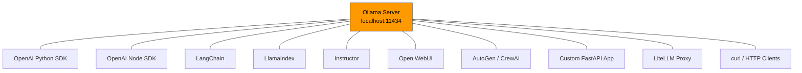

# Chapter 7: Integrations with OpenAI API, LangChain, and LlamaIndex

Welcome to **Chapter 7: Integrations with OpenAI API, LangChain, and LlamaIndex**. In this part of **Ollama Tutorial: Running and Serving LLMs Locally**, you will build an intuitive mental model first, then move into concrete implementation details and practical production tradeoffs.


> Use Ollama with common AI frameworks and OpenAI-compatible SDKs.

Ollama exposes an OpenAI-compatible API, which means virtually any tool, framework, or library that works with OpenAI can work with Ollama by simply changing the base URL. This chapter walks through complete, working integration examples for the most popular frameworks and tools in the AI ecosystem.

We will cover direct SDK usage, framework integrations, structured output with Instructor, agent frameworks, a self-hosted chat UI, and a full chat application built with FastAPI and WebSockets.

## Integration Architecture

The diagram below shows how Ollama sits at the center of your AI stack, providing a local, private inference endpoint that many tools can connect to simultaneously.



Every integration in this chapter connects to Ollama through the same HTTP API. The key connection details are always the same:

- **Base URL**: `http://localhost:11434` (native API) or `http://localhost:11434/v1` (OpenAI-compatible)
- **API Key**: Any string works (Ollama does not enforce authentication)
- **Model name**: Whatever you have pulled (e.g., `llama3`, `mistral`, `codellama`)

## OpenAI-Compatible SDKs

The easiest way to integrate Ollama is through the official OpenAI SDKs. Just change the base URL and you are done.

### Python (openai package)

```python
from openai import OpenAI

client = OpenAI(
    base_url="http://localhost:11434/v1",
    api_key="ollama",  # Required by the SDK but not enforced by Ollama
)

# Simple chat completion
response = client.chat.completions.create(
    model="llama3",
    messages=[
        {"role": "system", "content": "You are a helpful coding assistant."},
        {"role": "user", "content": "Write a Python function to flatten a nested list."},
    ],
    temperature=0.3,
)
print(response.choices[0].message.content)
```

### Python with Streaming

```python
from openai import OpenAI

client = OpenAI(base_url="http://localhost:11434/v1", api_key="ollama")

stream = client.chat.completions.create(
    model="llama3",
    messages=[{"role": "user", "content": "Explain how hash tables work."}],
    stream=True,
)

for chunk in stream:
    if chunk.choices[0].delta.content:
        print(chunk.choices[0].delta.content, end="", flush=True)
print()  # Newline at the end
```

### Node.js (openai package)

```javascript
import OpenAI from "openai";

const client = new OpenAI({
  baseURL: "http://localhost:11434/v1",
  apiKey: "ollama",
});

async function main() {
  const response = await client.chat.completions.create({
    model: "mistral",
    messages: [
      { role: "system", content: "You are a concise technical writer." },
      { role: "user", content: "Summarize RAG in 3 bullet points." },
    ],
  });
  console.log(response.choices[0].message.content);
}

main();
```

### Node.js with Streaming

```javascript
import OpenAI from "openai";

const client = new OpenAI({
  baseURL: "http://localhost:11434/v1",
  apiKey: "ollama",
});

async function main() {
  const stream = await client.chat.completions.create({
    model: "llama3",
    messages: [{ role: "user", content: "Write a haiku about programming." }],
    stream: true,
  });

  for await (const chunk of stream) {
    const content = chunk.choices[0]?.delta?.content || "";
    process.stdout.write(content);
  }
  console.log();
}

main();
```

### Embeddings via OpenAI SDK

```python
from openai import OpenAI

client = OpenAI(base_url="http://localhost:11434/v1", api_key="ollama")

response = client.embeddings.create(
    model="nomic-embed-text",
    input=["What is retrieval augmented generation?", "How do vector databases work?"],
)

for i, embedding in enumerate(response.data):
    print(f"Embedding {i}: {len(embedding.embedding)} dimensions")
```

## LangChain

LangChain is one of the most popular frameworks for building LLM applications. Ollama integrates cleanly as both an LLM and an embeddings provider.

### Basic LLM Usage

```python
from langchain_ollama import OllamaLLM
from langchain_core.prompts import PromptTemplate

llm = OllamaLLM(model="llama3", base_url="http://localhost:11434")

prompt = PromptTemplate.from_template(
    "Explain {topic} in 3 bullet points for a beginner."
)

chain = prompt | llm
result = chain.invoke({"topic": "vector databases"})
print(result)
```

### Chat Model with Streaming

```python
from langchain_ollama import ChatOllama
from langchain_core.messages import HumanMessage, SystemMessage

chat = ChatOllama(
    model="llama3",
    base_url="http://localhost:11434",
    temperature=0.3,
)

messages = [
    SystemMessage(content="You are a Python expert. Be concise."),
    HumanMessage(content="What are the main differences between lists and tuples?"),
]

# Streaming response
for chunk in chat.stream(messages):
    print(chunk.content, end="", flush=True)
print()
```

### RAG Chain with Ollama Embeddings

```python
from langchain_ollama import OllamaEmbeddings, ChatOllama
from langchain_community.vectorstores import Chroma
from langchain_core.prompts import ChatPromptTemplate
from langchain_core.runnables import RunnablePassthrough
from langchain_core.output_parsers import StrOutputParser
from langchain_community.document_loaders import TextLoader
from langchain_text_splitters import RecursiveCharacterTextSplitter

# Load and split documents
loader = TextLoader("./docs/architecture.md")
docs = loader.load()
splitter = RecursiveCharacterTextSplitter(chunk_size=500, chunk_overlap=50)
splits = splitter.split_documents(docs)

# Create vector store with Ollama embeddings
embeddings = OllamaEmbeddings(model="nomic-embed-text", base_url="http://localhost:11434")
vectorstore = Chroma.from_documents(splits, embeddings)
retriever = vectorstore.as_retriever(search_kwargs={"k": 3})

# Build RAG chain
llm = ChatOllama(model="llama3", base_url="http://localhost:11434")

template = """Answer the question based on the following context:

Context: {context}

Question: {question}

Answer:"""
prompt = ChatPromptTemplate.from_template(template)

chain = (
    {"context": retriever, "question": RunnablePassthrough()}
    | prompt
    | llm
    | StrOutputParser()
)

result = chain.invoke("How is the system architected?")
print(result)
```

### LangChain JavaScript

```javascript
import { ChatOllama } from "@langchain/ollama";
import { HumanMessage, SystemMessage } from "@langchain/core/messages";

const chat = new ChatOllama({
  model: "llama3",
  baseUrl: "http://localhost:11434",
  temperature: 0.3,
});

const response = await chat.invoke([
  new SystemMessage("You are a helpful assistant."),
  new HumanMessage("Explain the observer pattern in one paragraph."),
]);

console.log(response.content);
```

## LlamaIndex

LlamaIndex specializes in connecting LLMs to your data. Ollama works as both the LLM and the embedding model.

### Basic Query Engine

```python
from llama_index.core import VectorStoreIndex, SimpleDirectoryReader, Settings
from llama_index.llms.ollama import Ollama
from llama_index.embeddings.ollama import OllamaEmbedding

# Configure Ollama as the default LLM and embedding model
Settings.llm = Ollama(model="llama3", request_timeout=120)
Settings.embed_model = OllamaEmbedding(model_name="nomic-embed-text")

# Load documents and build index
documents = SimpleDirectoryReader("./data").load_data()
index = VectorStoreIndex.from_documents(documents)

# Query
query_engine = index.as_query_engine()
response = query_engine.query("What are the main components of the system?")
print(response)
```

### Chat Engine with Memory

```python
from llama_index.core import VectorStoreIndex, SimpleDirectoryReader, Settings
from llama_index.llms.ollama import Ollama
from llama_index.embeddings.ollama import OllamaEmbedding

Settings.llm = Ollama(model="llama3", request_timeout=120)
Settings.embed_model = OllamaEmbedding(model_name="nomic-embed-text")

documents = SimpleDirectoryReader("./data").load_data()
index = VectorStoreIndex.from_documents(documents)

# Create a chat engine that remembers conversation history
chat_engine = index.as_chat_engine(chat_mode="condense_question")

# Multi-turn conversation
response1 = chat_engine.chat("What does this project do?")
print(f"Bot: {response1}")

response2 = chat_engine.chat("How is it deployed?")
print(f"Bot: {response2}")

response3 = chat_engine.chat("What were the challenges mentioned?")
print(f"Bot: {response3}")
```

## Instructor -- Structured Output

Instructor is a library that makes it easy to get structured, validated output from LLMs using Pydantic models. It works with Ollama through the OpenAI compatibility layer.

### Installation

```bash
pip install instructor openai pydantic
```

### Basic Structured Output

```python
import instructor
from openai import OpenAI
from pydantic import BaseModel, Field

# Patch the OpenAI client with Instructor
client = instructor.from_openai(
    OpenAI(base_url="http://localhost:11434/v1", api_key="ollama"),
    mode=instructor.Mode.JSON,
)


class MovieReview(BaseModel):
    title: str = Field(description="The movie title")
    rating: float = Field(ge=0, le=10, description="Rating from 0 to 10")
    pros: list[str] = Field(description="List of positive aspects")
    cons: list[str] = Field(description="List of negative aspects")
    summary: str = Field(description="One-sentence summary")


review = client.chat.completions.create(
    model="llama3",
    messages=[
        {"role": "user", "content": "Write a review of the movie Inception."},
    ],
    response_model=MovieReview,
)

print(f"Title: {review.title}")
print(f"Rating: {review.rating}/10")
print(f"Pros: {', '.join(review.pros)}")
print(f"Cons: {', '.join(review.cons)}")
print(f"Summary: {review.summary}")
```

### Extracting Data from Text

```python
import instructor
from openai import OpenAI
from pydantic import BaseModel, Field

client = instructor.from_openai(
    OpenAI(base_url="http://localhost:11434/v1", api_key="ollama"),
    mode=instructor.Mode.JSON,
)


class ContactInfo(BaseModel):
    name: str
    email: str | None = None
    phone: str | None = None
    company: str | None = None


class ExtractedContacts(BaseModel):
    contacts: list[ContactInfo]


text = """
Hi, I'm Sarah Chen from Acme Corp. You can reach me at sarah@acme.com or 555-0123.
Also CC my colleague Bob Martinez (bob.m@acme.com).
"""

result = client.chat.completions.create(
    model="llama3",
    messages=[
        {"role": "user", "content": f"Extract contact information from: {text}"},
    ],
    response_model=ExtractedContacts,
)

for contact in result.contacts:
    print(f"{contact.name} ({contact.company}) - {contact.email}, {contact.phone}")
```

## Open WebUI

Open WebUI is a self-hosted web interface for Ollama that provides a ChatGPT-like experience. It is the fastest way to give your team a polished chat UI backed by local models.

### Quick Start with Docker

```bash
docker run -d \
  --name open-webui \
  -p 3000:8080 \
  -v open-webui:/app/backend/data \
  --add-host=host.docker.internal:host-gateway \
  -e OLLAMA_BASE_URL=http://host.docker.internal:11434 \
  ghcr.io/open-webui/open-webui:main
```

Then open `http://localhost:3000` in your browser. Create an account (the first account becomes admin) and start chatting with your local models.

### Docker Compose with Ollama and Open WebUI

```yaml
version: "3.8"
services:
  ollama:
    image: ollama/ollama:latest
    ports:
      - "11434:11434"
    volumes:
      - ollama-data:/root/.ollama
    deploy:
      resources:
        reservations:
          devices:
            - capabilities: [gpu]

  open-webui:
    image: ghcr.io/open-webui/open-webui:main
    ports:
      - "3000:8080"
    volumes:
      - open-webui-data:/app/backend/data
    environment:
      - OLLAMA_BASE_URL=http://ollama:11434
    depends_on:
      - ollama

volumes:
  ollama-data:
  open-webui-data:
```

### Key Features

- **Multi-model chat**: Switch between models in a single conversation.
- **Document upload**: Upload PDFs and text files for RAG-powered Q&A.
- **Prompt library**: Save and share prompt templates across your team.
- **User management**: Admin controls, user roles, and usage tracking.
- **Model management**: Pull, delete, and configure models from the web UI.

## AutoGen and CrewAI -- Agent Integration

Agent frameworks let you create teams of AI agents that collaborate to solve complex tasks. Ollama provides the local LLM backbone.

### AutoGen with Ollama

```python
from autogen import ConversableAgent

config_list = [
    {
        "model": "llama3",
        "base_url": "http://localhost:11434/v1",
        "api_key": "ollama",
    }
]

llm_config = {"config_list": config_list, "temperature": 0.3}

# Create a coding assistant agent
assistant = ConversableAgent(
    name="coding_assistant",
    system_message="You are a Python expert. Write clean, well-documented code.",
    llm_config=llm_config,
)

# Create a code reviewer agent
reviewer = ConversableAgent(
    name="code_reviewer",
    system_message="You are a code reviewer. Review the code for bugs, style issues, and suggest improvements.",
    llm_config=llm_config,
)

# Start a conversation between the agents
result = assistant.initiate_chat(
    reviewer,
    message="Write a Python class for a thread-safe queue with max size.",
    max_turns=3,
)
```

### CrewAI with Ollama

```python
from crewai import Agent, Task, Crew
from langchain_ollama import ChatOllama

llm = ChatOllama(model="llama3", base_url="http://localhost:11434")

# Define agents
researcher = Agent(
    role="Technical Researcher",
    goal="Research and summarize technical topics thoroughly",
    backstory="You are a senior technical researcher with expertise in software architecture.",
    llm=llm,
    verbose=True,
)

writer = Agent(
    role="Technical Writer",
    goal="Write clear, engaging technical content",
    backstory="You are an experienced technical writer who makes complex topics accessible.",
    llm=llm,
    verbose=True,
)

# Define tasks
research_task = Task(
    description="Research the key differences between REST and GraphQL APIs. Include pros, cons, and use cases.",
    agent=researcher,
    expected_output="A detailed comparison document.",
)

writing_task = Task(
    description="Take the research and write a beginner-friendly blog post comparing REST and GraphQL.",
    agent=writer,
    expected_output="A polished blog post of about 500 words.",
)

# Create crew and run
crew = Crew(agents=[researcher, writer], tasks=[research_task, writing_task], verbose=True)
result = crew.kickoff()
print(result)
```

## Building a Chat UI with FastAPI and WebSocket

For teams that want a custom chat experience, here is a complete working example using FastAPI for the backend and WebSockets for real-time streaming.

### Backend (server.py)

```python
import json
import httpx
from fastapi import FastAPI, WebSocket, WebSocketDisconnect
from fastapi.responses import HTMLResponse
from fastapi.staticfiles import StaticFiles

app = FastAPI()

OLLAMA_URL = "http://localhost:11434/api/chat"


@app.websocket("/ws/chat")
async def websocket_chat(websocket: WebSocket):
    await websocket.accept()
    conversation_history = []

    try:
        while True:
            # Receive user message
            user_message = await websocket.receive_text()
            conversation_history.append({"role": "user", "content": user_message})

            # Stream response from Ollama
            payload = {
                "model": "llama3",
                "messages": conversation_history,
                "stream": True,
            }

            assistant_message = ""
            async with httpx.AsyncClient(timeout=120.0) as client:
                async with client.stream("POST", OLLAMA_URL, json=payload) as response:
                    async for line in response.aiter_lines():
                        if line:
                            data = json.loads(line)
                            if "message" in data and "content" in data["message"]:
                                token = data["message"]["content"]
                                assistant_message += token
                                await websocket.send_text(
                                    json.dumps({"type": "token", "content": token})
                                )

            # Signal end of message
            await websocket.send_text(json.dumps({"type": "done"}))
            conversation_history.append(
                {"role": "assistant", "content": assistant_message}
            )

    except WebSocketDisconnect:
        print("Client disconnected")


@app.get("/")
async def get_chat_page():
    return HTMLResponse(CHAT_HTML)


CHAT_HTML = """
<!DOCTYPE html>
<html>
<head>
    <title>Ollama Chat</title>
    <style>
        body { font-family: system-ui, sans-serif; max-width: 800px; margin: 0 auto; padding: 20px; }
        #messages { height: 500px; overflow-y: auto; border: 1px solid #ddd; padding: 15px;
                    border-radius: 8px; margin-bottom: 15px; background: #fafafa; }
        .user { color: #0066cc; margin: 10px 0; }
        .assistant { color: #333; margin: 10px 0; }
        #input-area { display: flex; gap: 10px; }
        #user-input { flex: 1; padding: 10px; border: 1px solid #ddd; border-radius: 6px; font-size: 14px; }
        button { padding: 10px 20px; background: #0066cc; color: white; border: none;
                 border-radius: 6px; cursor: pointer; font-size: 14px; }
        button:hover { background: #0052a3; }
    </style>
</head>
<body>
    <h1>Ollama Chat</h1>
    <div id="messages"></div>
    <div id="input-area">
        <input type="text" id="user-input" placeholder="Type a message..." onkeypress="if(event.key==='Enter')sendMessage()">
        <button onclick="sendMessage()">Send</button>
    </div>
    <script>
        const ws = new WebSocket(`ws://${location.host}/ws/chat`);
        const messages = document.getElementById('messages');
        let currentAssistant = null;

        ws.onmessage = (event) => {
            const data = JSON.parse(event.data);
            if (data.type === 'token') {
                if (!currentAssistant) {
                    currentAssistant = document.createElement('div');
                    currentAssistant.className = 'assistant';
                    currentAssistant.innerHTML = '<strong>Assistant:</strong> ';
                    messages.appendChild(currentAssistant);
                }
                currentAssistant.innerHTML += data.content;
                messages.scrollTop = messages.scrollHeight;
            } else if (data.type === 'done') {
                currentAssistant = null;
            }
        };

        function sendMessage() {
            const input = document.getElementById('user-input');
            const text = input.value.trim();
            if (!text) return;

            const userDiv = document.createElement('div');
            userDiv.className = 'user';
            userDiv.innerHTML = '<strong>You:</strong> ' + text;
            messages.appendChild(userDiv);

            ws.send(text);
            input.value = '';
            messages.scrollTop = messages.scrollHeight;
        }
    </script>
</body>
</html>
"""

if __name__ == "__main__":
    import uvicorn
    uvicorn.run(app, host="0.0.0.0", port=8000)
```

### Running the Chat App

```bash
# Install dependencies
pip install fastapi uvicorn httpx websockets

# Start Ollama (if not already running)
ollama serve

# Start the chat server
python server.py
```

Open `http://localhost:8000` in your browser. You now have a real-time streaming chat interface backed by your local Ollama models.

## LiteLLM -- Universal Proxy

LiteLLM provides a unified interface to many LLM providers, including Ollama. This is useful when you want to switch between providers without changing your application code.

```python
from litellm import completion

# Ollama via LiteLLM (prefix model name with "ollama/")
response = completion(
    model="ollama/llama3",
    messages=[{"role": "user", "content": "What is the capital of France?"}],
    api_base="http://localhost:11434",
)
print(response.choices[0].message.content)
```

You can also run LiteLLM as a proxy server that translates OpenAI API calls to Ollama:

```bash
pip install litellm
litellm --model ollama/llama3 --port 4000
```

Now any OpenAI-compatible client can connect to `http://localhost:4000` and it will route to Ollama.

## Other Notable Integrations

### FastAPI / Flask

Any Python web framework can call Ollama through the OpenAI SDK or direct HTTP requests:

```python
from fastapi import FastAPI
from openai import OpenAI

app = FastAPI()
client = OpenAI(base_url="http://localhost:11434/v1", api_key="ollama")

@app.post("/api/ask")
async def ask(question: str):
    response = client.chat.completions.create(
        model="llama3",
        messages=[{"role": "user", "content": question}],
    )
    return {"answer": response.choices[0].message.content}
```

### RAG Stacks

Ollama embeddings work with all major vector databases:

- **Chroma**: `langchain_community.vectorstores.Chroma` with Ollama embeddings
- **Qdrant**: `qdrant_client` with Ollama embedding endpoint
- **Weaviate**: Configure the OpenAI module to point at Ollama
- **Pinecone**: Generate embeddings via Ollama, upsert to Pinecone

### Automation Platforms

- **n8n**: Use the HTTP Request node to call Ollama's API
- **Make (Integromat)**: HTTP module with Ollama endpoints
- **Zapier**: Webhooks to Ollama API

## Integration Tips

- **Keep model names consistent.** If your LangChain code uses `"llama3"` and your direct API calls use `"llama3:latest"`, you may load the model twice. Standardize on one name.
- **Set timeouts.** Local models can take time to load on first request. Set HTTP timeouts to at least 60 seconds for the first call.
- **Tune per integration.** A chatbot might use `temperature 0.7` while a code generator uses `temperature 0.2`. Set these per integration, not globally.
- **Use streaming.** For any user-facing application, streaming provides a much better experience than waiting for the full response.
- **Monitor token counts.** The API response includes token usage. Log this to track costs (even though local inference is "free," context length affects performance).
- **Test with the same model.** When switching from OpenAI to Ollama, expect different behavior. Test thoroughly and adjust prompts as needed.

---

| Navigation | |
|---|---|
| Previous | [Chapter 6: Performance & Hardware Tuning](./06-performance.md) |
| Next | [Chapter 8: Production Deployment](./08-production.md) |
| Index | [Ollama Tutorial Home](./index.md) |

## What Problem Does This Solve?

Most teams struggle here because the hard part is not writing more code, but deciding clear boundaries for `content`, `ollama`, `messages` so behavior stays predictable as complexity grows.

In practical terms, this chapter helps you avoid three common failures:

- coupling core logic too tightly to one implementation path
- missing the handoff boundaries between setup, execution, and validation
- shipping changes without clear rollback or observability strategy

After working through this chapter, you should be able to reason about `Chapter 7: Integrations with OpenAI API, LangChain, and LlamaIndex` as an operating subsystem inside **Ollama Tutorial: Running and Serving LLMs Locally**, with explicit contracts for inputs, state transitions, and outputs.

Use the implementation notes around `model`, `print`, `chat` as your checklist when adapting these patterns to your own repository.

## How it Works Under the Hood

Under the hood, `Chapter 7: Integrations with OpenAI API, LangChain, and LlamaIndex` usually follows a repeatable control path:

1. **Context bootstrap**: initialize runtime config and prerequisites for `content`.
2. **Input normalization**: shape incoming data so `ollama` receives stable contracts.
3. **Core execution**: run the main logic branch and propagate intermediate state through `messages`.
4. **Policy and safety checks**: enforce limits, auth scopes, and failure boundaries.
5. **Output composition**: return canonical result payloads for downstream consumers.
6. **Operational telemetry**: emit logs/metrics needed for debugging and performance tuning.

When debugging, walk this sequence in order and confirm each stage has explicit success/failure conditions.

## Source Walkthrough

Use the following upstream sources to verify implementation details while reading this chapter:

- [Ollama Repository](https://github.com/ollama/ollama)
  Why it matters: authoritative reference on `Ollama Repository` (github.com).
- [Ollama Releases](https://github.com/ollama/ollama/releases)
  Why it matters: authoritative reference on `Ollama Releases` (github.com).
- [Ollama Website and Docs](https://ollama.com/)
  Why it matters: authoritative reference on `Ollama Website and Docs` (ollama.com).

Suggested trace strategy:
- search upstream code for `content` and `ollama` to map concrete implementation paths
- compare docs claims against actual runtime/config code before reusing patterns in production

## Chapter Connections

- [Tutorial Index](index.md)
- [Previous Chapter: Chapter 6: Performance, GPU Tuning, and Quantization](06-performance.md)
- [Next Chapter: Chapter 8: Production Deployment, Security, and Monitoring](08-production.md)
- [Main Catalog](../../README.md#-tutorial-catalog)
- [A-Z Tutorial Directory](../../discoverability/tutorial-directory.md)
