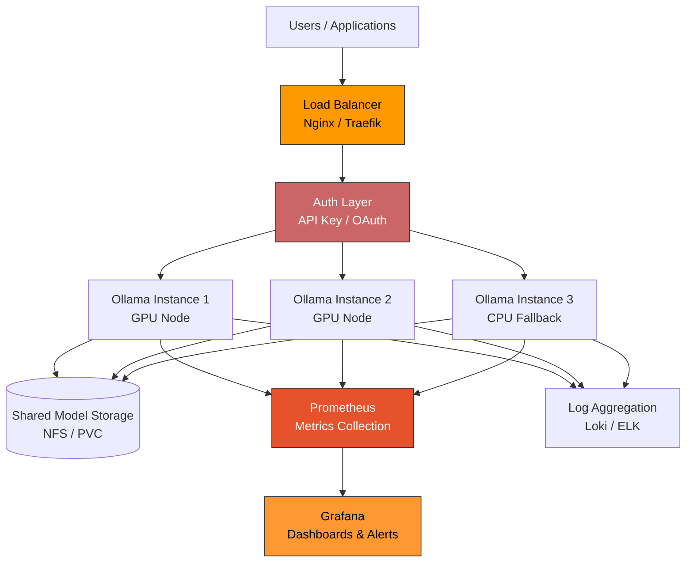

# Chapter 8: Production Deployment, Security, and Monitoring

Welcome to **Chapter 8: Production Deployment, Security, and Monitoring**. In this part of **Ollama Tutorial: Running and Serving LLMs Locally**, you will build an intuitive mental model first, then move into concrete implementation details and practical production tradeoffs.


> Run Ollama reliably in production with Docker, GPU support, security controls, and observability.

Running Ollama on your laptop is great for development, but deploying it for a team or as part of a production application requires careful attention to reliability, security, resource management, and monitoring. This chapter provides battle-tested configurations for Docker, Kubernetes, load balancing, and observability -- everything you need to go from a local experiment to a production-grade service.

## Production Architecture Overview

The following diagram shows a typical production deployment for Ollama, with all the components discussed in this chapter.



The key components are:

- **Load Balancer**: Distributes requests across multiple Ollama instances.
- **Auth Layer**: Since Ollama has no built-in authentication, this is handled at the proxy level.
- **Ollama Instances**: One or more servers running `ollama serve`, optionally with GPU acceleration.
- **Shared Storage**: Model files stored on a shared volume so all instances have access to the same models.
- **Monitoring**: Prometheus for metrics, Grafana for dashboards, and a log aggregation system.

## Docker Deployment

Docker is the most common way to deploy Ollama in production. Here are progressively more robust configurations.

### Basic Docker (CPU)

```bash
docker run -d \
  --name ollama \
  --restart unless-stopped \
  -p 11434:11434 \
  -v ollama-data:/root/.ollama \
  ollama/ollama:latest
```

### Docker with NVIDIA GPU

```bash
docker run -d \
  --name ollama \
  --restart unless-stopped \
  --gpus all \
  -p 11434:11434 \
  -v ollama-data:/root/.ollama \
  ollama/ollama:latest
```

Prerequisite: Install the [NVIDIA Container Toolkit](https://docs.nvidia.com/datacenter/cloud-native/container-toolkit/install-guide.html) on the host.

### Docker with Health Checks and Resource Limits

This is the configuration you should use for production. It includes health checks so orchestrators know when the service is healthy, resource limits to prevent runaway memory usage, and proper logging configuration.

```bash
docker run -d \
  --name ollama \
  --restart unless-stopped \
  --gpus all \
  -p 11434:11434 \
  -v ollama-data:/root/.ollama \
  --health-cmd="curl -f http://localhost:11434/api/tags || exit 1" \
  --health-interval=30s \
  --health-timeout=10s \
  --health-retries=3 \
  --health-start-period=40s \
  --memory=32g \
  --memory-swap=32g \
  --cpus=8 \
  --log-driver=json-file \
  --log-opt max-size=100m \
  --log-opt max-file=3 \
  -e OLLAMA_HOST=0.0.0.0:11434 \
  -e OLLAMA_MAX_LOADED_MODELS=2 \
  -e OLLAMA_NUM_PARALLEL=4 \
  ollama/ollama:latest
```

Key environment variables for production:

| Variable | Description | Recommended Value |
|----------|-------------|-------------------|
| `OLLAMA_HOST` | Bind address | `0.0.0.0:11434` for container |
| `OLLAMA_MAX_LOADED_MODELS` | Max models in memory simultaneously | 1-3 depending on RAM |
| `OLLAMA_NUM_PARALLEL` | Max concurrent requests per model | 2-8 depending on hardware |
| `OLLAMA_KEEP_ALIVE` | How long to keep model loaded after last request | `5m` (default), `24h` for always-on |
| `OLLAMA_DEBUG` | Enable debug logging | `0` in production |

### Production Docker Compose

```yaml
version: "3.8"

services:
  ollama:
    image: ollama/ollama:latest
    container_name: ollama
    restart: unless-stopped
    ports:
      - "11434:11434"
    volumes:
      - ollama-data:/root/.ollama
    environment:
      - OLLAMA_HOST=0.0.0.0:11434
      - OLLAMA_MAX_LOADED_MODELS=2
      - OLLAMA_NUM_PARALLEL=4
      - OLLAMA_KEEP_ALIVE=10m
    deploy:
      resources:
        limits:
          memory: 32G
          cpus: "8"
        reservations:
          memory: 16G
          devices:
            - driver: nvidia
              count: all
              capabilities: [gpu]
    healthcheck:
      test: ["CMD", "curl", "-f", "http://localhost:11434/api/tags"]
      interval: 30s
      timeout: 10s
      retries: 3
      start_period: 40s
    logging:
      driver: json-file
      options:
        max-size: "100m"
        max-file: "3"

  # Optional: Pre-pull models on startup
  ollama-init:
    image: ollama/ollama:latest
    depends_on:
      ollama:
        condition: service_healthy
    restart: "no"
    entrypoint: >
      sh -c "
        ollama pull llama3 &&
        ollama pull nomic-embed-text &&
        echo 'Models pulled successfully'
      "
    environment:
      - OLLAMA_HOST=ollama:11434

volumes:
  ollama-data:
```

### Systemd (Bare Metal)

For bare-metal deployments, a systemd unit file provides process management with automatic restarts.

```ini
[Unit]
Description=Ollama LLM Server
After=network-online.target
Wants=network-online.target

[Service]
Type=simple
User=ollama
Group=ollama
ExecStart=/usr/local/bin/ollama serve
Restart=always
RestartSec=5
Environment=OLLAMA_HOST=0.0.0.0:11434
Environment=OLLAMA_MAX_LOADED_MODELS=2
Environment=OLLAMA_NUM_PARALLEL=4
LimitNOFILE=65535
LimitMEMLOCK=infinity

[Install]
WantedBy=multi-user.target
```

```bash
# Install and enable
sudo cp ollama.service /etc/systemd/system/
sudo systemctl daemon-reload
sudo systemctl enable --now ollama
sudo systemctl status ollama
```

## Kubernetes Deployment

For teams already running Kubernetes, here is a complete deployment with Horizontal Pod Autoscaling.

### Namespace and Deployment

```yaml
apiVersion: v1
kind: Namespace
metadata:
  name: ollama
---
apiVersion: apps/v1
kind: Deployment
metadata:
  name: ollama
  namespace: ollama
  labels:
    app: ollama
spec:
  replicas: 2
  selector:
    matchLabels:
      app: ollama
  template:
    metadata:
      labels:
        app: ollama
    spec:
      containers:
        - name: ollama
          image: ollama/ollama:latest
          ports:
            - containerPort: 11434
              name: http
          env:
            - name: OLLAMA_HOST
              value: "0.0.0.0:11434"
            - name: OLLAMA_MAX_LOADED_MODELS
              value: "2"
            - name: OLLAMA_NUM_PARALLEL
              value: "4"
            - name: OLLAMA_KEEP_ALIVE
              value: "10m"
          resources:
            requests:
              memory: "16Gi"
              cpu: "4"
              nvidia.com/gpu: "1"
            limits:
              memory: "32Gi"
              cpu: "8"
              nvidia.com/gpu: "1"
          volumeMounts:
            - name: ollama-data
              mountPath: /root/.ollama
          livenessProbe:
            httpGet:
              path: /api/tags
              port: 11434
            initialDelaySeconds: 30
            periodSeconds: 30
            timeoutSeconds: 10
          readinessProbe:
            httpGet:
              path: /api/tags
              port: 11434
            initialDelaySeconds: 10
            periodSeconds: 10
            timeoutSeconds: 5
      volumes:
        - name: ollama-data
          persistentVolumeClaim:
            claimName: ollama-models
---
apiVersion: v1
kind: PersistentVolumeClaim
metadata:
  name: ollama-models
  namespace: ollama
spec:
  accessModes:
    - ReadWriteMany
  resources:
    requests:
      storage: 100Gi
  storageClassName: fast-ssd
```

### Service

```yaml
apiVersion: v1
kind: Service
metadata:
  name: ollama
  namespace: ollama
spec:
  selector:
    app: ollama
  ports:
    - port: 11434
      targetPort: 11434
      name: http
  type: ClusterIP
```

### Horizontal Pod Autoscaler

Scale based on CPU utilization. Since LLM inference is memory-bandwidth bound, CPU is a reasonable proxy for load.

```yaml
apiVersion: autoscaling/v2
kind: HorizontalPodAutoscaler
metadata:
  name: ollama-hpa
  namespace: ollama
spec:
  scaleTargetRef:
    apiVersion: apps/v1
    kind: Deployment
    name: ollama
  minReplicas: 2
  maxReplicas: 8
  metrics:
    - type: Resource
      resource:
        name: cpu
        target:
          type: Utilization
          averageUtilization: 70
  behavior:
    scaleUp:
      stabilizationWindowSeconds: 60
      policies:
        - type: Pods
          value: 1
          periodSeconds: 60
    scaleDown:
      stabilizationWindowSeconds: 300
      policies:
        - type: Pods
          value: 1
          periodSeconds: 120
```

### Model Init Job

Pre-pull models after deployment so the first user request does not trigger a slow download.

```yaml
apiVersion: batch/v1
kind: Job
metadata:
  name: ollama-model-pull
  namespace: ollama
spec:
  template:
    spec:
      containers:
        - name: pull-models
          image: curlimages/curl:latest
          command:
            - sh
            - -c
            - |
              echo "Waiting for Ollama to be ready..."
              until curl -sf http://ollama:11434/api/tags; do sleep 5; done
              echo "Pulling models..."
              curl -X POST http://ollama:11434/api/pull -d '{"name": "llama3"}'
              curl -X POST http://ollama:11434/api/pull -d '{"name": "nomic-embed-text"}'
              echo "Done."
      restartPolicy: OnFailure
  backoffLimit: 3
```

## Load Balancing

When running multiple Ollama instances, you need to distribute requests intelligently.

### Nginx Load Balancer

```nginx
upstream ollama_backends {
    # Least connections is best for LLM inference since request durations vary widely
    least_conn;

    server ollama-1:11434 max_fails=3 fail_timeout=30s;
    server ollama-2:11434 max_fails=3 fail_timeout=30s;
    server ollama-3:11434 max_fails=3 fail_timeout=30s backup;
}

server {
    listen 443 ssl;
    server_name llm.example.com;

    ssl_certificate /etc/nginx/ssl/cert.pem;
    ssl_certificate_key /etc/nginx/ssl/key.pem;

    # Authentication
    auth_basic "Ollama API";
    auth_basic_user_file /etc/nginx/.htpasswd;

    # Timeouts for long-running inference requests
    proxy_connect_timeout 10s;
    proxy_read_timeout 300s;
    proxy_send_timeout 60s;

    # Buffer settings for streaming responses
    proxy_buffering off;
    proxy_cache off;

    # Rate limiting
    limit_req zone=ollama_limit burst=20 nodelay;

    location / {
        proxy_pass http://ollama_backends;
        proxy_set_header Host $host;
        proxy_set_header X-Real-IP $remote_addr;
        proxy_set_header X-Forwarded-For $proxy_add_x_forwarded_for;
        proxy_set_header X-Forwarded-Proto $scheme;

        # Required for streaming
        proxy_http_version 1.1;
        proxy_set_header Connection "";
    }

    # Health check endpoint (no auth required)
    location /health {
        auth_basic off;
        proxy_pass http://ollama_backends/api/tags;
    }
}

# Rate limit zone definition (place in http block)
# limit_req_zone $binary_remote_addr zone=ollama_limit:10m rate=10r/s;
```

### Traefik Configuration

```yaml
# docker-compose with Traefik
version: "3.8"
services:
  traefik:
    image: traefik:v3.0
    ports:
      - "443:443"
    volumes:
      - /var/run/docker.sock:/var/run/docker.sock
      - ./traefik.yml:/etc/traefik/traefik.yml
      - ./certs:/certs

  ollama-1:
    image: ollama/ollama:latest
    labels:
      - "traefik.enable=true"
      - "traefik.http.routers.ollama.rule=Host(`llm.example.com`)"
      - "traefik.http.routers.ollama.tls=true"
      - "traefik.http.services.ollama.loadbalancer.server.port=11434"
      - "traefik.http.services.ollama.loadbalancer.healthcheck.path=/api/tags"
      - "traefik.http.services.ollama.loadbalancer.healthcheck.interval=30s"

  ollama-2:
    image: ollama/ollama:latest
    labels:
      - "traefik.enable=true"
      - "traefik.http.routers.ollama.rule=Host(`llm.example.com`)"
      - "traefik.http.routers.ollama.tls=true"
      - "traefik.http.services.ollama.loadbalancer.server.port=11434"
```

### Load Balancing Strategies

| Strategy | When to Use | Nginx Directive |
|----------|-------------|-----------------|
| Least Connections | Best for LLM inference (variable request durations) | `least_conn;` |
| Round Robin | Simple, works if all instances are identical | (default) |
| IP Hash | When you need session stickiness | `ip_hash;` |
| Random | Good fallback | `random;` |

## Monitoring with Prometheus

Ollama does not expose a native Prometheus `/metrics` endpoint, so we use a sidecar exporter or proxy-level metrics.

### Prometheus Metrics via Nginx

Nginx can export request metrics that are very useful for monitoring Ollama.

```nginx
# In your nginx.conf server block, add:
location /metrics {
    stub_status;
    allow 10.0.0.0/8;  # Only allow internal networks
    deny all;
}
```

For richer metrics, use the nginx-prometheus-exporter:

```yaml
# docker-compose addition
  nginx-exporter:
    image: nginx/nginx-prometheus-exporter:latest
    command:
      - -nginx.scrape-uri=http://nginx:8080/metrics
    ports:
      - "9113:9113"
```

### Custom Ollama Metrics Exporter

Here is a simple Python script that polls Ollama and exposes Prometheus metrics:

```python
"""Ollama Prometheus exporter -- run alongside your Ollama instance."""
import time
import requests
from prometheus_client import start_http_server, Gauge, Counter, Info

# Metrics
models_loaded = Gauge("ollama_models_loaded", "Number of models currently available")
model_size_bytes = Gauge("ollama_model_size_bytes", "Model size in bytes", ["model"])
health_status = Gauge("ollama_health_status", "1 if Ollama is healthy, 0 otherwise")
request_count = Counter("ollama_health_checks_total", "Total health check requests")
ollama_info = Info("ollama", "Ollama server information")

OLLAMA_URL = "http://localhost:11434"


def collect_metrics():
    """Collect metrics from Ollama API."""
    try:
        # Health check
        resp = requests.get(f"{OLLAMA_URL}/api/tags", timeout=10)
        resp.raise_for_status()
        data = resp.json()

        health_status.set(1)
        models = data.get("models", [])
        models_loaded.set(len(models))

        for model in models:
            name = model.get("name", "unknown")
            size = model.get("size", 0)
            model_size_bytes.labels(model=name).set(size)

    except Exception:
        health_status.set(0)

    request_count.inc()


if __name__ == "__main__":
    start_http_server(9090)
    print("Ollama exporter running on :9090/metrics")
    while True:
        collect_metrics()
        time.sleep(15)
```

### Prometheus Configuration

```yaml
# prometheus.yml
global:
  scrape_interval: 15s

scrape_configs:
  - job_name: "ollama-exporter"
    static_configs:
      - targets: ["ollama-exporter:9090"]

  - job_name: "nginx"
    static_configs:
      - targets: ["nginx-exporter:9113"]
```

### Grafana Dashboard Queries

Here are useful PromQL queries for your Grafana dashboard:

| Panel | Query |
|-------|-------|
| Ollama Health | `ollama_health_status` |
| Models Available | `ollama_models_loaded` |
| Request Rate | `rate(nginx_http_requests_total[5m])` |
| Error Rate | `rate(nginx_http_requests_total{status=~"5.."}[5m])` |
| Latency p99 | `histogram_quantile(0.99, rate(nginx_http_request_duration_seconds_bucket[5m]))` |
| Active Connections | `nginx_connections_active` |

## Security Hardening

Ollama has no built-in authentication or authorization. Security must be implemented at the infrastructure layer.

### Reverse Proxy with Authentication

**Basic auth with Nginx:**

```bash
# Create password file
sudo apt-get install apache2-utils
sudo htpasswd -c /etc/nginx/.htpasswd ollama-user
```

```nginx
server {
    listen 443 ssl;
    server_name llm.example.com;

    ssl_certificate /etc/nginx/ssl/cert.pem;
    ssl_certificate_key /etc/nginx/ssl/key.pem;
    ssl_protocols TLSv1.2 TLSv1.3;
    ssl_ciphers HIGH:!aNULL:!MD5;

    auth_basic "Ollama API";
    auth_basic_user_file /etc/nginx/.htpasswd;

    location / {
        proxy_pass http://localhost:11434;
        proxy_buffering off;
        proxy_http_version 1.1;
        proxy_set_header Connection "";
    }
}
```

**API key authentication with Nginx:**

```nginx
# Check for API key in header
map $http_authorization $auth_valid {
    default 0;
    "Bearer sk-your-secret-key-here" 1;
}

server {
    listen 443 ssl;
    server_name llm.example.com;

    location / {
        if ($auth_valid = 0) {
            return 401 '{"error": "Unauthorized"}';
        }
        proxy_pass http://localhost:11434;
        proxy_buffering off;
    }
}
```

### Network Security

```bash
# Bind Ollama to localhost only (default)
OLLAMA_HOST=127.0.0.1:11434 ollama serve

# If using Docker, only expose the port to the host network, not externally
docker run -d --name ollama -p 127.0.0.1:11434:11434 ollama/ollama:latest
```

### Security Hardening Checklist

| Item | Status | Action |
|------|--------|--------|
| Bind to localhost or internal network | Required | Set `OLLAMA_HOST=127.0.0.1:11434` or use firewall rules |
| Reverse proxy with TLS | Required | Nginx/Traefik with valid certificates |
| Authentication at proxy | Required | Basic auth, API keys, or OAuth2 proxy |
| Rate limiting | Recommended | Nginx `limit_req` or API gateway rate limiting |
| Container resource limits | Recommended | `--memory`, `--cpus` flags or Kubernetes limits |
| Non-root container user | Recommended | Custom Dockerfile with non-root user |
| Log sanitization | Recommended | Ensure prompts are not logged in plain text |
| Network ACLs | Recommended | Restrict which services can reach Ollama |
| Model access control | Optional | Restrict model pull/push to admin users |
| Audit logging | Optional | Log all API requests at the proxy level |

## Persistence and Backups

Models can be large (5-40 GB each), so plan your storage carefully.

### Volume Management

```bash
# Docker named volume (recommended)
docker volume create ollama-data
docker run -v ollama-data:/root/.ollama ollama/ollama

# Inspect volume location on host
docker volume inspect ollama-data

# Backup the volume
docker run --rm -v ollama-data:/data -v $(pwd):/backup \
  alpine tar czf /backup/ollama-backup-$(date +%Y%m%d).tar.gz /data
```

### Backup Strategy

- **Models from registry**: No need to back up -- just re-pull. Keep a list of models in a config file.
- **Custom models**: Back up the Modelfile and any adapter files. Rebuilding is faster than backing up the full model.
- **Custom model weights**: If you have custom GGUF files, back these up to durable storage (S3, GCS, etc.).

```bash
# backup-models.sh -- Document which models to restore
#!/bin/bash
ollama list | awk 'NR>1 {print $1}' > models-manifest.txt
echo "Models manifest saved to models-manifest.txt"

# restore-models.sh -- Pull all models from manifest
#!/bin/bash
while read -r model; do
    echo "Pulling $model..."
    ollama pull "$model"
done < models-manifest.txt
```

## Scaling Patterns

### Vertical Scaling (Scale Up)

Start here. A single powerful machine can serve many concurrent users.

- Choose the right model size for your use case (7B is often sufficient).
- Use the highest quality quantization your memory allows.
- Set `OLLAMA_NUM_PARALLEL` to allow concurrent requests.
- Ensure fast SSD storage for model loading.

### Horizontal Scaling (Scale Out)

When a single instance is not enough:

- Run multiple Ollama instances behind a load balancer.
- Use shared storage (NFS, EFS, or a PVC with ReadWriteMany) for models so all instances have access.
- Use `least_conn` load balancing since inference requests have variable durations.
- Consider model pinning: assign specific models to specific instances to avoid loading/unloading churn.

### Per-Team Instances

For organizations with multiple teams:

- Run separate Ollama instances per team.
- Each team gets their own models, resource limits, and access controls.
- Reduces noisy-neighbor issues where one team's heavy usage slows down another.

## Performance Hardening for Production

- **Pre-load models**: Send a warm-up request at startup to avoid cold-start latency for the first real user.
- **Set `OLLAMA_KEEP_ALIVE`**: Keep frequently used models loaded in memory (`24h` or `0` for indefinite).
- **Limit model count**: Set `OLLAMA_MAX_LOADED_MODELS` to prevent memory exhaustion from too many models loaded simultaneously.
- **Cap output length**: Set `num_predict` limits in your application to prevent runaway generations that consume resources.
- **Use RAG**: Keep prompts small by retrieving relevant context instead of stuffing everything into the prompt.

## Production Readiness Checklist

Use this table to verify your deployment before going live.

| Category | Item | Priority | Done? |
|----------|------|----------|-------|
| **Infrastructure** | Docker/K8s deployment with restart policy | Required | |
| **Infrastructure** | Persistent volume for model storage | Required | |
| **Infrastructure** | Resource limits (memory, CPU, GPU) | Required | |
| **Infrastructure** | Health checks (liveness + readiness) | Required | |
| **Security** | TLS termination at load balancer | Required | |
| **Security** | Authentication (basic auth / API key / OAuth) | Required | |
| **Security** | Bind to localhost or internal network | Required | |
| **Security** | Rate limiting | Recommended | |
| **Security** | Non-root container execution | Recommended | |
| **Reliability** | Multiple instances with load balancing | Recommended | |
| **Reliability** | Model pre-pull on deployment | Recommended | |
| **Reliability** | Warm-up requests after startup | Recommended | |
| **Reliability** | Backup and restore procedure tested | Recommended | |
| **Monitoring** | Health check endpoint monitored | Required | |
| **Monitoring** | Request latency and error rate tracked | Recommended | |
| **Monitoring** | Resource utilization dashboards (CPU, RAM, GPU) | Recommended | |
| **Monitoring** | Alerting on downtime and error spikes | Recommended | |
| **Monitoring** | Log aggregation and retention | Recommended | |
| **Performance** | Model size and quantization validated | Required | |
| **Performance** | `num_ctx` set to practical limits | Required | |
| **Performance** | `OLLAMA_NUM_PARALLEL` tuned for hardware | Recommended | |
| **Performance** | `OLLAMA_KEEP_ALIVE` set for usage pattern | Recommended | |

## Example Production Stack Summary

Here is a complete summary of the production stack described in this chapter:

| Component | Tool | Purpose |
|-----------|------|---------|
| LLM Runtime | Ollama (Docker/K8s) | Model inference |
| Reverse Proxy | Nginx or Traefik | TLS, auth, rate limiting, load balancing |
| Model Storage | Persistent volume (SSD) | Store model weights |
| Metrics | Prometheus + custom exporter | Collect health and performance metrics |
| Dashboards | Grafana | Visualize metrics and set alerts |
| Logs | Loki, ELK, or CloudWatch | Centralize and search logs |
| Embeddings Store | Chroma, Qdrant, or Pinecone | RAG vector storage |
| Application Layer | Your API (FastAPI, Express, etc.) | Business logic, user-facing API |

With these practices in place, you can operate Ollama safely in production, delivering local, private, and fast LLM capabilities to your applications and teams.

---

| Navigation | |
|---|---|
| Previous | [Chapter 7: Integrations](./07-integrations.md) |
| Index | [Ollama Tutorial Home](./index.md) |

## What Problem Does This Solve?

Most teams struggle here because the hard part is not writing more code, but deciding clear boundaries for `ollama`, `name`, `http` so behavior stays predictable as complexity grows.

In practical terms, this chapter helps you avoid three common failures:

- coupling core logic too tightly to one implementation path
- missing the handoff boundaries between setup, execution, and validation
- shipping changes without clear rollback or observability strategy

After working through this chapter, you should be able to reason about `Chapter 8: Production Deployment, Security, and Monitoring` as an operating subsystem inside **Ollama Tutorial: Running and Serving LLMs Locally**, with explicit contracts for inputs, state transitions, and outputs.

Use the implementation notes around `models`, `nginx`, `traefik` as your checklist when adapting these patterns to your own repository.

## How it Works Under the Hood

Under the hood, `Chapter 8: Production Deployment, Security, and Monitoring` usually follows a repeatable control path:

1. **Context bootstrap**: initialize runtime config and prerequisites for `ollama`.
2. **Input normalization**: shape incoming data so `name` receives stable contracts.
3. **Core execution**: run the main logic branch and propagate intermediate state through `http`.
4. **Policy and safety checks**: enforce limits, auth scopes, and failure boundaries.
5. **Output composition**: return canonical result payloads for downstream consumers.
6. **Operational telemetry**: emit logs/metrics needed for debugging and performance tuning.

When debugging, walk this sequence in order and confirm each stage has explicit success/failure conditions.

## Source Walkthrough

Use the following upstream sources to verify implementation details while reading this chapter:

- [Ollama Repository](https://github.com/ollama/ollama)
  Why it matters: authoritative reference on `Ollama Repository` (github.com).
- [Ollama Releases](https://github.com/ollama/ollama/releases)
  Why it matters: authoritative reference on `Ollama Releases` (github.com).
- [Ollama Website and Docs](https://ollama.com/)
  Why it matters: authoritative reference on `Ollama Website and Docs` (ollama.com).

Suggested trace strategy:
- search upstream code for `ollama` and `name` to map concrete implementation paths
- compare docs claims against actual runtime/config code before reusing patterns in production

## Chapter Connections

- [Tutorial Index](index.md)
- [Previous Chapter: Chapter 7: Integrations with OpenAI API, LangChain, and LlamaIndex](07-integrations.md)
- [Main Catalog](../../README.md#-tutorial-catalog)
- [A-Z Tutorial Directory](../../discoverability/tutorial-directory.md)
