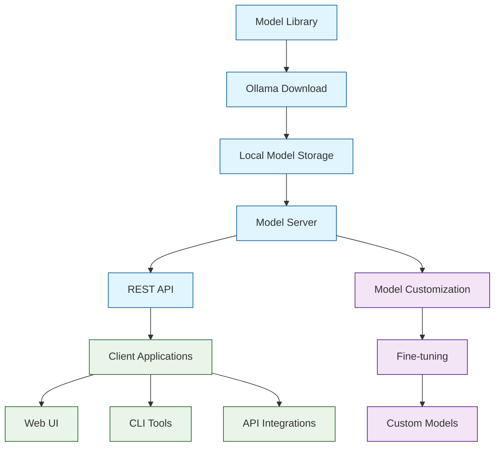

# Ollama Tutorial: Running Large Language Models Locally

Ollama[View Repo](https://github.com/ollama/ollama) is a powerful platform for running Large Language Models locally on your machine. It provides an easy way to download, run, and manage open-source LLMs with a simple command-line interface and REST API, enabling privacy-preserving AI applications without relying on external API calls.

Ollama supports a wide range of models from different architectures and provides tools for model customization, fine-tuning, and integration with various applications.

## Tutorial Chapters

Welcome to your journey through local LLM deployment! This tutorial explores how to run, manage, and customize Large Language Models locally with Ollama.

1. **[Chapter 1: Getting Started with Ollama](01-getting-started.md)** - Installation, setup, and your first local LLM
2. **[Chapter 2: Models & Modelfiles](02-models.md)** - Downloading, managing, and customizing models
3. **[Chapter 3: Chat & Completions](03-chat-completions.md)** - Interactive chat, streaming, and parameters
4. **[Chapter 4: Embeddings & RAG](04-embeddings-rag.md)** - Vector embeddings and retrieval-augmented generation
5. **[Chapter 5: Custom Models](05-modelfiles-custom.md)** - Building tailored models with Modelfiles
6. **[Chapter 6: Performance Tuning](06-performance.md)** - GPU tuning, quantization, and optimization
7. **[Chapter 7: Integrations](07-integrations.md)** - LangChain, LlamaIndex, and OpenAI-compatible SDKs
8. **[Chapter 8: Production Deployment](08-production.md)** - Docker, security, and monitoring

## What You'll Learn

By the end of this tutorial, you'll be able to:

- **Run LLMs locally** with complete privacy and control
- **Manage model libraries** and switch between different models
- **Build applications** using Ollama's REST API
- **Customize models** for specific use cases and domains
- **Optimize performance** for different hardware configurations
- **Deploy Ollama** in production environments
- **Integrate multimodal models** including vision and audio
- **Fine-tune models** for specialized tasks

## Prerequisites

- Modern computer with sufficient RAM (8GB+ recommended)
- Basic command-line knowledge
- Understanding of AI/LLM concepts
- Programming knowledge for API integration

## Learning Path

### 🟢 Beginner Track
Perfect for users new to local LLMs:
1. Chapters 1-2: Installation and basic model management
2. Focus on getting started with local AI

### 🟡 Intermediate Track
For developers building applications:
1. Chapters 3-5: Running models and API integration
2. Learn to build applications with local LLMs

### 🔴 Advanced Track
For production deployment and customization:
1. Chapters 6-8: Optimization, advanced features, and production
2. Master enterprise-grade local LLM deployment

---

**Ready to run LLMs locally with Ollama? Let's begin with [Chapter 1: Getting Started](01-getting-started.md)!**

*Generated by [AI Codebase Knowledge Builder](https://github.com/The-Pocket/Tutorial-Codebase-Knowledge)*
