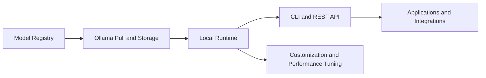

# Ollama Tutorial: Running and Serving LLMs Locally

> Learn how to use `ollama/ollama` for local model execution, customization, embeddings/RAG, integration, and production deployment.

## Why This Track Matters

Ollama is one of the most adopted local-LLM runtimes. Teams use it for privacy-sensitive workloads, cost control, and offline-capable development.

This track focuses on:

- practical local model operations
- model configuration and customization workflows
- embeddings/RAG application patterns
- production deployment and performance tuning

## Current Snapshot (auto-updated)

- repository: [`ollama/ollama`](https://github.com/ollama/ollama)
- stars: about **162.4k**
- latest release: [`v0.15.6`](https://github.com/ollama/ollama/releases/tag/v0.15.6)
- development activity: active with frequent releases
- project positioning in repo: local runtime for modern open models with CLI and API

## Mental Model

## Chapter Guide

| Chapter | Key Question | Outcome |
|:--------|:-------------|:--------|
| [01 - Getting Started](01-getting-started.md) | How do I install and run first local models? | Working local baseline |
| [02 - Models and Modelfiles](02-models.md) | How do I manage and configure model variants? | Better model lifecycle control |
| [03 - Chat and Completions](03-chat-completions.md) | How do I build reliable generation flows? | Stable interaction patterns |
| [04 - Embeddings and RAG](04-embeddings-rag.md) | How do I build retrieval workflows locally? | Local RAG architecture |
| [05 - Custom Models](05-modelfiles-custom.md) | How do I tailor models to tasks? | Modelfile customization playbook |
| [06 - Performance Tuning](06-performance.md) | How do I optimize latency and throughput? | Performance and hardware strategy |
| [07 - Integrations](07-integrations.md) | How does Ollama fit larger toolchains? | Ecosystem integration patterns |
| [08 - Production Deployment](08-production.md) | How do I run Ollama in production? | Deployment and operations baseline |

## What You Will Learn

- how to run and manage local LLMs with Ollama
- how to configure models and prompts for specific workloads
- how to build embeddings/RAG flows using local infrastructure
- how to deploy and operate Ollama with reliability and security controls

## Source References

- [Ollama Repository](https://github.com/ollama/ollama)
- [Ollama Releases](https://github.com/ollama/ollama/releases)
- [Ollama Website and Docs](https://ollama.com/)

## Related Tutorials

- [Open WebUI Tutorial](../open-webui-tutorial/)
- [LiteLLM Tutorial](../litellm-tutorial/)
- [Llama.cpp Tutorial](../llama-cpp-tutorial/)
- [VLLM Tutorial](../vllm-tutorial/)

---

Start with [Chapter 1: Getting Started](01-getting-started.md).

## Navigation & Backlinks

- [Start Here: Chapter 1: Getting Started with Ollama](01-getting-started.md)
- [Back to Main Catalog](../../README.md#-tutorial-catalog)
- [Browse A-Z Tutorial Directory](../../discoverability/tutorial-directory.md)
- [Search by Intent](../../discoverability/query-hub.md)
- [Explore Category Hubs](../../README.md#category-hubs)

## Full Chapter Map

1. [Chapter 1: Getting Started with Ollama](01-getting-started.md)
2. [Chapter 2: Models, Pulling, and Modelfiles](02-models.md)
3. [Chapter 3: Chat, Completions, and Parameters](03-chat-completions.md)
4. [Chapter 4: Embeddings and RAG with Ollama](04-embeddings-rag.md)
5. [Chapter 5: Modelfiles, Templates, and Custom Models](05-modelfiles-custom.md)
6. [Chapter 6: Performance, GPU Tuning, and Quantization](06-performance.md)
7. [Chapter 7: Integrations with OpenAI API, LangChain, and LlamaIndex](07-integrations.md)
8. [Chapter 8: Production Deployment, Security, and Monitoring](08-production.md)

*Generated by [AI Codebase Knowledge Builder](https://github.com/The-Pocket/Tutorial-Codebase-Knowledge)*
