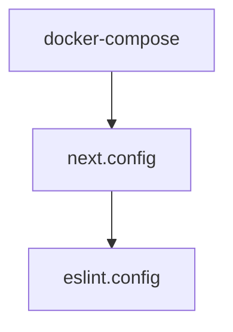

# Chapter 1: Getting Started

Welcome to **Chapter 1: Getting Started**. In this part of **Onlook Tutorial: Visual-First AI Coding for Next.js and Tailwind**, you will build an intuitive mental model first, then move into concrete implementation details and practical production tradeoffs.


This chapter gets you productive with Onlook through hosted and local entry points.

## Learning Goals

- choose hosted or local startup path
- initialize a Next.js + Tailwind workflow in Onlook
- understand first edit and preview loop
- avoid common setup friction quickly

## Startup Paths

| Path | Best For | Entry |
|:-----|:---------|:------|
| hosted app | fastest learning path | [onlook.com](https://onlook.com) |
| local development | contributors and advanced customization | [running locally docs](https://docs.onlook.com/developers/running-locally) |

## First-Use Checklist

1. open or create a Next.js + Tailwind project
2. run first visual edit in preview canvas
3. use AI chat for a scoped UI change
4. verify generated code in source panel
5. confirm change persists in your repository files

## Source References

- [Onlook README: Getting Started](https://github.com/onlook-dev/onlook/blob/main/README.md#getting-started)
- [Onlook Running Locally](https://docs.onlook.com/developers/running-locally)

## Summary

You now have a working Onlook baseline for visual and prompt-driven iteration.

Next: [Chapter 2: Product and Architecture Foundations](02-product-and-architecture-foundations.md)

## Depth Expansion Playbook

## Source Code Walkthrough

### `docker-compose.yml`

The `docker-compose` module in [`docker-compose.yml`](https://github.com/onlook-dev/onlook/blob/HEAD/docker-compose.yml) handles a key part of this chapter's functionality:

```yml
name: onlook

services:
  web-client:
    build:
      context: .
      dockerfile: Dockerfile
    env_file:
      - apps/web/client/.env
    ports:
      - "3000:3000"
    restart: unless-stopped
    network_mode: host

networks:
  supabase_network_onlook-web:
    external: true

```

This module is important because it defines how Onlook Tutorial: Visual-First AI Coding for Next.js and Tailwind implements the patterns covered in this chapter.

### `docs/next.config.ts`

The `next.config` module in [`docs/next.config.ts`](https://github.com/onlook-dev/onlook/blob/HEAD/docs/next.config.ts) handles a key part of this chapter's functionality:

```ts
/**
 * Run `build` or `dev` with `SKIP_ENV_VALIDATION` to skip env validation. This is especially useful
 * for Docker builds.
 */
import { createMDX } from 'fumadocs-mdx/next';
import { NextConfig } from 'next';
import path from 'node:path';

const withMDX = createMDX();

const nextConfig: NextConfig = {
    reactStrictMode: true,
};

if (process.env.NODE_ENV === 'development') {
    nextConfig.outputFileTracingRoot = path.join(__dirname, '../../..');
}

export default withMDX(nextConfig);

```

This module is important because it defines how Onlook Tutorial: Visual-First AI Coding for Next.js and Tailwind implements the patterns covered in this chapter.

### `eslint.config.js`

The `eslint.config` module in [`eslint.config.js`](https://github.com/onlook-dev/onlook/blob/HEAD/eslint.config.js) handles a key part of this chapter's functionality:

```js
import baseConfig from "@onlook/eslint/base";

/** @type {import('typescript-eslint').Config} */
export default [
  ...baseConfig,
  {
    files: ["tooling/**/*.js"],
  },
];

```

This module is important because it defines how Onlook Tutorial: Visual-First AI Coding for Next.js and Tailwind implements the patterns covered in this chapter.


## How These Components Connect


