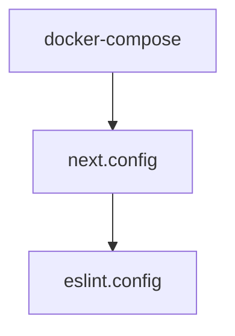

# Chapter 2: Product and Architecture Foundations

Welcome to **Chapter 2: Product and Architecture Foundations**. In this part of **Onlook Tutorial: Visual-First AI Coding for Next.js and Tailwind**, you will build an intuitive mental model first, then move into concrete implementation details and practical production tradeoffs.


This chapter explains how Onlook's architecture maps visual interaction to real code changes.

## Learning Goals

- understand core architectural flow
- identify responsibilities of editor, preview, and code layers
- reason about portability and framework scope
- map architecture to debugging strategy

## High-Level Flow

From Onlook docs and README:

1. app code runs in a containerized runtime
2. editor renders preview in an iFrame
3. editor indexes and maps DOM elements to code locations
4. edits are applied in preview, then persisted to source
5. AI tools also operate against code-aware context

## Why This Matters

- keeps developers in control of source code outputs
- supports rapid visual iteration without abandoning engineering rigor
- creates a path to collaboration and reproducibility through action history

## Source References

- [Onlook README: How it works](https://github.com/onlook-dev/onlook/blob/main/README.md#how-it-works)
- [Onlook Architecture Docs](https://docs.onlook.com/developers/architecture)

## Summary

You now have a systems-level model for how Onlook transforms edits into code.

Next: [Chapter 3: Visual Editing and Code Mapping](03-visual-editing-and-code-mapping.md)

## Depth Expansion Playbook

## Source Code Walkthrough

### `docker-compose.yml`

The `docker-compose` module in [`docker-compose.yml`](https://github.com/onlook-dev/onlook/blob/HEAD/docker-compose.yml) handles a key part of this chapter's functionality:

```yml
name: onlook

services:
  web-client:
    build:
      context: .
      dockerfile: Dockerfile
    env_file:
      - apps/web/client/.env
    ports:
      - "3000:3000"
    restart: unless-stopped
    network_mode: host

networks:
  supabase_network_onlook-web:
    external: true

```

This module is important because it defines how Onlook Tutorial: Visual-First AI Coding for Next.js and Tailwind implements the patterns covered in this chapter.

### `docs/next.config.ts`

The `next.config` module in [`docs/next.config.ts`](https://github.com/onlook-dev/onlook/blob/HEAD/docs/next.config.ts) handles a key part of this chapter's functionality:

```ts
/**
 * Run `build` or `dev` with `SKIP_ENV_VALIDATION` to skip env validation. This is especially useful
 * for Docker builds.
 */
import { createMDX } from 'fumadocs-mdx/next';
import { NextConfig } from 'next';
import path from 'node:path';

const withMDX = createMDX();

const nextConfig: NextConfig = {
    reactStrictMode: true,
};

if (process.env.NODE_ENV === 'development') {
    nextConfig.outputFileTracingRoot = path.join(__dirname, '../../..');
}

export default withMDX(nextConfig);

```

This module is important because it defines how Onlook Tutorial: Visual-First AI Coding for Next.js and Tailwind implements the patterns covered in this chapter.

### `eslint.config.js`

The `eslint.config` module in [`eslint.config.js`](https://github.com/onlook-dev/onlook/blob/HEAD/eslint.config.js) handles a key part of this chapter's functionality:

```js
import baseConfig from "@onlook/eslint/base";

/** @type {import('typescript-eslint').Config} */
export default [
  ...baseConfig,
  {
    files: ["tooling/**/*.js"],
  },
];

```

This module is important because it defines how Onlook Tutorial: Visual-First AI Coding for Next.js and Tailwind implements the patterns covered in this chapter.


## How These Components Connect


