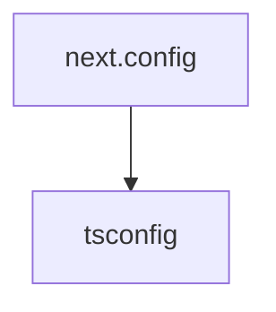

# Chapter 3: Visual Editing and Code Mapping

Welcome to **Chapter 3: Visual Editing and Code Mapping**. In this part of **Onlook Tutorial: Visual-First AI Coding for Next.js and Tailwind**, you will build an intuitive mental model first, then move into concrete implementation details and practical production tradeoffs.


This chapter focuses on the core visual editing loop and how to keep changes predictable.

## Learning Goals

- use visual controls for precise layout/styling updates
- understand element-to-code mapping behavior
- avoid destructive or ambiguous bulk edits
- validate generated code efficiently

## Editing Workflow

| Step | Action |
|:-----|:-------|
| inspect | select element in canvas or layer tree |
| modify | change styles/layout through visual controls |
| map | Onlook resolves target code location |
| persist | write updates to source files |
| verify | review code diff and rerun app/tests |

## Safe Iteration Tips

- keep edits scoped to one section at a time
- check generated code after each substantial change
- use branching/checkpoints for large redesigns
- run test/lint passes before merging

## Source References

- [Onlook README: Visual edit capabilities](https://github.com/onlook-dev/onlook/blob/main/README.md#what-you-can-do-with-onlook)
- [Onlook Architecture Docs](https://docs.onlook.com/developers/architecture)

## Summary

You now understand how to run visual editing loops while keeping code quality intact.

Next: [Chapter 4: AI Chat, Branching, and Iteration](04-ai-chat-branching-and-iteration.md)

## Source Code Walkthrough

### `docs/next.config.ts`

The `next.config` module in [`docs/next.config.ts`](https://github.com/onlook-dev/onlook/blob/HEAD/docs/next.config.ts) handles a key part of this chapter's functionality:

```ts
/**
 * Run `build` or `dev` with `SKIP_ENV_VALIDATION` to skip env validation. This is especially useful
 * for Docker builds.
 */
import { createMDX } from 'fumadocs-mdx/next';
import { NextConfig } from 'next';
import path from 'node:path';

const withMDX = createMDX();

const nextConfig: NextConfig = {
    reactStrictMode: true,
};

if (process.env.NODE_ENV === 'development') {
    nextConfig.outputFileTracingRoot = path.join(__dirname, '../../..');
}

export default withMDX(nextConfig);

```

This module is important because it defines how Onlook Tutorial: Visual-First AI Coding for Next.js and Tailwind implements the patterns covered in this chapter.

### `docs/tsconfig.json`

The `tsconfig` module in [`docs/tsconfig.json`](https://github.com/onlook-dev/onlook/blob/HEAD/docs/tsconfig.json) handles a key part of this chapter's functionality:

```json
{
  "compilerOptions": {
    "baseUrl": ".",
    "target": "ESNext",
    "lib": [
      "dom",
      "dom.iterable",
      "esnext"
    ],
    "allowJs": true,
    "skipLibCheck": true,
    "strict": true,
    "forceConsistentCasingInFileNames": true,
    "noEmit": true,
    "esModuleInterop": true,
    "module": "esnext",
    "moduleResolution": "bundler",
    "resolveJsonModule": true,
    "isolatedModules": true,
    "jsx": "react-jsx",
    "incremental": true,
    "paths": {
      "@/.source": [
        "./.source/index.ts"
      ],
      "@/*": [
        "./src/*"
      ]
    },
    "plugins": [
      {
        "name": "next"
      }
    ]
  },
```

This module is important because it defines how Onlook Tutorial: Visual-First AI Coding for Next.js and Tailwind implements the patterns covered in this chapter.


## How These Components Connect


