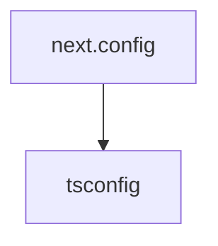

# Chapter 5: Local Development and Runtime Setup

Welcome to **Chapter 5: Local Development and Runtime Setup**. In this part of **Onlook Tutorial: Visual-First AI Coding for Next.js and Tailwind**, you will build an intuitive mental model first, then move into concrete implementation details and practical production tradeoffs.


This chapter covers local development setup for contributors and advanced operators.

## Learning Goals

- install local prerequisites for Onlook development
- bootstrap and run the monorepo runtime
- prepare database and environment dependencies
- establish repeatable local development workflows

## Prerequisites (Docs References)

Onlook development docs reference key dependencies including:

- Bun
- Docker
- Node.js
- Codesandbox account/keys and model provider keys for certain flows

## Common Development Commands

From the developer docs flow:

```bash
bun dev
```

Additional setup in the docs includes database migration/seed commands for local environments.

## Local Ops Checklist

1. clone repo and install dependencies
2. configure required environment variables
3. run database setup commands (if needed)
4. start dev server
5. open local URL and validate editor startup

## Source References

- [Onlook Running Locally](https://docs.onlook.com/developers/running-locally)
- [Onlook Developer Docs](https://docs.onlook.com/developers)

## Summary

You now have a repeatable foundation for local Onlook development.

Next: [Chapter 6: Deployment and Team Collaboration](06-deployment-and-team-collaboration.md)

## Source Code Walkthrough

### `docs/next.config.ts`

The `next.config` module in [`docs/next.config.ts`](https://github.com/onlook-dev/onlook/blob/HEAD/docs/next.config.ts) handles a key part of this chapter's functionality:

```ts
/**
 * Run `build` or `dev` with `SKIP_ENV_VALIDATION` to skip env validation. This is especially useful
 * for Docker builds.
 */
import { createMDX } from 'fumadocs-mdx/next';
import { NextConfig } from 'next';
import path from 'node:path';

const withMDX = createMDX();

const nextConfig: NextConfig = {
    reactStrictMode: true,
};

if (process.env.NODE_ENV === 'development') {
    nextConfig.outputFileTracingRoot = path.join(__dirname, '../../..');
}

export default withMDX(nextConfig);

```

This module is important because it defines how Onlook Tutorial: Visual-First AI Coding for Next.js and Tailwind implements the patterns covered in this chapter.

### `docs/tsconfig.json`

The `tsconfig` module in [`docs/tsconfig.json`](https://github.com/onlook-dev/onlook/blob/HEAD/docs/tsconfig.json) handles a key part of this chapter's functionality:

```json
{
  "compilerOptions": {
    "baseUrl": ".",
    "target": "ESNext",
    "lib": [
      "dom",
      "dom.iterable",
      "esnext"
    ],
    "allowJs": true,
    "skipLibCheck": true,
    "strict": true,
    "forceConsistentCasingInFileNames": true,
    "noEmit": true,
    "esModuleInterop": true,
    "module": "esnext",
    "moduleResolution": "bundler",
    "resolveJsonModule": true,
    "isolatedModules": true,
    "jsx": "react-jsx",
    "incremental": true,
    "paths": {
      "@/.source": [
        "./.source/index.ts"
      ],
      "@/*": [
        "./src/*"
      ]
    },
    "plugins": [
      {
        "name": "next"
      }
    ]
  },
```

This module is important because it defines how Onlook Tutorial: Visual-First AI Coding for Next.js and Tailwind implements the patterns covered in this chapter.


## How These Components Connect


