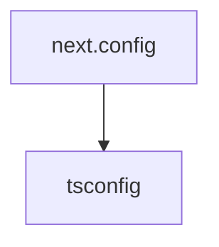

# Chapter 6: Deployment and Team Collaboration

Welcome to **Chapter 6: Deployment and Team Collaboration**. In this part of **Onlook Tutorial: Visual-First AI Coding for Next.js and Tailwind**, you will build an intuitive mental model first, then move into concrete implementation details and practical production tradeoffs.


This chapter focuses on shipping workflows and collaboration patterns around Onlook-generated code.

## Learning Goals

- move from local edits to deployable outputs
- use sharable links and branch workflows for reviews
- avoid collaboration bottlenecks in UI-heavy projects
- align design iteration with engineering quality gates

## Delivery Pattern

| Phase | Practice |
|:------|:---------|
| draft | rapid visual/prompt edits in isolated branch |
| review | share previews, run code review on diffs |
| validate | lint/tests/build checks |
| release | merge branch and deploy |

## Collaboration Guidance

- require code review for major generated UI changes
- keep prompt context and design goals in PR descriptions
- pair design and engineering reviewers for high-impact pages

## Source References

- [Onlook README: deployment/collaboration capabilities](https://github.com/onlook-dev/onlook/blob/main/README.md#what-you-can-do-with-onlook)
- [Onlook Docs](https://docs.onlook.com)

## Summary

You now have a workflow for turning Onlook edits into team-reviewed deployable changes.

Next: [Chapter 7: Contributing and Quality Workflow](07-contributing-and-quality-workflow.md)

## Source Code Walkthrough

### `docs/next.config.ts`

The `next.config` module in [`docs/next.config.ts`](https://github.com/onlook-dev/onlook/blob/HEAD/docs/next.config.ts) handles a key part of this chapter's functionality:

```ts
/**
 * Run `build` or `dev` with `SKIP_ENV_VALIDATION` to skip env validation. This is especially useful
 * for Docker builds.
 */
import { createMDX } from 'fumadocs-mdx/next';
import { NextConfig } from 'next';
import path from 'node:path';

const withMDX = createMDX();

const nextConfig: NextConfig = {
    reactStrictMode: true,
};

if (process.env.NODE_ENV === 'development') {
    nextConfig.outputFileTracingRoot = path.join(__dirname, '../../..');
}

export default withMDX(nextConfig);

```

This module is important because it defines how Onlook Tutorial: Visual-First AI Coding for Next.js and Tailwind implements the patterns covered in this chapter.

### `docs/tsconfig.json`

The `tsconfig` module in [`docs/tsconfig.json`](https://github.com/onlook-dev/onlook/blob/HEAD/docs/tsconfig.json) handles a key part of this chapter's functionality:

```json
{
  "compilerOptions": {
    "baseUrl": ".",
    "target": "ESNext",
    "lib": [
      "dom",
      "dom.iterable",
      "esnext"
    ],
    "allowJs": true,
    "skipLibCheck": true,
    "strict": true,
    "forceConsistentCasingInFileNames": true,
    "noEmit": true,
    "esModuleInterop": true,
    "module": "esnext",
    "moduleResolution": "bundler",
    "resolveJsonModule": true,
    "isolatedModules": true,
    "jsx": "react-jsx",
    "incremental": true,
    "paths": {
      "@/.source": [
        "./.source/index.ts"
      ],
      "@/*": [
        "./src/*"
      ]
    },
    "plugins": [
      {
        "name": "next"
      }
    ]
  },
```

This module is important because it defines how Onlook Tutorial: Visual-First AI Coding for Next.js and Tailwind implements the patterns covered in this chapter.


## How These Components Connect


