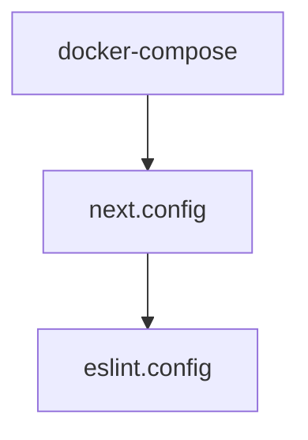

# Chapter 7: Contributing and Quality Workflow

Welcome to **Chapter 7: Contributing and Quality Workflow**. In this part of **Onlook Tutorial: Visual-First AI Coding for Next.js and Tailwind**, you will build an intuitive mental model first, then move into concrete implementation details and practical production tradeoffs.


This chapter covers the contribution model and quality gates for contributing to Onlook itself.

## Learning Goals

- follow Onlook's contribution process
- run local quality checks before PRs
- structure changes for maintainable review
- reduce integration risk when modifying editor/runtime subsystems

## Contribution Flow

1. pick issue or propose scoped enhancement
2. implement in feature branch/fork
3. run tests/lint/format/type checks locally
4. open PR with architecture notes and reproduction steps
5. iterate with maintainer feedback

## Quality Baseline

Onlook developer docs reference quality tooling including testing, linting/formatting, and TypeScript checks via Bun workflows.

## Source References

- [Onlook README: Contributing](https://github.com/onlook-dev/onlook/blob/main/README.md#contributing)
- [Onlook Developer Docs](https://docs.onlook.com/developers)

## Summary

You now have the operational contribution baseline for working on Onlook core.

Next: [Chapter 8: Production Operations and Governance](08-production-operations-and-governance.md)

## Depth Expansion Playbook

## Source Code Walkthrough

### `docker-compose.yml`

The `docker-compose` module in [`docker-compose.yml`](https://github.com/onlook-dev/onlook/blob/HEAD/docker-compose.yml) handles a key part of this chapter's functionality:

```yml
name: onlook

services:
  web-client:
    build:
      context: .
      dockerfile: Dockerfile
    env_file:
      - apps/web/client/.env
    ports:
      - "3000:3000"
    restart: unless-stopped
    network_mode: host

networks:
  supabase_network_onlook-web:
    external: true

```

This module is important because it defines how Onlook Tutorial: Visual-First AI Coding for Next.js and Tailwind implements the patterns covered in this chapter.

### `docs/next.config.ts`

The `next.config` module in [`docs/next.config.ts`](https://github.com/onlook-dev/onlook/blob/HEAD/docs/next.config.ts) handles a key part of this chapter's functionality:

```ts
/**
 * Run `build` or `dev` with `SKIP_ENV_VALIDATION` to skip env validation. This is especially useful
 * for Docker builds.
 */
import { createMDX } from 'fumadocs-mdx/next';
import { NextConfig } from 'next';
import path from 'node:path';

const withMDX = createMDX();

const nextConfig: NextConfig = {
    reactStrictMode: true,
};

if (process.env.NODE_ENV === 'development') {
    nextConfig.outputFileTracingRoot = path.join(__dirname, '../../..');
}

export default withMDX(nextConfig);

```

This module is important because it defines how Onlook Tutorial: Visual-First AI Coding for Next.js and Tailwind implements the patterns covered in this chapter.

### `eslint.config.js`

The `eslint.config` module in [`eslint.config.js`](https://github.com/onlook-dev/onlook/blob/HEAD/eslint.config.js) handles a key part of this chapter's functionality:

```js
import baseConfig from "@onlook/eslint/base";

/** @type {import('typescript-eslint').Config} */
export default [
  ...baseConfig,
  {
    files: ["tooling/**/*.js"],
  },
];

```

This module is important because it defines how Onlook Tutorial: Visual-First AI Coding for Next.js and Tailwind implements the patterns covered in this chapter.


## How These Components Connect


