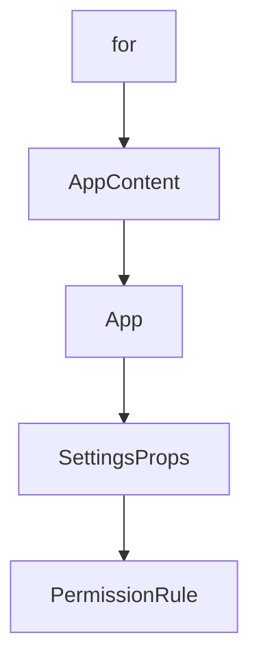

# Chapter 1: Getting Started

Welcome to **Chapter 1: Getting Started**. In this part of **Opcode Tutorial: GUI Command Center for Claude Code Workflows**, you will build an intuitive mental model first, then move into concrete implementation details and practical production tradeoffs.


This chapter establishes the baseline for using Opcode with Claude Code.

## Learning Goals

- understand prerequisites and install paths
- launch Opcode and discover local Claude Code projects
- validate first session and project workflow
- triage common setup failures

## Prerequisites

- Claude Code CLI installed and available in `PATH`

## First-Run Flow

1. launch Opcode
2. choose Projects or CC Agents entry point
3. confirm `~/.claude` directory detection
4. open a project and inspect sessions

## Common Startup Issues

| Symptom | Likely Cause | First Fix |
|:--------|:-------------|:----------|
| no projects visible | Claude directory not present | verify Claude Code setup and path |
| claude command errors | CLI not in PATH | reinstall and verify `claude --version` |
| build/install friction | missing platform deps | follow platform-specific source build docs |

## Source References

- [Opcode README: Installation](https://github.com/winfunc/opcode/blob/main/README.md#-installation)
- [Opcode README: Getting Started](https://github.com/winfunc/opcode/blob/main/README.md#getting-started)

## Summary

You now have Opcode connected to a working Claude Code environment.

Next: [Chapter 2: Architecture and Platform Stack](02-architecture-and-platform-stack.md)

## Depth Expansion Playbook

## Source Code Walkthrough

### `src-tauri/tauri.conf.json`

The `for` interface in [`src-tauri/tauri.conf.json`](https://github.com/winfunc/opcode/blob/HEAD/src-tauri/tauri.conf.json) handles a key part of this chapter's functionality:

```json
  "identifier": "opcode.asterisk.so",
  "build": {
    "beforeDevCommand": "",
    "beforeBuildCommand": "bun run build",
    "frontendDist": "../dist"
  },
  "app": {
    "macOSPrivateApi": true,
    "windows": [
      {
        "title": "opcode",
        "width": 800,
        "height": 600,
        "decorations": false,
        "transparent": true,
        "shadow": true,
        "center": true,
        "resizable": true,
        "alwaysOnTop": false
      }
    ],
    "security": {
      "csp": "default-src 'self'; img-src 'self' asset: https://asset.localhost blob: data:; style-src 'self' 'unsafe-inline'; script-src 'self' 'unsafe-eval' https://app.posthog.com https://*.posthog.com https://*.i.posthog.com https://*.assets.i.posthog.com; connect-src 'self' ipc: https://ipc.localhost https://app.posthog.com https://*.posthog.com https://*.i.posthog.com",
      "assetProtocol": {
        "enable": true,
        "scope": [
          "**"
        ]
      }
    }
  },
  "plugins": {
```

This interface is important because it defines how Opcode Tutorial: GUI Command Center for Claude Code Workflows implements the patterns covered in this chapter.

### `src/App.tsx`

The `AppContent` function in [`src/App.tsx`](https://github.com/winfunc/opcode/blob/HEAD/src/App.tsx) handles a key part of this chapter's functionality:

```tsx

/**
 * AppContent component - Contains the main app logic, wrapped by providers
 */
function AppContent() {
  const [view, setView] = useState<View>("tabs");
  const { createClaudeMdTab, createSettingsTab, createUsageTab, createMCPTab, createAgentsTab } = useTabState();
  const [projects, setProjects] = useState<Project[]>([]);
  const [selectedProject, setSelectedProject] = useState<Project | null>(null);
  const [sessions, setSessions] = useState<Session[]>([]);
  const [editingClaudeFile, setEditingClaudeFile] = useState<ClaudeMdFile | null>(null);
  const [loading, setLoading] = useState(true);
  const [_error, setError] = useState<string | null>(null);
  const [showNFO, setShowNFO] = useState(false);
  const [showClaudeBinaryDialog, setShowClaudeBinaryDialog] = useState(false);
  const [showProjectPicker, setShowProjectPicker] = useState(false);
  const [homeDirectory, setHomeDirectory] = useState<string>('/');
  const [toast, setToast] = useState<{ message: string; type: "success" | "error" | "info" } | null>(null);
  const [projectForSettings, setProjectForSettings] = useState<Project | null>(null);
  const [previousView] = useState<View>("welcome");
  
  // Initialize analytics lifecycle tracking
  useAppLifecycle();
  const trackEvent = useTrackEvent();
  
  // Track user journey milestones
  const [hasTrackedFirstChat] = useState(false);
  // const [hasTrackedFirstAgent] = useState(false);
  
  // Track when user reaches different journey stages
  useEffect(() => {
    if (view === "projects" && projects.length > 0 && !hasTrackedFirstChat) {
```

This function is important because it defines how Opcode Tutorial: GUI Command Center for Claude Code Workflows implements the patterns covered in this chapter.

### `src/App.tsx`

The `App` function in [`src/App.tsx`](https://github.com/winfunc/opcode/blob/HEAD/src/App.tsx) handles a key part of this chapter's functionality:

```tsx
import { TabContent } from "@/components/TabContent";
import { useTabState } from "@/hooks/useTabState";
import { useAppLifecycle, useTrackEvent } from "@/hooks";
import { StartupIntro } from "@/components/StartupIntro";

type View = 
  | "welcome" 
  | "projects" 
  | "editor" 
  | "claude-file-editor" 
  | "settings"
  | "cc-agents"
  | "create-agent"
  | "github-agents"
  | "agent-execution"
  | "agent-run-view"
  | "mcp"
  | "usage-dashboard"
  | "project-settings"
  | "tabs"; // New view for tab-based interface

/**
 * AppContent component - Contains the main app logic, wrapped by providers
 */
function AppContent() {
  const [view, setView] = useState<View>("tabs");
  const { createClaudeMdTab, createSettingsTab, createUsageTab, createMCPTab, createAgentsTab } = useTabState();
  const [projects, setProjects] = useState<Project[]>([]);
  const [selectedProject, setSelectedProject] = useState<Project | null>(null);
  const [sessions, setSessions] = useState<Session[]>([]);
  const [editingClaudeFile, setEditingClaudeFile] = useState<ClaudeMdFile | null>(null);
  const [loading, setLoading] = useState(true);
```

This function is important because it defines how Opcode Tutorial: GUI Command Center for Claude Code Workflows implements the patterns covered in this chapter.

### `src/components/Settings.tsx`

The `SettingsProps` interface in [`src/components/Settings.tsx`](https://github.com/winfunc/opcode/blob/HEAD/src/components/Settings.tsx) handles a key part of this chapter's functionality:

```tsx
import { TabPersistenceService } from "@/services/tabPersistence";

interface SettingsProps {
  /**
   * Callback to go back to the main view
   */
  onBack: () => void;
  /**
   * Optional className for styling
   */
  className?: string;
}

interface PermissionRule {
  id: string;
  value: string;
}

interface EnvironmentVariable {
  id: string;
  key: string;
  value: string;
}

/**
 * Comprehensive Settings UI for managing Claude Code settings
 * Provides a no-code interface for editing the settings.json file
 */
export const Settings: React.FC<SettingsProps> = ({
  className,
}) => {
  const [settings, setSettings] = useState<ClaudeSettings | null>(null);
```

This interface is important because it defines how Opcode Tutorial: GUI Command Center for Claude Code Workflows implements the patterns covered in this chapter.


## How These Components Connect


