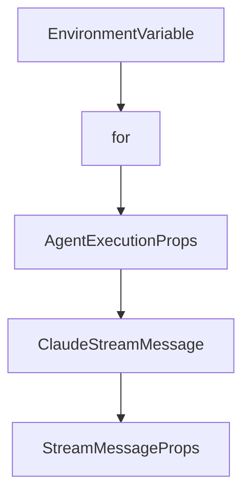

# Chapter 2: Architecture and Platform Stack

Welcome to **Chapter 2: Architecture and Platform Stack**. In this part of **Opcode Tutorial: GUI Command Center for Claude Code Workflows**, you will build an intuitive mental model first, then move into concrete implementation details and practical production tradeoffs.


This chapter covers the technical foundation behind Opcode's desktop experience.

## Learning Goals

- understand frontend/backend responsibilities
- map Tauri + React + Rust architecture to runtime behavior
- reason about storage and process boundaries
- align architecture with debugging strategy

## Stack Overview

| Layer | Technology |
|:------|:-----------|
| desktop shell | Tauri 2 |
| frontend | React 18 + TypeScript + Vite |
| backend/runtime | Rust |
| storage | SQLite |
| package tooling | Bun |

## Architecture Implications

- desktop-native distribution with web-style UX
- strong Rust-based process and state control
- straightforward contributor model for frontend/backend changes

## Source References

- [Opcode README: Tech Stack](https://github.com/winfunc/opcode/blob/main/README.md#tech-stack)
- [Opcode README: Project Structure](https://github.com/winfunc/opcode/blob/main/README.md#project-structure)

## Summary

You now understand the core architecture choices that shape Opcode behavior.

Next: [Chapter 3: Projects and Session Management](03-projects-and-session-management.md)

## Depth Expansion Playbook

## Source Code Walkthrough

### `src/components/Settings.tsx`

The `EnvironmentVariable` interface in [`src/components/Settings.tsx`](https://github.com/winfunc/opcode/blob/HEAD/src/components/Settings.tsx) handles a key part of this chapter's functionality:

```tsx
}

interface EnvironmentVariable {
  id: string;
  key: string;
  value: string;
}

/**
 * Comprehensive Settings UI for managing Claude Code settings
 * Provides a no-code interface for editing the settings.json file
 */
export const Settings: React.FC<SettingsProps> = ({
  className,
}) => {
  const [settings, setSettings] = useState<ClaudeSettings | null>(null);
  const [loading, setLoading] = useState(true);
  const [saving, setSaving] = useState(false);
  const [error, setError] = useState<string | null>(null);
  const [activeTab, setActiveTab] = useState("general");
  const [currentBinaryPath, setCurrentBinaryPath] = useState<string | null>(null);
  const [selectedInstallation, setSelectedInstallation] = useState<ClaudeInstallation | null>(null);
  const [binaryPathChanged, setBinaryPathChanged] = useState(false);
  const [toast, setToast] = useState<{ message: string; type: 'success' | 'error' } | null>(null);
  
  // Permission rules state
  const [allowRules, setAllowRules] = useState<PermissionRule[]>([]);
  const [denyRules, setDenyRules] = useState<PermissionRule[]>([]);
  
  // Environment variables state
  const [envVars, setEnvVars] = useState<EnvironmentVariable[]>([]);
  
```

This interface is important because it defines how Opcode Tutorial: GUI Command Center for Claude Code Workflows implements the patterns covered in this chapter.

### `src/components/Settings.tsx`

The `for` interface in [`src/components/Settings.tsx`](https://github.com/winfunc/opcode/blob/HEAD/src/components/Settings.tsx) handles a key part of this chapter's functionality:

```tsx
  onBack: () => void;
  /**
   * Optional className for styling
   */
  className?: string;
}

interface PermissionRule {
  id: string;
  value: string;
}

interface EnvironmentVariable {
  id: string;
  key: string;
  value: string;
}

/**
 * Comprehensive Settings UI for managing Claude Code settings
 * Provides a no-code interface for editing the settings.json file
 */
export const Settings: React.FC<SettingsProps> = ({
  className,
}) => {
  const [settings, setSettings] = useState<ClaudeSettings | null>(null);
  const [loading, setLoading] = useState(true);
  const [saving, setSaving] = useState(false);
  const [error, setError] = useState<string | null>(null);
  const [activeTab, setActiveTab] = useState("general");
  const [currentBinaryPath, setCurrentBinaryPath] = useState<string | null>(null);
  const [selectedInstallation, setSelectedInstallation] = useState<ClaudeInstallation | null>(null);
```

This interface is important because it defines how Opcode Tutorial: GUI Command Center for Claude Code Workflows implements the patterns covered in this chapter.

### `src/components/AgentExecution.tsx`

The `AgentExecutionProps` interface in [`src/components/AgentExecution.tsx`](https://github.com/winfunc/opcode/blob/HEAD/src/components/AgentExecution.tsx) handles a key part of this chapter's functionality:

```tsx
import { useTabState } from "@/hooks/useTabState";

interface AgentExecutionProps {
  /**
   * The agent to execute
   */
  agent: Agent;
  /**
   * Optional initial project path
   */
  projectPath?: string;
  /**
   * Optional tab ID for updating tab status
   */
  tabId?: string;
  /**
   * Callback to go back to the agents list
   */
  onBack: () => void;
  /**
   * Optional className for styling
   */
  className?: string;
}

export interface ClaudeStreamMessage {
  type: "system" | "assistant" | "user" | "result";
  subtype?: string;
  message?: {
    content?: any[];
    usage?: {
      input_tokens: number;
```

This interface is important because it defines how Opcode Tutorial: GUI Command Center for Claude Code Workflows implements the patterns covered in this chapter.

### `src/components/AgentExecution.tsx`

The `ClaudeStreamMessage` interface in [`src/components/AgentExecution.tsx`](https://github.com/winfunc/opcode/blob/HEAD/src/components/AgentExecution.tsx) handles a key part of this chapter's functionality:

```tsx
}

export interface ClaudeStreamMessage {
  type: "system" | "assistant" | "user" | "result";
  subtype?: string;
  message?: {
    content?: any[];
    usage?: {
      input_tokens: number;
      output_tokens: number;
    };
  };
  usage?: {
    input_tokens: number;
    output_tokens: number;
  };
  [key: string]: any;
}

/**
 * AgentExecution component for running CC agents
 * 
 * @example
 * <AgentExecution agent={agent} onBack={() => setView('list')} />
 */
export const AgentExecution: React.FC<AgentExecutionProps> = ({
  agent,
  projectPath: initialProjectPath,
  tabId,
  onBack,
  className,
}) => {
```

This interface is important because it defines how Opcode Tutorial: GUI Command Center for Claude Code Workflows implements the patterns covered in this chapter.


## How These Components Connect


