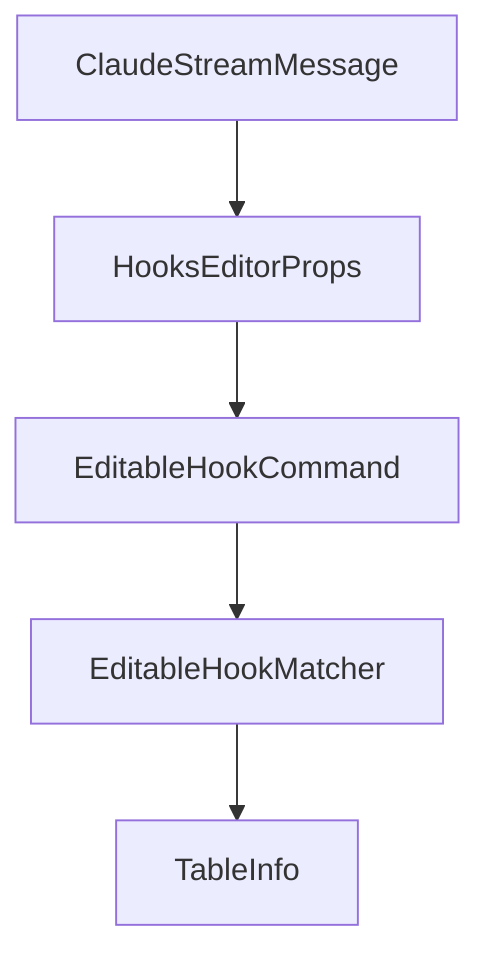

# Chapter 3: Projects and Session Management

Welcome to **Chapter 3: Projects and Session Management**. In this part of **Opcode Tutorial: GUI Command Center for Claude Code Workflows**, you will build an intuitive mental model first, then move into concrete implementation details and practical production tradeoffs.


This chapter focuses on Opcode's project browser and session control workflows.

## Learning Goals

- navigate project and session history efficiently
- resume prior sessions with context intact
- organize workflows for multiple repositories
- reduce context switching costs

## Workflow Path

```text
Projects -> Select Project -> View Sessions -> Resume or Start New
```

## Best Practices

- keep one active session per major objective
- name and group tasks at project level for clarity
- review session metadata before resuming old runs

## Source References

- [Opcode README: Project & Session Management](https://github.com/winfunc/opcode/blob/main/README.md#️-project--session-management)
- [Opcode README: Managing Projects](https://github.com/winfunc/opcode/blob/main/README.md#managing-projects)

## Summary

You now have a repeatable approach to session control through Opcode's GUI.

Next: [Chapter 4: Custom Agents and Background Runs](04-custom-agents-and-background-runs.md)

## Source Code Walkthrough

### `src/components/AgentExecution.tsx`

The `ClaudeStreamMessage` interface in [`src/components/AgentExecution.tsx`](https://github.com/winfunc/opcode/blob/HEAD/src/components/AgentExecution.tsx) handles a key part of this chapter's functionality:

```tsx
}

export interface ClaudeStreamMessage {
  type: "system" | "assistant" | "user" | "result";
  subtype?: string;
  message?: {
    content?: any[];
    usage?: {
      input_tokens: number;
      output_tokens: number;
    };
  };
  usage?: {
    input_tokens: number;
    output_tokens: number;
  };
  [key: string]: any;
}

/**
 * AgentExecution component for running CC agents
 * 
 * @example
 * <AgentExecution agent={agent} onBack={() => setView('list')} />
 */
export const AgentExecution: React.FC<AgentExecutionProps> = ({
  agent,
  projectPath: initialProjectPath,
  tabId,
  onBack,
  className,
}) => {
```

This interface is important because it defines how Opcode Tutorial: GUI Command Center for Claude Code Workflows implements the patterns covered in this chapter.

### `src/components/HooksEditor.tsx`

The `HooksEditorProps` interface in [`src/components/HooksEditor.tsx`](https://github.com/winfunc/opcode/blob/HEAD/src/components/HooksEditor.tsx) handles a key part of this chapter's functionality:

```tsx
} from '@/types/hooks';

interface HooksEditorProps {
  projectPath?: string;
  scope: 'project' | 'local' | 'user';
  readOnly?: boolean;
  className?: string;
  onChange?: (hasChanges: boolean, getHooks: () => HooksConfiguration) => void;
  hideActions?: boolean;
}

interface EditableHookCommand extends HookCommand {
  id: string;
}

interface EditableHookMatcher extends Omit<HookMatcher, 'hooks'> {
  id: string;
  hooks: EditableHookCommand[];
  expanded?: boolean;
}

const EVENT_INFO: Record<HookEvent, { label: string; description: string; icon: React.ReactNode }> = {
  PreToolUse: {
    label: 'Pre Tool Use',
    description: 'Runs before tool calls, can block and provide feedback',
    icon: <Shield className="h-4 w-4" />
  },
  PostToolUse: {
    label: 'Post Tool Use',
    description: 'Runs after successful tool completion',
    icon: <PlayCircle className="h-4 w-4" />
  },
```

This interface is important because it defines how Opcode Tutorial: GUI Command Center for Claude Code Workflows implements the patterns covered in this chapter.

### `src/components/HooksEditor.tsx`

The `EditableHookCommand` interface in [`src/components/HooksEditor.tsx`](https://github.com/winfunc/opcode/blob/HEAD/src/components/HooksEditor.tsx) handles a key part of this chapter's functionality:

```tsx
}

interface EditableHookCommand extends HookCommand {
  id: string;
}

interface EditableHookMatcher extends Omit<HookMatcher, 'hooks'> {
  id: string;
  hooks: EditableHookCommand[];
  expanded?: boolean;
}

const EVENT_INFO: Record<HookEvent, { label: string; description: string; icon: React.ReactNode }> = {
  PreToolUse: {
    label: 'Pre Tool Use',
    description: 'Runs before tool calls, can block and provide feedback',
    icon: <Shield className="h-4 w-4" />
  },
  PostToolUse: {
    label: 'Post Tool Use',
    description: 'Runs after successful tool completion',
    icon: <PlayCircle className="h-4 w-4" />
  },
  Notification: {
    label: 'Notification',
    description: 'Customizes notifications when Claude needs attention',
    icon: <Zap className="h-4 w-4" />
  },
  Stop: {
    label: 'Stop',
    description: 'Runs when Claude finishes responding',
    icon: <Code2 className="h-4 w-4" />
```

This interface is important because it defines how Opcode Tutorial: GUI Command Center for Claude Code Workflows implements the patterns covered in this chapter.

### `src/components/HooksEditor.tsx`

The `EditableHookMatcher` interface in [`src/components/HooksEditor.tsx`](https://github.com/winfunc/opcode/blob/HEAD/src/components/HooksEditor.tsx) handles a key part of this chapter's functionality:

```tsx
}

interface EditableHookMatcher extends Omit<HookMatcher, 'hooks'> {
  id: string;
  hooks: EditableHookCommand[];
  expanded?: boolean;
}

const EVENT_INFO: Record<HookEvent, { label: string; description: string; icon: React.ReactNode }> = {
  PreToolUse: {
    label: 'Pre Tool Use',
    description: 'Runs before tool calls, can block and provide feedback',
    icon: <Shield className="h-4 w-4" />
  },
  PostToolUse: {
    label: 'Post Tool Use',
    description: 'Runs after successful tool completion',
    icon: <PlayCircle className="h-4 w-4" />
  },
  Notification: {
    label: 'Notification',
    description: 'Customizes notifications when Claude needs attention',
    icon: <Zap className="h-4 w-4" />
  },
  Stop: {
    label: 'Stop',
    description: 'Runs when Claude finishes responding',
    icon: <Code2 className="h-4 w-4" />
  },
  SubagentStop: {
    label: 'Subagent Stop',
    description: 'Runs when a Claude subagent (Task) finishes',
```

This interface is important because it defines how Opcode Tutorial: GUI Command Center for Claude Code Workflows implements the patterns covered in this chapter.


## How These Components Connect


