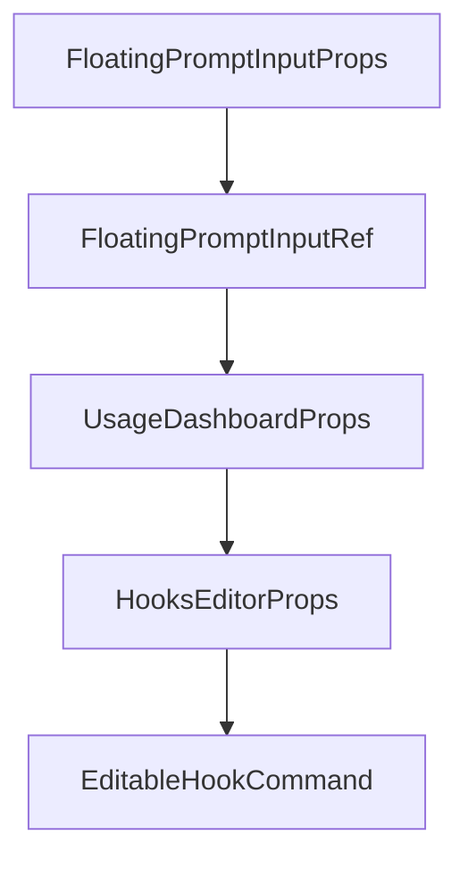

# Chapter 3: Projects and Session Management

Welcome to **Chapter 3: Projects and Session Management**. In this part of **Opcode Tutorial: GUI Command Center for Claude Code Workflows**, you will build an intuitive mental model first, then move into concrete implementation details and practical production tradeoffs.


This chapter focuses on Opcode's project browser and session control workflows.

## Learning Goals

- navigate project and session history efficiently
- resume prior sessions with context intact
- organize workflows for multiple repositories
- reduce context switching costs

## Workflow Path

```text
Projects -> Select Project -> View Sessions -> Resume or Start New
```

## Best Practices

- keep one active session per major objective
- name and group tasks at project level for clarity
- review session metadata before resuming old runs

## Source References

- [Opcode README: Project & Session Management](https://github.com/winfunc/opcode/blob/main/README.md#️-project--session-management)
- [Opcode README: Managing Projects](https://github.com/winfunc/opcode/blob/main/README.md#managing-projects)

## Summary

You now have a repeatable approach to session control through Opcode's GUI.

Next: [Chapter 4: Custom Agents and Background Runs](04-custom-agents-and-background-runs.md)

## Depth Expansion Playbook

## Source Code Walkthrough

### `src/components/FloatingPromptInput.tsx`

The `FloatingPromptInputProps` interface in [`src/components/FloatingPromptInput.tsx`](https://github.com/winfunc/opcode/blob/HEAD/src/components/FloatingPromptInput.tsx) handles a key part of this chapter's functionality:

```tsx
const getCurrentWebviewWindow = tauriGetCurrentWebviewWindow || (() => ({ listen: () => Promise.resolve(() => {}) }));

interface FloatingPromptInputProps {
  /**
   * Callback when prompt is sent
   */
  onSend: (prompt: string, model: "sonnet" | "opus") => void;
  /**
   * Whether the input is loading
   */
  isLoading?: boolean;
  /**
   * Whether the input is disabled
   */
  disabled?: boolean;
  /**
   * Default model to select
   */
  defaultModel?: "sonnet" | "opus";
  /**
   * Project path for file picker
   */
  projectPath?: string;
  /**
   * Optional className for styling
   */
  className?: string;
  /**
   * Callback when cancel is clicked (only during loading)
   */
  onCancel?: () => void;
  /**
```

This interface is important because it defines how Opcode Tutorial: GUI Command Center for Claude Code Workflows implements the patterns covered in this chapter.

### `src/components/FloatingPromptInput.tsx`

The `FloatingPromptInputRef` interface in [`src/components/FloatingPromptInput.tsx`](https://github.com/winfunc/opcode/blob/HEAD/src/components/FloatingPromptInput.tsx) handles a key part of this chapter's functionality:

```tsx
}

export interface FloatingPromptInputRef {
  addImage: (imagePath: string) => void;
}

/**
 * Thinking mode type definition
 */
type ThinkingMode = "auto" | "think" | "think_hard" | "think_harder" | "ultrathink";

/**
 * Thinking mode configuration
 */
type ThinkingModeConfig = {
  id: ThinkingMode;
  name: string;
  description: string;
  level: number; // 0-4 for visual indicator
  phrase?: string; // The phrase to append
  icon: React.ReactNode;
  color: string;
  shortName: string;
};

const THINKING_MODES: ThinkingModeConfig[] = [
  {
    id: "auto",
    name: "Auto",
    description: "Let Claude decide",
    level: 0,
    icon: <Sparkles className="h-3.5 w-3.5" />,
```

This interface is important because it defines how Opcode Tutorial: GUI Command Center for Claude Code Workflows implements the patterns covered in this chapter.

### `src/components/UsageDashboard.tsx`

The `UsageDashboardProps` interface in [`src/components/UsageDashboard.tsx`](https://github.com/winfunc/opcode/blob/HEAD/src/components/UsageDashboard.tsx) handles a key part of this chapter's functionality:

```tsx
} from "lucide-react";

interface UsageDashboardProps {
  /**
   * Callback when back button is clicked
   */
  onBack: () => void;
}

// Cache for storing fetched data
const dataCache = new Map<string, { data: any; timestamp: number }>();
const CACHE_DURATION = 10 * 60 * 1000; // 10 minutes cache - increased for better performance

/**
 * Optimized UsageDashboard component with caching and progressive loading
 */
export const UsageDashboard: React.FC<UsageDashboardProps> = ({ }) => {
  const [loading, setLoading] = useState(true);
  const [error, setError] = useState<string | null>(null);
  const [stats, setStats] = useState<UsageStats | null>(null);
  const [sessionStats, setSessionStats] = useState<ProjectUsage[] | null>(null);
  const [selectedDateRange, setSelectedDateRange] = useState<"all" | "7d" | "30d">("7d");
  const [activeTab, setActiveTab] = useState("overview");
  const [hasLoadedTabs, setHasLoadedTabs] = useState<Set<string>>(new Set(["overview"]));
  
  // Pagination states
  const [projectsPage, setProjectsPage] = useState(1);
  const [sessionsPage, setSessionsPage] = useState(1);
  const ITEMS_PER_PAGE = 10;

  // Memoized formatters to prevent recreation on each render
  const formatCurrency = useMemo(() => (amount: number): string => {
```

This interface is important because it defines how Opcode Tutorial: GUI Command Center for Claude Code Workflows implements the patterns covered in this chapter.

### `src/components/HooksEditor.tsx`

The `HooksEditorProps` interface in [`src/components/HooksEditor.tsx`](https://github.com/winfunc/opcode/blob/HEAD/src/components/HooksEditor.tsx) handles a key part of this chapter's functionality:

```tsx
} from '@/types/hooks';

interface HooksEditorProps {
  projectPath?: string;
  scope: 'project' | 'local' | 'user';
  readOnly?: boolean;
  className?: string;
  onChange?: (hasChanges: boolean, getHooks: () => HooksConfiguration) => void;
  hideActions?: boolean;
}

interface EditableHookCommand extends HookCommand {
  id: string;
}

interface EditableHookMatcher extends Omit<HookMatcher, 'hooks'> {
  id: string;
  hooks: EditableHookCommand[];
  expanded?: boolean;
}

const EVENT_INFO: Record<HookEvent, { label: string; description: string; icon: React.ReactNode }> = {
  PreToolUse: {
    label: 'Pre Tool Use',
    description: 'Runs before tool calls, can block and provide feedback',
    icon: <Shield className="h-4 w-4" />
  },
  PostToolUse: {
    label: 'Post Tool Use',
    description: 'Runs after successful tool completion',
    icon: <PlayCircle className="h-4 w-4" />
  },
```

This interface is important because it defines how Opcode Tutorial: GUI Command Center for Claude Code Workflows implements the patterns covered in this chapter.


## How These Components Connect


