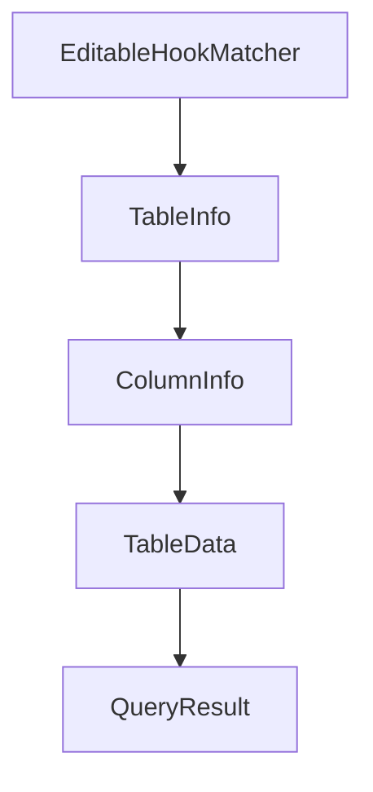

# Chapter 4: Custom Agents and Background Runs

Welcome to **Chapter 4: Custom Agents and Background Runs**. In this part of **Opcode Tutorial: GUI Command Center for Claude Code Workflows**, you will build an intuitive mental model first, then move into concrete implementation details and practical production tradeoffs.


This chapter covers how Opcode supports specialized agents and non-blocking execution.

## Learning Goals

- create custom task-specific agents
- configure model and permission settings per agent
- run background executions safely
- track execution history and outcomes

## Agent Workflow

```text
CC Agents -> Create Agent -> Configure -> Execute
```

## Guardrail Practices

- restrict permissions per agent role
- document agent purpose and prompt contracts
- review execution logs before promoting outputs

## Source References

- [Opcode README: CC Agents](https://github.com/winfunc/opcode/blob/main/README.md#-cc-agents)
- [Opcode README: Creating Agents](https://github.com/winfunc/opcode/blob/main/README.md#creating-agents)

## Summary

You now know how to build and operate specialized agent workflows in Opcode.

Next: [Chapter 5: MCP and Context Management](05-mcp-and-context-management.md)

## Depth Expansion Playbook

## Source Code Walkthrough

### `src/components/HooksEditor.tsx`

The `EditableHookMatcher` interface in [`src/components/HooksEditor.tsx`](https://github.com/winfunc/opcode/blob/HEAD/src/components/HooksEditor.tsx) handles a key part of this chapter's functionality:

```tsx
}

interface EditableHookMatcher extends Omit<HookMatcher, 'hooks'> {
  id: string;
  hooks: EditableHookCommand[];
  expanded?: boolean;
}

const EVENT_INFO: Record<HookEvent, { label: string; description: string; icon: React.ReactNode }> = {
  PreToolUse: {
    label: 'Pre Tool Use',
    description: 'Runs before tool calls, can block and provide feedback',
    icon: <Shield className="h-4 w-4" />
  },
  PostToolUse: {
    label: 'Post Tool Use',
    description: 'Runs after successful tool completion',
    icon: <PlayCircle className="h-4 w-4" />
  },
  Notification: {
    label: 'Notification',
    description: 'Customizes notifications when Claude needs attention',
    icon: <Zap className="h-4 w-4" />
  },
  Stop: {
    label: 'Stop',
    description: 'Runs when Claude finishes responding',
    icon: <Code2 className="h-4 w-4" />
  },
  SubagentStop: {
    label: 'Subagent Stop',
    description: 'Runs when a Claude subagent (Task) finishes',
```

This interface is important because it defines how Opcode Tutorial: GUI Command Center for Claude Code Workflows implements the patterns covered in this chapter.

### `src/components/StorageTab.tsx`

The `TableInfo` interface in [`src/components/StorageTab.tsx`](https://github.com/winfunc/opcode/blob/HEAD/src/components/StorageTab.tsx) handles a key part of this chapter's functionality:

```tsx
import { Toast, ToastContainer } from "./ui/toast";

interface TableInfo {
  name: string;
  row_count: number;
  columns: ColumnInfo[];
}

interface ColumnInfo {
  cid: number;
  name: string;
  type_name: string;
  notnull: boolean;
  dflt_value: string | null;
  pk: boolean;
}

interface TableData {
  table_name: string;
  columns: ColumnInfo[];
  rows: Record<string, any>[];
  total_rows: number;
  page: number;
  page_size: number;
  total_pages: number;
}

interface QueryResult {
  columns: string[];
  rows: any[][];
  rows_affected?: number;
  last_insert_rowid?: number;
```

This interface is important because it defines how Opcode Tutorial: GUI Command Center for Claude Code Workflows implements the patterns covered in this chapter.

### `src/components/StorageTab.tsx`

The `ColumnInfo` interface in [`src/components/StorageTab.tsx`](https://github.com/winfunc/opcode/blob/HEAD/src/components/StorageTab.tsx) handles a key part of this chapter's functionality:

```tsx
  name: string;
  row_count: number;
  columns: ColumnInfo[];
}

interface ColumnInfo {
  cid: number;
  name: string;
  type_name: string;
  notnull: boolean;
  dflt_value: string | null;
  pk: boolean;
}

interface TableData {
  table_name: string;
  columns: ColumnInfo[];
  rows: Record<string, any>[];
  total_rows: number;
  page: number;
  page_size: number;
  total_pages: number;
}

interface QueryResult {
  columns: string[];
  rows: any[][];
  rows_affected?: number;
  last_insert_rowid?: number;
}

/**
```

This interface is important because it defines how Opcode Tutorial: GUI Command Center for Claude Code Workflows implements the patterns covered in this chapter.

### `src/components/StorageTab.tsx`

The `TableData` interface in [`src/components/StorageTab.tsx`](https://github.com/winfunc/opcode/blob/HEAD/src/components/StorageTab.tsx) handles a key part of this chapter's functionality:

```tsx
}

interface TableData {
  table_name: string;
  columns: ColumnInfo[];
  rows: Record<string, any>[];
  total_rows: number;
  page: number;
  page_size: number;
  total_pages: number;
}

interface QueryResult {
  columns: string[];
  rows: any[][];
  rows_affected?: number;
  last_insert_rowid?: number;
}

/**
 * StorageTab component - A beautiful SQLite database viewer/editor
 */
export const StorageTab: React.FC = () => {
  const [tables, setTables] = useState<TableInfo[]>([]);
  const [selectedTable, setSelectedTable] = useState<string>("");
  const [tableData, setTableData] = useState<TableData | null>(null);
  const [currentPage, setCurrentPage] = useState(1);
  const [pageSize] = useState(25);
  const [searchQuery, setSearchQuery] = useState("");
  const [loading, setLoading] = useState(false);
  const [error, setError] = useState<string | null>(null);

```

This interface is important because it defines how Opcode Tutorial: GUI Command Center for Claude Code Workflows implements the patterns covered in this chapter.


## How These Components Connect


