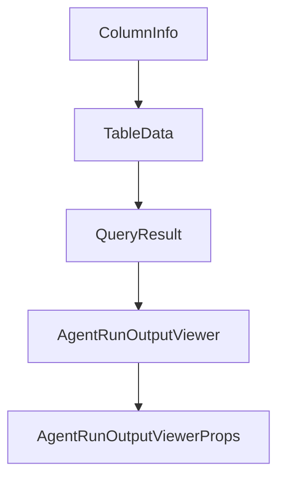

# Chapter 4: Custom Agents and Background Runs

Welcome to **Chapter 4: Custom Agents and Background Runs**. In this part of **Opcode Tutorial: GUI Command Center for Claude Code Workflows**, you will build an intuitive mental model first, then move into concrete implementation details and practical production tradeoffs.


This chapter covers how Opcode supports specialized agents and non-blocking execution.

## Learning Goals

- create custom task-specific agents
- configure model and permission settings per agent
- run background executions safely
- track execution history and outcomes

## Agent Workflow

```text
CC Agents -> Create Agent -> Configure -> Execute
```

## Guardrail Practices

- restrict permissions per agent role
- document agent purpose and prompt contracts
- review execution logs before promoting outputs

## Source References

- [Opcode README: CC Agents](https://github.com/winfunc/opcode/blob/main/README.md#-cc-agents)
- [Opcode README: Creating Agents](https://github.com/winfunc/opcode/blob/main/README.md#creating-agents)

## Summary

You now know how to build and operate specialized agent workflows in Opcode.

Next: [Chapter 5: MCP and Context Management](05-mcp-and-context-management.md)

## Source Code Walkthrough

### `src/components/StorageTab.tsx`

The `ColumnInfo` interface in [`src/components/StorageTab.tsx`](https://github.com/winfunc/opcode/blob/HEAD/src/components/StorageTab.tsx) handles a key part of this chapter's functionality:

```tsx
  name: string;
  row_count: number;
  columns: ColumnInfo[];
}

interface ColumnInfo {
  cid: number;
  name: string;
  type_name: string;
  notnull: boolean;
  dflt_value: string | null;
  pk: boolean;
}

interface TableData {
  table_name: string;
  columns: ColumnInfo[];
  rows: Record<string, any>[];
  total_rows: number;
  page: number;
  page_size: number;
  total_pages: number;
}

interface QueryResult {
  columns: string[];
  rows: any[][];
  rows_affected?: number;
  last_insert_rowid?: number;
}

/**
```

This interface is important because it defines how Opcode Tutorial: GUI Command Center for Claude Code Workflows implements the patterns covered in this chapter.

### `src/components/StorageTab.tsx`

The `TableData` interface in [`src/components/StorageTab.tsx`](https://github.com/winfunc/opcode/blob/HEAD/src/components/StorageTab.tsx) handles a key part of this chapter's functionality:

```tsx
}

interface TableData {
  table_name: string;
  columns: ColumnInfo[];
  rows: Record<string, any>[];
  total_rows: number;
  page: number;
  page_size: number;
  total_pages: number;
}

interface QueryResult {
  columns: string[];
  rows: any[][];
  rows_affected?: number;
  last_insert_rowid?: number;
}

/**
 * StorageTab component - A beautiful SQLite database viewer/editor
 */
export const StorageTab: React.FC = () => {
  const [tables, setTables] = useState<TableInfo[]>([]);
  const [selectedTable, setSelectedTable] = useState<string>("");
  const [tableData, setTableData] = useState<TableData | null>(null);
  const [currentPage, setCurrentPage] = useState(1);
  const [pageSize] = useState(25);
  const [searchQuery, setSearchQuery] = useState("");
  const [loading, setLoading] = useState(false);
  const [error, setError] = useState<string | null>(null);

```

This interface is important because it defines how Opcode Tutorial: GUI Command Center for Claude Code Workflows implements the patterns covered in this chapter.

### `src/components/StorageTab.tsx`

The `QueryResult` interface in [`src/components/StorageTab.tsx`](https://github.com/winfunc/opcode/blob/HEAD/src/components/StorageTab.tsx) handles a key part of this chapter's functionality:

```tsx
}

interface QueryResult {
  columns: string[];
  rows: any[][];
  rows_affected?: number;
  last_insert_rowid?: number;
}

/**
 * StorageTab component - A beautiful SQLite database viewer/editor
 */
export const StorageTab: React.FC = () => {
  const [tables, setTables] = useState<TableInfo[]>([]);
  const [selectedTable, setSelectedTable] = useState<string>("");
  const [tableData, setTableData] = useState<TableData | null>(null);
  const [currentPage, setCurrentPage] = useState(1);
  const [pageSize] = useState(25);
  const [searchQuery, setSearchQuery] = useState("");
  const [loading, setLoading] = useState(false);
  const [error, setError] = useState<string | null>(null);

  // Dialog states
  const [editingRow, setEditingRow] = useState<Record<string, any> | null>(null);
  const [newRow, setNewRow] = useState<Record<string, any> | null>(null);
  const [deletingRow, setDeletingRow] = useState<Record<string, any> | null>(null);
  const [showResetConfirm, setShowResetConfirm] = useState(false);
  const [showSqlEditor, setShowSqlEditor] = useState(false);
  const [sqlQuery, setSqlQuery] = useState("");
  const [sqlResult, setSqlResult] = useState<QueryResult | null>(null);
  const [sqlError, setSqlError] = useState<string | null>(null);
  const [toast, setToast] = useState<{ message: string; type: "success" | "error" } | null>(null);
```

This interface is important because it defines how Opcode Tutorial: GUI Command Center for Claude Code Workflows implements the patterns covered in this chapter.

### `src/components/AgentRunOutputViewer.tsx`

The `AgentRunOutputViewer` function in [`src/components/AgentRunOutputViewer.tsx`](https://github.com/winfunc/opcode/blob/HEAD/src/components/AgentRunOutputViewer.tsx) handles a key part of this chapter's functionality:

```tsx
import { useTabState } from '@/hooks/useTabState';

interface AgentRunOutputViewerProps {
  /**
   * The agent run ID to display
   */
  agentRunId: string;
  /**
   * Tab ID for this agent run
   */
  tabId: string;
  /**
   * Optional className for styling
   */
  className?: string;
}

/**
 * AgentRunOutputViewer - Modal component for viewing agent execution output
 * 
 * @example
 * <AgentRunOutputViewer
 *   run={agentRun}
 *   onClose={() => setSelectedRun(null)}
 * />
 */
export function AgentRunOutputViewer({ 
  agentRunId, 
  tabId,
  className 
}: AgentRunOutputViewerProps) {
  const { updateTabTitle, updateTabStatus } = useTabState();
```

This function is important because it defines how Opcode Tutorial: GUI Command Center for Claude Code Workflows implements the patterns covered in this chapter.


## How These Components Connect


