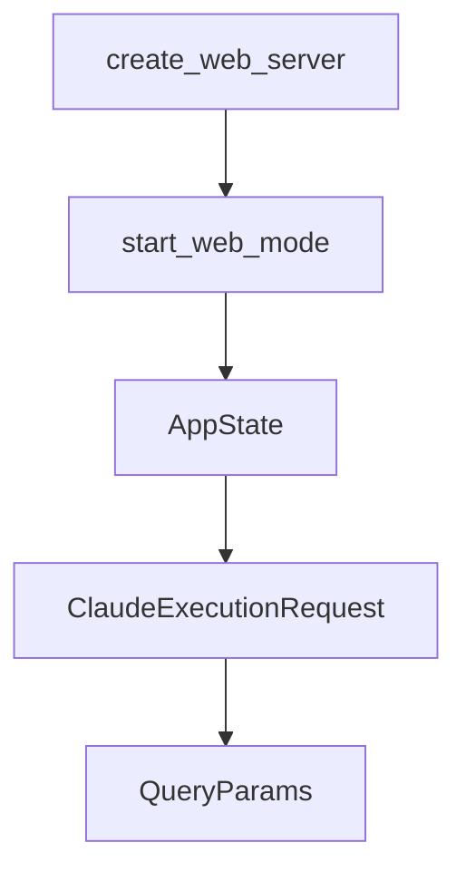

# Chapter 5: MCP and Context Management

Welcome to **Chapter 5: MCP and Context Management**. In this part of **Opcode Tutorial: GUI Command Center for Claude Code Workflows**, you will build an intuitive mental model first, then move into concrete implementation details and practical production tradeoffs.


This chapter explains how Opcode helps manage MCP integrations and project context assets.

## Learning Goals

- manage MCP servers from central UI controls
- test/import MCP configuration safely
- maintain CLAUDE.md context artifacts effectively
- reduce setup drift across projects

## MCP Management Capabilities

- server registry and configuration
- connection testing
- import from Claude Desktop configs

## Context Management Capabilities

- built-in CLAUDE.md editing
- project scanning for CLAUDE.md files
- live markdown preview workflows

## Source References

- [Opcode README: MCP Server Management](https://github.com/winfunc/opcode/blob/main/README.md#-mcp-server-management)
- [Opcode README: CLAUDE.md Management](https://github.com/winfunc/opcode/blob/main/README.md#-claudemd-management)

## Summary

You now have a structured approach to managing integrations and context artifacts in Opcode.

Next: [Chapter 6: Timeline, Checkpoints, and Recovery](06-timeline-checkpoints-and-recovery.md)

## Depth Expansion Playbook

## Source Code Walkthrough

### `src-tauri/src/web_server.rs`

The `create_web_server` function in [`src-tauri/src/web_server.rs`](https://github.com/winfunc/opcode/blob/HEAD/src-tauri/src/web_server.rs) handles a key part of this chapter's functionality:

```rs

/// Create the web server
pub async fn create_web_server(port: u16) -> Result<(), Box<dyn std::error::Error>> {
    let state = AppState {
        active_sessions: Arc::new(Mutex::new(std::collections::HashMap::new())),
    };

    // CORS layer to allow requests from phone browsers
    let cors = CorsLayer::new()
        .allow_origin(Any)
        .allow_methods([Method::GET, Method::POST, Method::PUT, Method::DELETE])
        .allow_headers(Any);

    // Create router with API endpoints
    let app = Router::new()
        // Frontend routes
        .route("/", get(serve_frontend))
        .route("/index.html", get(serve_frontend))
        // API routes (REST API equivalent of Tauri commands)
        .route("/api/projects", get(get_projects))
        .route("/api/projects/{project_id}/sessions", get(get_sessions))
        .route("/api/agents", get(get_agents))
        .route("/api/usage", get(get_usage))
        // Settings and configuration
        .route("/api/settings/claude", get(get_claude_settings))
        .route("/api/settings/claude/version", get(check_claude_version))
        .route(
            "/api/settings/claude/installations",
            get(list_claude_installations),
        )
        .route("/api/settings/system-prompt", get(get_system_prompt))
        // Session management
```

This function is important because it defines how Opcode Tutorial: GUI Command Center for Claude Code Workflows implements the patterns covered in this chapter.

### `src-tauri/src/web_server.rs`

The `start_web_mode` function in [`src-tauri/src/web_server.rs`](https://github.com/winfunc/opcode/blob/HEAD/src-tauri/src/web_server.rs) handles a key part of this chapter's functionality:

```rs

/// Start web server mode (alternative to Tauri GUI)
pub async fn start_web_mode(port: Option<u16>) -> Result<(), Box<dyn std::error::Error>> {
    let port = port.unwrap_or(8080);

    println!("🚀 Starting Opcode in web server mode...");
    create_web_server(port).await
}

```

This function is important because it defines how Opcode Tutorial: GUI Command Center for Claude Code Workflows implements the patterns covered in this chapter.

### `src-tauri/src/web_server.rs`

The `AppState` interface in [`src-tauri/src/web_server.rs`](https://github.com/winfunc/opcode/blob/HEAD/src-tauri/src/web_server.rs) handles a key part of this chapter's functionality:

```rs

#[derive(Clone)]
pub struct AppState {
    // Track active WebSocket sessions for Claude execution
    pub active_sessions:
        Arc<Mutex<std::collections::HashMap<String, tokio::sync::mpsc::Sender<String>>>>,
}

#[derive(Debug, Deserialize)]
pub struct ClaudeExecutionRequest {
    pub project_path: String,
    pub prompt: String,
    pub model: Option<String>,
    pub session_id: Option<String>,
    pub command_type: String, // "execute", "continue", or "resume"
}

#[derive(Deserialize)]
pub struct QueryParams {
    #[serde(default)]
    pub project_path: Option<String>,
}

#[derive(Serialize)]
pub struct ApiResponse<T> {
    pub success: bool,
    pub data: Option<T>,
    pub error: Option<String>,
}

impl<T> ApiResponse<T> {
    pub fn success(data: T) -> Self {
```

This interface is important because it defines how Opcode Tutorial: GUI Command Center for Claude Code Workflows implements the patterns covered in this chapter.

### `src-tauri/src/web_server.rs`

The `ClaudeExecutionRequest` interface in [`src-tauri/src/web_server.rs`](https://github.com/winfunc/opcode/blob/HEAD/src-tauri/src/web_server.rs) handles a key part of this chapter's functionality:

```rs

#[derive(Debug, Deserialize)]
pub struct ClaudeExecutionRequest {
    pub project_path: String,
    pub prompt: String,
    pub model: Option<String>,
    pub session_id: Option<String>,
    pub command_type: String, // "execute", "continue", or "resume"
}

#[derive(Deserialize)]
pub struct QueryParams {
    #[serde(default)]
    pub project_path: Option<String>,
}

#[derive(Serialize)]
pub struct ApiResponse<T> {
    pub success: bool,
    pub data: Option<T>,
    pub error: Option<String>,
}

impl<T> ApiResponse<T> {
    pub fn success(data: T) -> Self {
        Self {
            success: true,
            data: Some(data),
            error: None,
        }
    }

```

This interface is important because it defines how Opcode Tutorial: GUI Command Center for Claude Code Workflows implements the patterns covered in this chapter.


## How These Components Connect


