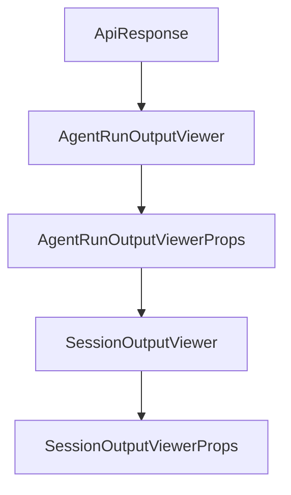

# Chapter 6: Timeline, Checkpoints, and Recovery

Welcome to **Chapter 6: Timeline, Checkpoints, and Recovery**. In this part of **Opcode Tutorial: GUI Command Center for Claude Code Workflows**, you will build an intuitive mental model first, then move into concrete implementation details and practical production tradeoffs.


This chapter focuses on versioned session control and rollback safety.

## Learning Goals

- use checkpoints to protect long-running sessions
- restore and fork from prior states quickly
- inspect diffs between checkpoints
- design safer experimentation workflows

## Checkpoint Strategy

| Pattern | When to Use |
|:--------|:------------|
| checkpoint before big prompt | any high-impact refactor/design change |
| branch from checkpoint | exploring alternative implementations |
| restore previous state | output drift or regressions |

## Source References

- [Opcode README: Timeline & Checkpoints](https://github.com/winfunc/opcode/blob/main/README.md#-timeline--checkpoints)
- [Opcode README: Diff Viewer mentions](https://github.com/winfunc/opcode/blob/main/README.md#-timeline--checkpoints)

## Summary

You now know how to use checkpointing as a first-class safety primitive in Opcode.

Next: [Chapter 7: Development Workflow and Build from Source](07-development-workflow-and-build-from-source.md)

## Depth Expansion Playbook

## Source Code Walkthrough

### `src-tauri/src/web_server.rs`

The `ApiResponse` interface in [`src-tauri/src/web_server.rs`](https://github.com/winfunc/opcode/blob/HEAD/src-tauri/src/web_server.rs) handles a key part of this chapter's functionality:

```rs

#[derive(Serialize)]
pub struct ApiResponse<T> {
    pub success: bool,
    pub data: Option<T>,
    pub error: Option<String>,
}

impl<T> ApiResponse<T> {
    pub fn success(data: T) -> Self {
        Self {
            success: true,
            data: Some(data),
            error: None,
        }
    }

    pub fn error(error: String) -> Self {
        Self {
            success: false,
            data: None,
            error: Some(error),
        }
    }
}

/// Serve the React frontend
async fn serve_frontend() -> Html<&'static str> {
    Html(include_str!("../../dist/index.html"))
}

/// API endpoint to get projects (equivalent to Tauri command)
```

This interface is important because it defines how Opcode Tutorial: GUI Command Center for Claude Code Workflows implements the patterns covered in this chapter.

### `src/components/AgentRunOutputViewer.tsx`

The `AgentRunOutputViewer` function in [`src/components/AgentRunOutputViewer.tsx`](https://github.com/winfunc/opcode/blob/HEAD/src/components/AgentRunOutputViewer.tsx) handles a key part of this chapter's functionality:

```tsx
import { useTabState } from '@/hooks/useTabState';

interface AgentRunOutputViewerProps {
  /**
   * The agent run ID to display
   */
  agentRunId: string;
  /**
   * Tab ID for this agent run
   */
  tabId: string;
  /**
   * Optional className for styling
   */
  className?: string;
}

/**
 * AgentRunOutputViewer - Modal component for viewing agent execution output
 * 
 * @example
 * <AgentRunOutputViewer
 *   run={agentRun}
 *   onClose={() => setSelectedRun(null)}
 * />
 */
export function AgentRunOutputViewer({ 
  agentRunId, 
  tabId,
  className 
}: AgentRunOutputViewerProps) {
  const { updateTabTitle, updateTabStatus } = useTabState();
```

This function is important because it defines how Opcode Tutorial: GUI Command Center for Claude Code Workflows implements the patterns covered in this chapter.

### `src/components/AgentRunOutputViewer.tsx`

The `AgentRunOutputViewerProps` interface in [`src/components/AgentRunOutputViewer.tsx`](https://github.com/winfunc/opcode/blob/HEAD/src/components/AgentRunOutputViewer.tsx) handles a key part of this chapter's functionality:

```tsx
import { useTabState } from '@/hooks/useTabState';

interface AgentRunOutputViewerProps {
  /**
   * The agent run ID to display
   */
  agentRunId: string;
  /**
   * Tab ID for this agent run
   */
  tabId: string;
  /**
   * Optional className for styling
   */
  className?: string;
}

/**
 * AgentRunOutputViewer - Modal component for viewing agent execution output
 * 
 * @example
 * <AgentRunOutputViewer
 *   run={agentRun}
 *   onClose={() => setSelectedRun(null)}
 * />
 */
export function AgentRunOutputViewer({ 
  agentRunId, 
  tabId,
  className 
}: AgentRunOutputViewerProps) {
  const { updateTabTitle, updateTabStatus } = useTabState();
```

This interface is important because it defines how Opcode Tutorial: GUI Command Center for Claude Code Workflows implements the patterns covered in this chapter.

### `src/components/SessionOutputViewer.tsx`

The `SessionOutputViewer` function in [`src/components/SessionOutputViewer.tsx`](https://github.com/winfunc/opcode/blob/HEAD/src/components/SessionOutputViewer.tsx) handles a key part of this chapter's functionality:

```tsx
import { ErrorBoundary } from './ErrorBoundary';

interface SessionOutputViewerProps {
  session: AgentRun;
  onClose: () => void;
  className?: string;
}

// Use the same message interface as AgentExecution for consistency
export interface ClaudeStreamMessage {
  type: "system" | "assistant" | "user" | "result";
  subtype?: string;
  message?: {
    content?: any[];
    usage?: {
      input_tokens: number;
      output_tokens: number;
    };
  };
  usage?: {
    input_tokens: number;
    output_tokens: number;
  };
  [key: string]: any;
}

export function SessionOutputViewer({ session, onClose, className }: SessionOutputViewerProps) {
  const [messages, setMessages] = useState<ClaudeStreamMessage[]>([]);
  const [rawJsonlOutput, setRawJsonlOutput] = useState<string[]>([]);
  const [loading, setLoading] = useState(false);
  const [isFullscreen, setIsFullscreen] = useState(false);
  const [refreshing, setRefreshing] = useState(false);
```

This function is important because it defines how Opcode Tutorial: GUI Command Center for Claude Code Workflows implements the patterns covered in this chapter.


## How These Components Connect


