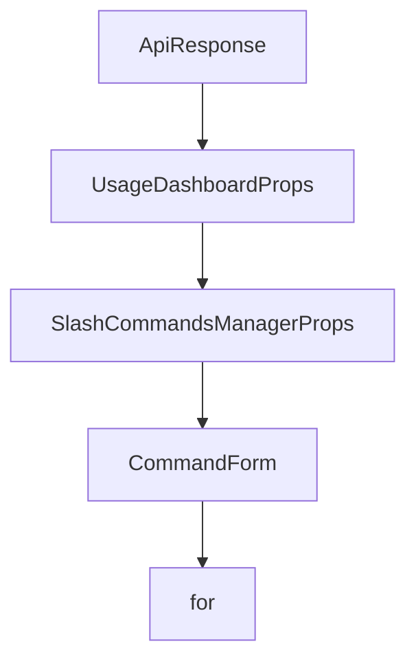

# Chapter 6: Timeline, Checkpoints, and Recovery

Welcome to **Chapter 6: Timeline, Checkpoints, and Recovery**. In this part of **Opcode Tutorial: GUI Command Center for Claude Code Workflows**, you will build an intuitive mental model first, then move into concrete implementation details and practical production tradeoffs.


This chapter focuses on versioned session control and rollback safety.

## Learning Goals

- use checkpoints to protect long-running sessions
- restore and fork from prior states quickly
- inspect diffs between checkpoints
- design safer experimentation workflows

## Checkpoint Strategy

| Pattern | When to Use |
|:--------|:------------|
| checkpoint before big prompt | any high-impact refactor/design change |
| branch from checkpoint | exploring alternative implementations |
| restore previous state | output drift or regressions |

## Source References

- [Opcode README: Timeline & Checkpoints](https://github.com/winfunc/opcode/blob/main/README.md#-timeline--checkpoints)
- [Opcode README: Diff Viewer mentions](https://github.com/winfunc/opcode/blob/main/README.md#-timeline--checkpoints)

## Summary

You now know how to use checkpointing as a first-class safety primitive in Opcode.

Next: [Chapter 7: Development Workflow and Build from Source](07-development-workflow-and-build-from-source.md)

## Source Code Walkthrough

### `src-tauri/src/web_server.rs`

The `ApiResponse` interface in [`src-tauri/src/web_server.rs`](https://github.com/winfunc/opcode/blob/HEAD/src-tauri/src/web_server.rs) handles a key part of this chapter's functionality:

```rs

#[derive(Serialize)]
pub struct ApiResponse<T> {
    pub success: bool,
    pub data: Option<T>,
    pub error: Option<String>,
}

impl<T> ApiResponse<T> {
    pub fn success(data: T) -> Self {
        Self {
            success: true,
            data: Some(data),
            error: None,
        }
    }

    pub fn error(error: String) -> Self {
        Self {
            success: false,
            data: None,
            error: Some(error),
        }
    }
}

/// Serve the React frontend
async fn serve_frontend() -> Html<&'static str> {
    Html(include_str!("../../dist/index.html"))
}

/// API endpoint to get projects (equivalent to Tauri command)
```

This interface is important because it defines how Opcode Tutorial: GUI Command Center for Claude Code Workflows implements the patterns covered in this chapter.

### `src/components/UsageDashboard.tsx`

The `UsageDashboardProps` interface in [`src/components/UsageDashboard.tsx`](https://github.com/winfunc/opcode/blob/HEAD/src/components/UsageDashboard.tsx) handles a key part of this chapter's functionality:

```tsx
} from "lucide-react";

interface UsageDashboardProps {
  /**
   * Callback when back button is clicked
   */
  onBack: () => void;
}

// Cache for storing fetched data
const dataCache = new Map<string, { data: any; timestamp: number }>();
const CACHE_DURATION = 10 * 60 * 1000; // 10 minutes cache - increased for better performance

/**
 * Optimized UsageDashboard component with caching and progressive loading
 */
export const UsageDashboard: React.FC<UsageDashboardProps> = ({ }) => {
  const [loading, setLoading] = useState(true);
  const [error, setError] = useState<string | null>(null);
  const [stats, setStats] = useState<UsageStats | null>(null);
  const [sessionStats, setSessionStats] = useState<ProjectUsage[] | null>(null);
  const [selectedDateRange, setSelectedDateRange] = useState<"all" | "7d" | "30d">("7d");
  const [activeTab, setActiveTab] = useState("overview");
  const [hasLoadedTabs, setHasLoadedTabs] = useState<Set<string>>(new Set(["overview"]));
  
  // Pagination states
  const [projectsPage, setProjectsPage] = useState(1);
  const [sessionsPage, setSessionsPage] = useState(1);
  const ITEMS_PER_PAGE = 10;

  // Memoized formatters to prevent recreation on each render
  const formatCurrency = useMemo(() => (amount: number): string => {
```

This interface is important because it defines how Opcode Tutorial: GUI Command Center for Claude Code Workflows implements the patterns covered in this chapter.

### `src/components/SlashCommandsManager.tsx`

The `SlashCommandsManagerProps` interface in [`src/components/SlashCommandsManager.tsx`](https://github.com/winfunc/opcode/blob/HEAD/src/components/SlashCommandsManager.tsx) handles a key part of this chapter's functionality:

```tsx
import { useTrackEvent } from "@/hooks";

interface SlashCommandsManagerProps {
  projectPath?: string;
  className?: string;
  scopeFilter?: 'project' | 'user' | 'all';
}

interface CommandForm {
  name: string;
  namespace: string;
  content: string;
  description: string;
  allowedTools: string[];
  scope: 'project' | 'user';
}

const EXAMPLE_COMMANDS = [
  {
    name: "review",
    description: "Review code for best practices",
    content: "Review the following code for best practices, potential issues, and improvements:\n\n@$ARGUMENTS",
    allowedTools: ["Read", "Grep"]
  },
  {
    name: "explain",
    description: "Explain how something works",
    content: "Explain how $ARGUMENTS works in detail, including its purpose, implementation, and usage examples.",
    allowedTools: ["Read", "Grep", "WebSearch"]
  },
  {
    name: "fix-issue",
```

This interface is important because it defines how Opcode Tutorial: GUI Command Center for Claude Code Workflows implements the patterns covered in this chapter.

### `src/components/SlashCommandsManager.tsx`

The `CommandForm` interface in [`src/components/SlashCommandsManager.tsx`](https://github.com/winfunc/opcode/blob/HEAD/src/components/SlashCommandsManager.tsx) handles a key part of this chapter's functionality:

```tsx
}

interface CommandForm {
  name: string;
  namespace: string;
  content: string;
  description: string;
  allowedTools: string[];
  scope: 'project' | 'user';
}

const EXAMPLE_COMMANDS = [
  {
    name: "review",
    description: "Review code for best practices",
    content: "Review the following code for best practices, potential issues, and improvements:\n\n@$ARGUMENTS",
    allowedTools: ["Read", "Grep"]
  },
  {
    name: "explain",
    description: "Explain how something works",
    content: "Explain how $ARGUMENTS works in detail, including its purpose, implementation, and usage examples.",
    allowedTools: ["Read", "Grep", "WebSearch"]
  },
  {
    name: "fix-issue",
    description: "Fix a specific issue",
    content: "Fix issue #$ARGUMENTS following our coding standards and best practices.",
    allowedTools: ["Read", "Edit", "MultiEdit", "Write"]
  },
  {
    name: "test",
```

This interface is important because it defines how Opcode Tutorial: GUI Command Center for Claude Code Workflows implements the patterns covered in this chapter.


## How These Components Connect


