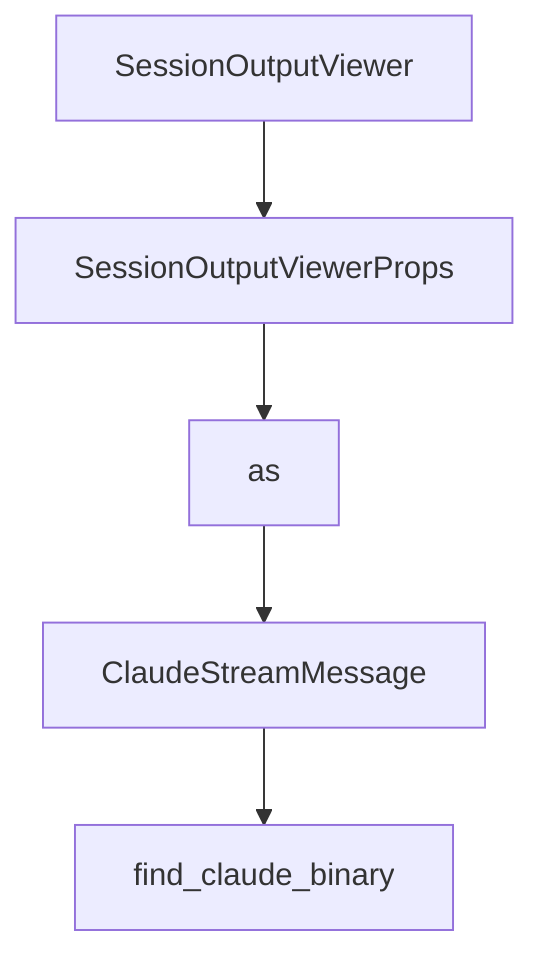

# Chapter 7: Development Workflow and Build from Source

Welcome to **Chapter 7: Development Workflow and Build from Source**. In this part of **Opcode Tutorial: GUI Command Center for Claude Code Workflows**, you will build an intuitive mental model first, then move into concrete implementation details and practical production tradeoffs.


This chapter covers contributor workflows and cross-platform source builds.

## Learning Goals

- set up Rust + Bun + system dependencies
- run local dev and production builds
- execute core quality checks
- troubleshoot common build failures

## Core Commands

```bash
bun install
bun run tauri dev
bun run tauri build
```

Additional quality commands:

- `bunx tsc --noEmit`
- `cd src-tauri && cargo test`
- `cd src-tauri && cargo fmt`

## Source References

- [Opcode README: Build from Source](https://github.com/winfunc/opcode/blob/main/README.md#-build-from-source)
- [Opcode README: Development Commands](https://github.com/winfunc/opcode/blob/main/README.md#development-commands)

## Summary

You now have a full contributor baseline for building and validating Opcode.

Next: [Chapter 8: Production Operations and Security](08-production-operations-and-security.md)

## Source Code Walkthrough

### `src/components/SessionOutputViewer.tsx`

The `SessionOutputViewer` function in [`src/components/SessionOutputViewer.tsx`](https://github.com/winfunc/opcode/blob/HEAD/src/components/SessionOutputViewer.tsx) handles a key part of this chapter's functionality:

```tsx
import { ErrorBoundary } from './ErrorBoundary';

interface SessionOutputViewerProps {
  session: AgentRun;
  onClose: () => void;
  className?: string;
}

// Use the same message interface as AgentExecution for consistency
export interface ClaudeStreamMessage {
  type: "system" | "assistant" | "user" | "result";
  subtype?: string;
  message?: {
    content?: any[];
    usage?: {
      input_tokens: number;
      output_tokens: number;
    };
  };
  usage?: {
    input_tokens: number;
    output_tokens: number;
  };
  [key: string]: any;
}

export function SessionOutputViewer({ session, onClose, className }: SessionOutputViewerProps) {
  const [messages, setMessages] = useState<ClaudeStreamMessage[]>([]);
  const [rawJsonlOutput, setRawJsonlOutput] = useState<string[]>([]);
  const [loading, setLoading] = useState(false);
  const [isFullscreen, setIsFullscreen] = useState(false);
  const [refreshing, setRefreshing] = useState(false);
```

This function is important because it defines how Opcode Tutorial: GUI Command Center for Claude Code Workflows implements the patterns covered in this chapter.

### `src/components/SessionOutputViewer.tsx`

The `SessionOutputViewerProps` interface in [`src/components/SessionOutputViewer.tsx`](https://github.com/winfunc/opcode/blob/HEAD/src/components/SessionOutputViewer.tsx) handles a key part of this chapter's functionality:

```tsx
import { ErrorBoundary } from './ErrorBoundary';

interface SessionOutputViewerProps {
  session: AgentRun;
  onClose: () => void;
  className?: string;
}

// Use the same message interface as AgentExecution for consistency
export interface ClaudeStreamMessage {
  type: "system" | "assistant" | "user" | "result";
  subtype?: string;
  message?: {
    content?: any[];
    usage?: {
      input_tokens: number;
      output_tokens: number;
    };
  };
  usage?: {
    input_tokens: number;
    output_tokens: number;
  };
  [key: string]: any;
}

export function SessionOutputViewer({ session, onClose, className }: SessionOutputViewerProps) {
  const [messages, setMessages] = useState<ClaudeStreamMessage[]>([]);
  const [rawJsonlOutput, setRawJsonlOutput] = useState<string[]>([]);
  const [loading, setLoading] = useState(false);
  const [isFullscreen, setIsFullscreen] = useState(false);
  const [refreshing, setRefreshing] = useState(false);
```

This interface is important because it defines how Opcode Tutorial: GUI Command Center for Claude Code Workflows implements the patterns covered in this chapter.

### `src/components/SessionOutputViewer.tsx`

The `as` interface in [`src/components/SessionOutputViewer.tsx`](https://github.com/winfunc/opcode/blob/HEAD/src/components/SessionOutputViewer.tsx) handles a key part of this chapter's functionality:

```tsx
import { Card, CardContent, CardHeader, CardTitle } from '@/components/ui/card';
import { Badge } from '@/components/ui/badge';
import { Toast, ToastContainer } from '@/components/ui/toast';
import { Popover } from '@/components/ui/popover';
import { api } from '@/lib/api';
import { useOutputCache } from '@/lib/outputCache';
import type { AgentRun } from '@/lib/api';
import { listen, type UnlistenFn } from '@tauri-apps/api/event';
import { StreamMessage } from './StreamMessage';
import { ErrorBoundary } from './ErrorBoundary';

interface SessionOutputViewerProps {
  session: AgentRun;
  onClose: () => void;
  className?: string;
}

// Use the same message interface as AgentExecution for consistency
export interface ClaudeStreamMessage {
  type: "system" | "assistant" | "user" | "result";
  subtype?: string;
  message?: {
    content?: any[];
    usage?: {
      input_tokens: number;
      output_tokens: number;
    };
  };
  usage?: {
    input_tokens: number;
    output_tokens: number;
  };
```

This interface is important because it defines how Opcode Tutorial: GUI Command Center for Claude Code Workflows implements the patterns covered in this chapter.

### `src/components/SessionOutputViewer.tsx`

The `ClaudeStreamMessage` interface in [`src/components/SessionOutputViewer.tsx`](https://github.com/winfunc/opcode/blob/HEAD/src/components/SessionOutputViewer.tsx) handles a key part of this chapter's functionality:

```tsx

// Use the same message interface as AgentExecution for consistency
export interface ClaudeStreamMessage {
  type: "system" | "assistant" | "user" | "result";
  subtype?: string;
  message?: {
    content?: any[];
    usage?: {
      input_tokens: number;
      output_tokens: number;
    };
  };
  usage?: {
    input_tokens: number;
    output_tokens: number;
  };
  [key: string]: any;
}

export function SessionOutputViewer({ session, onClose, className }: SessionOutputViewerProps) {
  const [messages, setMessages] = useState<ClaudeStreamMessage[]>([]);
  const [rawJsonlOutput, setRawJsonlOutput] = useState<string[]>([]);
  const [loading, setLoading] = useState(false);
  const [isFullscreen, setIsFullscreen] = useState(false);
  const [refreshing, setRefreshing] = useState(false);
  const [toast, setToast] = useState<{ message: string; type: "success" | "error" } | null>(null);
  const [copyPopoverOpen, setCopyPopoverOpen] = useState(false);
  const [hasUserScrolled, setHasUserScrolled] = useState(false);
  
  const scrollAreaRef = useRef<HTMLDivElement>(null);
  const outputEndRef = useRef<HTMLDivElement>(null);
  const fullscreenScrollRef = useRef<HTMLDivElement>(null);
```

This interface is important because it defines how Opcode Tutorial: GUI Command Center for Claude Code Workflows implements the patterns covered in this chapter.


## How These Components Connect


