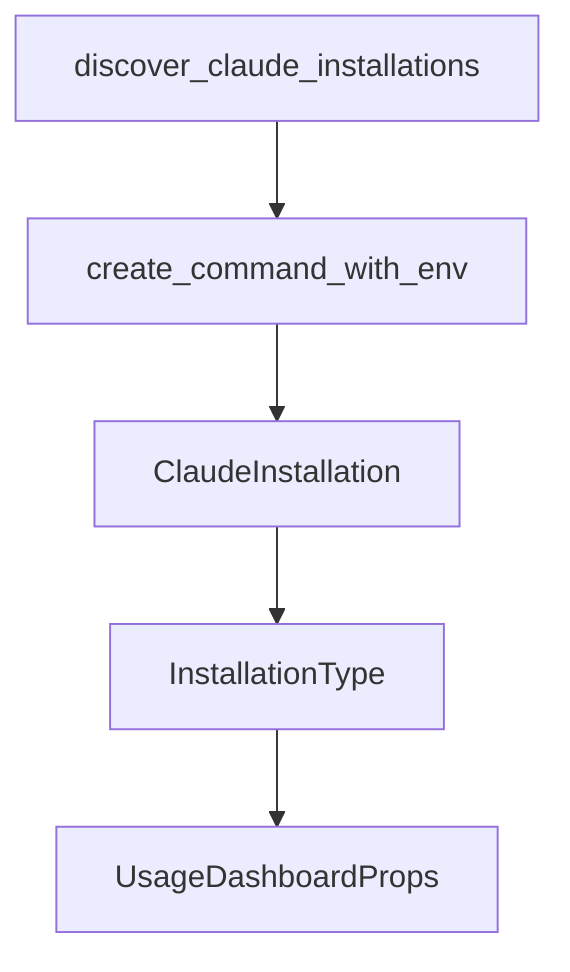

# Chapter 8: Production Operations and Security

Welcome to **Chapter 8: Production Operations and Security**. In this part of **Opcode Tutorial: GUI Command Center for Claude Code Workflows**, you will build an intuitive mental model first, then move into concrete implementation details and practical production tradeoffs.


This chapter provides operational guidance for deploying Opcode in team environments.

## Learning Goals

- align Opcode with internal security and governance controls
- define safe agent execution policies
- establish rollout and incident response practices
- maintain stable operations over time

## Security Baseline

From README positioning:

- process isolation for agent operations
- permission controls per agent
- local data-first model
- open-source transparency

## Rollout Model

1. pilot with experienced maintainers
2. enforce policy templates for agent permissions
3. require review for MCP and session checkpoint policies
4. monitor usage, errors, and restore events

## Source References

- [Opcode README: Security](https://github.com/winfunc/opcode/blob/main/README.md#-security)
- [Opcode README: Contributing](https://github.com/winfunc/opcode/blob/main/README.md#-contributing)

## Summary

You now have a complete runbook for operating Opcode as a governed desktop control plane for Claude Code.

Compare higher-level orchestration in the [Vibe Kanban Tutorial](../vibe-kanban-tutorial/).

## Source Code Walkthrough

### `src-tauri/src/claude_binary.rs`

The `discover_claude_installations` function in [`src-tauri/src/claude_binary.rs`](https://github.com/winfunc/opcode/blob/HEAD/src-tauri/src/claude_binary.rs) handles a key part of this chapter's functionality:

```rs
/// Discovers all available Claude installations and returns them for selection
/// This allows UI to show a version selector
pub fn discover_claude_installations() -> Vec<ClaudeInstallation> {
    info!("Discovering all Claude installations...");

    let mut installations = discover_system_installations();

    // Sort by version (highest first), then by source preference
    installations.sort_by(|a, b| {
        match (&a.version, &b.version) {
            (Some(v1), Some(v2)) => {
                // Compare versions in descending order (newest first)
                match compare_versions(v2, v1) {
                    Ordering::Equal => {
                        // If versions are equal, prefer by source
                        source_preference(a).cmp(&source_preference(b))
                    }
                    other => other,
                }
            }
            (Some(_), None) => Ordering::Less, // Version comes before no version
            (None, Some(_)) => Ordering::Greater,
            (None, None) => source_preference(a).cmp(&source_preference(b)),
        }
    });

    installations
}

/// Returns a preference score for installation sources (lower is better)
fn source_preference(installation: &ClaudeInstallation) -> u8 {
    match installation.source.as_str() {
```

This function is important because it defines how Opcode Tutorial: GUI Command Center for Claude Code Workflows implements the patterns covered in this chapter.

### `src-tauri/src/claude_binary.rs`

The `create_command_with_env` function in [`src-tauri/src/claude_binary.rs`](https://github.com/winfunc/opcode/blob/HEAD/src-tauri/src/claude_binary.rs) handles a key part of this chapter's functionality:

```rs
/// Helper function to create a Command with proper environment variables
/// This ensures commands like Claude can find Node.js and other dependencies
pub fn create_command_with_env(program: &str) -> Command {
    let mut cmd = Command::new(program);

    info!("Creating command for: {}", program);

    // Inherit essential environment variables from parent process
    for (key, value) in std::env::vars() {
        // Pass through PATH and other essential environment variables
        if key == "PATH"
            || key == "HOME"
            || key == "USER"
            || key == "SHELL"
            || key == "LANG"
            || key == "LC_ALL"
            || key.starts_with("LC_")
            || key == "NODE_PATH"
            || key == "NVM_DIR"
            || key == "NVM_BIN"
            || key == "HOMEBREW_PREFIX"
            || key == "HOMEBREW_CELLAR"
            // Add proxy environment variables (only uppercase)
            || key == "HTTP_PROXY"
            || key == "HTTPS_PROXY"
            || key == "NO_PROXY"
            || key == "ALL_PROXY"
        {
            debug!("Inheriting env var: {}={}", key, value);
            cmd.env(&key, &value);
        }
    }
```

This function is important because it defines how Opcode Tutorial: GUI Command Center for Claude Code Workflows implements the patterns covered in this chapter.

### `src-tauri/src/claude_binary.rs`

The `ClaudeInstallation` interface in [`src-tauri/src/claude_binary.rs`](https://github.com/winfunc/opcode/blob/HEAD/src-tauri/src/claude_binary.rs) handles a key part of this chapter's functionality:

```rs
/// Represents a Claude installation with metadata
#[derive(Debug, Clone, Serialize, Deserialize)]
pub struct ClaudeInstallation {
    /// Full path to the Claude binary
    pub path: String,
    /// Version string if available
    pub version: Option<String>,
    /// Source of discovery (e.g., "nvm", "system", "homebrew", "which")
    pub source: String,
    /// Type of installation
    pub installation_type: InstallationType,
}

/// Main function to find the Claude binary
/// Checks database first for stored path and preference, then prioritizes accordingly
pub fn find_claude_binary(app_handle: &tauri::AppHandle) -> Result<String, String> {
    info!("Searching for claude binary...");

    // First check if we have a stored path and preference in the database
    if let Ok(app_data_dir) = app_handle.path().app_data_dir() {
        let db_path = app_data_dir.join("agents.db");
        if db_path.exists() {
            if let Ok(conn) = rusqlite::Connection::open(&db_path) {
                // Check for stored path first
                if let Ok(stored_path) = conn.query_row(
                    "SELECT value FROM app_settings WHERE key = 'claude_binary_path'",
                    [],
                    |row| row.get::<_, String>(0),
                ) {
                    info!("Found stored claude path in database: {}", stored_path);

                    // Check if the path still exists
```

This interface is important because it defines how Opcode Tutorial: GUI Command Center for Claude Code Workflows implements the patterns covered in this chapter.

### `src-tauri/src/claude_binary.rs`

The `InstallationType` interface in [`src-tauri/src/claude_binary.rs`](https://github.com/winfunc/opcode/blob/HEAD/src-tauri/src/claude_binary.rs) handles a key part of this chapter's functionality:

```rs
/// Type of Claude installation
#[derive(Debug, Clone, Serialize, Deserialize, PartialEq)]
pub enum InstallationType {
    /// System-installed binary
    System,
    /// Custom path specified by user
    Custom,
}

/// Represents a Claude installation with metadata
#[derive(Debug, Clone, Serialize, Deserialize)]
pub struct ClaudeInstallation {
    /// Full path to the Claude binary
    pub path: String,
    /// Version string if available
    pub version: Option<String>,
    /// Source of discovery (e.g., "nvm", "system", "homebrew", "which")
    pub source: String,
    /// Type of installation
    pub installation_type: InstallationType,
}

/// Main function to find the Claude binary
/// Checks database first for stored path and preference, then prioritizes accordingly
pub fn find_claude_binary(app_handle: &tauri::AppHandle) -> Result<String, String> {
    info!("Searching for claude binary...");

    // First check if we have a stored path and preference in the database
    if let Ok(app_data_dir) = app_handle.path().app_data_dir() {
        let db_path = app_data_dir.join("agents.db");
        if db_path.exists() {
            if let Ok(conn) = rusqlite::Connection::open(&db_path) {
```

This interface is important because it defines how Opcode Tutorial: GUI Command Center for Claude Code Workflows implements the patterns covered in this chapter.


## How These Components Connect


