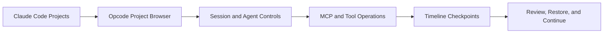

# Opcode Tutorial: GUI Command Center for Claude Code Workflows

> Learn how to use `winfunc/opcode` to manage Claude Code projects, sessions, agents, MCP servers, and checkpoints from a desktop-first operating interface.

## Why This Track Matters

Opcode gives teams a visual layer on top of Claude Code sessions and agent workflows, which is valuable for tracking progress, coordinating work, and reducing terminal-only overhead.

This track focuses on:

- setting up Opcode and Claude Code together
- managing projects/sessions/agents from one dashboard
- using MCP and checkpoint features for safer iteration
- operating Opcode in secure, production-adjacent workflows

## Current Snapshot (auto-updated)

- repository: [`winfunc/opcode`](https://github.com/winfunc/opcode)
- stars: about **20.5k**
- latest release: [`v0.2.0`](https://github.com/winfunc/opcode/releases/tag/v0.2.0)
- recent activity: repository appears maintained; verify latest commits for current status
- project positioning: desktop GUI toolkit and command center for Claude Code

## Mental Model

## Chapter Guide

| Chapter | Key Question | Outcome |
|:--------|:-------------|:--------|
| [01 - Getting Started](01-getting-started.md) | How do I set up Opcode with Claude Code? | Working baseline |
| [02 - Architecture and Platform Stack](02-architecture-and-platform-stack.md) | What is Opcode built from and why? | Architecture understanding |
| [03 - Projects and Session Management](03-projects-and-session-management.md) | How do I manage Claude Code sessions visually? | Better workflow control |
| [04 - Custom Agents and Background Runs](04-custom-agents-and-background-runs.md) | How do I create and run specialized agents? | Agent orchestration baseline |
| [05 - MCP and Context Management](05-mcp-and-context-management.md) | How do I manage MCP servers and CLAUDE.md assets? | Integration governance |
| [06 - Timeline, Checkpoints, and Recovery](06-timeline-checkpoints-and-recovery.md) | How do I use checkpoints and restore flows safely? | Safer experimentation |
| [07 - Development Workflow and Build from Source](07-development-workflow-and-build-from-source.md) | How do contributors build and test Opcode? | Contributor readiness |
| [08 - Production Operations and Security](08-production-operations-and-security.md) | How do teams adopt Opcode responsibly? | Production runbook |

## What You Will Learn

- how to operate Claude Code workflows from a structured GUI layer
- how to manage custom agents and background execution safely
- how to use timeline/checkpoint features for reliable iteration
- how to deploy and govern Opcode usage across teams

## Source References

- [Opcode Repository](https://github.com/winfunc/opcode)
- [Opcode README](https://github.com/winfunc/opcode/blob/main/README.md)
- [Opcode Releases](https://github.com/winfunc/opcode/releases)

## Related Tutorials

- [Claude Code Tutorial](../claude-code-tutorial/)
- [Cline Tutorial](../cline-tutorial/)
- [Roo Code Tutorial](../roo-code-tutorial/)
- [Vibe Kanban Tutorial](../vibe-kanban-tutorial/)

---

Start with [Chapter 1: Getting Started](01-getting-started.md).

## Navigation & Backlinks

- [Start Here: Chapter 1: Getting Started](01-getting-started.md)
- [Back to Main Catalog](../../README.md#-tutorial-catalog)
- [Browse A-Z Tutorial Directory](../../discoverability/tutorial-directory.md)
- [Search by Intent](../../discoverability/query-hub.md)
- [Explore Category Hubs](../../README.md#category-hubs)

## Full Chapter Map

1. [Chapter 1: Getting Started](01-getting-started.md)
2. [Chapter 2: Architecture and Platform Stack](02-architecture-and-platform-stack.md)
3. [Chapter 3: Projects and Session Management](03-projects-and-session-management.md)
4. [Chapter 4: Custom Agents and Background Runs](04-custom-agents-and-background-runs.md)
5. [Chapter 5: MCP and Context Management](05-mcp-and-context-management.md)
6. [Chapter 6: Timeline, Checkpoints, and Recovery](06-timeline-checkpoints-and-recovery.md)
7. [Chapter 7: Development Workflow and Build from Source](07-development-workflow-and-build-from-source.md)
8. [Chapter 8: Production Operations and Security](08-production-operations-and-security.md)

*Generated by [AI Codebase Knowledge Builder](https://github.com/The-Pocket/Tutorial-Codebase-Knowledge)*
