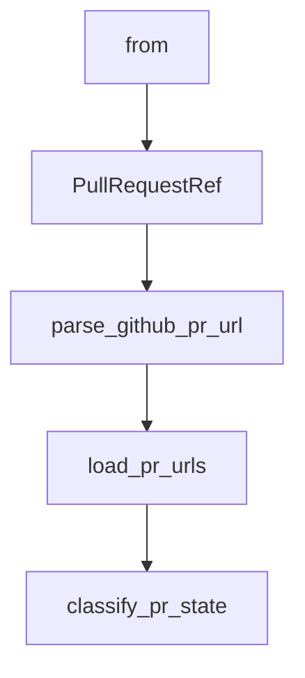

# Chapter 1: Getting Started and Project Status

Welcome to **Chapter 1: Getting Started and Project Status**. In this part of **Open SWE Tutorial: Asynchronous Cloud Coding Agent Architecture and Migration Playbook**, you will build an intuitive mental model first, then move into concrete implementation details and practical production tradeoffs.


This chapter sets expectations for using a deprecated repository responsibly.

## Learning Goals

- confirm current maintenance status before adoption
- decide whether to study, fork, or migrate
- identify minimal setup paths for local evaluation
- avoid treating deprecated defaults as production-ready

## Status Assessment

Open SWE's README includes a deprecation notice. Treat the codebase primarily as a reference or controlled fork starting point unless you commit to ownership.

## Source References

- [Open SWE README](https://github.com/langchain-ai/open-swe/blob/main/README.md)
- [Open SWE Demo](https://swe.langchain.com)
- [Open SWE Docs Index File](https://github.com/langchain-ai/open-swe/blob/main/apps/docs/index.mdx)

## Summary

You now have the correct operating context for responsible Open SWE usage.

Next: [Chapter 2: LangGraph Architecture and Agent Graphs](02-langgraph-architecture-and-agent-graphs.md)

## Source Code Walkthrough

### `scripts/check_pr_merge_status.py`

The `from` class in [`scripts/check_pr_merge_status.py`](https://github.com/langchain-ai/open-swe/blob/HEAD/scripts/check_pr_merge_status.py) handles a key part of this chapter's functionality:

```py
"""Check merge status counts for PR URLs exported from LangGraph threads."""

from __future__ import annotations

import argparse
import asyncio
import json
import logging
import os
from dataclasses import dataclass
from pathlib import Path
from typing import Any
from urllib.parse import urlparse

import httpx

logger = logging.getLogger(__name__)

DEFAULT_INPUT_PATH = "pr_urls.json"
DEFAULT_CONCURRENCY = 20
GITHUB_API_VERSION = "2022-11-28"


def _load_dotenv_if_available() -> None:
    try:
        from dotenv import load_dotenv
    except ImportError:
        return
    load_dotenv()

```

This class is important because it defines how Open SWE Tutorial: Asynchronous Cloud Coding Agent Architecture and Migration Playbook implements the patterns covered in this chapter.

### `scripts/check_pr_merge_status.py`

The `PullRequestRef` class in [`scripts/check_pr_merge_status.py`](https://github.com/langchain-ai/open-swe/blob/HEAD/scripts/check_pr_merge_status.py) handles a key part of this chapter's functionality:

```py

@dataclass(frozen=True)
class PullRequestRef:
    owner: str
    repo: str
    number: int
    url: str


def parse_github_pr_url(pr_url: str) -> PullRequestRef:
    parsed_url = urlparse(pr_url)
    if parsed_url.scheme not in {"http", "https"}:
        raise ValueError(f"Unsupported PR URL scheme: {pr_url}")
    if parsed_url.netloc not in {"github.com", "www.github.com"}:
        raise ValueError(f"Unsupported PR URL host: {pr_url}")

    path_parts = [part for part in parsed_url.path.split("/") if part]
    if len(path_parts) < 4 or path_parts[2] != "pull":
        raise ValueError(f"Unsupported GitHub PR URL path: {pr_url}")

    try:
        number = int(path_parts[3])
    except ValueError as exc:
        raise ValueError(f"Invalid GitHub PR number in URL: {pr_url}") from exc

    return PullRequestRef(
        owner=path_parts[0],
        repo=path_parts[1],
        number=number,
        url=pr_url,
    )

```

This class is important because it defines how Open SWE Tutorial: Asynchronous Cloud Coding Agent Architecture and Migration Playbook implements the patterns covered in this chapter.

### `scripts/check_pr_merge_status.py`

The `parse_github_pr_url` function in [`scripts/check_pr_merge_status.py`](https://github.com/langchain-ai/open-swe/blob/HEAD/scripts/check_pr_merge_status.py) handles a key part of this chapter's functionality:

```py


def parse_github_pr_url(pr_url: str) -> PullRequestRef:
    parsed_url = urlparse(pr_url)
    if parsed_url.scheme not in {"http", "https"}:
        raise ValueError(f"Unsupported PR URL scheme: {pr_url}")
    if parsed_url.netloc not in {"github.com", "www.github.com"}:
        raise ValueError(f"Unsupported PR URL host: {pr_url}")

    path_parts = [part for part in parsed_url.path.split("/") if part]
    if len(path_parts) < 4 or path_parts[2] != "pull":
        raise ValueError(f"Unsupported GitHub PR URL path: {pr_url}")

    try:
        number = int(path_parts[3])
    except ValueError as exc:
        raise ValueError(f"Invalid GitHub PR number in URL: {pr_url}") from exc

    return PullRequestRef(
        owner=path_parts[0],
        repo=path_parts[1],
        number=number,
        url=pr_url,
    )


def load_pr_urls(input_path: Path) -> list[str]:
    payload = json.loads(input_path.read_text(encoding="utf-8"))
    if not isinstance(payload, list):
        raise ValueError(f"Expected {input_path} to contain a JSON array of PR URLs")

    unique_urls: list[str] = []
```

This function is important because it defines how Open SWE Tutorial: Asynchronous Cloud Coding Agent Architecture and Migration Playbook implements the patterns covered in this chapter.

### `scripts/check_pr_merge_status.py`

The `load_pr_urls` function in [`scripts/check_pr_merge_status.py`](https://github.com/langchain-ai/open-swe/blob/HEAD/scripts/check_pr_merge_status.py) handles a key part of this chapter's functionality:

```py


def load_pr_urls(input_path: Path) -> list[str]:
    payload = json.loads(input_path.read_text(encoding="utf-8"))
    if not isinstance(payload, list):
        raise ValueError(f"Expected {input_path} to contain a JSON array of PR URLs")

    unique_urls: list[str] = []
    seen_urls: set[str] = set()
    for item in payload:
        if not isinstance(item, str) or not item:
            raise ValueError(f"Expected every item in {input_path} to be a non-empty string")
        if item not in seen_urls:
            seen_urls.add(item)
            unique_urls.append(item)
    return unique_urls


def classify_pr_state(pr_payload: dict[str, Any]) -> str:
    if pr_payload.get("merged") or pr_payload.get("merged_at"):
        return "merged"

    state = pr_payload.get("state")
    if state == "open":
        return "open_or_draft"
    if state == "closed":
        return "closed"

    raise ValueError(f"Unsupported GitHub PR state: {state!r}")


async def _fetch_pr_state(
```

This function is important because it defines how Open SWE Tutorial: Asynchronous Cloud Coding Agent Architecture and Migration Playbook implements the patterns covered in this chapter.


## How These Components Connect


