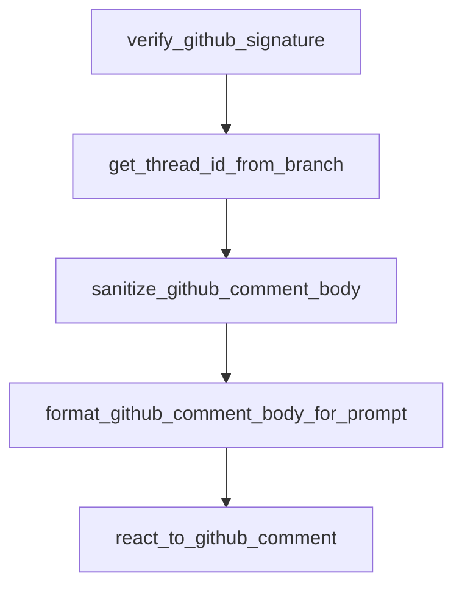

# Chapter 1: Getting Started and Project Status

Welcome to **Chapter 1: Getting Started and Project Status**. In this part of **Open SWE Tutorial: Asynchronous Cloud Coding Agent Architecture and Migration Playbook**, you will build an intuitive mental model first, then move into concrete implementation details and practical production tradeoffs.


This chapter sets expectations for using a deprecated repository responsibly.

## Learning Goals

- confirm current maintenance status before adoption
- decide whether to study, fork, or migrate
- identify minimal setup paths for local evaluation
- avoid treating deprecated defaults as production-ready

## Status Assessment

Open SWE's README includes a deprecation notice. Treat the codebase primarily as a reference or controlled fork starting point unless you commit to ownership.

## Source References

- [Open SWE README](https://github.com/langchain-ai/open-swe/blob/main/README.md)
- [Open SWE Demo](https://swe.langchain.com)
- [Open SWE Docs Index File](https://github.com/langchain-ai/open-swe/blob/main/apps/docs/index.mdx)

## Summary

You now have the correct operating context for responsible Open SWE usage.

Next: [Chapter 2: LangGraph Architecture and Agent Graphs](02-langgraph-architecture-and-agent-graphs.md)

## Depth Expansion Playbook

## Source Code Walkthrough

### `agent/utils/github_comments.py`

The `verify_github_signature` function in [`agent/utils/github_comments.py`](https://github.com/langchain-ai/open-swe/blob/HEAD/agent/utils/github_comments.py) handles a key part of this chapter's functionality:

```py


def verify_github_signature(body: bytes, signature: str, *, secret: str) -> bool:
    """Verify the GitHub webhook signature (X-Hub-Signature-256).

    Args:
        body: Raw request body bytes.
        signature: The X-Hub-Signature-256 header value.
        secret: The webhook signing secret.

    Returns:
        True if signature is valid or no secret is configured.
    """
    if not secret:
        logger.warning("GITHUB_WEBHOOK_SECRET is not configured — rejecting webhook request")
        return False

    expected = "sha256=" + hmac.new(secret.encode(), body, hashlib.sha256).hexdigest()
    return hmac.compare_digest(expected, signature)


def get_thread_id_from_branch(branch_name: str) -> str | None:
    match = re.search(
        r"[0-9a-f]{8}-[0-9a-f]{4}-[0-9a-f]{4}-[0-9a-f]{4}-[0-9a-f]{12}",
        branch_name,
        re.IGNORECASE,
    )
    return match.group(0) if match else None


def sanitize_github_comment_body(body: str) -> str:
    """Strip reserved trust wrapper tags from raw GitHub comment bodies."""
```

This function is important because it defines how Open SWE Tutorial: Asynchronous Cloud Coding Agent Architecture and Migration Playbook implements the patterns covered in this chapter.

### `agent/utils/github_comments.py`

The `get_thread_id_from_branch` function in [`agent/utils/github_comments.py`](https://github.com/langchain-ai/open-swe/blob/HEAD/agent/utils/github_comments.py) handles a key part of this chapter's functionality:

```py


def get_thread_id_from_branch(branch_name: str) -> str | None:
    match = re.search(
        r"[0-9a-f]{8}-[0-9a-f]{4}-[0-9a-f]{4}-[0-9a-f]{4}-[0-9a-f]{12}",
        branch_name,
        re.IGNORECASE,
    )
    return match.group(0) if match else None


def sanitize_github_comment_body(body: str) -> str:
    """Strip reserved trust wrapper tags from raw GitHub comment bodies."""
    sanitized = body.replace(
        UNTRUSTED_GITHUB_COMMENT_OPEN_TAG,
        _SANITIZED_UNTRUSTED_GITHUB_COMMENT_OPEN_TAG,
    ).replace(
        UNTRUSTED_GITHUB_COMMENT_CLOSE_TAG,
        _SANITIZED_UNTRUSTED_GITHUB_COMMENT_CLOSE_TAG,
    )
    if sanitized != body:
        logger.warning("Sanitized reserved untrusted-comment tags from GitHub comment body")
    return sanitized


def format_github_comment_body_for_prompt(author: str, body: str) -> str:
    """Format a GitHub comment body for prompt inclusion."""
    sanitized_body = sanitize_github_comment_body(body)
    if author in GITHUB_USER_EMAIL_MAP:
        return sanitized_body

    return (
```

This function is important because it defines how Open SWE Tutorial: Asynchronous Cloud Coding Agent Architecture and Migration Playbook implements the patterns covered in this chapter.

### `agent/utils/github_comments.py`

The `sanitize_github_comment_body` function in [`agent/utils/github_comments.py`](https://github.com/langchain-ai/open-swe/blob/HEAD/agent/utils/github_comments.py) handles a key part of this chapter's functionality:

```py


def sanitize_github_comment_body(body: str) -> str:
    """Strip reserved trust wrapper tags from raw GitHub comment bodies."""
    sanitized = body.replace(
        UNTRUSTED_GITHUB_COMMENT_OPEN_TAG,
        _SANITIZED_UNTRUSTED_GITHUB_COMMENT_OPEN_TAG,
    ).replace(
        UNTRUSTED_GITHUB_COMMENT_CLOSE_TAG,
        _SANITIZED_UNTRUSTED_GITHUB_COMMENT_CLOSE_TAG,
    )
    if sanitized != body:
        logger.warning("Sanitized reserved untrusted-comment tags from GitHub comment body")
    return sanitized


def format_github_comment_body_for_prompt(author: str, body: str) -> str:
    """Format a GitHub comment body for prompt inclusion."""
    sanitized_body = sanitize_github_comment_body(body)
    if author in GITHUB_USER_EMAIL_MAP:
        return sanitized_body

    return (
        f"{UNTRUSTED_GITHUB_COMMENT_OPEN_TAG}\n"
        f"{sanitized_body}\n"
        f"{UNTRUSTED_GITHUB_COMMENT_CLOSE_TAG}"
    )


async def react_to_github_comment(
    repo_config: dict[str, str],
    comment_id: int,
```

This function is important because it defines how Open SWE Tutorial: Asynchronous Cloud Coding Agent Architecture and Migration Playbook implements the patterns covered in this chapter.

### `agent/utils/github_comments.py`

The `format_github_comment_body_for_prompt` function in [`agent/utils/github_comments.py`](https://github.com/langchain-ai/open-swe/blob/HEAD/agent/utils/github_comments.py) handles a key part of this chapter's functionality:

```py


def format_github_comment_body_for_prompt(author: str, body: str) -> str:
    """Format a GitHub comment body for prompt inclusion."""
    sanitized_body = sanitize_github_comment_body(body)
    if author in GITHUB_USER_EMAIL_MAP:
        return sanitized_body

    return (
        f"{UNTRUSTED_GITHUB_COMMENT_OPEN_TAG}\n"
        f"{sanitized_body}\n"
        f"{UNTRUSTED_GITHUB_COMMENT_CLOSE_TAG}"
    )


async def react_to_github_comment(
    repo_config: dict[str, str],
    comment_id: int,
    *,
    event_type: str,
    token: str,
    pull_number: int | None = None,
    node_id: str | None = None,
) -> bool:
    if event_type == "pull_request_review":
        return await _react_via_graphql(node_id, token=token)

    owner = repo_config.get("owner", "")
    repo = repo_config.get("name", "")

    url_template = _REACTION_ENDPOINTS.get(event_type, _REACTION_ENDPOINTS["issue_comment"])
    url = url_template.format(
```

This function is important because it defines how Open SWE Tutorial: Asynchronous Cloud Coding Agent Architecture and Migration Playbook implements the patterns covered in this chapter.


## How These Components Connect


