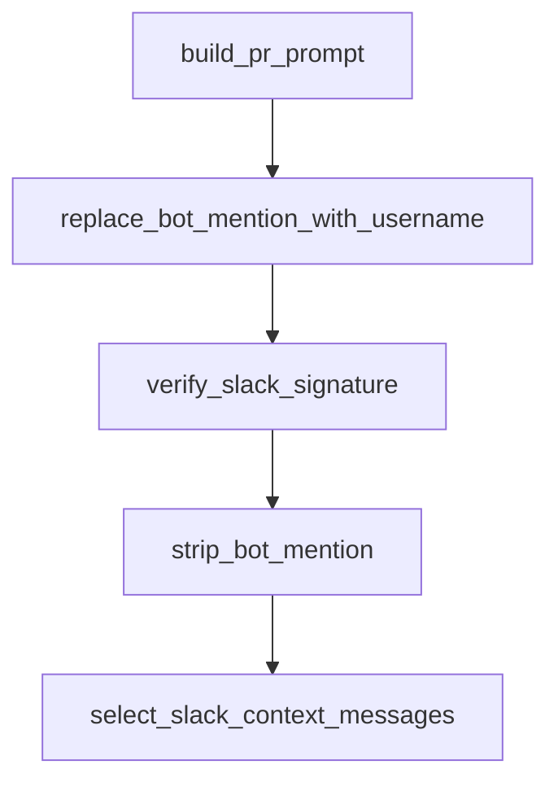

# Chapter 2: LangGraph Architecture and Agent Graphs

Welcome to **Chapter 2: LangGraph Architecture and Agent Graphs**. In this part of **Open SWE Tutorial: Asynchronous Cloud Coding Agent Architecture and Migration Playbook**, you will build an intuitive mental model first, then move into concrete implementation details and practical production tradeoffs.


This chapter explains the three-graph structure and why it matters.

## Learning Goals

- understand manager/planner/programmer responsibilities
- map graph boundaries to user-visible behavior
- identify extension points for custom forks
- reason about orchestration tradeoffs

## Architecture Pattern

- manager graph coordinates conversations and workflow control
- planner graph generates execution plans for approval
- programmer graph performs code edits and task execution

## Source References

- [Open SWE Docs Intro](https://github.com/langchain-ai/open-swe/blob/main/apps/docs/index.mdx)
- [Open SWE README: Architecture Summary](https://github.com/langchain-ai/open-swe/blob/main/README.md)
- [LangGraph Overview](https://docs.langchain.com/oss/javascript/langgraph/overview)

## Summary

You now understand Open SWE's core orchestration model and where to customize it.

Next: [Chapter 3: Development Environment and Monorepo Setup](03-development-environment-and-monorepo-setup.md)

## Depth Expansion Playbook

## Source Code Walkthrough

### `agent/utils/github_comments.py`

The `build_pr_prompt` function in [`agent/utils/github_comments.py`](https://github.com/langchain-ai/open-swe/blob/HEAD/agent/utils/github_comments.py) handles a key part of this chapter's functionality:

```py


def build_pr_prompt(comments: list[dict[str, Any]], pr_url: str) -> str:
    """Format PR comments into a human message for the agent."""
    lines: list[str] = []
    for c in comments:
        author = c.get("author", "unknown")
        body = format_github_comment_body_for_prompt(author, c.get("body", ""))
        if c.get("type") == "review_comment":
            path = c.get("path", "")
            line = c.get("line", "")
            loc = f" (file: `{path}`, line: {line})" if path else ""
            lines.append(f"\n**{author}**{loc}:\n{body}\n")
        else:
            lines.append(f"\n**{author}**:\n{body}\n")

    comments_text = "".join(lines)
    return (
        "You've been tagged in GitHub PR comments. Please resolve them.\n\n"
        f"PR: {pr_url}\n\n"
        f"## Comments:\n{comments_text}\n\n"
        "If code changes are needed:\n"
        "1. Make the changes in the sandbox\n"
        "2. Call `commit_and_open_pr` to push them to GitHub — this is REQUIRED, do NOT skip it\n"
        "3. Call `github_comment` with the PR number to post a summary on GitHub\n\n"
        "If no code changes are needed:\n"
        "1. Call `github_comment` with the PR number to explain your answer — this is REQUIRED, never end silently\n\n"
        "**You MUST always call `github_comment` before finishing — whether or not changes were made.**"
    )


async def _fetch_paginated(
```

This function is important because it defines how Open SWE Tutorial: Asynchronous Cloud Coding Agent Architecture and Migration Playbook implements the patterns covered in this chapter.

### `agent/utils/slack.py`

The `replace_bot_mention_with_username` function in [`agent/utils/slack.py`](https://github.com/langchain-ai/open-swe/blob/HEAD/agent/utils/slack.py) handles a key part of this chapter's functionality:

```py


def replace_bot_mention_with_username(text: str, bot_user_id: str, bot_username: str) -> str:
    """Replace Slack bot ID mention token with @username."""
    if not text:
        return ""
    if bot_user_id and bot_username:
        return text.replace(f"<@{bot_user_id}>", f"@{bot_username}")
    return text


def verify_slack_signature(
    body: bytes,
    timestamp: str,
    signature: str,
    secret: str,
    max_age_seconds: int = 300,
) -> bool:
    """Verify Slack request signature."""
    if not secret:
        logger.warning("SLACK_SIGNING_SECRET is not configured — rejecting webhook request")
        return False
    if not timestamp or not signature:
        return False
    try:
        request_timestamp = int(timestamp)
    except ValueError:
        return False
    if abs(int(time.time()) - request_timestamp) > max_age_seconds:
        return False

    base_string = f"v0:{timestamp}:{body.decode('utf-8', errors='replace')}"
```

This function is important because it defines how Open SWE Tutorial: Asynchronous Cloud Coding Agent Architecture and Migration Playbook implements the patterns covered in this chapter.

### `agent/utils/slack.py`

The `verify_slack_signature` function in [`agent/utils/slack.py`](https://github.com/langchain-ai/open-swe/blob/HEAD/agent/utils/slack.py) handles a key part of this chapter's functionality:

```py


def verify_slack_signature(
    body: bytes,
    timestamp: str,
    signature: str,
    secret: str,
    max_age_seconds: int = 300,
) -> bool:
    """Verify Slack request signature."""
    if not secret:
        logger.warning("SLACK_SIGNING_SECRET is not configured — rejecting webhook request")
        return False
    if not timestamp or not signature:
        return False
    try:
        request_timestamp = int(timestamp)
    except ValueError:
        return False
    if abs(int(time.time()) - request_timestamp) > max_age_seconds:
        return False

    base_string = f"v0:{timestamp}:{body.decode('utf-8', errors='replace')}"
    expected = (
        "v0="
        + hmac.new(secret.encode("utf-8"), base_string.encode("utf-8"), hashlib.sha256).hexdigest()
    )
    return hmac.compare_digest(expected, signature)


def strip_bot_mention(text: str, bot_user_id: str, bot_username: str = "") -> str:
    """Remove bot mention token from Slack text."""
```

This function is important because it defines how Open SWE Tutorial: Asynchronous Cloud Coding Agent Architecture and Migration Playbook implements the patterns covered in this chapter.

### `agent/utils/slack.py`

The `strip_bot_mention` function in [`agent/utils/slack.py`](https://github.com/langchain-ai/open-swe/blob/HEAD/agent/utils/slack.py) handles a key part of this chapter's functionality:

```py


def strip_bot_mention(text: str, bot_user_id: str, bot_username: str = "") -> str:
    """Remove bot mention token from Slack text."""
    if not text:
        return ""
    stripped = text
    if bot_user_id:
        stripped = stripped.replace(f"<@{bot_user_id}>", "")
    if bot_username:
        stripped = stripped.replace(f"@{bot_username}", "")
    return stripped.strip()


def select_slack_context_messages(
    messages: list[dict[str, Any]],
    current_message_ts: str,
    bot_user_id: str,
    bot_username: str = "",
) -> tuple[list[dict[str, Any]], str]:
    """Select context from thread start or previous bot mention."""
    if not messages:
        return [], "thread_start"

    current_ts = _parse_ts(current_message_ts)
    ordered = sorted(messages, key=lambda item: _parse_ts(item.get("ts")))
    up_to_current = [item for item in ordered if _parse_ts(item.get("ts")) <= current_ts]
    if not up_to_current:
        up_to_current = ordered

    mention_tokens = []
    if bot_user_id:
```

This function is important because it defines how Open SWE Tutorial: Asynchronous Cloud Coding Agent Architecture and Migration Playbook implements the patterns covered in this chapter.


## How These Components Connect


