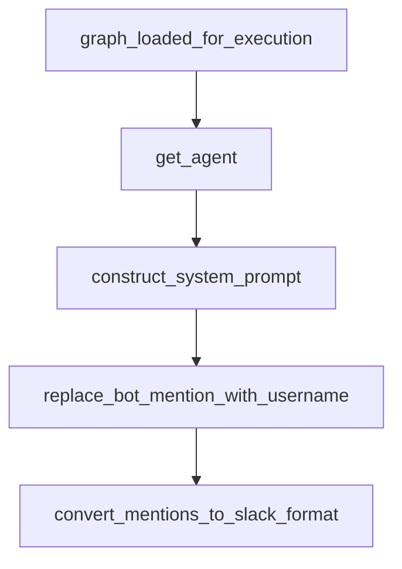

# Chapter 2: LangGraph Architecture and Agent Graphs

Welcome to **Chapter 2: LangGraph Architecture and Agent Graphs**. In this part of **Open SWE Tutorial: Asynchronous Cloud Coding Agent Architecture and Migration Playbook**, you will build an intuitive mental model first, then move into concrete implementation details and practical production tradeoffs.


This chapter explains the three-graph structure and why it matters.

## Learning Goals

- understand manager/planner/programmer responsibilities
- map graph boundaries to user-visible behavior
- identify extension points for custom forks
- reason about orchestration tradeoffs

## Architecture Pattern

- manager graph coordinates conversations and workflow control
- planner graph generates execution plans for approval
- programmer graph performs code edits and task execution

## Source References

- [Open SWE Docs Intro](https://github.com/langchain-ai/open-swe/blob/main/apps/docs/index.mdx)
- [Open SWE README: Architecture Summary](https://github.com/langchain-ai/open-swe/blob/main/README.md)
- [LangGraph Overview](https://docs.langchain.com/oss/javascript/langgraph/overview)

## Summary

You now understand Open SWE's core orchestration model and where to customize it.

Next: [Chapter 3: Development Environment and Monorepo Setup](03-development-environment-and-monorepo-setup.md)

## Source Code Walkthrough

### `agent/server.py`

The `graph_loaded_for_execution` function in [`agent/server.py`](https://github.com/langchain-ai/open-swe/blob/HEAD/agent/server.py) handles a key part of this chapter's functionality:

```py


def graph_loaded_for_execution(config: RunnableConfig) -> bool:
    """Check if the graph is loaded for actual execution vs introspection."""
    return (
        config["configurable"].get("__is_for_execution__", False)
        if "configurable" in config
        else False
    )


DEFAULT_LLM_MODEL_ID = "anthropic:claude-opus-4-6"
DEFAULT_RECURSION_LIMIT = 1_000


async def get_agent(config: RunnableConfig) -> Pregel:  # noqa: PLR0915
    """Get or create an agent with a sandbox for the given thread."""
    thread_id = config["configurable"].get("thread_id", None)

    config["recursion_limit"] = DEFAULT_RECURSION_LIMIT

    repo_config = config["configurable"].get("repo", {})
    repo_owner = repo_config.get("owner")
    repo_name = repo_config.get("name")

    if thread_id is None or not graph_loaded_for_execution(config):
        logger.info("No thread_id or not for execution, returning agent without sandbox")
        return create_deep_agent(
            system_prompt="",
            tools=[],
        ).with_config(config)

```

This function is important because it defines how Open SWE Tutorial: Asynchronous Cloud Coding Agent Architecture and Migration Playbook implements the patterns covered in this chapter.

### `agent/server.py`

The `get_agent` function in [`agent/server.py`](https://github.com/langchain-ai/open-swe/blob/HEAD/agent/server.py) handles a key part of this chapter's functionality:

```py


async def get_agent(config: RunnableConfig) -> Pregel:  # noqa: PLR0915
    """Get or create an agent with a sandbox for the given thread."""
    thread_id = config["configurable"].get("thread_id", None)

    config["recursion_limit"] = DEFAULT_RECURSION_LIMIT

    repo_config = config["configurable"].get("repo", {})
    repo_owner = repo_config.get("owner")
    repo_name = repo_config.get("name")

    if thread_id is None or not graph_loaded_for_execution(config):
        logger.info("No thread_id or not for execution, returning agent without sandbox")
        return create_deep_agent(
            system_prompt="",
            tools=[],
        ).with_config(config)

    github_token, new_encrypted = await resolve_github_token(config, thread_id)
    config["metadata"]["github_token_encrypted"] = new_encrypted

    sandbox_backend = SANDBOX_BACKENDS.get(thread_id)
    sandbox_id = await get_sandbox_id_from_metadata(thread_id)

    if sandbox_id == SANDBOX_CREATING and not sandbox_backend:
        logger.info("Sandbox creation in progress, waiting...")
        sandbox_id = await _wait_for_sandbox_id(thread_id)

    if sandbox_backend:
        logger.info("Using cached sandbox backend for thread %s", thread_id)
        metadata = get_config().get("metadata", {})
```

This function is important because it defines how Open SWE Tutorial: Asynchronous Cloud Coding Agent Architecture and Migration Playbook implements the patterns covered in this chapter.

### `agent/prompt.py`

The `construct_system_prompt` function in [`agent/prompt.py`](https://github.com/langchain-ai/open-swe/blob/HEAD/agent/prompt.py) handles a key part of this chapter's functionality:

```py


def construct_system_prompt(
    working_dir: str,
    linear_project_id: str = "",
    linear_issue_number: str = "",
    agents_md: str = "",
) -> str:
    agents_md_section = ""
    if agents_md:
        agents_md_section = (
            "\nThe following text is pulled from the repository's AGENTS.md file. "
            "It may contain specific instructions and guidelines for the agent.\n"
            "<agents_md>\n"
            f"{agents_md}\n"
            "</agents_md>\n"
        )
    return SYSTEM_PROMPT.format(
        working_dir=working_dir,
        linear_project_id=linear_project_id or "<PROJECT_ID>",
        linear_issue_number=linear_issue_number or "<ISSUE_NUMBER>",
        agents_md_section=agents_md_section,
    )

```

This function is important because it defines how Open SWE Tutorial: Asynchronous Cloud Coding Agent Architecture and Migration Playbook implements the patterns covered in this chapter.

### `agent/utils/slack.py`

The `replace_bot_mention_with_username` function in [`agent/utils/slack.py`](https://github.com/langchain-ai/open-swe/blob/HEAD/agent/utils/slack.py) handles a key part of this chapter's functionality:

```py


def replace_bot_mention_with_username(text: str, bot_user_id: str, bot_username: str) -> str:
    """Replace Slack bot ID mention token with @username."""
    if not text:
        return ""
    if bot_user_id and bot_username:
        return text.replace(f"<@{bot_user_id}>", f"@{bot_username}")
    return text


def convert_mentions_to_slack_format(text: str) -> str:
    """Convert @Name(USER_ID) patterns to Slack's <@USER_ID> mention format."""
    return re.sub(r"@[^()]+\(([A-Z0-9]+)\)", r"<@\1>", text)


def verify_slack_signature(
    body: bytes,
    timestamp: str,
    signature: str,
    secret: str,
    max_age_seconds: int = 300,
) -> bool:
    """Verify Slack request signature."""
    if not secret:
        logger.warning("SLACK_SIGNING_SECRET is not configured — rejecting webhook request")
        return False
    if not timestamp or not signature:
        return False
    try:
        request_timestamp = int(timestamp)
    except ValueError:
```

This function is important because it defines how Open SWE Tutorial: Asynchronous Cloud Coding Agent Architecture and Migration Playbook implements the patterns covered in this chapter.


## How These Components Connect


