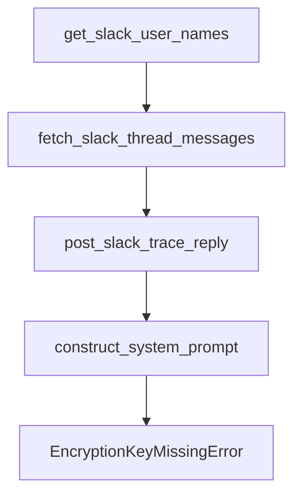

# Chapter 3: Development Environment and Monorepo Setup

Welcome to **Chapter 3: Development Environment and Monorepo Setup**. In this part of **Open SWE Tutorial: Asynchronous Cloud Coding Agent Architecture and Migration Playbook**, you will build an intuitive mental model first, then move into concrete implementation details and practical production tradeoffs.


This chapter covers local development setup for teams auditing or maintaining forks.

## Learning Goals

- bootstrap the Yarn/Turbo monorepo correctly
- configure env files and secrets flow
- run web and agent services locally
- avoid setup drift across collaborators

## Setup Highlights

- use Yarn workspaces and Turbo tasks from repo root
- configure both `apps/web` and `apps/open-swe` env files
- establish GitHub App credentials before webhook testing

## Source References

- [Open SWE Development Setup Doc](https://github.com/langchain-ai/open-swe/blob/main/apps/docs/setup/development.mdx)
- [Open SWE AGENTS Rules](https://github.com/langchain-ai/open-swe/blob/main/AGENTS.md)
- [Open SWE Setup Intro](https://github.com/langchain-ai/open-swe/blob/main/apps/docs/setup/intro.mdx)

## Summary

You now have a repeatable local setup baseline for maintenance and experimentation.

Next: [Chapter 4: Usage Patterns: UI and GitHub Workflows](04-usage-patterns-ui-and-github-workflows.md)

## Depth Expansion Playbook

## Source Code Walkthrough

### `agent/utils/slack.py`

The `get_slack_user_names` function in [`agent/utils/slack.py`](https://github.com/langchain-ai/open-swe/blob/HEAD/agent/utils/slack.py) handles a key part of this chapter's functionality:

```py


async def get_slack_user_names(user_ids: list[str]) -> dict[str, str]:
    """Get display names for a set of Slack user IDs."""
    unique_ids = sorted({user_id for user_id in user_ids if isinstance(user_id, str) and user_id})
    if not unique_ids:
        return {}

    user_infos = await asyncio.gather(
        *(get_slack_user_info(user_id) for user_id in unique_ids),
        return_exceptions=True,
    )

    user_names: dict[str, str] = {}
    for user_id, user_info in zip(unique_ids, user_infos, strict=True):
        if isinstance(user_info, dict):
            user_names[user_id] = _extract_slack_user_name(user_info)
        else:
            user_names[user_id] = user_id
    return user_names


async def fetch_slack_thread_messages(channel_id: str, thread_ts: str) -> list[dict[str, Any]]:
    """Fetch all messages for a Slack thread."""
    if not SLACK_BOT_TOKEN:
        return []

    messages: list[dict[str, Any]] = []
    cursor: str | None = None

    async with httpx.AsyncClient() as http_client:
        while True:
```

This function is important because it defines how Open SWE Tutorial: Asynchronous Cloud Coding Agent Architecture and Migration Playbook implements the patterns covered in this chapter.

### `agent/utils/slack.py`

The `fetch_slack_thread_messages` function in [`agent/utils/slack.py`](https://github.com/langchain-ai/open-swe/blob/HEAD/agent/utils/slack.py) handles a key part of this chapter's functionality:

```py


async def fetch_slack_thread_messages(channel_id: str, thread_ts: str) -> list[dict[str, Any]]:
    """Fetch all messages for a Slack thread."""
    if not SLACK_BOT_TOKEN:
        return []

    messages: list[dict[str, Any]] = []
    cursor: str | None = None

    async with httpx.AsyncClient() as http_client:
        while True:
            params: dict[str, str | int] = {"channel": channel_id, "ts": thread_ts, "limit": 200}
            if cursor:
                params["cursor"] = cursor

            try:
                response = await http_client.get(
                    f"{SLACK_API_BASE_URL}/conversations.replies",
                    headers=_slack_headers(),
                    params=params,
                )
                response.raise_for_status()
                payload = response.json()
            except httpx.HTTPError:
                logger.exception("Slack conversations.replies request failed")
                break

            if not payload.get("ok"):
                logger.warning("Slack conversations.replies failed: %s", payload.get("error"))
                break

```

This function is important because it defines how Open SWE Tutorial: Asynchronous Cloud Coding Agent Architecture and Migration Playbook implements the patterns covered in this chapter.

### `agent/utils/slack.py`

The `post_slack_trace_reply` function in [`agent/utils/slack.py`](https://github.com/langchain-ai/open-swe/blob/HEAD/agent/utils/slack.py) handles a key part of this chapter's functionality:

```py


async def post_slack_trace_reply(channel_id: str, thread_ts: str, run_id: str) -> None:
    """Post a trace URL reply in a Slack thread."""
    trace_url = get_langsmith_trace_url(run_id)
    if trace_url:
        await post_slack_thread_reply(
            channel_id, thread_ts, f"Working on it! <{trace_url}|View trace>"
        )

```

This function is important because it defines how Open SWE Tutorial: Asynchronous Cloud Coding Agent Architecture and Migration Playbook implements the patterns covered in this chapter.

### `agent/prompt.py`

The `construct_system_prompt` function in [`agent/prompt.py`](https://github.com/langchain-ai/open-swe/blob/HEAD/agent/prompt.py) handles a key part of this chapter's functionality:

```py


def construct_system_prompt(
    working_dir: str,
    linear_project_id: str = "",
    linear_issue_number: str = "",
    agents_md: str = "",
) -> str:
    agents_md_section = ""
    if agents_md:
        agents_md_section = (
            "\nThe following text is pulled from the repository's AGENTS.md file. "
            "It may contain specific instructions and guidelines for the agent.\n"
            "<agents_md>\n"
            f"{agents_md}\n"
            "</agents_md>\n"
        )
    return SYSTEM_PROMPT.format(
        working_dir=working_dir,
        linear_project_id=linear_project_id or "<PROJECT_ID>",
        linear_issue_number=linear_issue_number or "<ISSUE_NUMBER>",
        agents_md_section=agents_md_section,
    )

```

This function is important because it defines how Open SWE Tutorial: Asynchronous Cloud Coding Agent Architecture and Migration Playbook implements the patterns covered in this chapter.


## How These Components Connect


