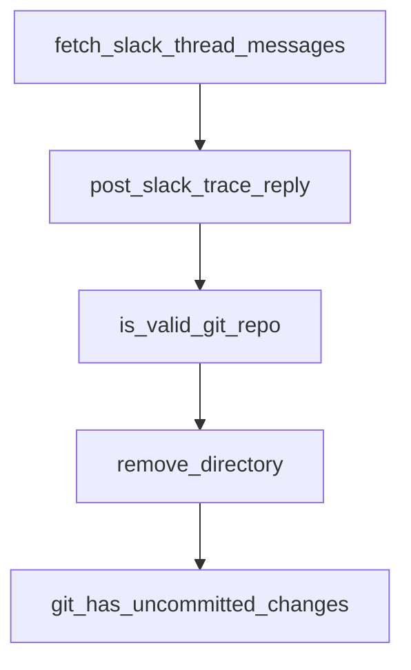

# Chapter 3: Development Environment and Monorepo Setup

Welcome to **Chapter 3: Development Environment and Monorepo Setup**. In this part of **Open SWE Tutorial: Asynchronous Cloud Coding Agent Architecture and Migration Playbook**, you will build an intuitive mental model first, then move into concrete implementation details and practical production tradeoffs.


This chapter covers local development setup for teams auditing or maintaining forks.

## Learning Goals

- bootstrap the Yarn/Turbo monorepo correctly
- configure env files and secrets flow
- run web and agent services locally
- avoid setup drift across collaborators

## Setup Highlights

- use Yarn workspaces and Turbo tasks from repo root
- configure both `apps/web` and `apps/open-swe` env files
- establish GitHub App credentials before webhook testing

## Source References

- [Open SWE Development Setup Doc](https://github.com/langchain-ai/open-swe/blob/main/apps/docs/setup/development.mdx)
- [Open SWE AGENTS Rules](https://github.com/langchain-ai/open-swe/blob/main/AGENTS.md)
- [Open SWE Setup Intro](https://github.com/langchain-ai/open-swe/blob/main/apps/docs/setup/intro.mdx)

## Summary

You now have a repeatable local setup baseline for maintenance and experimentation.

Next: [Chapter 4: Usage Patterns: UI and GitHub Workflows](04-usage-patterns-ui-and-github-workflows.md)

## Source Code Walkthrough

### `agent/utils/slack.py`

The `fetch_slack_thread_messages` function in [`agent/utils/slack.py`](https://github.com/langchain-ai/open-swe/blob/HEAD/agent/utils/slack.py) handles a key part of this chapter's functionality:

```py


async def fetch_slack_thread_messages(channel_id: str, thread_ts: str) -> list[dict[str, Any]]:
    """Fetch all messages for a Slack thread."""
    if not SLACK_BOT_TOKEN:
        return []

    messages: list[dict[str, Any]] = []
    cursor: str | None = None

    async with httpx.AsyncClient() as http_client:
        while True:
            params: dict[str, str | int] = {"channel": channel_id, "ts": thread_ts, "limit": 200}
            if cursor:
                params["cursor"] = cursor

            try:
                response = await http_client.get(
                    f"{SLACK_API_BASE_URL}/conversations.replies",
                    headers=_slack_headers(),
                    params=params,
                )
                response.raise_for_status()
                payload = response.json()
            except httpx.HTTPError:
                logger.exception("Slack conversations.replies request failed")
                break

            if not payload.get("ok"):
                logger.warning("Slack conversations.replies failed: %s", payload.get("error"))
                break

```

This function is important because it defines how Open SWE Tutorial: Asynchronous Cloud Coding Agent Architecture and Migration Playbook implements the patterns covered in this chapter.

### `agent/utils/slack.py`

The `post_slack_trace_reply` function in [`agent/utils/slack.py`](https://github.com/langchain-ai/open-swe/blob/HEAD/agent/utils/slack.py) handles a key part of this chapter's functionality:

```py


async def post_slack_trace_reply(channel_id: str, thread_ts: str, run_id: str) -> None:
    """Post a trace URL reply in a Slack thread."""
    trace_url = get_langsmith_trace_url(run_id)
    if trace_url:
        await post_slack_thread_reply(
            channel_id, thread_ts, f"Working on it! <{trace_url}|View trace>"
        )

```

This function is important because it defines how Open SWE Tutorial: Asynchronous Cloud Coding Agent Architecture and Migration Playbook implements the patterns covered in this chapter.

### `agent/utils/github.py`

The `is_valid_git_repo` function in [`agent/utils/github.py`](https://github.com/langchain-ai/open-swe/blob/HEAD/agent/utils/github.py) handles a key part of this chapter's functionality:

```py


def is_valid_git_repo(sandbox_backend: SandboxBackendProtocol, repo_dir: str) -> bool:
    """Check if directory is a valid git repository."""
    git_dir = f"{repo_dir}/.git"
    safe_git_dir = shlex.quote(git_dir)
    result = sandbox_backend.execute(f"test -d {safe_git_dir} && echo exists")
    return result.exit_code == 0 and "exists" in result.output


def remove_directory(sandbox_backend: SandboxBackendProtocol, repo_dir: str) -> bool:
    """Remove a directory and all its contents."""
    safe_repo_dir = shlex.quote(repo_dir)
    result = sandbox_backend.execute(f"rm -rf {safe_repo_dir}")
    return result.exit_code == 0


def git_has_uncommitted_changes(sandbox_backend: SandboxBackendProtocol, repo_dir: str) -> bool:
    """Check whether the repo has uncommitted changes."""
    result = _run_git(sandbox_backend, repo_dir, "git status --porcelain")
    return result.exit_code == 0 and bool(result.output.strip())


def git_fetch_origin(sandbox_backend: SandboxBackendProtocol, repo_dir: str) -> ExecuteResponse:
    """Fetch latest from origin (best-effort)."""
    return _run_git(sandbox_backend, repo_dir, "git fetch origin 2>/dev/null || true")


def git_has_unpushed_commits(sandbox_backend: SandboxBackendProtocol, repo_dir: str) -> bool:
    """Check whether there are commits not pushed to upstream."""
    git_log_cmd = (
        "git log --oneline @{upstream}..HEAD 2>/dev/null "
```

This function is important because it defines how Open SWE Tutorial: Asynchronous Cloud Coding Agent Architecture and Migration Playbook implements the patterns covered in this chapter.

### `agent/utils/github.py`

The `remove_directory` function in [`agent/utils/github.py`](https://github.com/langchain-ai/open-swe/blob/HEAD/agent/utils/github.py) handles a key part of this chapter's functionality:

```py


def remove_directory(sandbox_backend: SandboxBackendProtocol, repo_dir: str) -> bool:
    """Remove a directory and all its contents."""
    safe_repo_dir = shlex.quote(repo_dir)
    result = sandbox_backend.execute(f"rm -rf {safe_repo_dir}")
    return result.exit_code == 0


def git_has_uncommitted_changes(sandbox_backend: SandboxBackendProtocol, repo_dir: str) -> bool:
    """Check whether the repo has uncommitted changes."""
    result = _run_git(sandbox_backend, repo_dir, "git status --porcelain")
    return result.exit_code == 0 and bool(result.output.strip())


def git_fetch_origin(sandbox_backend: SandboxBackendProtocol, repo_dir: str) -> ExecuteResponse:
    """Fetch latest from origin (best-effort)."""
    return _run_git(sandbox_backend, repo_dir, "git fetch origin 2>/dev/null || true")


def git_has_unpushed_commits(sandbox_backend: SandboxBackendProtocol, repo_dir: str) -> bool:
    """Check whether there are commits not pushed to upstream."""
    git_log_cmd = (
        "git log --oneline @{upstream}..HEAD 2>/dev/null "
        "|| git log --oneline origin/HEAD..HEAD 2>/dev/null || echo ''"
    )
    result = _run_git(sandbox_backend, repo_dir, git_log_cmd)
    return result.exit_code == 0 and bool(result.output.strip())


def git_current_branch(sandbox_backend: SandboxBackendProtocol, repo_dir: str) -> str:
    """Get the current git branch name."""
```

This function is important because it defines how Open SWE Tutorial: Asynchronous Cloud Coding Agent Architecture and Migration Playbook implements the patterns covered in this chapter.


## How These Components Connect


