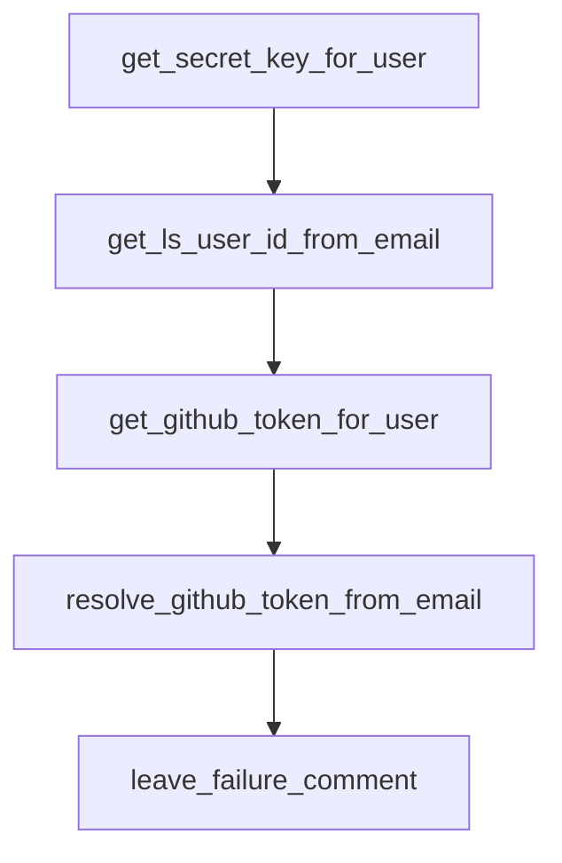

# Chapter 4: Usage Patterns: UI and GitHub Workflows

Welcome to **Chapter 4: Usage Patterns: UI and GitHub Workflows**. In this part of **Open SWE Tutorial: Asynchronous Cloud Coding Agent Architecture and Migration Playbook**, you will build an intuitive mental model first, then move into concrete implementation details and practical production tradeoffs.


This chapter explains the two primary interaction surfaces: UI and GitHub-driven automation.

## Learning Goals

- run tasks from the web interface
- trigger tasks through GitHub labels
- understand asynchronous run lifecycle
- monitor status through issues and PRs

## Workflow Modes

- interactive UI mode for direct supervision
- webhook/label mode for issue-driven automation
- automatic PR generation for completed work

## Source References

- [Open SWE Usage Intro](https://github.com/langchain-ai/open-swe/blob/main/apps/docs/usage/intro.mdx)
- [Open SWE GitHub Usage Guide](https://github.com/langchain-ai/open-swe/blob/main/apps/docs/usage/github.mdx)
- [Open SWE Demo](https://swe.langchain.com)

## Summary

You now understand how Open SWE connects user requests to async implementation workflows.

Next: [Chapter 5: Planning Control and Human-in-the-Loop](05-planning-control-and-human-in-the-loop.md)

## Depth Expansion Playbook

## Source Code Walkthrough

### `agent/utils/auth.py`

The `get_secret_key_for_user` function in [`agent/utils/auth.py`](https://github.com/langchain-ai/open-swe/blob/HEAD/agent/utils/auth.py) handles a key part of this chapter's functionality:

```py


def get_secret_key_for_user(
    user_id: str, tenant_id: str, expiration_seconds: int = 300
) -> tuple[str, Literal["service", "api_key"]]:
    """Create a short-lived service JWT for authenticating as a specific user."""
    if not X_SERVICE_AUTH_JWT_SECRET:
        msg = "X_SERVICE_AUTH_JWT_SECRET is not configured. Cannot generate service keys."
        raise ValueError(msg)

    payload = {
        "sub": "unspecified",
        "exp": datetime.now(UTC) + timedelta(seconds=expiration_seconds),
        "user_id": user_id,
        "tenant_id": tenant_id,
    }
    return jwt.encode(payload, X_SERVICE_AUTH_JWT_SECRET, algorithm="HS256"), "service"


async def get_ls_user_id_from_email(email: str) -> dict[str, str | None]:
    """Get the LangSmith user ID and tenant ID from a user's email."""
    if not LANGSMITH_API_KEY:
        logger.warning("LangSmith API key not configured; cannot resolve LS user for %s", email)
        return {"ls_user_id": None, "tenant_id": None}

    url = f"{LANGSMITH_API_URL}/api/v1/workspaces/current/members/active"

    async with httpx.AsyncClient() as client:
        try:
            response = await client.get(
                url,
                headers={"X-API-Key": LANGSMITH_API_KEY},
```

This function is important because it defines how Open SWE Tutorial: Asynchronous Cloud Coding Agent Architecture and Migration Playbook implements the patterns covered in this chapter.

### `agent/utils/auth.py`

The `get_ls_user_id_from_email` function in [`agent/utils/auth.py`](https://github.com/langchain-ai/open-swe/blob/HEAD/agent/utils/auth.py) handles a key part of this chapter's functionality:

```py


async def get_ls_user_id_from_email(email: str) -> dict[str, str | None]:
    """Get the LangSmith user ID and tenant ID from a user's email."""
    if not LANGSMITH_API_KEY:
        logger.warning("LangSmith API key not configured; cannot resolve LS user for %s", email)
        return {"ls_user_id": None, "tenant_id": None}

    url = f"{LANGSMITH_API_URL}/api/v1/workspaces/current/members/active"

    async with httpx.AsyncClient() as client:
        try:
            response = await client.get(
                url,
                headers={"X-API-Key": LANGSMITH_API_KEY},
                params={"emails": [email]},
            )
            response.raise_for_status()
            members = response.json()

            if members and len(members) > 0:
                member = members[0]
                return {
                    "ls_user_id": member.get("ls_user_id"),
                    "tenant_id": member.get("tenant_id"),
                }
        except Exception as e:
            logger.exception("Error getting LangSmith user info for email: %s", e)
        return {"ls_user_id": None, "tenant_id": None}


async def get_github_token_for_user(ls_user_id: str, tenant_id: str) -> dict[str, Any]:
```

This function is important because it defines how Open SWE Tutorial: Asynchronous Cloud Coding Agent Architecture and Migration Playbook implements the patterns covered in this chapter.

### `agent/utils/auth.py`

The `get_github_token_for_user` function in [`agent/utils/auth.py`](https://github.com/langchain-ai/open-swe/blob/HEAD/agent/utils/auth.py) handles a key part of this chapter's functionality:

```py


async def get_github_token_for_user(ls_user_id: str, tenant_id: str) -> dict[str, Any]:
    """Get GitHub OAuth token for a user via LangSmith agent auth."""
    if not GITHUB_OAUTH_PROVIDER_ID:
        logger.error("GitHub auth failed: GITHUB_OAUTH_PROVIDER_ID is not configured")
        return {"error": "GITHUB_OAUTH_PROVIDER_ID not configured"}

    try:
        headers = {
            "X-Tenant-Id": tenant_id,
            "X-User-Id": ls_user_id,
        }
        secret_key, secret_type = get_secret_key_for_user(ls_user_id, tenant_id)
        if secret_type == "api_key":
            headers["X-API-Key"] = secret_key
        else:
            headers["X-Service-Key"] = secret_key

        payload = {
            "provider": GITHUB_OAUTH_PROVIDER_ID,
            "scopes": ["repo"],
            "user_id": ls_user_id,
            "ls_user_id": ls_user_id,
        }

        async with httpx.AsyncClient() as client:
            response = await client.post(
                f"{LANGSMITH_HOST_API_URL}/v2/auth/authenticate",
                json=payload,
                headers=headers,
            )
```

This function is important because it defines how Open SWE Tutorial: Asynchronous Cloud Coding Agent Architecture and Migration Playbook implements the patterns covered in this chapter.

### `agent/utils/auth.py`

The `resolve_github_token_from_email` function in [`agent/utils/auth.py`](https://github.com/langchain-ai/open-swe/blob/HEAD/agent/utils/auth.py) handles a key part of this chapter's functionality:

```py


async def resolve_github_token_from_email(email: str) -> dict[str, Any]:
    """Resolve a GitHub token for a user identified by email.

    Chains get_ls_user_id_from_email -> get_github_token_for_user.

    Returns:
        Dict with one of:
        - {"token": str} on success
        - {"auth_url": str} if user needs to authenticate via OAuth
        - {"error": str} on failure; error="no_ls_user" if email not in LangSmith
    """
    user_info = await get_ls_user_id_from_email(email)
    ls_user_id = user_info.get("ls_user_id")
    tenant_id = user_info.get("tenant_id")

    if not ls_user_id or not tenant_id:
        logger.warning(
            "No LangSmith user found for email %s (ls_user_id=%s, tenant_id=%s)",
            email,
            ls_user_id,
            tenant_id,
        )
        return {"error": "no_ls_user", "email": email}

    auth_result = await get_github_token_for_user(ls_user_id, tenant_id)
    return auth_result


async def leave_failure_comment(
    source: str,
```

This function is important because it defines how Open SWE Tutorial: Asynchronous Cloud Coding Agent Architecture and Migration Playbook implements the patterns covered in this chapter.


## How These Components Connect


