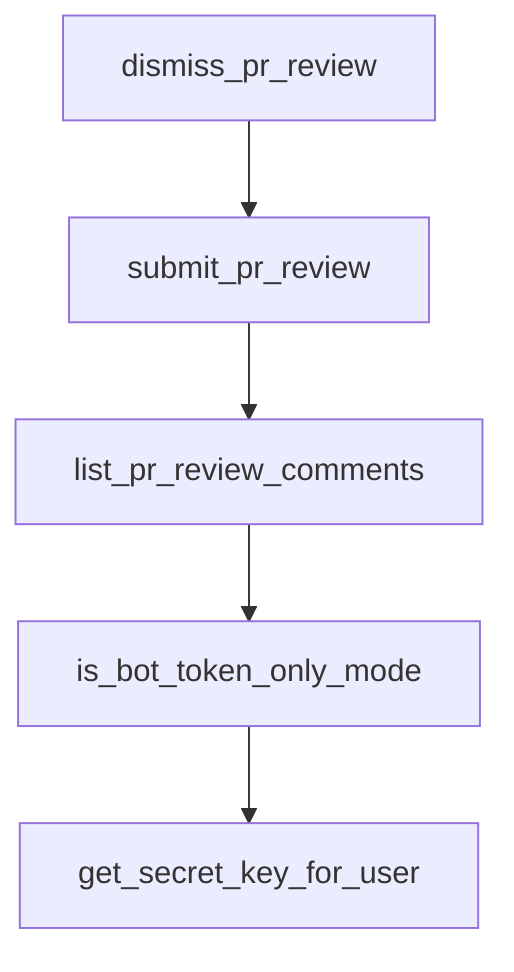

# Chapter 5: Planning Control and Human-in-the-Loop

Welcome to **Chapter 5: Planning Control and Human-in-the-Loop**. In this part of **Open SWE Tutorial: Asynchronous Cloud Coding Agent Architecture and Migration Playbook**, you will build an intuitive mental model first, then move into concrete implementation details and practical production tradeoffs.


This chapter focuses on plan-approval patterns and operator controls.

## Learning Goals

- use manual and auto label modes intentionally
- apply human checkpoints to reduce risky execution
- understand deprecated label variants and drift
- design safer intervention paths

## Control Patterns

- manual approval mode for sensitive changes
- auto mode for low-risk repetitive tasks
- real-time feedback loops during planning/execution

## Source References

- [Open SWE GitHub Usage Labels](https://github.com/langchain-ai/open-swe/blob/main/apps/docs/usage/github.mdx)
- [Open SWE README: Usage](https://github.com/langchain-ai/open-swe/blob/main/README.md#usage)
- [Open SWE Best Practices Doc](https://github.com/langchain-ai/open-swe/blob/main/apps/docs/usage/best-practices.mdx)

## Summary

You now have a framework for balancing automation speed with human oversight.

Next: [Chapter 6: Security, Auth, and Operational Constraints](06-security-auth-and-operational-constraints.md)

## Source Code Walkthrough

### `agent/tools/github_review.py`

The `dismiss_pr_review` function in [`agent/tools/github_review.py`](https://github.com/langchain-ai/open-swe/blob/HEAD/agent/tools/github_review.py) handles a key part of this chapter's functionality:

```py


def dismiss_pr_review(
    pull_number: int,
    review_id: int,
    message: str,
) -> dict[str, Any]:
    """Dismiss a review on a pull request.

    Args:
        pull_number: The PR number.
        review_id: The ID of the review to dismiss.
        message: A message explaining why the review is being dismissed.

    Returns:
        Dictionary with success status and the dismissed review data.
    """
    repo_config = _get_repo_config()
    if not repo_config:
        return {"success": False, "error": "No repo config found"}

    token = asyncio.run(_get_token())
    if not token:
        return {"success": False, "error": "Failed to get GitHub App installation token"}

    url = f"{_repo_url(repo_config)}/pulls/{pull_number}/reviews/{review_id}/dismissals"

    async def _dismiss() -> dict[str, Any]:
        async with httpx.AsyncClient() as client:
            response = await client.put(
                url, headers=_github_headers(token), json={"message": message}
            )
```

This function is important because it defines how Open SWE Tutorial: Asynchronous Cloud Coding Agent Architecture and Migration Playbook implements the patterns covered in this chapter.

### `agent/tools/github_review.py`

The `submit_pr_review` function in [`agent/tools/github_review.py`](https://github.com/langchain-ai/open-swe/blob/HEAD/agent/tools/github_review.py) handles a key part of this chapter's functionality:

```py


def submit_pr_review(
    pull_number: int,
    review_id: int,
    body: str | None = None,
    event: str = "COMMENT",
) -> dict[str, Any]:
    """Submit a pending review on a pull request.

    Use this if a review was created without an event (pending state) and needs to be submitted.

    Args:
        pull_number: The PR number.
        review_id: The ID of the pending review to submit.
        body: Optional body text for the review submission.
        event: The review action - one of APPROVE, REQUEST_CHANGES, or COMMENT.

    Returns:
        Dictionary with success status and the submitted review data.
    """
    repo_config = _get_repo_config()
    if not repo_config:
        return {"success": False, "error": "No repo config found"}

    token = asyncio.run(_get_token())
    if not token:
        return {"success": False, "error": "Failed to get GitHub App installation token"}

    url = f"{_repo_url(repo_config)}/pulls/{pull_number}/reviews/{review_id}/events"
    payload: dict[str, Any] = {"event": event}
    if body is not None:
```

This function is important because it defines how Open SWE Tutorial: Asynchronous Cloud Coding Agent Architecture and Migration Playbook implements the patterns covered in this chapter.

### `agent/tools/github_review.py`

The `list_pr_review_comments` function in [`agent/tools/github_review.py`](https://github.com/langchain-ai/open-swe/blob/HEAD/agent/tools/github_review.py) handles a key part of this chapter's functionality:

```py


def list_pr_review_comments(
    pull_number: int,
    review_id: int | None = None,
) -> dict[str, Any]:
    """List comments on a pull request review.

    Args:
        pull_number: The PR number.
        review_id: If provided, list comments for a specific review.
            If not provided, list all review comments on the PR.

    Returns:
        Dictionary with success status and the list of review comments.
    """
    repo_config = _get_repo_config()
    if not repo_config:
        return {"success": False, "error": "No repo config found"}

    token = asyncio.run(_get_token())
    if not token:
        return {"success": False, "error": "Failed to get GitHub App installation token"}

    if review_id is not None:
        url = f"{_repo_url(repo_config)}/pulls/{pull_number}/reviews/{review_id}/comments"
    else:
        url = f"{_repo_url(repo_config)}/pulls/{pull_number}/comments"

    async def _fetch() -> dict[str, Any]:
        async with httpx.AsyncClient() as client:
            response = await client.get(url, headers=_github_headers(token))
```

This function is important because it defines how Open SWE Tutorial: Asynchronous Cloud Coding Agent Architecture and Migration Playbook implements the patterns covered in this chapter.

### `agent/utils/auth.py`

The `is_bot_token_only_mode` function in [`agent/utils/auth.py`](https://github.com/langchain-ai/open-swe/blob/HEAD/agent/utils/auth.py) handles a key part of this chapter's functionality:

```py


def is_bot_token_only_mode() -> bool:
    """Check if we're in bot-token-only mode.

    This is the case when LANGSMITH_API_KEY_PROD is set (deployed) but neither
    X_SERVICE_AUTH_JWT_SECRET nor USER_ID_API_KEY_MAP is configured, meaning we
    can't resolve per-user GitHub OAuth tokens. In this mode the GitHub App
    installation token is used for all git operations instead.
    """
    return bool(LANGSMITH_API_KEY and not X_SERVICE_AUTH_JWT_SECRET and not USER_ID_API_KEY_MAP)


def _retry_instruction(source: str) -> str:
    if source == "slack":
        return "Once authenticated, mention me again in this Slack thread to retry."
    return "Once authenticated, reply to this issue mentioning @openswe to retry."


def _source_account_label(source: str) -> str:
    if source == "slack":
        return "Slack"
    return "Linear"


def _auth_link_text(source: str, auth_url: str) -> str:
    if source == "slack":
        return auth_url
    return f"[Authenticate with GitHub]({auth_url})"


def _work_item_label(source: str) -> str:
```

This function is important because it defines how Open SWE Tutorial: Asynchronous Cloud Coding Agent Architecture and Migration Playbook implements the patterns covered in this chapter.


## How These Components Connect


