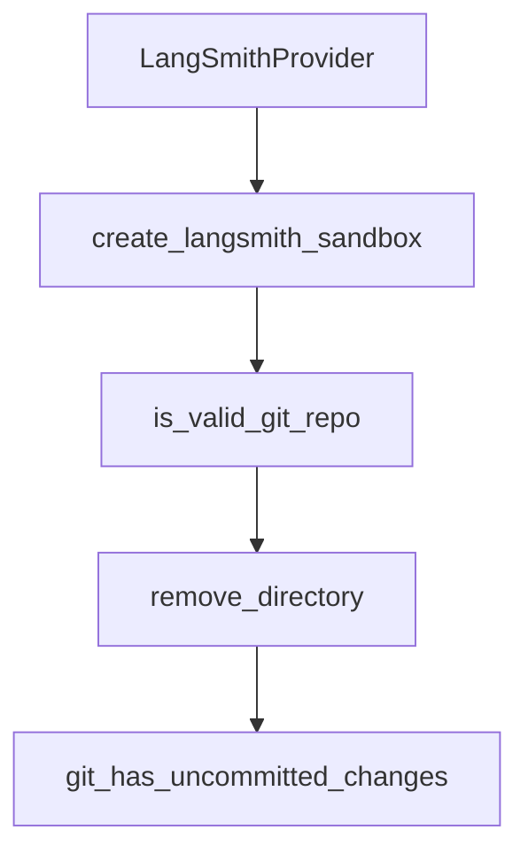

# Chapter 5: Planning Control and Human-in-the-Loop

Welcome to **Chapter 5: Planning Control and Human-in-the-Loop**. In this part of **Open SWE Tutorial: Asynchronous Cloud Coding Agent Architecture and Migration Playbook**, you will build an intuitive mental model first, then move into concrete implementation details and practical production tradeoffs.


This chapter focuses on plan-approval patterns and operator controls.

## Learning Goals

- use manual and auto label modes intentionally
- apply human checkpoints to reduce risky execution
- understand deprecated label variants and drift
- design safer intervention paths

## Control Patterns

- manual approval mode for sensitive changes
- auto mode for low-risk repetitive tasks
- real-time feedback loops during planning/execution

## Source References

- [Open SWE GitHub Usage Labels](https://github.com/langchain-ai/open-swe/blob/main/apps/docs/usage/github.mdx)
- [Open SWE README: Usage](https://github.com/langchain-ai/open-swe/blob/main/README.md#usage)
- [Open SWE Best Practices Doc](https://github.com/langchain-ai/open-swe/blob/main/apps/docs/usage/best-practices.mdx)

## Summary

You now have a framework for balancing automation speed with human oversight.

Next: [Chapter 6: Security, Auth, and Operational Constraints](06-security-auth-and-operational-constraints.md)

## Depth Expansion Playbook

## Source Code Walkthrough

### `agent/integrations/langsmith.py`

The `LangSmithProvider` class in [`agent/integrations/langsmith.py`](https://github.com/langchain-ai/open-swe/blob/HEAD/agent/integrations/langsmith.py) handles a key part of this chapter's functionality:

```py
    """Create or connect to a LangSmith sandbox without automatic cleanup.

    This function directly uses the LangSmithProvider to create/connect to sandboxes
    without the context manager cleanup, allowing sandboxes to persist across
    multiple agent invocations.

    Args:
        sandbox_id: Optional existing sandbox ID to connect to.
                   If None, creates a new sandbox.

    Returns:
        SandboxBackendProtocol instance
    """
    api_key = _get_langsmith_api_key()
    template_name, template_image = _get_sandbox_template_config()

    provider = LangSmithProvider(api_key=api_key)
    backend = provider.get_or_create(
        sandbox_id=sandbox_id,
        template=template_name,
        template_image=template_image,
    )
    _update_thread_sandbox_metadata(backend.id)
    return backend


def _update_thread_sandbox_metadata(sandbox_id: str) -> None:
    """Update thread metadata with sandbox_id."""
    try:
        import asyncio

        from langgraph.config import get_config
```

This class is important because it defines how Open SWE Tutorial: Asynchronous Cloud Coding Agent Architecture and Migration Playbook implements the patterns covered in this chapter.

### `agent/integrations/langsmith.py`

The `create_langsmith_sandbox` function in [`agent/integrations/langsmith.py`](https://github.com/langchain-ai/open-swe/blob/HEAD/agent/integrations/langsmith.py) handles a key part of this chapter's functionality:

```py


def create_langsmith_sandbox(
    sandbox_id: str | None = None,
) -> SandboxBackendProtocol:
    """Create or connect to a LangSmith sandbox without automatic cleanup.

    This function directly uses the LangSmithProvider to create/connect to sandboxes
    without the context manager cleanup, allowing sandboxes to persist across
    multiple agent invocations.

    Args:
        sandbox_id: Optional existing sandbox ID to connect to.
                   If None, creates a new sandbox.

    Returns:
        SandboxBackendProtocol instance
    """
    api_key = _get_langsmith_api_key()
    template_name, template_image = _get_sandbox_template_config()

    provider = LangSmithProvider(api_key=api_key)
    backend = provider.get_or_create(
        sandbox_id=sandbox_id,
        template=template_name,
        template_image=template_image,
    )
    _update_thread_sandbox_metadata(backend.id)
    return backend


def _update_thread_sandbox_metadata(sandbox_id: str) -> None:
```

This function is important because it defines how Open SWE Tutorial: Asynchronous Cloud Coding Agent Architecture and Migration Playbook implements the patterns covered in this chapter.

### `agent/utils/github.py`

The `is_valid_git_repo` function in [`agent/utils/github.py`](https://github.com/langchain-ai/open-swe/blob/HEAD/agent/utils/github.py) handles a key part of this chapter's functionality:

```py


def is_valid_git_repo(sandbox_backend: SandboxBackendProtocol, repo_dir: str) -> bool:
    """Check if directory is a valid git repository."""
    git_dir = f"{repo_dir}/.git"
    safe_git_dir = shlex.quote(git_dir)
    result = sandbox_backend.execute(f"test -d {safe_git_dir} && echo exists")
    return result.exit_code == 0 and "exists" in result.output


def remove_directory(sandbox_backend: SandboxBackendProtocol, repo_dir: str) -> bool:
    """Remove a directory and all its contents."""
    safe_repo_dir = shlex.quote(repo_dir)
    result = sandbox_backend.execute(f"rm -rf {safe_repo_dir}")
    return result.exit_code == 0


def git_has_uncommitted_changes(sandbox_backend: SandboxBackendProtocol, repo_dir: str) -> bool:
    """Check whether the repo has uncommitted changes."""
    result = _run_git(sandbox_backend, repo_dir, "git status --porcelain")
    return result.exit_code == 0 and bool(result.output.strip())


def git_fetch_origin(sandbox_backend: SandboxBackendProtocol, repo_dir: str) -> ExecuteResponse:
    """Fetch latest from origin (best-effort)."""
    return _run_git(sandbox_backend, repo_dir, "git fetch origin 2>/dev/null || true")


def git_has_unpushed_commits(sandbox_backend: SandboxBackendProtocol, repo_dir: str) -> bool:
    """Check whether there are commits not pushed to upstream."""
    git_log_cmd = (
        "git log --oneline @{upstream}..HEAD 2>/dev/null "
```

This function is important because it defines how Open SWE Tutorial: Asynchronous Cloud Coding Agent Architecture and Migration Playbook implements the patterns covered in this chapter.

### `agent/utils/github.py`

The `remove_directory` function in [`agent/utils/github.py`](https://github.com/langchain-ai/open-swe/blob/HEAD/agent/utils/github.py) handles a key part of this chapter's functionality:

```py


def remove_directory(sandbox_backend: SandboxBackendProtocol, repo_dir: str) -> bool:
    """Remove a directory and all its contents."""
    safe_repo_dir = shlex.quote(repo_dir)
    result = sandbox_backend.execute(f"rm -rf {safe_repo_dir}")
    return result.exit_code == 0


def git_has_uncommitted_changes(sandbox_backend: SandboxBackendProtocol, repo_dir: str) -> bool:
    """Check whether the repo has uncommitted changes."""
    result = _run_git(sandbox_backend, repo_dir, "git status --porcelain")
    return result.exit_code == 0 and bool(result.output.strip())


def git_fetch_origin(sandbox_backend: SandboxBackendProtocol, repo_dir: str) -> ExecuteResponse:
    """Fetch latest from origin (best-effort)."""
    return _run_git(sandbox_backend, repo_dir, "git fetch origin 2>/dev/null || true")


def git_has_unpushed_commits(sandbox_backend: SandboxBackendProtocol, repo_dir: str) -> bool:
    """Check whether there are commits not pushed to upstream."""
    git_log_cmd = (
        "git log --oneline @{upstream}..HEAD 2>/dev/null "
        "|| git log --oneline origin/HEAD..HEAD 2>/dev/null || echo ''"
    )
    result = _run_git(sandbox_backend, repo_dir, git_log_cmd)
    return result.exit_code == 0 and bool(result.output.strip())


def git_current_branch(sandbox_backend: SandboxBackendProtocol, repo_dir: str) -> str:
    """Get the current git branch name."""
```

This function is important because it defines how Open SWE Tutorial: Asynchronous Cloud Coding Agent Architecture and Migration Playbook implements the patterns covered in this chapter.


## How These Components Connect


