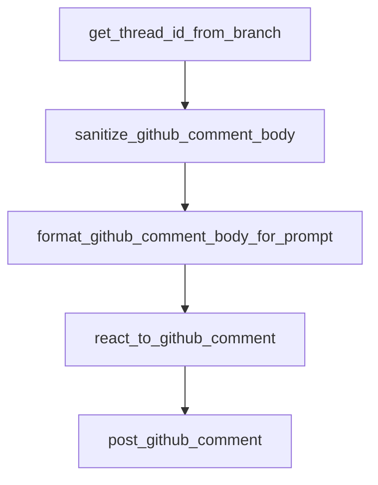

# Chapter 6: Security, Auth, and Operational Constraints

Welcome to **Chapter 6: Security, Auth, and Operational Constraints**. In this part of **Open SWE Tutorial: Asynchronous Cloud Coding Agent Architecture and Migration Playbook**, you will build an intuitive mental model first, then move into concrete implementation details and practical production tradeoffs.


This chapter surfaces the critical security boundaries in Open SWE deployments.

## Learning Goals

- handle GitHub App credentials and webhook secrets safely
- constrain sandbox and API-key exposure
- manage user access restrictions in shared environments
- document secure operational defaults

## Security Priorities

- protect private keys and webhook secrets
- limit repository permissions to required scopes
- enforce authenticated access boundaries per run
- rotate keys and monitor suspicious webhook activity

## Source References

- [Open SWE Setup: Authentication](https://github.com/langchain-ai/open-swe/blob/main/apps/docs/setup/authentication.mdx)
- [Open SWE Setup: Development](https://github.com/langchain-ai/open-swe/blob/main/apps/docs/setup/development.mdx)
- [Open SWE Security Policy](https://github.com/langchain-ai/open-swe/blob/main/SECURITY.md)

## Summary

You now have a practical security model for operating or auditing Open SWE forks.

Next: [Chapter 7: Fork Maintenance and Migration Strategy](07-fork-maintenance-and-migration-strategy.md)

## Source Code Walkthrough

### `agent/utils/github_comments.py`

The `get_thread_id_from_branch` function in [`agent/utils/github_comments.py`](https://github.com/langchain-ai/open-swe/blob/HEAD/agent/utils/github_comments.py) handles a key part of this chapter's functionality:

```py


def get_thread_id_from_branch(branch_name: str) -> str | None:
    match = re.search(
        r"[0-9a-f]{8}-[0-9a-f]{4}-[0-9a-f]{4}-[0-9a-f]{4}-[0-9a-f]{12}",
        branch_name,
        re.IGNORECASE,
    )
    return match.group(0) if match else None


def sanitize_github_comment_body(body: str) -> str:
    """Strip reserved trust wrapper tags from raw GitHub comment bodies."""
    sanitized = body.replace(
        UNTRUSTED_GITHUB_COMMENT_OPEN_TAG,
        _SANITIZED_UNTRUSTED_GITHUB_COMMENT_OPEN_TAG,
    ).replace(
        UNTRUSTED_GITHUB_COMMENT_CLOSE_TAG,
        _SANITIZED_UNTRUSTED_GITHUB_COMMENT_CLOSE_TAG,
    )
    if sanitized != body:
        logger.warning("Sanitized reserved untrusted-comment tags from GitHub comment body")
    return sanitized


def format_github_comment_body_for_prompt(author: str, body: str) -> str:
    """Format a GitHub comment body for prompt inclusion."""
    sanitized_body = sanitize_github_comment_body(body)
    if author in GITHUB_USER_EMAIL_MAP:
        return sanitized_body

    return (
```

This function is important because it defines how Open SWE Tutorial: Asynchronous Cloud Coding Agent Architecture and Migration Playbook implements the patterns covered in this chapter.

### `agent/utils/github_comments.py`

The `sanitize_github_comment_body` function in [`agent/utils/github_comments.py`](https://github.com/langchain-ai/open-swe/blob/HEAD/agent/utils/github_comments.py) handles a key part of this chapter's functionality:

```py


def sanitize_github_comment_body(body: str) -> str:
    """Strip reserved trust wrapper tags from raw GitHub comment bodies."""
    sanitized = body.replace(
        UNTRUSTED_GITHUB_COMMENT_OPEN_TAG,
        _SANITIZED_UNTRUSTED_GITHUB_COMMENT_OPEN_TAG,
    ).replace(
        UNTRUSTED_GITHUB_COMMENT_CLOSE_TAG,
        _SANITIZED_UNTRUSTED_GITHUB_COMMENT_CLOSE_TAG,
    )
    if sanitized != body:
        logger.warning("Sanitized reserved untrusted-comment tags from GitHub comment body")
    return sanitized


def format_github_comment_body_for_prompt(author: str, body: str) -> str:
    """Format a GitHub comment body for prompt inclusion."""
    sanitized_body = sanitize_github_comment_body(body)
    if author in GITHUB_USER_EMAIL_MAP:
        return sanitized_body

    return (
        f"{UNTRUSTED_GITHUB_COMMENT_OPEN_TAG}\n"
        f"{sanitized_body}\n"
        f"{UNTRUSTED_GITHUB_COMMENT_CLOSE_TAG}"
    )


async def react_to_github_comment(
    repo_config: dict[str, str],
    comment_id: int,
```

This function is important because it defines how Open SWE Tutorial: Asynchronous Cloud Coding Agent Architecture and Migration Playbook implements the patterns covered in this chapter.

### `agent/utils/github_comments.py`

The `format_github_comment_body_for_prompt` function in [`agent/utils/github_comments.py`](https://github.com/langchain-ai/open-swe/blob/HEAD/agent/utils/github_comments.py) handles a key part of this chapter's functionality:

```py


def format_github_comment_body_for_prompt(author: str, body: str) -> str:
    """Format a GitHub comment body for prompt inclusion."""
    sanitized_body = sanitize_github_comment_body(body)
    if author in GITHUB_USER_EMAIL_MAP:
        return sanitized_body

    return (
        f"{UNTRUSTED_GITHUB_COMMENT_OPEN_TAG}\n"
        f"{sanitized_body}\n"
        f"{UNTRUSTED_GITHUB_COMMENT_CLOSE_TAG}"
    )


async def react_to_github_comment(
    repo_config: dict[str, str],
    comment_id: int,
    *,
    event_type: str,
    token: str,
    pull_number: int | None = None,
    node_id: str | None = None,
) -> bool:
    if event_type == "pull_request_review":
        return await _react_via_graphql(node_id, token=token)

    owner = repo_config.get("owner", "")
    repo = repo_config.get("name", "")

    url_template = _REACTION_ENDPOINTS.get(event_type, _REACTION_ENDPOINTS["issue_comment"])
    url = url_template.format(
```

This function is important because it defines how Open SWE Tutorial: Asynchronous Cloud Coding Agent Architecture and Migration Playbook implements the patterns covered in this chapter.

### `agent/utils/github_comments.py`

The `react_to_github_comment` function in [`agent/utils/github_comments.py`](https://github.com/langchain-ai/open-swe/blob/HEAD/agent/utils/github_comments.py) handles a key part of this chapter's functionality:

```py


async def react_to_github_comment(
    repo_config: dict[str, str],
    comment_id: int,
    *,
    event_type: str,
    token: str,
    pull_number: int | None = None,
    node_id: str | None = None,
) -> bool:
    if event_type == "pull_request_review":
        return await _react_via_graphql(node_id, token=token)

    owner = repo_config.get("owner", "")
    repo = repo_config.get("name", "")

    url_template = _REACTION_ENDPOINTS.get(event_type, _REACTION_ENDPOINTS["issue_comment"])
    url = url_template.format(
        owner=owner, repo=repo, comment_id=comment_id, pull_number=pull_number
    )

    async with httpx.AsyncClient() as http_client:
        try:
            response = await http_client.post(
                url,
                headers={
                    "Authorization": f"Bearer {token}",
                    "Accept": "application/vnd.github+json",
                    "X-GitHub-Api-Version": "2022-11-28",
                },
                json={"content": "eyes"},
```

This function is important because it defines how Open SWE Tutorial: Asynchronous Cloud Coding Agent Architecture and Migration Playbook implements the patterns covered in this chapter.


## How These Components Connect


