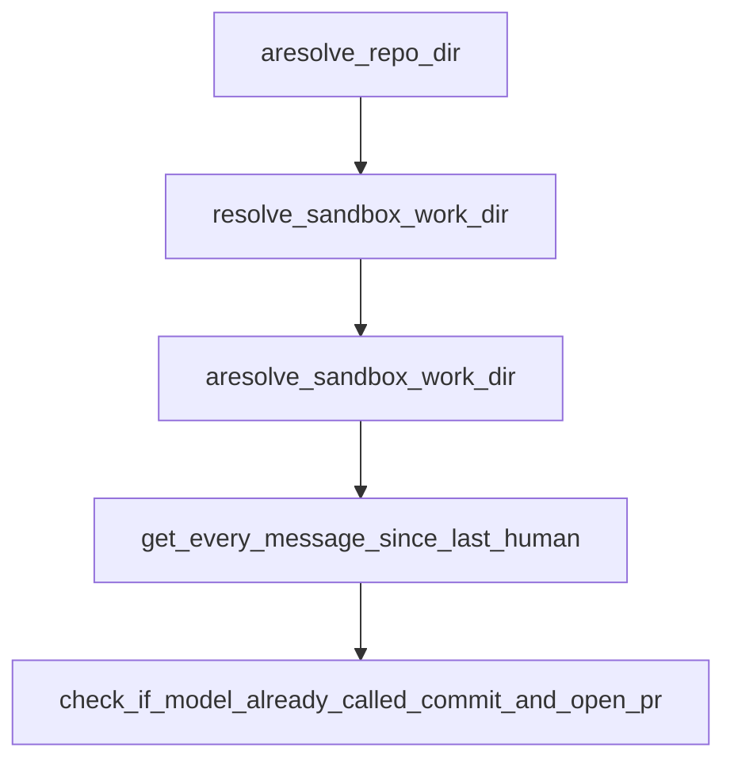

# Chapter 7: Fork Maintenance and Migration Strategy

Welcome to **Chapter 7: Fork Maintenance and Migration Strategy**. In this part of **Open SWE Tutorial: Asynchronous Cloud Coding Agent Architecture and Migration Playbook**, you will build an intuitive mental model first, then move into concrete implementation details and practical production tradeoffs.


This chapter helps teams decide whether to maintain Open SWE forks or migrate away.

## Learning Goals

- evaluate technical debt and ownership costs
- define migration triggers and timeline
- keep legacy systems stable during transition
- choose target platforms for long-term maintainability

## Migration Strategy Template

1. audit critical dependencies and breakpoints
2. freeze risky feature expansion in legacy branch
3. run dual-track pilots on maintained alternatives
4. migrate workloads incrementally with rollback plans

## Source References

- [Open SWE README (Deprecation Notice)](https://github.com/langchain-ai/open-swe/blob/main/README.md)
- [Open SWE Pull Requests](https://github.com/langchain-ai/open-swe/pulls)
- [Open SWE Issues](https://github.com/langchain-ai/open-swe/issues)

## Summary

You now have a migration-first framework for managing deprecated coding-agent infrastructure.

Next: [Chapter 8: Contribution, Legacy Support, and Next Steps](08-contribution-legacy-support-and-next-steps.md)

## Depth Expansion Playbook

## Source Code Walkthrough

### `agent/utils/sandbox_paths.py`

The `aresolve_repo_dir` function in [`agent/utils/sandbox_paths.py`](https://github.com/langchain-ai/open-swe/blob/HEAD/agent/utils/sandbox_paths.py) handles a key part of this chapter's functionality:

```py


async def aresolve_repo_dir(sandbox_backend: SandboxBackendProtocol, repo_name: str) -> str:
    """Async wrapper around resolve_repo_dir for use in event-loop code."""
    return await asyncio.to_thread(resolve_repo_dir, sandbox_backend, repo_name)


def resolve_sandbox_work_dir(sandbox_backend: SandboxBackendProtocol) -> str:
    """Resolve a writable base directory for repository operations."""
    cached_work_dir = getattr(sandbox_backend, _WORK_DIR_CACHE_ATTR, None)
    if isinstance(cached_work_dir, str) and cached_work_dir:
        return cached_work_dir

    checked_candidates: list[str] = []
    for candidate in _iter_work_dir_candidates(sandbox_backend):
        checked_candidates.append(candidate)
        if _is_writable_directory(sandbox_backend, candidate):
            _cache_work_dir(sandbox_backend, candidate)
            return candidate

    msg = "Failed to resolve a writable sandbox work directory"
    if checked_candidates:
        msg = f"{msg}. Candidates checked: {', '.join(checked_candidates)}"
    raise RuntimeError(msg)


async def aresolve_sandbox_work_dir(sandbox_backend: SandboxBackendProtocol) -> str:
    """Async wrapper around resolve_sandbox_work_dir for use in event-loop code."""
    return await asyncio.to_thread(resolve_sandbox_work_dir, sandbox_backend)


def _iter_work_dir_candidates(
```

This function is important because it defines how Open SWE Tutorial: Asynchronous Cloud Coding Agent Architecture and Migration Playbook implements the patterns covered in this chapter.

### `agent/utils/sandbox_paths.py`

The `resolve_sandbox_work_dir` function in [`agent/utils/sandbox_paths.py`](https://github.com/langchain-ai/open-swe/blob/HEAD/agent/utils/sandbox_paths.py) handles a key part of this chapter's functionality:

```py
        raise ValueError("repo_name must be a non-empty string")

    work_dir = resolve_sandbox_work_dir(sandbox_backend)
    return posixpath.join(work_dir, repo_name)


async def aresolve_repo_dir(sandbox_backend: SandboxBackendProtocol, repo_name: str) -> str:
    """Async wrapper around resolve_repo_dir for use in event-loop code."""
    return await asyncio.to_thread(resolve_repo_dir, sandbox_backend, repo_name)


def resolve_sandbox_work_dir(sandbox_backend: SandboxBackendProtocol) -> str:
    """Resolve a writable base directory for repository operations."""
    cached_work_dir = getattr(sandbox_backend, _WORK_DIR_CACHE_ATTR, None)
    if isinstance(cached_work_dir, str) and cached_work_dir:
        return cached_work_dir

    checked_candidates: list[str] = []
    for candidate in _iter_work_dir_candidates(sandbox_backend):
        checked_candidates.append(candidate)
        if _is_writable_directory(sandbox_backend, candidate):
            _cache_work_dir(sandbox_backend, candidate)
            return candidate

    msg = "Failed to resolve a writable sandbox work directory"
    if checked_candidates:
        msg = f"{msg}. Candidates checked: {', '.join(checked_candidates)}"
    raise RuntimeError(msg)


async def aresolve_sandbox_work_dir(sandbox_backend: SandboxBackendProtocol) -> str:
    """Async wrapper around resolve_sandbox_work_dir for use in event-loop code."""
```

This function is important because it defines how Open SWE Tutorial: Asynchronous Cloud Coding Agent Architecture and Migration Playbook implements the patterns covered in this chapter.

### `agent/utils/sandbox_paths.py`

The `aresolve_sandbox_work_dir` function in [`agent/utils/sandbox_paths.py`](https://github.com/langchain-ai/open-swe/blob/HEAD/agent/utils/sandbox_paths.py) handles a key part of this chapter's functionality:

```py


async def aresolve_sandbox_work_dir(sandbox_backend: SandboxBackendProtocol) -> str:
    """Async wrapper around resolve_sandbox_work_dir for use in event-loop code."""
    return await asyncio.to_thread(resolve_sandbox_work_dir, sandbox_backend)


def _iter_work_dir_candidates(
    sandbox_backend: SandboxBackendProtocol,
) -> Iterable[str]:
    seen: set[str] = set()

    for candidate in _iter_provider_paths(sandbox_backend, "get_work_dir"):
        if candidate not in seen:
            seen.add(candidate)
            yield candidate

    shell_work_dir = _resolve_shell_path(sandbox_backend, "pwd")
    if shell_work_dir and shell_work_dir not in seen:
        seen.add(shell_work_dir)
        yield shell_work_dir

    for candidate in _iter_provider_paths(
        sandbox_backend,
        "get_user_home_dir",
        "get_user_root_dir",
    ):
        if candidate not in seen:
            seen.add(candidate)
            yield candidate

    shell_home_dir = _resolve_shell_path(sandbox_backend, "printf '%s' \"$HOME\"")
```

This function is important because it defines how Open SWE Tutorial: Asynchronous Cloud Coding Agent Architecture and Migration Playbook implements the patterns covered in this chapter.

### `agent/middleware/ensure_no_empty_msg.py`

The `get_every_message_since_last_human` function in [`agent/middleware/ensure_no_empty_msg.py`](https://github.com/langchain-ai/open-swe/blob/HEAD/agent/middleware/ensure_no_empty_msg.py) handles a key part of this chapter's functionality:

```py


def get_every_message_since_last_human(state: AgentState) -> list[AnyMessage]:
    messages = state["messages"]
    last_human_idx = -1
    for i in range(len(messages) - 1, -1, -1):
        if messages[i].type == "human":
            last_human_idx = i
            break
    return messages[last_human_idx + 1 :]


def check_if_model_already_called_commit_and_open_pr(messages: list[AnyMessage]) -> bool:
    for msg in messages:
        if msg.type == "tool" and msg.name == "commit_and_open_pr":
            return True
    return False


def check_if_model_messaged_user(messages: list[AnyMessage]) -> bool:
    for msg in messages:
        if msg.type == "tool" and msg.name in [
            "slack_thread_reply",
            "linear_comment",
            "github_comment",
        ]:
            return True
    return False


def check_if_confirming_completion(messages: list[AnyMessage]) -> bool:
    for msg in messages:
```

This function is important because it defines how Open SWE Tutorial: Asynchronous Cloud Coding Agent Architecture and Migration Playbook implements the patterns covered in this chapter.


## How These Components Connect


