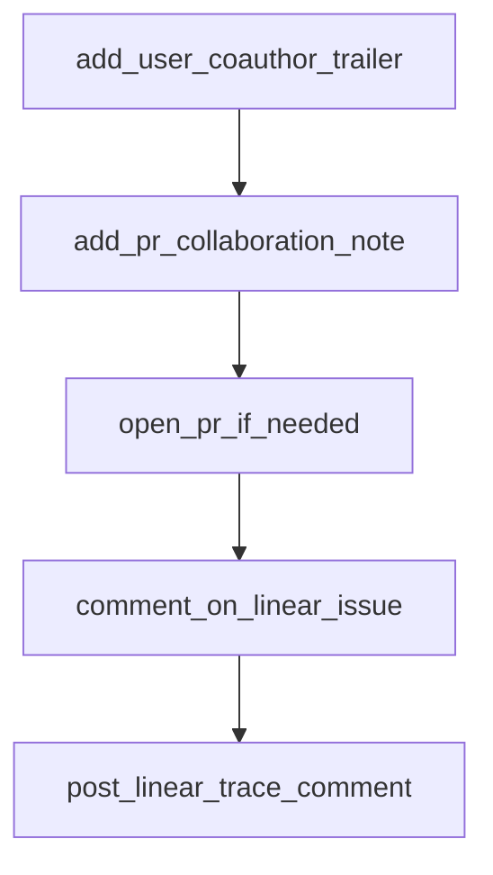

# Chapter 7: Fork Maintenance and Migration Strategy

Welcome to **Chapter 7: Fork Maintenance and Migration Strategy**. In this part of **Open SWE Tutorial: Asynchronous Cloud Coding Agent Architecture and Migration Playbook**, you will build an intuitive mental model first, then move into concrete implementation details and practical production tradeoffs.


This chapter helps teams decide whether to maintain Open SWE forks or migrate away.

## Learning Goals

- evaluate technical debt and ownership costs
- define migration triggers and timeline
- keep legacy systems stable during transition
- choose target platforms for long-term maintainability

## Migration Strategy Template

1. audit critical dependencies and breakpoints
2. freeze risky feature expansion in legacy branch
3. run dual-track pilots on maintained alternatives
4. migrate workloads incrementally with rollback plans

## Source References

- [Open SWE README (Deprecation Notice)](https://github.com/langchain-ai/open-swe/blob/main/README.md)
- [Open SWE Pull Requests](https://github.com/langchain-ai/open-swe/pulls)
- [Open SWE Issues](https://github.com/langchain-ai/open-swe/issues)

## Summary

You now have a migration-first framework for managing deprecated coding-agent infrastructure.

Next: [Chapter 8: Contribution, Legacy Support, and Next Steps](08-contribution-legacy-support-and-next-steps.md)

## Source Code Walkthrough

### `agent/utils/authorship.py`

The `add_user_coauthor_trailer` function in [`agent/utils/authorship.py`](https://github.com/langchain-ai/open-swe/blob/HEAD/agent/utils/authorship.py) handles a key part of this chapter's functionality:

```py


def add_user_coauthor_trailer(
    commit_message: str,
    identity: CollaboratorIdentity | None,
) -> str:
    """Append a Co-authored-by trailer when a user identity is available."""
    normalized_message = commit_message.rstrip()
    if not identity:
        return normalized_message

    trailer = f"Co-authored-by: {identity.commit_name} <{identity.commit_email}>"
    if trailer in normalized_message:
        return normalized_message
    return f"{normalized_message}\n\n{trailer}"


def add_pr_collaboration_note(
    pr_body: str,
    identity: CollaboratorIdentity | None,
) -> str:
    """Append a best-effort PR attribution note.

    GitHub supports commit co-authors, but not PR co-authors. This note makes
    the collaboration explicit in the automatically-opened PR body.
    """

    normalized_body = pr_body.rstrip()
    if not identity:
        return normalized_body

    note = f"_Opened collaboratively by {identity.display_name} and open-swe._"
```

This function is important because it defines how Open SWE Tutorial: Asynchronous Cloud Coding Agent Architecture and Migration Playbook implements the patterns covered in this chapter.

### `agent/utils/authorship.py`

The `add_pr_collaboration_note` function in [`agent/utils/authorship.py`](https://github.com/langchain-ai/open-swe/blob/HEAD/agent/utils/authorship.py) handles a key part of this chapter's functionality:

```py


def add_pr_collaboration_note(
    pr_body: str,
    identity: CollaboratorIdentity | None,
) -> str:
    """Append a best-effort PR attribution note.

    GitHub supports commit co-authors, but not PR co-authors. This note makes
    the collaboration explicit in the automatically-opened PR body.
    """

    normalized_body = pr_body.rstrip()
    if not identity:
        return normalized_body

    note = f"_Opened collaboratively by {identity.display_name} and open-swe._"
    if note in normalized_body:
        return normalized_body
    if not normalized_body:
        return note
    return f"{normalized_body}\n\n{note}"

```

This function is important because it defines how Open SWE Tutorial: Asynchronous Cloud Coding Agent Architecture and Migration Playbook implements the patterns covered in this chapter.

### `agent/middleware/open_pr.py`

The `open_pr_if_needed` function in [`agent/middleware/open_pr.py`](https://github.com/langchain-ai/open-swe/blob/HEAD/agent/middleware/open_pr.py) handles a key part of this chapter's functionality:

```py

@after_agent
async def open_pr_if_needed(
    state: AgentState,
    runtime: Runtime,
) -> dict[str, Any] | None:
    """Middleware that commits/pushes changes after agent runs if `commit_and_open_pr` tool didn't."""
    logger.info("After-agent middleware started")

    try:
        config = get_config()
        configurable = config.get("configurable", {})
        thread_id = configurable.get("thread_id")
        logger.debug("Middleware running for thread %s", thread_id)

        messages = state.get("messages", [])
        pr_payload = _extract_pr_params_from_messages(messages)

        if not pr_payload:
            logger.info("No commit_and_open_pr tool call found, skipping PR creation")
            return None

        if "success" in pr_payload:
            # Tool already handled commit/push/PR creation
            return None

        pr_title = pr_payload.get("title", "feat: Open SWE PR")
        pr_body = pr_payload.get("body", "Automated PR created by Open SWE agent.")
        commit_message = pr_payload.get("commit_message", pr_title)
        github_token = get_github_token()
        user_identity = await asyncio.to_thread(
            resolve_triggering_user_identity, config, github_token
```

This function is important because it defines how Open SWE Tutorial: Asynchronous Cloud Coding Agent Architecture and Migration Playbook implements the patterns covered in this chapter.

### `agent/utils/linear.py`

The `comment_on_linear_issue` function in [`agent/utils/linear.py`](https://github.com/langchain-ai/open-swe/blob/HEAD/agent/utils/linear.py) handles a key part of this chapter's functionality:

```py


async def comment_on_linear_issue(
    issue_id: str, comment_body: str, parent_id: str | None = None
) -> bool:
    """Add a comment to a Linear issue, optionally as a reply to a specific comment."""
    mutation = """
    mutation CommentCreate($issueId: String!, $body: String!, $parentId: String) {
        commentCreate(input: { issueId: $issueId, body: $body, parentId: $parentId }) {
            success
            comment { id }
        }
    }
    """
    result = await _graphql_request(
        mutation,
        {"issueId": issue_id, "body": comment_body, "parentId": parent_id},
    )
    return bool(result.get("commentCreate", {}).get("success"))


async def post_linear_trace_comment(issue_id: str, run_id: str, triggering_comment_id: str) -> None:
    """Post a trace URL comment on a Linear issue."""
    trace_url = get_langsmith_trace_url(run_id)
    if trace_url:
        await comment_on_linear_issue(
            issue_id,
            f"On it! [View trace]({trace_url})",
            parent_id=triggering_comment_id or None,
        )


```

This function is important because it defines how Open SWE Tutorial: Asynchronous Cloud Coding Agent Architecture and Migration Playbook implements the patterns covered in this chapter.


## How These Components Connect


