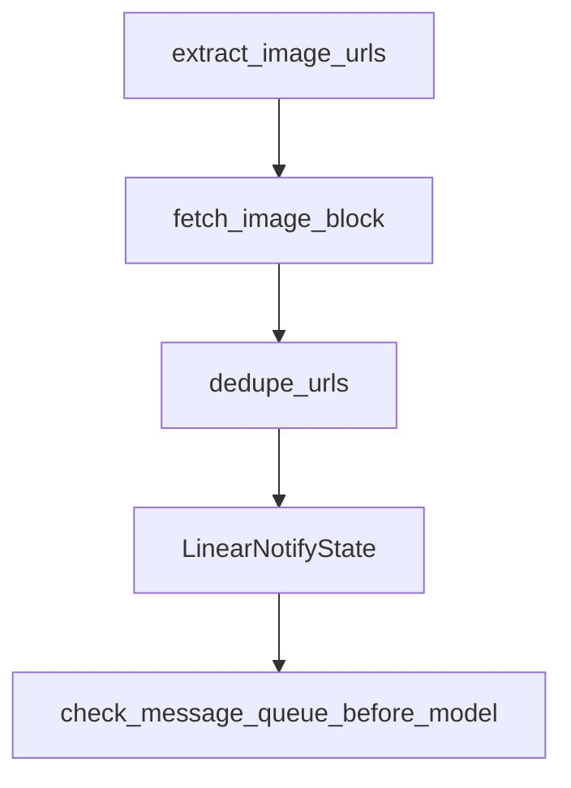

# Chapter 8: Contribution, Legacy Support, and Next Steps

Welcome to **Chapter 8: Contribution, Legacy Support, and Next Steps**. In this part of **Open SWE Tutorial: Asynchronous Cloud Coding Agent Architecture and Migration Playbook**, you will build an intuitive mental model first, then move into concrete implementation details and practical production tradeoffs.


This chapter wraps with practical guidance for legacy stewardship and transition planning.

## Learning Goals

- contribute responsibly to a deprecated repository
- focus on docs, security, and critical-fix priorities
- preserve institutional knowledge during migration
- keep internal runbooks current and actionable

## Legacy Support Priorities

- prioritize security and operational stability fixes
- avoid broad architectural rewrites without ownership commitment
- document migration assumptions and owner responsibilities
- keep fork-specific changes isolated and auditable

## Source References

- [Open SWE AGENTS Guidelines](https://github.com/langchain-ai/open-swe/blob/main/AGENTS.md)
- [Open SWE Docs Tree](https://github.com/langchain-ai/open-swe/tree/main/apps/docs)
- [Open SWE Announcement Context](https://blog.langchain.com/introducing-open-swe-an-open-source-asynchronous-coding-agent/)

## Summary

You now have a complete Open SWE playbook for architecture study, legacy operations, and staged migration.

Next tutorial: [SWE-agent Tutorial](../swe-agent-tutorial/)

## Source Code Walkthrough

### `agent/utils/multimodal.py`

The `extract_image_urls` function in [`agent/utils/multimodal.py`](https://github.com/langchain-ai/open-swe/blob/HEAD/agent/utils/multimodal.py) handles a key part of this chapter's functionality:

```py


def extract_image_urls(text: str) -> list[str]:
    """Extract image URLs from markdown image syntax and direct image links."""
    if not text:
        return []

    urls: list[str] = []
    urls.extend(IMAGE_MARKDOWN_RE.findall(text))
    urls.extend(IMAGE_URL_RE.findall(text))

    deduped = dedupe_urls(urls)
    if deduped:
        logger.debug("Extracted %d image URL(s)", len(deduped))
    return deduped


async def fetch_image_block(
    image_url: str,
    client: httpx.AsyncClient,
) -> dict[str, Any] | None:
    """Fetch image bytes and build an image content block."""
    try:
        logger.debug("Fetching image from %s", image_url)
        headers = None
        host = (urlparse(image_url).hostname or "").lower()
        if host == "uploads.linear.app" or host.endswith(".uploads.linear.app"):
            linear_api_key = os.environ.get("LINEAR_API_KEY", "")
            if linear_api_key:
                headers = {"Authorization": linear_api_key}
            else:
                logger.warning(
```

This function is important because it defines how Open SWE Tutorial: Asynchronous Cloud Coding Agent Architecture and Migration Playbook implements the patterns covered in this chapter.

### `agent/utils/multimodal.py`

The `fetch_image_block` function in [`agent/utils/multimodal.py`](https://github.com/langchain-ai/open-swe/blob/HEAD/agent/utils/multimodal.py) handles a key part of this chapter's functionality:

```py


async def fetch_image_block(
    image_url: str,
    client: httpx.AsyncClient,
) -> dict[str, Any] | None:
    """Fetch image bytes and build an image content block."""
    try:
        logger.debug("Fetching image from %s", image_url)
        headers = None
        host = (urlparse(image_url).hostname or "").lower()
        if host == "uploads.linear.app" or host.endswith(".uploads.linear.app"):
            linear_api_key = os.environ.get("LINEAR_API_KEY", "")
            if linear_api_key:
                headers = {"Authorization": linear_api_key}
            else:
                logger.warning(
                    "LINEAR_API_KEY not set; cannot authenticate image fetch for %s",
                    image_url,
                )
        elif host == "files.slack.com" or host.endswith(".files.slack.com"):
            slack_bot_token = os.environ.get("SLACK_BOT_TOKEN", "")
            if slack_bot_token:
                headers = {"Authorization": f"Bearer {slack_bot_token}"}
            else:
                logger.warning(
                    "SLACK_BOT_TOKEN not set; cannot authenticate image fetch for %s",
                    image_url,
                )
        response = await client.get(image_url, headers=headers, follow_redirects=True)
        response.raise_for_status()
        content_type = response.headers.get("Content-Type", "").split(";")[0].strip()
```

This function is important because it defines how Open SWE Tutorial: Asynchronous Cloud Coding Agent Architecture and Migration Playbook implements the patterns covered in this chapter.

### `agent/utils/multimodal.py`

The `dedupe_urls` function in [`agent/utils/multimodal.py`](https://github.com/langchain-ai/open-swe/blob/HEAD/agent/utils/multimodal.py) handles a key part of this chapter's functionality:

```py
    urls.extend(IMAGE_URL_RE.findall(text))

    deduped = dedupe_urls(urls)
    if deduped:
        logger.debug("Extracted %d image URL(s)", len(deduped))
    return deduped


async def fetch_image_block(
    image_url: str,
    client: httpx.AsyncClient,
) -> dict[str, Any] | None:
    """Fetch image bytes and build an image content block."""
    try:
        logger.debug("Fetching image from %s", image_url)
        headers = None
        host = (urlparse(image_url).hostname or "").lower()
        if host == "uploads.linear.app" or host.endswith(".uploads.linear.app"):
            linear_api_key = os.environ.get("LINEAR_API_KEY", "")
            if linear_api_key:
                headers = {"Authorization": linear_api_key}
            else:
                logger.warning(
                    "LINEAR_API_KEY not set; cannot authenticate image fetch for %s",
                    image_url,
                )
        elif host == "files.slack.com" or host.endswith(".files.slack.com"):
            slack_bot_token = os.environ.get("SLACK_BOT_TOKEN", "")
            if slack_bot_token:
                headers = {"Authorization": f"Bearer {slack_bot_token}"}
            else:
                logger.warning(
```

This function is important because it defines how Open SWE Tutorial: Asynchronous Cloud Coding Agent Architecture and Migration Playbook implements the patterns covered in this chapter.

### `agent/middleware/check_message_queue.py`

The `LinearNotifyState` class in [`agent/middleware/check_message_queue.py`](https://github.com/langchain-ai/open-swe/blob/HEAD/agent/middleware/check_message_queue.py) handles a key part of this chapter's functionality:

```py


class LinearNotifyState(AgentState):
    """Extended agent state for tracking Linear notifications."""

    linear_messages_sent_count: int


async def _build_blocks_from_payload(
    payload: dict[str, Any],
) -> list[dict[str, Any]]:
    text = payload.get("text", "")
    image_urls = payload.get("image_urls", []) or []
    blocks: list[dict[str, Any]] = []
    if text:
        blocks.append({"type": "text", "text": text})

    if not image_urls:
        return blocks
    async with httpx.AsyncClient() as client:
        for image_url in image_urls:
            image_block = await fetch_image_block(image_url, client)
            if image_block:
                blocks.append(image_block)
    return blocks


@before_model(state_schema=LinearNotifyState)
async def check_message_queue_before_model(  # noqa: PLR0911
    state: LinearNotifyState,  # noqa: ARG001
    runtime: Runtime,  # noqa: ARG001
) -> dict[str, Any] | None:
```

This class is important because it defines how Open SWE Tutorial: Asynchronous Cloud Coding Agent Architecture and Migration Playbook implements the patterns covered in this chapter.


## How These Components Connect


