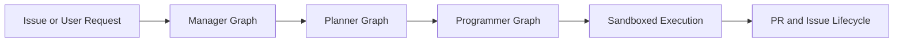

# Open SWE Tutorial: Asynchronous Cloud Coding Agent Architecture and Migration Playbook

> Learn from `langchain-ai/open-swe` architecture, workflows, and operational patterns, including how to maintain or migrate from a deprecated codebase.

## Why This Track Matters

Open SWE is deprecated, but its design remains instructive for asynchronous coding-agent systems that integrate planning, execution, and GitHub-driven workflows.

This track focuses on:

- understanding the LangGraph-based multi-agent architecture
- learning robust development and webhook integration patterns
- identifying operational risks in deprecated systems
- planning migration paths to actively maintained alternatives

## Current Snapshot (auto-updated)

- repository: [`langchain-ai/open-swe`](https://github.com/langchain-ai/open-swe)
- stars: about **5.3k**
- latest release: **none tagged** (rolling `main`)
- recent activity: updates on **February 12, 2026**
- maintenance status: repository README marks project as **deprecated**
- project positioning: reference architecture for asynchronous coding-agent workflows

## Mental Model

## Chapter Guide

| Chapter | Key Question | Outcome |
|:--------|:-------------|:--------|
| [01 - Getting Started and Project Status](01-getting-started-and-project-status.md) | How do I evaluate Open SWE today given deprecation? | Safe starting baseline |
| [02 - LangGraph Architecture and Agent Graphs](02-langgraph-architecture-and-agent-graphs.md) | How is Open SWE structured internally? | Architecture understanding |
| [03 - Development Environment and Monorepo Setup](03-development-environment-and-monorepo-setup.md) | How do I run Open SWE locally for analysis or maintenance? | Local dev readiness |
| [04 - Usage Patterns: UI and GitHub Workflows](04-usage-patterns-ui-and-github-workflows.md) | How do users trigger and manage tasks? | Workflow clarity |
| [05 - Planning Control and Human-in-the-Loop](05-planning-control-and-human-in-the-loop.md) | How do plan approval controls and labels affect behavior? | Better execution governance |
| [06 - Security, Auth, and Operational Constraints](06-security-auth-and-operational-constraints.md) | What security controls are critical in this architecture? | Safer operations |
| [07 - Fork Maintenance and Migration Strategy](07-fork-maintenance-and-migration-strategy.md) | How do teams maintain or migrate a deprecated platform? | Migration plan |
| [08 - Contribution, Legacy Support, and Next Steps](08-contribution-legacy-support-and-next-steps.md) | How should teams handle legacy support and docs hygiene? | Sustainable transition model |

## What You Will Learn

- how Open SWE's manager/planner/programmer graph pattern works
- how webhook and label-driven workflows coordinate asynchronous coding tasks
- how to evaluate the risk profile of deprecated but useful codebases
- how to design a staged migration to maintained alternatives

## Source References

- [Open SWE Repository](https://github.com/langchain-ai/open-swe)
- [Open SWE README](https://github.com/langchain-ai/open-swe/blob/main/README.md)
- [Open SWE Docs Directory](https://github.com/langchain-ai/open-swe/tree/main/apps/docs)
- [Open SWE AGENTS Context](https://github.com/langchain-ai/open-swe/blob/main/AGENTS.md)
- [Open SWE Announcement Blog](https://blog.langchain.com/introducing-open-swe-an-open-source-asynchronous-coding-agent/)

## Related Tutorials

- [SWE-agent Tutorial](../swe-agent-tutorial/)
- [LangGraph Tutorial](../langgraph-tutorial/)
- [OpenHands Tutorial](../openhands-tutorial/)
- [Mastra Tutorial](../mastra-tutorial/)

---

Start with [Chapter 1: Getting Started and Project Status](01-getting-started-and-project-status.md).

## Navigation & Backlinks

- [Start Here: Chapter 1: Getting Started and Project Status](01-getting-started-and-project-status.md)
- [Back to Main Catalog](../../README.md#-tutorial-catalog)
- [Browse A-Z Tutorial Directory](../../discoverability/tutorial-directory.md)
- [Search by Intent](../../discoverability/query-hub.md)
- [Explore Category Hubs](../../README.md#category-hubs)

## Full Chapter Map

1. [Chapter 1: Getting Started and Project Status](01-getting-started-and-project-status.md)
2. [Chapter 2: LangGraph Architecture and Agent Graphs](02-langgraph-architecture-and-agent-graphs.md)
3. [Chapter 3: Development Environment and Monorepo Setup](03-development-environment-and-monorepo-setup.md)
4. [Chapter 4: Usage Patterns: UI and GitHub Workflows](04-usage-patterns-ui-and-github-workflows.md)
5. [Chapter 5: Planning Control and Human-in-the-Loop](05-planning-control-and-human-in-the-loop.md)
6. [Chapter 6: Security, Auth, and Operational Constraints](06-security-auth-and-operational-constraints.md)
7. [Chapter 7: Fork Maintenance and Migration Strategy](07-fork-maintenance-and-migration-strategy.md)
8. [Chapter 8: Contribution, Legacy Support, and Next Steps](08-contribution-legacy-support-and-next-steps.md)

*Generated by [AI Codebase Knowledge Builder](https://github.com/The-Pocket/Tutorial-Codebase-Knowledge)*
