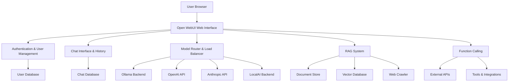

# Open WebUI Tutorial: Self-Hosted ChatGPT Alternative

> This tutorial is AI-generated! To learn more, check out [Awesome Code Docs](https://github.com/johnxie/awesome-code-docs)

Open WebUI[View Repo](https://github.com/open-webui/open-webui) is a powerful, self-hosted web interface for Large Language Models. It provides a ChatGPT-like experience while giving you full control over your data and models.

## Tutorial Chapters

1. **[Chapter 1: Getting Started](01-getting-started.md)** - Installation and basic setup
2. **[Chapter 2: Model Management](02-model-management.md)** - Connecting and managing LLM backends
3. **[Chapter 3: Interface Customization](03-interface-customization.md)** - Theming and personalization
4. **[Chapter 4: Advanced Chat Features](04-advanced-chat-features.md)** - Multi-modal conversations and tools
5. **[Chapter 5: Data & Knowledge](05-data-knowledge.md)** - RAG, document upload, and knowledge bases
6. **[Chapter 6: User Management](06-user-management.md)** - Multi-user setup and permissions
7. **[Chapter 7: Integrations](07-integrations.md)** - API connections and external services
8. **[Chapter 8: Production Deployment](08-production-deployment.md)** - Scaling and enterprise features

## What You'll Learn

- **Self-Hosted AI Chat**: Run your own ChatGPT alternative
- **Multi-Model Support**: Connect to Ollama, OpenAI, Anthropic, and more
- **RAG Implementation**: Build knowledge bases with document ingestion
- **User Management**: Multi-tenant setup with role-based access
- **Advanced Features**: Voice input, image generation, function calling
- **Production Ready**: Docker deployment, monitoring, and scaling

## Learning Objectives

By the end of this tutorial, you'll be able to:
- Deploy Open WebUI on various platforms
- Configure multiple LLM backends
- Create custom chat interfaces and themes
- Implement RAG with document collections
- Set up multi-user environments
- Integrate with external APIs and services
- Deploy production-ready instances

## Key Features Covered

**🚀 Core Capabilities:**
- ⚡ **Multi-Model Support**: Ollama, OpenAI, Anthropic, Google, LocalAI
- 🎨 **Fully Customizable**: Themes, prompts, and interface personalization
- 📚 **RAG & Knowledge**: Document upload, web crawling, knowledge bases
- 👥 **Multi-User**: Role-based access, user management, shared chats
- 🔧 **API Integration**: Function calling, tools, and external services
- 🐳 **Easy Deployment**: Docker, Kubernetes, cloud platforms

**🔒 Privacy & Security:**
- 🔐 **Self-Hosted**: Your data stays on your infrastructure
- 👤 **User Isolation**: Separate user contexts and permissions
- 📊 **Audit Logging**: Track usage and access patterns
- 🔑 **API Security**: Secure API key management

## Prerequisites

- Basic Docker knowledge
- Understanding of LLM concepts
- Access to LLM APIs or local models
- Basic Linux/Unix command line skills

## Architecture Overview

Open WebUI serves as a comprehensive web interface that connects users to multiple LLM backends while providing advanced features like RAG, multi-user support, and extensive customization options.

## Getting Started

Ready to start your self-hosted AI chat journey? Let's begin with [Chapter 1: Getting Started](01-getting-started.md)!