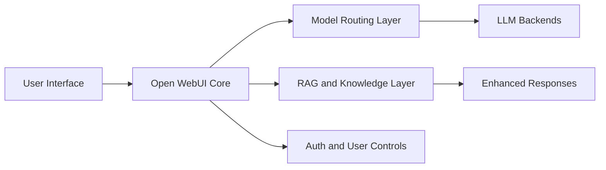

# Open WebUI Tutorial: Self-Hosted AI Workspace and Chat Interface

> Learn how to run and operate `open-webui/open-webui` as a self-hosted AI interface with model routing, RAG workflows, multi-user controls, and production deployment patterns.

## Why This Track Matters

Open WebUI is one of the largest self-hosted AI interface projects and commonly sits between users and multiple model backends.

This track focuses on:

- deploying a reliable self-hosted AI interface
- connecting and managing multiple model providers
- implementing knowledge and RAG workflows
- operating secure multi-user environments in production

## Current Snapshot (Verified February 11, 2026)

- repository: [`open-webui/open-webui`](https://github.com/open-webui/open-webui)
- stars: about **123.6k**
- latest release: [`v0.7.2`](https://github.com/open-webui/open-webui/releases/tag/v0.7.2)
- development activity: active with frequent updates
- project scope: user-friendly web interface supporting Ollama, OpenAI-compatible APIs, and additional backends

## Mental Model

## Chapter Guide

| Chapter | Key Question | Outcome |
|:--------|:-------------|:--------|
| [01 - Getting Started](01-getting-started.md) | How do I install and run Open WebUI quickly? | Working local or container baseline |
| [02 - Model Management](02-model-management.md) | How do I connect and manage backend models? | Stable model routing setup |
| [03 - Interface Customization](03-interface-customization.md) | How do I tailor UX for teams or products? | Custom UI and prompt surfaces |
| [04 - Advanced Chat Features](04-advanced-chat-features.md) | How do advanced chat/tool features work? | More capable interaction workflows |
| [05 - Data and Knowledge](05-data-knowledge.md) | How do I implement RAG and document ingestion? | Knowledge-aware chat experiences |
| [06 - User Management](06-user-management.md) | How do I run multi-user securely? | Role and access governance |
| [07 - Integrations](07-integrations.md) | How do I integrate external services and APIs? | Broader platform connectivity |
| [08 - Production Deployment](08-production-deployment.md) | How do I deploy and operate at scale? | Production operations baseline |

## What You Will Learn

- how to deploy and manage Open WebUI in self-hosted environments
- how to connect multiple LLM backends and route requests effectively
- how to add RAG and knowledge workflows
- how to run secure multi-user AI interfaces in production

## Source References

- [Open WebUI Repository](https://github.com/open-webui/open-webui)
- [Open WebUI Releases](https://github.com/open-webui/open-webui/releases)
- [Open WebUI Docs](https://docs.openwebui.com/)

## Related Tutorials

- [Ollama Tutorial](../ollama-tutorial/)
- [LiteLLM Tutorial](../litellm-tutorial/)
- [Langfuse Tutorial](../langfuse-tutorial/)
- [OpenHands Tutorial](../openhands-tutorial/)

---

Start with [Chapter 1: Getting Started](01-getting-started.md).
