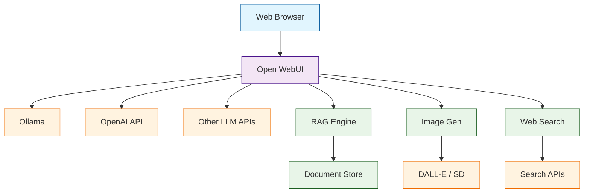

# Open WebUI Tutorial: Self-Hosted ChatGPT Alternative

> Run a feature-rich AI chat interface for Ollama and OpenAI-compatible APIs.

<div align="center">

**🌐 The Best Open-Source Chat UI for LLMs**

[](https://github.com/open-webui/open-webui)

</div>

---

## 🎯 What is Open WebUI?

**Open WebUI**<sup>[View Repo](https://github.com/open-webui/open-webui)</sup> (formerly Ollama WebUI) is a self-hosted, feature-packed web interface for interacting with LLMs. It works seamlessly with Ollama for local models and supports any OpenAI-compatible API.

### Key Features

| Feature | Description |
|:--------|:------------|
| **Beautiful UI** | Modern, responsive ChatGPT-like interface |
| **Multi-Model** | Switch between Ollama, OpenAI, and other providers |
| **RAG Support** | Upload documents for retrieval-augmented generation |
| **Voice I/O** | Speech-to-text and text-to-speech |
| **Image Generation** | Integrate with DALL-E, Stable Diffusion |
| **Multi-User** | User management with roles and permissions |
| **Model Builder** | Create custom models with Modelfiles |
| **Web Search** | Integrate real-time web results |



## Tutorial Chapters

1. **[Chapter 1: Getting Started](01-getting-started.md)** - Installation with Docker and first setup
2. **[Chapter 2: Model Configuration](02-models.md)** - Adding Ollama, OpenAI, and other models
3. **[Chapter 3: Chat Features](03-chat.md)** - Conversations, history, and export
4. **[Chapter 4: RAG & Documents](04-rag.md)** - Document upload and retrieval
5. **[Chapter 5: Voice & Image](05-multimedia.md)** - Speech and image generation
6. **[Chapter 6: User Management](06-users.md)** - Multi-user setup and permissions
7. **[Chapter 7: Customization](07-customization.md)** - Themes, models, and extensions
8. **[Chapter 8: Production Deployment](08-production.md)** - Scaling and security

## What You'll Learn

- **Deploy Open WebUI** with Docker in minutes
- **Connect Multiple LLM Providers** seamlessly
- **Enable RAG** for document-based conversations
- **Configure Voice** input and output
- **Manage Multiple Users** with proper access control
- **Customize the Interface** for your needs
- **Scale for Production** with proper architecture

## Prerequisites

- Docker and Docker Compose
- Ollama installed (for local models)
- API keys for cloud providers (optional)
- Basic command line knowledge

## Quick Start

### With Ollama (Local Models)

```bash
# Make sure Ollama is running
ollama serve

# Run Open WebUI
docker run -d -p 3000:8080 \
  --add-host=host.docker.internal:host-gateway \
  -v open-webui:/app/backend/data \
  --name open-webui \
  ghcr.io/open-webui/open-webui:main

# Open http://localhost:3000
```

### With Docker Compose

```yaml
# docker-compose.yml
version: '3.8'
services:
  ollama:
    image: ollama/ollama:latest
    container_name: ollama
    volumes:
      - ollama:/root/.ollama
    ports:
      - "11434:11434"

  open-webui:
    image: ghcr.io/open-webui/open-webui:main
    container_name: open-webui
    volumes:
      - open-webui:/app/backend/data
    ports:
      - "3000:8080"
    environment:
      - OLLAMA_BASE_URL=http://ollama:11434
    depends_on:
      - ollama

volumes:
  ollama:
  open-webui:
```

```bash
docker compose up -d
```

### OpenAI-Only Setup

```bash
docker run -d -p 3000:8080 \
  -e OPENAI_API_KEY="sk-..." \
  -v open-webui:/app/backend/data \
  --name open-webui \
  ghcr.io/open-webui/open-webui:main
```

## First-Time Setup

1. **Navigate** to `http://localhost:3000`
2. **Create Admin Account** - First user becomes admin
3. **Configure Models** - Add Ollama or OpenAI models
4. **Start Chatting** - Select a model and go!

## Connecting Models

### Ollama Models
```bash
# Pull models in Ollama
ollama pull llama3.1
ollama pull codellama
ollama pull mistral

# Models appear automatically in Open WebUI
```

### OpenAI API
1. Go to **Settings → Connections**
2. Add OpenAI API key
3. Models like GPT-4o become available

### Custom OpenAI-Compatible APIs
```bash
# Environment variable for custom endpoint
-e OPENAI_API_BASE_URL="https://api.groq.com/openai/v1"
-e OPENAI_API_KEY="your-groq-key"
```

## RAG: Document Chat

Upload documents and chat with them:

1. Click the **📎** icon in chat
2. **Upload** PDF, TXT, MD, or other documents
3. Documents are **chunked and embedded**
4. Ask questions about your documents

```bash
# Enable document processing
-e ENABLE_RAG_WEB_LOADER=true
-e ENABLE_RAG_LOCAL_WEB_FETCH=true
```

## Environment Variables

| Variable | Description | Default |
|:---------|:------------|:--------|
| `OLLAMA_BASE_URL` | Ollama API endpoint | `http://localhost:11434` |
| `OPENAI_API_KEY` | OpenAI API key | - |
| `WEBUI_AUTH` | Enable authentication | `true` |
| `ENABLE_SIGNUP` | Allow new registrations | `true` |
| `DEFAULT_USER_ROLE` | Role for new users | `pending` |
| `ENABLE_RAG_WEB_LOADER` | Enable web document loading | `false` |

## User Roles

| Role | Capabilities |
|:-----|:-------------|
| **Admin** | Full access, user management, settings |
| **User** | Chat, document upload, model selection |
| **Pending** | Awaiting admin approval |

## Customization

### Custom System Prompts
Create persistent system prompts for specific use cases:
- Go to **Workspace → Prompts**
- Create named prompts with variables
- Use them across conversations

### Model Presets
Configure model parameters:
- Temperature, top-p, top-k
- Max tokens, repeat penalty
- System prompts per model

## Learning Path

### 🟢 Beginner Track
1. Chapters 1-3: Setup and basic chat
2. Run Open WebUI with local models

### 🟡 Intermediate Track
1. Chapters 4-6: RAG, multimedia, and users
2. Build a team AI chat platform

### 🔴 Advanced Track
1. Chapters 7-8: Customization and production
2. Deploy enterprise AI chat infrastructure

---

**Ready to run your own AI chat interface? Let's begin with [Chapter 1: Getting Started](01-getting-started.md)!**

*Generated for [Awesome Code Docs](https://github.com/johnxie/awesome-code-docs)*
