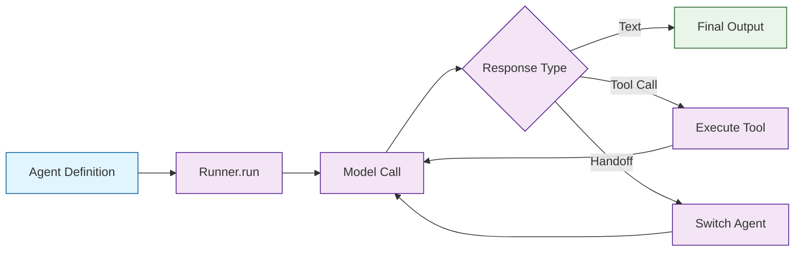

# Chapter 1: Getting Started with OpenAI Agents SDK

Welcome to the OpenAI Agents SDK! If you want to build multi-agent systems that can hand off work between specialized agents, call tools, and enforce safety guardrails — all backed by the OpenAI API — this is your starting point. The Agents SDK is OpenAI's production successor to Swarm, bringing a clean, declarative API to multi-agent orchestration.

## What Makes the Agents SDK Special?

The OpenAI Agents SDK is built around a few core principles:

- **Minimal abstractions** — Agents, handoffs, guardrails, and tracing are the only primitives you need
- **Pythonic and declarative** — Define agents as data; the framework handles the agentic loop
- **Built-in safety** — Guardrails are first-class, not bolted on after the fact
- **Production tracing** — Every agent run is traced and visible in the OpenAI dashboard
- **Seamless handoffs** — Agents can delegate to other agents natively, carrying context forward

## Installing the SDK

### Basic Installation

```bash
# Install the OpenAI Agents SDK
pip install openai-agents

# Optional: Install with voice/realtime support
pip install 'openai-agents[voice]'

# For development
pip install 'openai-agents[dev]'
```

### Environment Setup

```bash
# Create a virtual environment
python -m venv agents-env
source agents-env/bin/activate  # On Windows: agents-env\Scripts\activate

# Install the SDK
pip install openai-agents
```

### API Key Configuration

```bash
# Set your OpenAI API key
export OPENAI_API_KEY="sk-your-key-here"
```

Or programmatically:

```python
import os
os.environ["OPENAI_API_KEY"] = "sk-your-key-here"
```

## Your First Agent

### The Simplest Possible Agent

```python
from agents import Agent, Runner
import asyncio

# Define an agent
agent = Agent(
    name="Greeter",
    instructions="You are a helpful assistant. Greet the user warmly and answer their questions concisely.",
)

# Run the agent
result = asyncio.run(Runner.run(agent, input="Hello! What can you do?"))
print(result.final_output)
```

That is the entire program. The `Agent` defines *what* the agent is; the `Runner` handles the agentic loop — calling the model, executing tools, following handoffs, and checking guardrails.

### Understanding the Core Components



### The Agent Primitive

```python
from agents import Agent

agent = Agent(
    name="Research Assistant",           # Display name for tracing
    instructions="You are a research assistant. Provide detailed, sourced answers.",
    model="gpt-4o",                      # Model to use (default: gpt-4o)
    tools=[],                            # List of tools (covered in Chapter 3)
    handoffs=[],                         # List of handoff targets (Chapter 4)
    input_guardrails=[],                 # Input validators (Chapter 5)
    output_guardrails=[],                # Output validators (Chapter 5)
)
```

### The Runner

The `Runner` is the orchestration engine. It takes an agent and input, then runs the agentic loop until the agent produces a final text output (or a handoff, or a guardrail trips).

```python
from agents import Agent, Runner
import asyncio

agent = Agent(name="Helper", instructions="Answer questions helpfully.")

# Async run (recommended)
async def main():
    result = await Runner.run(agent, input="What is the capital of France?")
    print(result.final_output)

asyncio.run(main())
```

Three ways to run:

```python
# 1. Async (recommended for production)
result = await Runner.run(agent, input="Hello")

# 2. Sync wrapper (convenience for scripts)
result = Runner.run_sync(agent, input="Hello")

# 3. Streaming (for real-time UIs — see Chapter 6)
async for event in Runner.run_streamed(agent, input="Hello"):
    print(event)
```

## Building a Practical Agent

Let's build a more useful agent — a writing assistant with a system prompt:

```python
from agents import Agent, Runner

writing_agent = Agent(
    name="Writing Coach",
    instructions="""You are an expert writing coach. When the user shares text:
1. Identify the strengths of the writing
2. Suggest 2-3 specific improvements
3. Provide a revised version if requested

Be encouraging but honest. Focus on clarity and impact.""",
    model="gpt-4o",
)

async def review_writing():
    result = await Runner.run(
        writing_agent,
        input="Review this: The project was done by the team and it was good.",
    )
    print(result.final_output)

import asyncio
asyncio.run(review_writing())
```

## Understanding the RunResult

Every call to `Runner.run` returns a `RunResult` with rich metadata:

```python
from agents import Agent, Runner
import asyncio

agent = Agent(name="Helper", instructions="Be helpful.")

async def inspect_result():
    result = await Runner.run(agent, input="Tell me a fun fact.")

    # The final text output
    print("Output:", result.final_output)

    # The agent that produced the final output (may differ from starting agent after handoffs)
    print("Final agent:", result.last_agent.name)

    # Full list of items generated during the run
    print("Items generated:", len(result.new_items))

    # Input and output guardrail results
    print("Input guardrails:", result.input_guardrail_results)
    print("Output guardrails:", result.output_guardrail_results)

asyncio.run(inspect_result())
```

## Conversation History and Multi-Turn

Agents support multi-turn conversations by passing previous items back:

```python
from agents import Agent, Runner
import asyncio

agent = Agent(name="Tutor", instructions="You are a patient math tutor.")

async def multi_turn():
    # First turn
    result = await Runner.run(agent, input="What is a derivative?")
    print("Turn 1:", result.final_output)

    # Second turn — pass conversation history
    result = await Runner.run(
        agent,
        input="Can you give me a simple example?",
        context=result.to_input_list(),
    )
    print("Turn 2:", result.final_output)

asyncio.run(multi_turn())
```

The `result.to_input_list()` method converts the run's output into a format that can be passed as conversation context to the next turn.

## Configuration Options

### Model Selection

```python
# Use different models
agent_fast = Agent(name="Fast", instructions="Be concise.", model="gpt-4o-mini")
agent_smart = Agent(name="Smart", instructions="Be thorough.", model="gpt-4o")
agent_flagship = Agent(name="Flagship", instructions="Reason deeply.", model="o3-mini")
```

### Temperature and Model Settings

```python
from agents import Agent, ModelSettings

agent = Agent(
    name="Creative Writer",
    instructions="Write creative fiction.",
    model_settings=ModelSettings(
        temperature=0.9,
        top_p=0.95,
        max_tokens=2000,
    ),
)
```

## Error Handling

```python
from agents import Agent, Runner
from agents.exceptions import AgentsException, MaxTurnsExceeded
import asyncio

agent = Agent(name="Helper", instructions="Be helpful.")

async def safe_run():
    try:
        result = await Runner.run(
            agent,
            input="Hello",
            max_turns=5,  # Limit the number of agentic loop iterations
        )
        print(result.final_output)
    except MaxTurnsExceeded:
        print("Agent exceeded maximum turns — possible infinite loop")
    except AgentsException as e:
        print(f"Agent error: {e}")

asyncio.run(safe_run())
```

## Project Structure Recommendation

```
my-agents-project/
├── agents/
│   ├── __init__.py
│   ├── researcher.py      # Research agent definition
│   ├── writer.py           # Writing agent definition
│   └── reviewer.py         # Review agent definition
├── tools/
│   ├── __init__.py
│   └── search.py           # Custom tool definitions
├── guardrails/
│   ├── __init__.py
│   └── content_filter.py   # Guardrail definitions
├── main.py                 # Entry point
├── requirements.txt
└── .env                    # API keys (never commit!)
```

## What We've Accomplished

- Installed the OpenAI Agents SDK and configured API access
- Created a minimal agent and understood the Agent/Runner split
- Explored the RunResult object and its metadata
- Built multi-turn conversations with context passing
- Configured model selection, temperature, and token limits
- Implemented basic error handling with max_turns guards

## Next Steps

Now that you have agents running, it's time to understand the Agent primitive in depth. In [Chapter 2: Agent Architecture](02-agent-architecture.md), we'll explore how agents are structured internally, how instructions shape behavior, and how the agentic loop works under the hood.

---

## Source Walkthrough

Use the following upstream sources to verify implementation details:

- [View Repo](https://github.com/openai/openai-agents-python)
- [`src/agents/agent.py`](https://github.com/openai/openai-agents-python/blob/main/src/agents/agent.py) — Agent class definition
- [`src/agents/run.py`](https://github.com/openai/openai-agents-python/blob/main/src/agents/run.py) — Runner implementation

## Chapter Connections

- [Tutorial Index](README.md)
- [Next Chapter: Agent Architecture](02-agent-architecture.md)
- [Main Catalog](../../README.md#-tutorial-catalog)
- [A-Z Tutorial Directory](../../discoverability/tutorial-directory.md)
