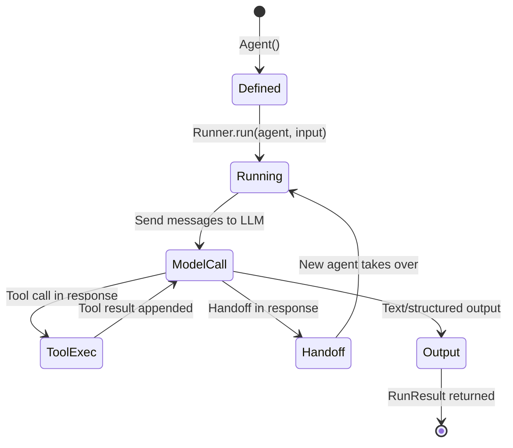
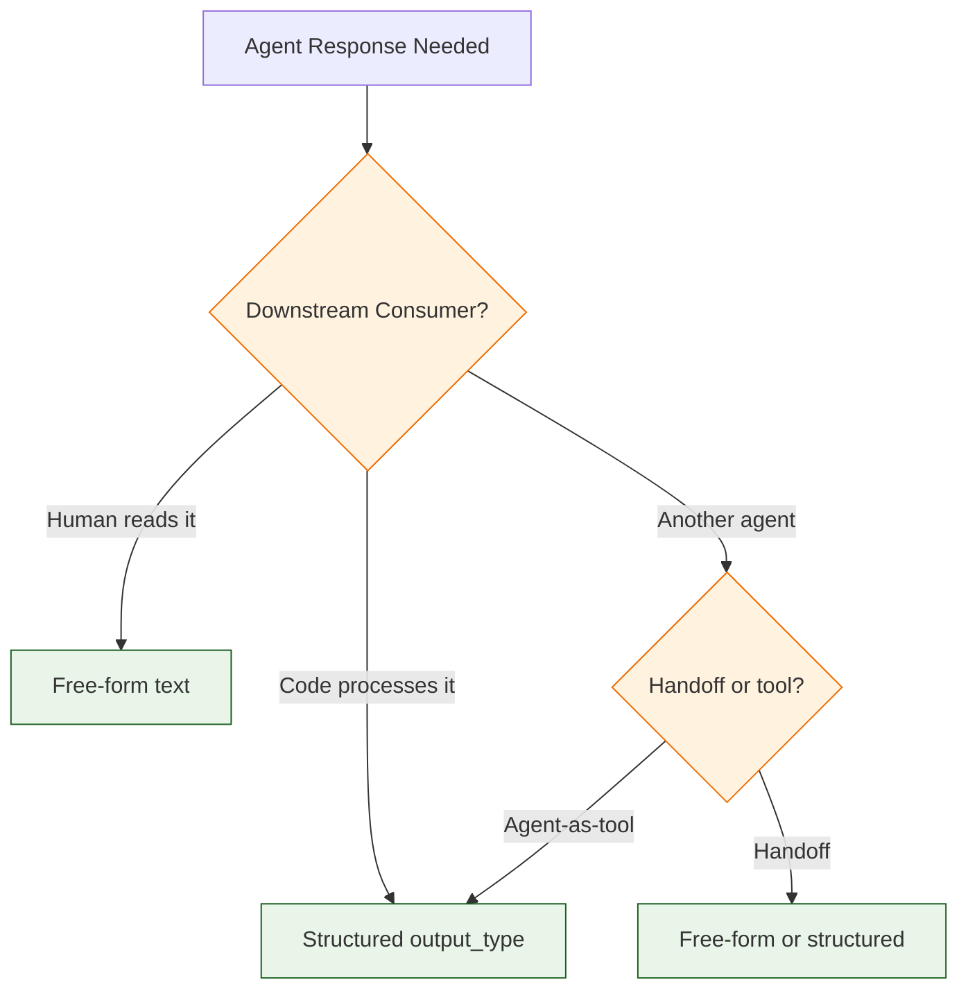
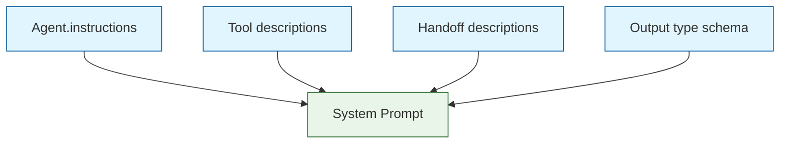

# Chapter 2: Agent Architecture

In [Chapter 1](01-getting-started.md) you created your first agent and ran it. Now we go deeper — how is the `Agent` class structured, what does the agentic loop actually do, and how do instructions, context, and output types shape agent behavior?

## The Agent Class in Detail

An `Agent` in the SDK is a declarative configuration object. It does not run itself — the `Runner` reads its configuration and orchestrates model calls, tool execution, and handoffs.

```python
from agents import Agent

agent = Agent(
    name="Analyst",
    instructions="You analyze data and produce insights.",
    model="gpt-4o",
    tools=[],
    handoffs=[],
    input_guardrails=[],
    output_guardrails=[],
    output_type=None,       # Structured output schema (Pydantic model)
    handoff_description=None,  # Used when this agent is a handoff target
    model_settings=None,    # Temperature, top_p, max_tokens, etc.
)
```

### Agent Lifecycle



## Dynamic Instructions

Instructions can be static strings or dynamic functions. Dynamic instructions receive the run context and the agent, allowing you to personalize behavior per-run:

```python
from agents import Agent, RunContextWrapper

def personalized_instructions(
    context: RunContextWrapper[dict], agent: Agent
) -> str:
    user_name = context.context.get("user_name", "friend")
    expertise = context.context.get("expertise", "general")
    return f"""You are a helpful assistant for {user_name}.
Tailor your responses to someone with {expertise}-level knowledge.
Be concise and practical."""

agent = Agent(
    name="Personalized Helper",
    instructions=personalized_instructions,
)
```

Running with context:

```python
from agents import Runner
import asyncio

async def main():
    context = {"user_name": "Alice", "expertise": "intermediate"}
    result = await Runner.run(
        agent,
        input="Explain how neural networks learn.",
        context=context,
    )
    print(result.final_output)

asyncio.run(main())
```

## Structured Output with output_type

By default, agents produce free-form text. With `output_type`, you can force the agent to return structured data validated by a Pydantic model:

```python
from pydantic import BaseModel
from agents import Agent, Runner
import asyncio

class SentimentResult(BaseModel):
    sentiment: str        # "positive", "negative", or "neutral"
    confidence: float     # 0.0 to 1.0
    reasoning: str        # Brief explanation

sentiment_agent = Agent(
    name="Sentiment Analyzer",
    instructions="Analyze the sentiment of the given text. Return structured output.",
    output_type=SentimentResult,
)

async def analyze():
    result = await Runner.run(
        sentiment_agent,
        input="I absolutely love this new feature! It makes everything so much easier.",
    )
    # result.final_output is a SentimentResult instance
    parsed: SentimentResult = result.final_output_as(SentimentResult)
    print(f"Sentiment: {parsed.sentiment}")
    print(f"Confidence: {parsed.confidence}")
    print(f"Reasoning: {parsed.reasoning}")

asyncio.run(analyze())
```

### When to Use Structured Output



## The Agentic Loop

The Runner executes a loop that continues until the agent produces a final output, a handoff occurs, or a guardrail trips. Understanding this loop is key to debugging agent behavior:

```python
# Pseudocode of the agentic loop
async def agentic_loop(agent, input, max_turns):
    messages = format_input(input)
    current_agent = agent

    for turn in range(max_turns):
        # 1. Check input guardrails (first turn only)
        if turn == 0:
            await check_input_guardrails(current_agent, messages)

        # 2. Call the model
        response = await call_model(
            current_agent.model,
            current_agent.instructions,
            messages,
            current_agent.tools,
            current_agent.handoffs,
            current_agent.output_type,
        )

        # 3. Process the response
        if response.is_final_output:
            await check_output_guardrails(current_agent, response)
            return RunResult(final_output=response.output)

        if response.is_handoff:
            current_agent = response.handoff_target
            continue

        if response.has_tool_calls:
            tool_results = await execute_tools(response.tool_calls)
            messages.extend(tool_results)
            continue

    raise MaxTurnsExceeded()
```

### Turn Budget

The `max_turns` parameter prevents runaway loops:

```python
from agents import Runner

# Conservative: 3 turns max
result = await Runner.run(agent, input="Hello", max_turns=3)

# Generous: 25 turns for complex multi-tool workflows
result = await Runner.run(agent, input="Research this topic", max_turns=25)
```

## System Prompt Construction

The SDK builds the system prompt from several sources, assembled in this order:



```python
# The effective system prompt includes:
# 1. Your instructions string
# 2. Auto-generated descriptions of available tools
# 3. Auto-generated descriptions of handoff targets
# 4. JSON schema of output_type (if set)
```

This means your instructions do not need to describe the tools or handoff targets — the SDK does that automatically. Focus your instructions on *behavior*, *tone*, and *decision-making criteria*.

## Agent Cloning and Composition

You can create agent variants by cloning with overrides:

```python
base_agent = Agent(
    name="Base Support",
    instructions="You are a customer support agent. Be polite and helpful.",
    model="gpt-4o",
)

# Clone with different instructions for different departments
billing_agent = base_agent.clone(
    name="Billing Support",
    instructions=base_agent.instructions + "\nYou specialize in billing questions.",
)

technical_agent = base_agent.clone(
    name="Technical Support",
    instructions=base_agent.instructions + "\nYou specialize in technical issues.",
    model="gpt-4o",  # Could use a different model
)
```

## Context Variables

The `RunContextWrapper` provides typed access to shared state across tools, guardrails, and dynamic instructions:

```python
from dataclasses import dataclass
from agents import Agent, Runner, RunContextWrapper
import asyncio

@dataclass
class UserContext:
    user_id: str
    tier: str  # "free", "pro", "enterprise"
    locale: str

def tier_instructions(ctx: RunContextWrapper[UserContext], agent: Agent) -> str:
    tier = ctx.context.tier
    if tier == "enterprise":
        return "Provide detailed, thorough responses with examples. Offer to schedule calls."
    elif tier == "pro":
        return "Provide helpful responses with relevant details."
    else:
        return "Provide concise responses. Suggest upgrading for more detailed help."

support_agent = Agent[UserContext](
    name="Support",
    instructions=tier_instructions,
)

async def main():
    ctx = UserContext(user_id="u_123", tier="enterprise", locale="en-US")
    result = await Runner.run(
        support_agent,
        input="How do I set up SSO?",
        context=ctx,
    )
    print(result.final_output)

asyncio.run(main())
```

## Model Configuration

### ModelSettings

```python
from agents import Agent, ModelSettings

agent = Agent(
    name="Precise Agent",
    instructions="Be precise and factual.",
    model_settings=ModelSettings(
        temperature=0.0,       # Deterministic output
        top_p=1.0,
        max_tokens=1000,
        tool_choice="auto",    # "auto", "required", "none", or specific tool
        parallel_tool_calls=True,  # Allow parallel tool execution
    ),
)
```

### Reasoning Models

```python
# Use reasoning models for complex tasks
reasoning_agent = Agent(
    name="Reasoner",
    instructions="Solve complex problems step by step.",
    model="o3-mini",
    model_settings=ModelSettings(
        temperature=1.0,  # Required for reasoning models
    ),
)
```

## What We've Accomplished

- Explored the Agent class and all its configuration options
- Understood dynamic instructions with RunContextWrapper
- Implemented structured output with Pydantic models and output_type
- Traced the agentic loop and understood turn budgets
- Learned how system prompts are constructed automatically
- Used context variables for stateful agent behavior
- Configured model settings for different use cases

## Next Steps

Agents are powerful on their own, but they become truly useful when equipped with tools. In [Chapter 3: Tool Integration](03-tool-integration.md), we'll add function tools, hosted tools, and agents-as-tools to expand what your agents can do.

---

## Source Walkthrough

- [`src/agents/agent.py`](https://github.com/openai/openai-agents-python/blob/main/src/agents/agent.py) — Agent dataclass and configuration
- [`src/agents/run.py`](https://github.com/openai/openai-agents-python/blob/main/src/agents/run.py) — Agentic loop implementation
- [`src/agents/models/`](https://github.com/openai/openai-agents-python/tree/main/src/agents/models) — Model interface and settings

## Chapter Connections

- [Previous Chapter: Getting Started](01-getting-started.md)
- [Tutorial Index](README.md)
- [Next Chapter: Tool Integration](03-tool-integration.md)
- [Main Catalog](../../README.md#-tutorial-catalog)
- [A-Z Tutorial Directory](../../discoverability/tutorial-directory.md)
