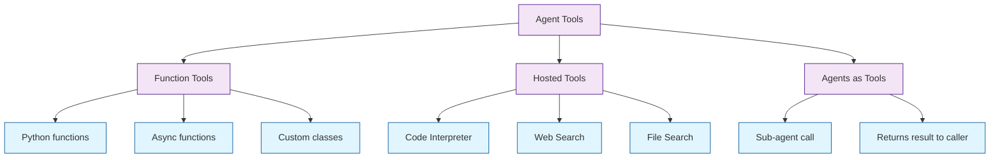
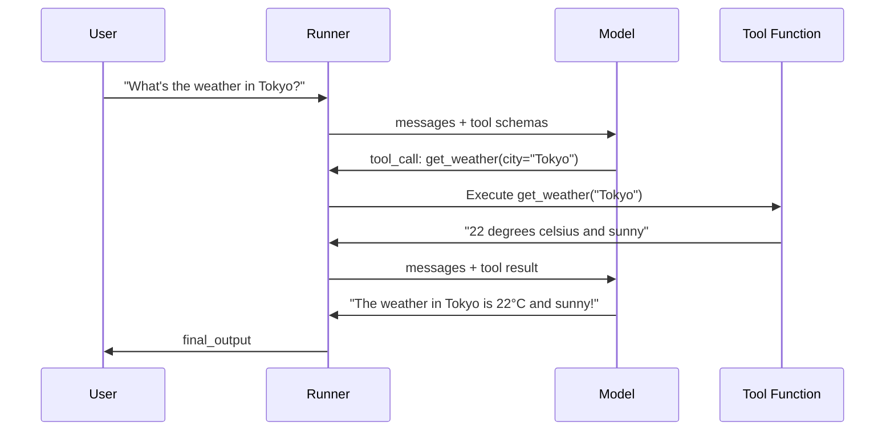
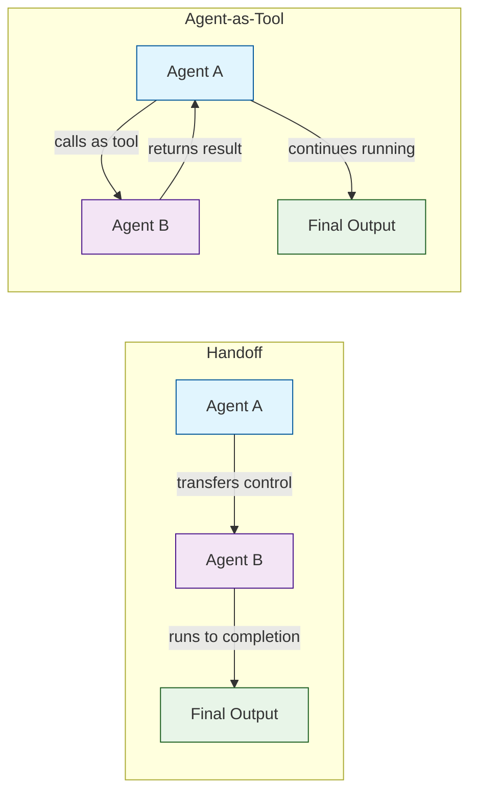

# Chapter 3: Tool Integration

In [Chapter 2](02-agent-architecture.md) you learned how agents are structured and how the agentic loop works. Now we equip agents with tools — the mechanism by which agents take actions in the world beyond generating text. The Agents SDK supports three types of tools: function tools (your Python functions), hosted tools (OpenAI-managed services), and agents-as-tools.

## Tool Types Overview



## Function Tools

The most common tool type. Decorate any Python function with `@function_tool` and the SDK will automatically generate the JSON schema from the function signature and docstring:

```python
from agents import Agent, Runner, function_tool
import asyncio

@function_tool
def get_weather(city: str, units: str = "celsius") -> str:
    """Get the current weather for a city.

    Args:
        city: The city name to get weather for.
        units: Temperature units — 'celsius' or 'fahrenheit'.
    """
    # In production, call a real weather API
    return f"The weather in {city} is 22 degrees {units} and sunny."

weather_agent = Agent(
    name="Weather Agent",
    instructions="Help users check the weather. Use the get_weather tool.",
    tools=[get_weather],
)

async def main():
    result = await Runner.run(
        weather_agent,
        input="What's the weather like in Tokyo?",
    )
    print(result.final_output)

asyncio.run(main())
```

### How Function Tools Work



### Async Function Tools

```python
import httpx
from agents import function_tool

@function_tool
async def fetch_stock_price(symbol: str) -> str:
    """Fetch the current stock price for a given ticker symbol.

    Args:
        symbol: Stock ticker symbol (e.g., 'AAPL', 'GOOGL').
    """
    async with httpx.AsyncClient() as client:
        resp = await client.get(f"https://api.example.com/stock/{symbol}")
        data = resp.json()
        return f"{symbol}: ${data['price']:.2f} ({data['change']:+.2f}%)"
```

### Structured Tool Input with Pydantic

For complex tool inputs, use a Pydantic model:

```python
from pydantic import BaseModel, Field
from agents import function_tool

class SearchQuery(BaseModel):
    query: str = Field(description="The search query string")
    max_results: int = Field(default=5, description="Maximum number of results")
    date_range: str = Field(default="all", description="Filter: 'day', 'week', 'month', 'all'")

@function_tool
def search_documents(params: SearchQuery) -> str:
    """Search the document database with filters."""
    # Implementation here
    return f"Found {params.max_results} results for '{params.query}' in range '{params.date_range}'"
```

### Tools with Context Access

Tools can access the run context for stateful operations:

```python
from dataclasses import dataclass
from agents import Agent, Runner, RunContextWrapper, function_tool
import asyncio

@dataclass
class AppContext:
    user_id: str
    db_connection: object  # Your database connection
    api_key: str

@function_tool
async def get_user_orders(
    ctx: RunContextWrapper[AppContext], limit: int = 5
) -> str:
    """Get recent orders for the current user.

    Args:
        limit: Maximum number of orders to return.
    """
    user_id = ctx.context.user_id
    # Use ctx.context.db_connection to query
    return f"Found {limit} recent orders for user {user_id}"

@function_tool
async def update_order_status(
    ctx: RunContextWrapper[AppContext], order_id: str, status: str
) -> str:
    """Update the status of an order.

    Args:
        order_id: The order ID to update.
        status: New status ('processing', 'shipped', 'delivered', 'cancelled').
    """
    user_id = ctx.context.user_id
    return f"Order {order_id} for user {user_id} updated to '{status}'"

order_agent = Agent[AppContext](
    name="Order Manager",
    instructions="Help users manage their orders.",
    tools=[get_user_orders, update_order_status],
)

async def main():
    ctx = AppContext(user_id="u_42", db_connection=None, api_key="key")
    result = await Runner.run(
        order_agent,
        input="Show me my recent orders",
        context=ctx,
    )
    print(result.final_output)

asyncio.run(main())
```

## Hosted Tools

Hosted tools run on OpenAI's infrastructure. They do not execute in your Python process.

### Web Search

```python
from agents import Agent, Runner, WebSearchTool
import asyncio

research_agent = Agent(
    name="Researcher",
    instructions="Answer questions using web search. Cite your sources.",
    tools=[WebSearchTool()],
)

async def main():
    result = await Runner.run(
        research_agent,
        input="What are the latest developments in quantum computing?",
    )
    print(result.final_output)

asyncio.run(main())
```

### Code Interpreter

```python
from agents import Agent, Runner, CodeInterpreterTool
import asyncio

data_agent = Agent(
    name="Data Analyst",
    instructions="""You are a data analyst. Use the code interpreter to:
- Run Python code for calculations
- Generate charts and visualizations
- Process and analyze data""",
    tools=[CodeInterpreterTool()],
)

async def main():
    result = await Runner.run(
        data_agent,
        input="Calculate the first 20 Fibonacci numbers and plot them.",
    )
    print(result.final_output)

asyncio.run(main())
```

### File Search

```python
from agents import Agent, Runner, FileSearchTool
import asyncio

# File search requires a vector store (created via OpenAI API)
doc_agent = Agent(
    name="Document Expert",
    instructions="Answer questions based on the uploaded documents.",
    tools=[FileSearchTool(vector_store_ids=["vs_abc123"])],
)
```

## Agents as Tools

A powerful pattern: use one agent as a tool for another. Unlike handoffs (which transfer control), agent-as-tool calls the sub-agent and returns its output to the calling agent:

```python
from agents import Agent, Runner
import asyncio

# Specialist agent
translator = Agent(
    name="Translator",
    instructions="Translate the given text to the requested language. Return only the translation.",
    handoff_description="Translates text between languages",
)

# Specialist agent
summarizer = Agent(
    name="Summarizer",
    instructions="Summarize the given text in 2-3 sentences. Return only the summary.",
    handoff_description="Summarizes long text",
)

# Orchestrator uses specialists as tools
orchestrator = Agent(
    name="Content Processor",
    instructions="""You process content requests. Use the available tools:
- Use the Translator tool when translation is needed
- Use the Summarizer tool when summarization is needed
You can chain them: summarize first, then translate the summary.""",
    tools=[
        translator.as_tool(
            tool_name="translate",
            tool_description="Translate text to another language",
        ),
        summarizer.as_tool(
            tool_name="summarize",
            tool_description="Summarize long text concisely",
        ),
    ],
)

async def main():
    result = await Runner.run(
        orchestrator,
        input="Summarize the following article and translate the summary to Spanish: [long article text]",
    )
    print(result.final_output)

asyncio.run(main())
```

### Handoff vs Agent-as-Tool



## Combining Multiple Tool Types

Real agents often mix tool types:

```python
from agents import Agent, function_tool, WebSearchTool, CodeInterpreterTool

@function_tool
def save_report(title: str, content: str) -> str:
    """Save a generated report to the database.

    Args:
        title: Report title.
        content: Full report content in markdown.
    """
    # Save to database
    return f"Report '{title}' saved successfully."

analyst_agent = Agent(
    name="Research Analyst",
    instructions="""You are a research analyst. Your workflow:
1. Use web search to gather current information
2. Use code interpreter to analyze data and create charts
3. Save the final report using the save_report tool""",
    tools=[
        WebSearchTool(),
        CodeInterpreterTool(),
        save_report,
    ],
)
```

## Custom Tool Classes

For advanced use cases, implement the `Tool` base class directly:

```python
from agents.tool import FunctionTool
from pydantic import BaseModel
import json

class DatabaseQueryInput(BaseModel):
    sql: str
    database: str = "default"

class DatabaseQueryTool(FunctionTool):
    def __init__(self):
        super().__init__(
            name="query_database",
            description="Execute a read-only SQL query against the database",
            params_json_schema=DatabaseQueryInput.model_json_schema(),
            on_invoke_tool=self._execute,
        )

    async def _execute(self, ctx, input_json: str) -> str:
        params = DatabaseQueryInput.model_validate_json(input_json)
        # Execute query safely (read-only)
        return json.dumps({"rows": [], "count": 0})
```

## Tool Error Handling

```python
@function_tool
def risky_operation(param: str) -> str:
    """Perform an operation that might fail.

    Args:
        param: The input parameter.
    """
    try:
        result = do_something(param)
        return f"Success: {result}"
    except ValueError as e:
        # Return error as string — the model will see it and can retry or explain
        return f"Error: {e}. Please try with a different parameter."
    except Exception as e:
        return f"Unexpected error: {e}"
```

## What We've Accomplished

- Created function tools with `@function_tool` and automatic schema generation
- Built async tools for I/O-bound operations
- Used context-aware tools that access shared run state
- Integrated hosted tools: web search, code interpreter, and file search
- Implemented the agent-as-tool pattern for sub-agent delegation
- Combined multiple tool types in a single agent
- Handled tool errors gracefully

## Next Steps

Tools let agents *do* things. But what happens when a task is better handled by a different agent entirely? In [Chapter 4: Agent Handoffs](04-agent-handoffs.md), we'll explore the handoff primitive — the mechanism that lets agents transfer control to specialized peers.

---

## Source Walkthrough

- [`src/agents/tool.py`](https://github.com/openai/openai-agents-python/blob/main/src/agents/tool.py) — Tool base classes
- [`src/agents/function_tool.py`](https://github.com/openai/openai-agents-python/blob/main/src/agents/function_tool.py) — @function_tool decorator
- [`src/agents/hosted_tools.py`](https://github.com/openai/openai-agents-python/blob/main/src/agents/hosted_tools.py) — WebSearchTool, CodeInterpreterTool, FileSearchTool

## Chapter Connections

- [Previous Chapter: Agent Architecture](02-agent-architecture.md)
- [Tutorial Index](README.md)
- [Next Chapter: Agent Handoffs](04-agent-handoffs.md)
- [Main Catalog](../../README.md#-tutorial-catalog)
- [A-Z Tutorial Directory](../../discoverability/tutorial-directory.md)
