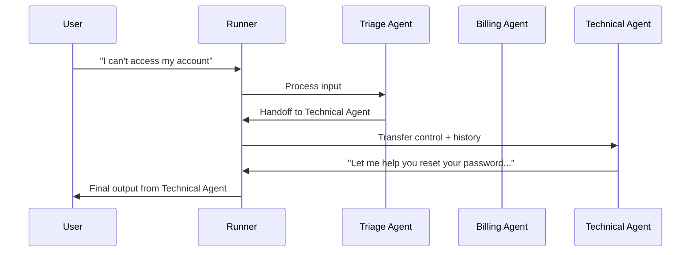
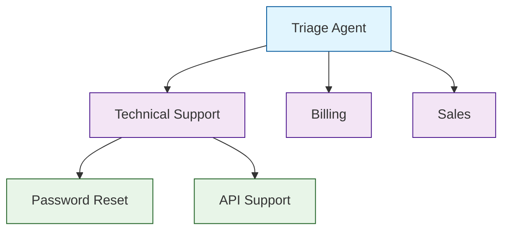
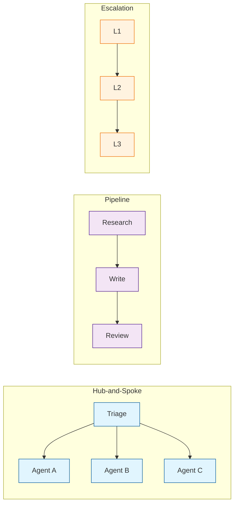

# Chapter 4: Agent Handoffs

Handoffs are the defining feature of the OpenAI Agents SDK — and the concept inherited from Swarm. A handoff transfers control from one agent to another within the same run, carrying conversation history forward. This is how you build multi-agent systems where specialized agents handle different parts of a task.

## The Handoff Concept



When an agent hands off, the Runner:
1. Stops the current agent's turn
2. Switches `current_agent` to the handoff target
3. Continues the agentic loop with the new agent (which sees the full conversation history)
4. The `RunResult.last_agent` reflects whichever agent produced the final output

## Basic Handoffs

The simplest way to set up handoffs is to list target agents in the `handoffs` parameter:

```python
from agents import Agent, Runner
import asyncio

# Specialist agents
billing_agent = Agent(
    name="Billing Specialist",
    instructions="""You handle billing questions: invoices, payments, refunds,
    and subscription changes. Be precise with dollar amounts.""",
    handoff_description="Handles billing, payment, and subscription questions",
)

technical_agent = Agent(
    name="Technical Specialist",
    instructions="""You handle technical issues: bugs, errors, configuration,
    and how-to questions. Ask for error messages and screenshots.""",
    handoff_description="Handles technical issues, bugs, and how-to questions",
)

sales_agent = Agent(
    name="Sales Specialist",
    instructions="""You handle sales inquiries: pricing, plans, demos,
    and enterprise agreements. Be enthusiastic but honest.""",
    handoff_description="Handles sales inquiries, pricing, and demos",
)

# Triage agent routes to specialists
triage_agent = Agent(
    name="Triage Agent",
    instructions="""You are the first point of contact. Determine the user's need and
    hand off to the appropriate specialist:
    - Billing questions → Billing Specialist
    - Technical issues → Technical Specialist
    - Sales inquiries → Sales Specialist

    Ask a clarifying question if the intent is unclear.""",
    handoffs=[billing_agent, technical_agent, sales_agent],
)

async def main():
    result = await Runner.run(
        triage_agent,
        input="I was charged twice for my subscription last month.",
    )
    print(f"Handled by: {result.last_agent.name}")
    print(f"Response: {result.final_output}")

asyncio.run(main())
```

## The handoff_description Field

The `handoff_description` is what the triage agent sees when deciding where to route. It gets injected into the system prompt automatically. Write it like a capability summary:

```python
# Good: specific capabilities
billing_agent = Agent(
    name="Billing",
    handoff_description="Handles invoices, payment failures, refund requests, and plan changes",
    instructions="...",
)

# Bad: vague description
billing_agent = Agent(
    name="Billing",
    handoff_description="Handles billing stuff",  # Too vague for the model to route well
    instructions="...",
)
```

## Handoff Chains

Agents can hand off to agents that hand off to other agents. This creates routing chains:

```python
# Level 3: Deep specialists
password_agent = Agent(
    name="Password Reset Specialist",
    instructions="Walk the user through password reset step by step.",
    handoff_description="Handles password reset and account access recovery",
)

api_agent = Agent(
    name="API Support Specialist",
    instructions="Help with API integration, authentication, and endpoint usage.",
    handoff_description="Handles API questions, integration help, and auth issues",
)

# Level 2: Domain specialist that can escalate further
technical_agent = Agent(
    name="Technical Support",
    instructions="""Handle technical questions. For specific sub-topics:
    - Password/access issues → Password Reset Specialist
    - API questions → API Support Specialist""",
    handoffs=[password_agent, api_agent],
    handoff_description="General technical support",
)

# Level 1: Entry point
triage_agent = Agent(
    name="Triage",
    instructions="Route to the right team.",
    handoffs=[technical_agent, billing_agent, sales_agent],
)
```



## Circular Handoffs (Escalation and Return)

Agents can hand off back to a previous agent. This is useful for "return to triage" or "escalate to human" patterns:

```python
from agents import Agent

# Define agents with circular references
triage_agent = Agent(
    name="Triage",
    instructions="Route to specialists. If they hand back to you, ask the user for more info.",
    handoffs=[],  # Will be set after all agents are defined
)

billing_agent = Agent(
    name="Billing",
    instructions="""Handle billing questions. If the question is not billing-related,
    hand back to Triage for re-routing.""",
    handoffs=[triage_agent],
    handoff_description="Billing and payments",
)

technical_agent = Agent(
    name="Technical",
    instructions="""Handle technical issues. If the question is not technical,
    hand back to Triage for re-routing.""",
    handoffs=[triage_agent],
    handoff_description="Technical support",
)

# Now set triage handoffs (circular reference)
triage_agent.handoffs = [billing_agent, technical_agent]
```

### Preventing Infinite Handoff Loops

Always use `max_turns` to prevent infinite handoff chains:

```python
result = await Runner.run(
    triage_agent,
    input="This is confusing...",
    max_turns=10,  # Safety limit
)
```

## Handoffs with Context Preservation

Handoffs carry the full conversation history. The target agent sees everything the previous agent saw, including tool results:

```python
from agents import Agent, Runner, function_tool
import asyncio

@function_tool
def lookup_account(email: str) -> str:
    """Look up a customer account by email.

    Args:
        email: Customer email address.
    """
    return '{"account_id": "ACC-789", "tier": "pro", "status": "active"}'

# Triage gathers info, then hands off with full context
triage_agent = Agent(
    name="Triage",
    instructions="""First, look up the customer's account using their email.
    Then hand off to the appropriate specialist — they will see the account info.""",
    tools=[lookup_account],
    handoffs=[],  # Set below
)

billing_agent = Agent(
    name="Billing",
    instructions="""You handle billing. The conversation may already contain
    account lookup results — use that information.""",
    handoff_description="Billing questions",
)

triage_agent.handoffs = [billing_agent]

async def main():
    result = await Runner.run(
        triage_agent,
        input="I need help with my bill. My email is alice@example.com.",
    )
    print(f"Agent: {result.last_agent.name}")
    print(result.final_output)

asyncio.run(main())
```

## Custom Handoff Logic

For advanced routing, use the `Handoff` class with custom input filters or callbacks:

```python
from agents import Agent, Handoff, handoff

# Using the handoff() function for customization
custom_handoff = handoff(
    agent=billing_agent,
    tool_name_override="transfer_to_billing",
    tool_description_override="Transfer to billing team for payment and invoice questions",
)

triage_agent = Agent(
    name="Triage",
    instructions="Route to the right team.",
    handoffs=[custom_handoff, technical_agent],
)
```

## Recommended Handoff Patterns

### 1. Hub-and-Spoke (Triage)

Best for customer support, help desks, and intake flows:

```python
triage = Agent(name="Triage", handoffs=[agent_a, agent_b, agent_c])
```

### 2. Pipeline (Sequential)

Best for multi-step workflows where each agent adds value:

```python
researcher = Agent(name="Researcher", handoffs=[writer])
writer = Agent(name="Writer", handoffs=[reviewer])
reviewer = Agent(name="Reviewer", instructions="Produce the final output.")
```

### 3. Escalation Ladder

Best for tiered support:

```python
l1 = Agent(name="L1 Support", handoffs=[l2])
l2 = Agent(name="L2 Support", handoffs=[l3])
l3 = Agent(name="L3 Engineering", instructions="Handle the most complex issues.")
```



## Handoffs vs Agent-as-Tool: When to Use Which

| Aspect | Handoff | Agent-as-Tool |
|--------|---------|---------------|
| Control | Transfers to target | Returns to caller |
| Conversation | Target sees full history | Sub-agent gets specific input |
| Use case | Routing, specialization | Subtask delegation |
| Final output | Target agent's output | Calling agent's output |
| Tracing | Visible as handoff span | Visible as tool call span |

Use **handoffs** when the target agent should own the rest of the conversation. Use **agent-as-tool** (see [Chapter 3](03-tool-integration.md)) when the calling agent needs the result back to continue its own work.

## What We've Accomplished

- Understood the handoff primitive and how it transfers control
- Built a triage-to-specialist routing system
- Created multi-level handoff chains with deep specialists
- Handled circular handoffs with return-to-triage patterns
- Preserved context across handoff boundaries
- Compared handoffs to agent-as-tool for choosing the right pattern

## Next Steps

Handoffs and tools make agents powerful, but power without safety is dangerous. In [Chapter 5: Guardrails & Safety](05-guardrails-safety.md), we'll add input validation and output filtering to ensure agents behave within bounds.

---

## Source Walkthrough

- [`src/agents/handoffs.py`](https://github.com/openai/openai-agents-python/blob/main/src/agents/handoffs.py) — Handoff class and handoff() helper
- [`src/agents/run.py`](https://github.com/openai/openai-agents-python/blob/main/src/agents/run.py) — Handoff processing in the agentic loop
- [`examples/agent_patterns/`](https://github.com/openai/openai-agents-python/tree/main/examples/agent_patterns) — Official handoff examples

## Chapter Connections

- [Previous Chapter: Tool Integration](03-tool-integration.md)
- [Tutorial Index](README.md)
- [Next Chapter: Guardrails & Safety](05-guardrails-safety.md)
- [Main Catalog](../../README.md#-tutorial-catalog)
- [A-Z Tutorial Directory](../../discoverability/tutorial-directory.md)
