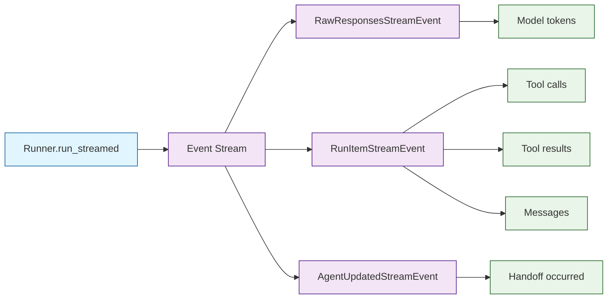
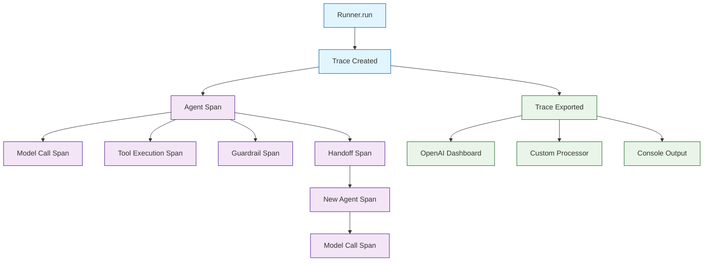

# Chapter 6: Streaming & Tracing

In [Chapter 5](05-guardrails-safety.md) you added safety guardrails to your agents. Now we make agents observable — both in real time (streaming) and after the fact (tracing). These are essential for production UIs and debugging.

## Streaming Architecture

The `Runner.run_streamed()` method returns an async iterator of events. Each event describes something happening in the agentic loop — a model token, a tool call starting, a handoff occurring, etc.



## Basic Streaming

```python
from agents import Agent, Runner
import asyncio

agent = Agent(
    name="Storyteller",
    instructions="Tell creative short stories. Be vivid and engaging.",
)

async def stream_response():
    result = Runner.run_streamed(agent, input="Tell me a story about a robot learning to paint.")

    async for event in result.stream_events():
        # RawResponsesStreamEvent contains model output tokens
        if event.type == "raw_response_event" and hasattr(event.data, "delta"):
            print(event.data.delta, end="", flush=True)

    print()  # Newline at end
    # After streaming completes, the final result is available
    final = result.final_output
    print(f"\n[Handled by: {result.last_agent.name}]")

asyncio.run(stream_response())
```

## Stream Event Types

The SDK emits three categories of events:

### 1. RawResponsesStreamEvent

Raw model output, including text deltas (tokens) as they arrive:

```python
from agents.stream_events import RawResponsesStreamEvent

async for event in result.stream_events():
    if isinstance(event, RawResponsesStreamEvent):
        # event.data contains the raw streaming chunk from the model
        # Useful for token-by-token display
        pass
```

### 2. RunItemStreamEvent

Higher-level items: messages, tool calls, tool results, handoffs:

```python
from agents.stream_events import RunItemStreamEvent

async for event in result.stream_events():
    if isinstance(event, RunItemStreamEvent):
        item = event.item
        if item.type == "tool_call_item":
            print(f"[Calling tool: {item.raw_item.name}]")
        elif item.type == "tool_call_output_item":
            print(f"[Tool result received]")
        elif item.type == "message_output_item":
            print(f"[Agent message]")
```

### 3. AgentUpdatedStreamEvent

Fired when the current agent changes (due to a handoff):

```python
from agents.stream_events import AgentUpdatedStreamEvent

async for event in result.stream_events():
    if isinstance(event, AgentUpdatedStreamEvent):
        print(f"[Handoff: now talking to {event.new_agent.name}]")
```

## Building a Chat UI with Streaming

Here is a complete example suitable for a terminal chat or web socket relay:

```python
from agents import Agent, Runner
from agents.stream_events import (
    RawResponsesStreamEvent,
    RunItemStreamEvent,
    AgentUpdatedStreamEvent,
)
import asyncio

support_agent = Agent(
    name="Support",
    instructions="Help users with their questions. Be thorough.",
)

async def chat_stream(user_message: str):
    result = Runner.run_streamed(support_agent, input=user_message)
    current_agent = support_agent.name

    async for event in result.stream_events():
        if isinstance(event, AgentUpdatedStreamEvent):
            current_agent = event.new_agent.name
            yield {"type": "agent_change", "agent": current_agent}

        elif isinstance(event, RunItemStreamEvent):
            if event.item.type == "tool_call_item":
                yield {"type": "tool_start", "tool": event.item.raw_item.name}
            elif event.item.type == "tool_call_output_item":
                yield {"type": "tool_end"}

        elif isinstance(event, RawResponsesStreamEvent):
            if hasattr(event.data, "delta"):
                yield {"type": "token", "text": event.data.delta}

    yield {"type": "done", "agent": result.last_agent.name}

# Usage
async def main():
    async for chunk in chat_stream("How do I reset my password?"):
        if chunk["type"] == "token":
            print(chunk["text"], end="", flush=True)
        elif chunk["type"] == "agent_change":
            print(f"\n[Transferred to {chunk['agent']}]")
        elif chunk["type"] == "tool_start":
            print(f"\n[Using tool: {chunk['tool']}]", end="")
        elif chunk["type"] == "done":
            print(f"\n[Completed by {chunk['agent']}]")

asyncio.run(main())
```

## Tracing

Every call to `Runner.run()` or `Runner.run_streamed()` is automatically traced. Traces capture the full execution timeline: model calls, tool executions, handoffs, guardrail checks, and their durations.

### Tracing Architecture



### Viewing Traces in the OpenAI Dashboard

By default, traces are sent to the OpenAI platform and visible in your dashboard at [platform.openai.com](https://platform.openai.com). No configuration needed — if your `OPENAI_API_KEY` is set, tracing works automatically.

### Trace Configuration

```python
from agents import Agent, Runner, trace
import asyncio

agent = Agent(name="Helper", instructions="Be helpful.")

async def traced_run():
    # Custom trace name and metadata
    with trace(
        workflow_name="customer_support",
        trace_id=None,  # Auto-generated if None
        group_id="session_abc123",  # Group related traces
        metadata={"user_id": "u_42", "channel": "web"},
        disabled=False,  # Set True to disable tracing
    ):
        result = await Runner.run(agent, input="Hello")
        print(result.final_output)

asyncio.run(traced_run())
```

### Disabling Tracing

```python
from agents import set_tracing_disabled

# Globally disable tracing (e.g., in tests)
set_tracing_disabled(True)

# Or per-run with the trace context manager
with trace(disabled=True):
    result = await Runner.run(agent, input="Hello")
```

## Custom Trace Processors

Send traces to your own observability stack:

```python
from agents.tracing import TracingProcessor, Span, Trace

class DatadogProcessor(TracingProcessor):
    """Send trace data to Datadog APM."""

    def on_trace_start(self, trace: Trace) -> None:
        # Start a Datadog trace
        print(f"[Datadog] Trace started: {trace.trace_id}")

    def on_span_start(self, span: Span) -> None:
        print(f"[Datadog] Span started: {span.span_id} ({span.span_type})")

    def on_span_end(self, span: Span) -> None:
        duration = span.ended_at - span.started_at
        print(f"[Datadog] Span ended: {span.span_id} ({duration:.2f}s)")

    def on_trace_end(self, trace: Trace) -> None:
        print(f"[Datadog] Trace complete: {trace.trace_id}")

# Register custom processor
from agents.tracing import add_trace_processor
add_trace_processor(DatadogProcessor())
```

### Multi-Backend Tracing

```python
from agents.tracing import add_trace_processor

# Traces go to all registered processors + OpenAI dashboard
add_trace_processor(DatadogProcessor())
add_trace_processor(PrometheusProcessor())
add_trace_processor(FileLogProcessor(path="/var/log/agents/traces.jsonl"))
```

## Custom Spans

Add your own spans to annotate business logic within a trace:

```python
from agents import Agent, Runner, function_tool
from agents.tracing import custom_span
import asyncio

@function_tool
async def process_document(document_id: str) -> str:
    """Process a document by ID.

    Args:
        document_id: The ID of the document to process.
    """
    with custom_span(
        name="document_processing",
        data={"document_id": document_id},
    ):
        # Your processing logic
        await asyncio.sleep(0.5)  # Simulate work
        return f"Document {document_id} processed successfully."

agent = Agent(
    name="Doc Processor",
    instructions="Process documents when asked.",
    tools=[process_document],
)
```

## Combining Streaming and Tracing

Streaming and tracing work together seamlessly:

```python
from agents import Agent, Runner, trace
import asyncio

agent = Agent(
    name="Assistant",
    instructions="Be helpful and thorough.",
)

async def traced_stream():
    with trace(workflow_name="chat_session", group_id="session_123"):
        result = Runner.run_streamed(agent, input="Explain quantum computing.")

        token_count = 0
        async for event in result.stream_events():
            if event.type == "raw_response_event" and hasattr(event.data, "delta"):
                print(event.data.delta, end="", flush=True)
                token_count += 1

        print(f"\n\n[Tokens streamed: {token_count}]")
        # Trace is automatically captured with streaming metadata

asyncio.run(traced_stream())
```

## Debugging with Traces

When something goes wrong, traces show you exactly where:

```python
from agents import Agent, Runner, function_tool
from agents.exceptions import MaxTurnsExceeded
import asyncio

@function_tool
def flaky_tool(query: str) -> str:
    """A tool that sometimes fails.

    Args:
        query: The search query.
    """
    import random
    if random.random() < 0.5:
        raise ValueError("Service temporarily unavailable")
    return f"Results for: {query}"

agent = Agent(
    name="Debuggable Agent",
    instructions="Search for information. If a tool fails, try again.",
    tools=[flaky_tool],
)

async def debug_run():
    try:
        result = await Runner.run(agent, input="Search for AI news", max_turns=5)
        print(result.final_output)
    except MaxTurnsExceeded:
        print("Agent exceeded max turns — check trace for tool failure pattern")
    # Check the OpenAI dashboard for the full trace timeline

asyncio.run(debug_run())
```

## What We've Accomplished

- Implemented real-time streaming with `Runner.run_streamed()` and event handlers
- Understood the three event types: raw responses, run items, and agent updates
- Built a chat-UI-ready streaming handler with tool and handoff indicators
- Explored automatic tracing and the OpenAI dashboard
- Configured custom trace processors for Datadog, Prometheus, or file logging
- Added custom spans to annotate business logic within traces
- Combined streaming and tracing for full production observability

## Next Steps

Now you have observable, safe, streaming agents. In [Chapter 7: Multi-Agent Patterns](07-multi-agent-patterns.md), we'll put everything together into proven architectural patterns: orchestrator-worker, pipeline, parallel fan-out, and more.

---

## Source Walkthrough

- [`src/agents/stream_events.py`](https://github.com/openai/openai-agents-python/blob/main/src/agents/stream_events.py) — Stream event types
- [`src/agents/run.py`](https://github.com/openai/openai-agents-python/blob/main/src/agents/run.py) — run_streamed implementation
- [`src/agents/tracing/`](https://github.com/openai/openai-agents-python/tree/main/src/agents/tracing) — Tracing infrastructure

## Chapter Connections

- [Previous Chapter: Guardrails & Safety](05-guardrails-safety.md)
- [Tutorial Index](README.md)
- [Next Chapter: Multi-Agent Patterns](07-multi-agent-patterns.md)
- [Main Catalog](../../README.md#-tutorial-catalog)
- [A-Z Tutorial Directory](../../discoverability/tutorial-directory.md)
