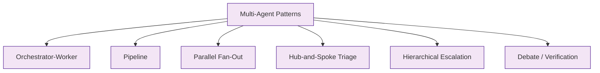
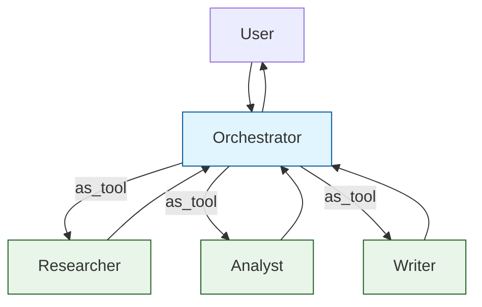
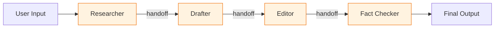
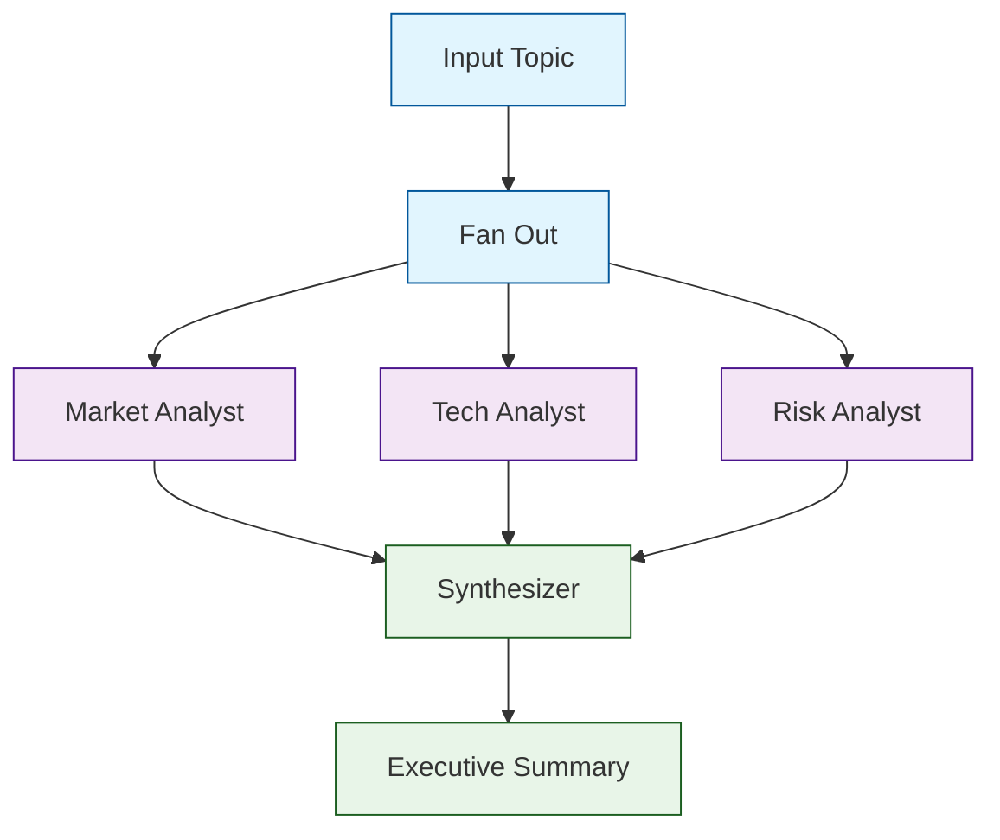
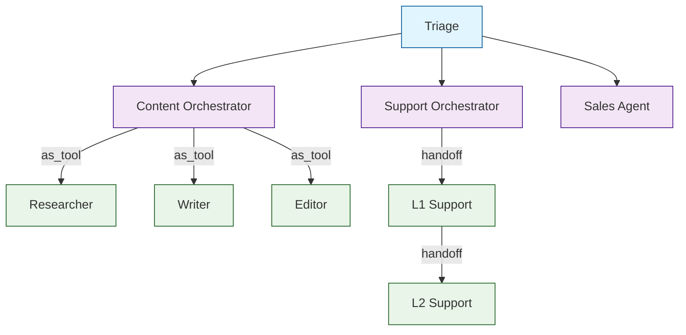

# Chapter 7: Multi-Agent Patterns

You now know every primitive in the SDK: agents, tools, handoffs, guardrails, streaming, and tracing (Chapters [1](01-getting-started.md)--[6](06-streaming-tracing.md)). This chapter shows how to compose them into proven architectural patterns for real applications.

## Pattern Overview



## Pattern 1: Orchestrator-Worker

An orchestrator agent decides which specialist to invoke and synthesizes results. Specialists are called as tools (not handoffs), so control returns to the orchestrator.



```python
from agents import Agent, Runner
import asyncio

researcher = Agent(
    name="Researcher",
    instructions="Research the given topic thoroughly. Return key findings.",
    handoff_description="Research any topic and return findings",
)

analyst = Agent(
    name="Analyst",
    instructions="Analyze the given data or findings. Identify trends and insights.",
    handoff_description="Analyze data and identify insights",
)

writer = Agent(
    name="Writer",
    instructions="Write clear, engaging content based on the provided information.",
    handoff_description="Write polished content from raw material",
)

orchestrator = Agent(
    name="Project Manager",
    instructions="""You manage a content creation pipeline:
1. Use the researcher to gather information on the topic
2. Use the analyst to identify key insights
3. Use the writer to produce the final deliverable
Coordinate the work and synthesize the final output.""",
    tools=[
        researcher.as_tool(tool_name="research", tool_description="Research a topic"),
        analyst.as_tool(tool_name="analyze", tool_description="Analyze findings"),
        writer.as_tool(tool_name="write", tool_description="Write content"),
    ],
)

async def main():
    result = await Runner.run(
        orchestrator,
        input="Create a market analysis report on the AI agents ecosystem in 2026.",
        max_turns=15,
    )
    print(result.final_output)

asyncio.run(main())
```

## Pattern 2: Pipeline (Sequential Handoffs)

Each agent does its part and hands off to the next. The final agent in the chain produces the output.



```python
from agents import Agent, Runner
import asyncio

fact_checker = Agent(
    name="Fact Checker",
    instructions="""You are the final step. Review the edited draft for:
    - Factual accuracy
    - Unsupported claims
    - Missing citations
    Produce the final, verified version.""",
    handoff_description="Final fact-checking pass",
)

editor = Agent(
    name="Editor",
    instructions="""Edit the draft for:
    - Clarity and conciseness
    - Grammar and style
    - Logical flow
    Then hand off to the Fact Checker.""",
    handoffs=[fact_checker],
    handoff_description="Edit for clarity and style",
)

drafter = Agent(
    name="Drafter",
    instructions="""Write a comprehensive draft based on the research notes
    in the conversation history. Then hand off to the Editor.""",
    handoffs=[editor],
    handoff_description="Write the first draft",
)

researcher = Agent(
    name="Researcher",
    instructions="""Research the given topic. Produce detailed notes with
    key facts, data points, and sources. Then hand off to the Drafter.""",
    handoffs=[drafter],
    handoff_description="Research the topic",
)

async def pipeline():
    result = await Runner.run(
        researcher,
        input="Write an article about the impact of AI on software engineering.",
        max_turns=20,
    )
    print(f"Final agent: {result.last_agent.name}")
    print(result.final_output)

asyncio.run(pipeline())
```

## Pattern 3: Parallel Fan-Out

Run multiple agents in parallel and aggregate their results. Use `asyncio.gather` with agent-as-tool or direct Runner calls:

```python
from agents import Agent, Runner
import asyncio

# Three independent analysts
market_analyst = Agent(
    name="Market Analyst",
    instructions="Analyze market trends for the given topic. Be data-driven.",
)

tech_analyst = Agent(
    name="Technology Analyst",
    instructions="Analyze the technology landscape for the given topic.",
)

risk_analyst = Agent(
    name="Risk Analyst",
    instructions="Identify risks and challenges for the given topic.",
)

# Synthesizer combines results
synthesizer = Agent(
    name="Synthesizer",
    instructions="Combine the three analysis reports into a unified executive summary.",
)

async def parallel_analysis(topic: str):
    # Fan out: run three analysts in parallel
    market_task = Runner.run(market_analyst, input=f"Analyze: {topic}")
    tech_task = Runner.run(tech_analyst, input=f"Analyze: {topic}")
    risk_task = Runner.run(risk_analyst, input=f"Analyze: {topic}")

    market_result, tech_result, risk_result = await asyncio.gather(
        market_task, tech_task, risk_task
    )

    # Fan in: synthesize results
    combined_input = f"""Combine these three analyses into an executive summary:

    **Market Analysis:**
    {market_result.final_output}

    **Technology Analysis:**
    {tech_result.final_output}

    **Risk Analysis:**
    {risk_result.final_output}"""

    final = await Runner.run(synthesizer, input=combined_input)
    return final.final_output

async def main():
    summary = await parallel_analysis("Enterprise adoption of AI agents")
    print(summary)

asyncio.run(main())
```



## Pattern 4: Hub-and-Spoke Triage

Covered in [Chapter 4](04-agent-handoffs.md), but here is the full production version with guardrails:

```python
from agents import Agent, InputGuardrail, GuardrailFunctionOutput, RunContextWrapper

async def classify_intent(ctx: RunContextWrapper, agent: Agent, input: str) -> GuardrailFunctionOutput:
    """Log the incoming intent for analytics."""
    return GuardrailFunctionOutput(
        output_info={"logged": True},
        tripwire_triggered=False,
    )

billing = Agent(name="Billing", instructions="Handle billing.", handoff_description="Billing questions")
technical = Agent(name="Technical", instructions="Handle tech issues.", handoff_description="Technical support")
sales = Agent(name="Sales", instructions="Handle sales.", handoff_description="Sales inquiries")

triage = Agent(
    name="Triage",
    instructions="""Classify the user's intent and hand off:
    - Billing → Billing
    - Technical → Technical
    - Sales → Sales
    If unclear, ask one clarifying question before routing.""",
    handoffs=[billing, technical, sales],
    input_guardrails=[InputGuardrail(guardrail_function=classify_intent)],
)
```

## Pattern 5: Hierarchical Escalation

Layered support with escalation paths and return-to-triage:

```python
from agents import Agent

# Top-level: human escalation endpoint
l3_agent = Agent(
    name="L3 Engineering",
    instructions="""You are the final escalation tier. Handle complex technical issues
    that L1 and L2 could not resolve. You have access to internal systems.""",
)

l2_agent = Agent(
    name="L2 Senior Support",
    instructions="""Handle issues that L1 could not resolve. Escalate to L3
    if you cannot resolve within 2 exchanges.""",
    handoffs=[l3_agent],
    handoff_description="Senior support for complex issues",
)

l1_agent = Agent(
    name="L1 Support",
    instructions="""Handle common support questions using the knowledge base.
    If you cannot resolve the issue, escalate to L2.""",
    handoffs=[l2_agent],
    handoff_description="First-line support for common questions",
)
```

## Pattern 6: Debate and Verification

Two agents take opposing positions; a judge agent decides:

```python
from agents import Agent, Runner
import asyncio

advocate = Agent(
    name="Advocate",
    instructions="Argue strongly IN FAVOR of the given proposition. Provide evidence.",
)

critic = Agent(
    name="Critic",
    instructions="Argue strongly AGAINST the given proposition. Identify weaknesses.",
)

judge = Agent(
    name="Judge",
    instructions="""You are an impartial judge. Given arguments for and against a proposition,
    produce a balanced verdict with:
    1. Strongest point from each side
    2. Your assessment
    3. Confidence level (high/medium/low)""",
)

async def debate(proposition: str):
    # Run advocate and critic in parallel
    for_task = Runner.run(advocate, input=f"Argue for: {proposition}")
    against_task = Runner.run(critic, input=f"Argue against: {proposition}")

    for_result, against_result = await asyncio.gather(for_task, against_task)

    verdict_input = f"""Proposition: {proposition}

    **Arguments FOR:**
    {for_result.final_output}

    **Arguments AGAINST:**
    {against_result.final_output}

    Deliver your verdict."""

    verdict = await Runner.run(judge, input=verdict_input)
    return verdict.final_output

async def main():
    result = await debate("AI agents will replace most customer support jobs by 2030")
    print(result)

asyncio.run(main())
```

## Choosing the Right Pattern

| Pattern | Best For | Control Flow | Complexity |
|---------|----------|-------------|------------|
| Orchestrator-Worker | Flexible task decomposition | Agent-as-tool | Medium |
| Pipeline | Linear multi-step processes | Sequential handoffs | Low |
| Parallel Fan-Out | Independent analyses | asyncio.gather | Medium |
| Hub-and-Spoke | Intent classification & routing | Triage handoffs | Low |
| Hierarchical Escalation | Tiered support | Layered handoffs | Low |
| Debate / Verification | Decision validation | Parallel + synthesis | Medium |

## Combining Patterns

Real systems mix patterns. Here is a triage agent that routes to an orchestrator, which uses a pipeline internally:

```python
# Triage routes to domain orchestrators
triage = Agent(
    name="Triage",
    instructions="Route to the right department.",
    handoffs=[content_orchestrator, support_orchestrator, sales_agent],
)

# Content orchestrator uses workers as tools
content_orchestrator = Agent(
    name="Content Team Lead",
    instructions="Coordinate content creation.",
    tools=[
        researcher.as_tool(tool_name="research", tool_description="Research"),
        writer.as_tool(tool_name="write", tool_description="Write"),
        editor.as_tool(tool_name="edit", tool_description="Edit"),
    ],
    handoff_description="Content creation requests",
)
```



## What We've Accomplished

- Learned six proven multi-agent patterns and when to use each
- Built orchestrator-worker systems with agent-as-tool
- Constructed sequential pipelines with handoff chains
- Implemented parallel fan-out with asyncio.gather
- Created debate/verification systems for decision validation
- Combined patterns for complex production architectures

## Next Steps

Patterns are the blueprint; deployment is the execution. In [Chapter 8: Production Deployment](08-production-deployment.md), we'll cover error recovery, cost control, rate limiting, monitoring, and scaling strategies for production agent systems.

---

## Source Walkthrough

- [`examples/agent_patterns/`](https://github.com/openai/openai-agents-python/tree/main/examples/agent_patterns) — Official pattern examples
- [`examples/research_bot/`](https://github.com/openai/openai-agents-python/tree/main/examples/research_bot) — Multi-agent research example

## Chapter Connections

- [Previous Chapter: Streaming & Tracing](06-streaming-tracing.md)
- [Tutorial Index](README.md)
- [Next Chapter: Production Deployment](08-production-deployment.md)
- [Related: CrewAI Tutorial](../crewai-tutorial/) — Alternative multi-agent framework
- [Related: Swarm Tutorial](../swarm-tutorial/) — Predecessor to Agents SDK
- [Main Catalog](../../README.md#-tutorial-catalog)
- [A-Z Tutorial Directory](../../discoverability/tutorial-directory.md)
