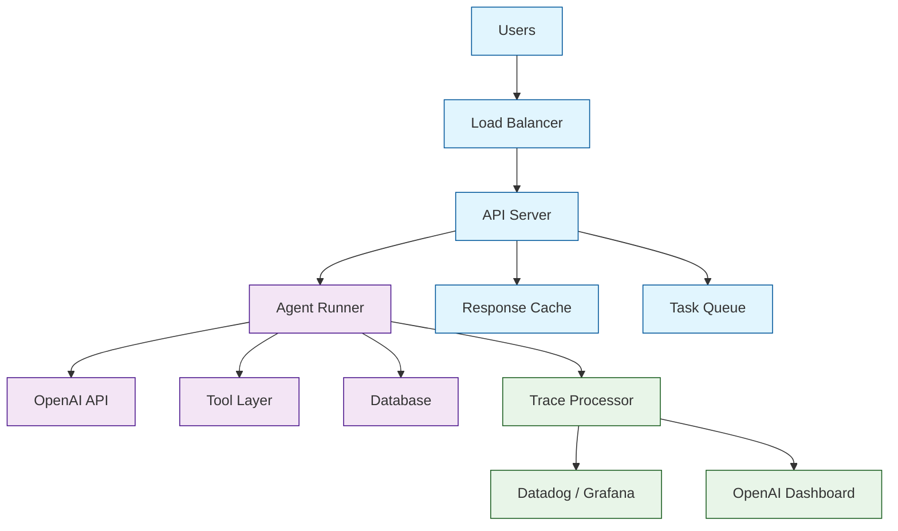

# Chapter 8: Production Deployment

You have built multi-agent systems with tools, handoffs, guardrails, streaming, and tracing (Chapters [1](01-getting-started.md)--[7](07-multi-agent-patterns.md)). This final chapter covers what it takes to run them in production: error recovery, cost control, rate limiting, monitoring, testing, and scaling.

## Production Architecture



## Error Recovery

### Retry with Exponential Backoff

The OpenAI API can return transient errors (rate limits, server errors). Wrap your runner with retry logic:

```python
from agents import Agent, Runner
from agents.exceptions import AgentsException
import asyncio
import random

agent = Agent(name="Production Agent", instructions="Be helpful.")

async def run_with_retry(
    agent: Agent,
    input: str,
    max_retries: int = 3,
    base_delay: float = 1.0,
    max_turns: int = 10,
):
    """Run an agent with exponential backoff retry."""
    last_error = None

    for attempt in range(max_retries):
        try:
            result = await Runner.run(
                agent,
                input=input,
                max_turns=max_turns,
            )
            return result
        except AgentsException as e:
            last_error = e
            if attempt < max_retries - 1:
                delay = base_delay * (2 ** attempt) + random.uniform(0, 1)
                print(f"Attempt {attempt + 1} failed: {e}. Retrying in {delay:.1f}s")
                await asyncio.sleep(delay)

    raise last_error
```

### Graceful Degradation

When an agent fails, fall back to a simpler agent or a static response:

```python
from agents import Agent, Runner
from agents.exceptions import AgentsException, MaxTurnsExceeded
import asyncio

primary_agent = Agent(
    name="Primary",
    instructions="Provide detailed, helpful responses with tool use.",
    tools=[web_search, code_interpreter],
    model="gpt-4o",
)

fallback_agent = Agent(
    name="Fallback",
    instructions="Provide helpful responses without tools. Acknowledge limitations.",
    model="gpt-4o-mini",
)

async def resilient_run(input: str):
    try:
        return await Runner.run(primary_agent, input=input, max_turns=10)
    except MaxTurnsExceeded:
        print("[WARN] Primary agent exceeded max turns, trying fallback")
        return await Runner.run(fallback_agent, input=input, max_turns=3)
    except AgentsException as e:
        print(f"[ERROR] Agent failed: {e}")
        return await Runner.run(fallback_agent, input=input, max_turns=3)
```

## Cost Control

### Token Budget Management

```python
from agents import Agent, ModelSettings

# Use cheaper models for simple tasks
triage_agent = Agent(
    name="Triage",
    instructions="Classify and route. Be brief.",
    model="gpt-4o-mini",  # Cheap for classification
    model_settings=ModelSettings(max_tokens=100),
)

# Use powerful models only for complex tasks
analyst_agent = Agent(
    name="Analyst",
    instructions="Provide deep analysis.",
    model="gpt-4o",
    model_settings=ModelSettings(max_tokens=2000),
)
```

### Cost Tracking Middleware

```python
from agents.tracing import TracingProcessor, Span, Trace
from dataclasses import dataclass, field

# Approximate pricing per 1K tokens (adjust to current rates)
MODEL_COSTS = {
    "gpt-4o": {"input": 0.0025, "output": 0.01},
    "gpt-4o-mini": {"input": 0.00015, "output": 0.0006},
    "o3-mini": {"input": 0.0011, "output": 0.0044},
}

@dataclass
class CostTracker(TracingProcessor):
    total_cost: float = 0.0
    run_costs: dict = field(default_factory=dict)

    def on_span_end(self, span: Span) -> None:
        if span.span_type == "model_call" and hasattr(span, "usage"):
            model = span.data.get("model", "gpt-4o")
            costs = MODEL_COSTS.get(model, MODEL_COSTS["gpt-4o"])
            input_cost = (span.usage.input_tokens / 1000) * costs["input"]
            output_cost = (span.usage.output_tokens / 1000) * costs["output"]
            run_cost = input_cost + output_cost
            self.total_cost += run_cost

    def on_trace_end(self, trace: Trace) -> None:
        self.run_costs[trace.trace_id] = self.total_cost
        if self.total_cost > 1.0:  # Alert threshold
            print(f"[COST ALERT] Trace {trace.trace_id}: ${self.total_cost:.4f}")

# Register the cost tracker
from agents.tracing import add_trace_processor
cost_tracker = CostTracker()
add_trace_processor(cost_tracker)
```

### Per-Request Budget Enforcement

```python
from dataclasses import dataclass
from agents import Agent, InputGuardrail, GuardrailFunctionOutput, RunContextWrapper

@dataclass
class BudgetContext:
    user_id: str
    budget_remaining_cents: int  # Remaining budget in cents
    estimated_cost_cents: int = 10  # Default estimated cost

async def check_budget(
    ctx: RunContextWrapper[BudgetContext], agent: Agent, input: str
) -> GuardrailFunctionOutput:
    """Block requests that would exceed the user's budget."""
    if ctx.context.budget_remaining_cents < ctx.context.estimated_cost_cents:
        return GuardrailFunctionOutput(
            output_info={"reason": "Budget exceeded", "remaining": ctx.context.budget_remaining_cents},
            tripwire_triggered=True,
        )
    return GuardrailFunctionOutput(
        output_info={"budget_ok": True},
        tripwire_triggered=False,
    )

budget_agent = Agent[BudgetContext](
    name="Budget-Aware Agent",
    instructions="Help the user.",
    input_guardrails=[InputGuardrail(guardrail_function=check_budget)],
)
```

## Rate Limiting

### Application-Level Rate Limiter

```python
import asyncio
from collections import defaultdict
from datetime import datetime, timedelta

class RateLimiter:
    def __init__(self, max_requests: int, window_seconds: int):
        self.max_requests = max_requests
        self.window = timedelta(seconds=window_seconds)
        self.requests: dict[str, list[datetime]] = defaultdict(list)
        self._lock = asyncio.Lock()

    async def check(self, user_id: str) -> bool:
        async with self._lock:
            now = datetime.now()
            cutoff = now - self.window
            self.requests[user_id] = [
                t for t in self.requests[user_id] if t > cutoff
            ]
            if len(self.requests[user_id]) >= self.max_requests:
                return False
            self.requests[user_id].append(now)
            return True

# Usage
limiter = RateLimiter(max_requests=20, window_seconds=60)

async def handle_request(user_id: str, input: str):
    if not await limiter.check(user_id):
        return {"error": "Rate limit exceeded. Please wait."}

    result = await Runner.run(agent, input=input)
    return {"output": result.final_output}
```

## Testing Strategies

### Unit Testing Agents

```python
import pytest
from agents import Agent, Runner

@pytest.mark.asyncio
async def test_triage_routes_billing():
    """Test that billing questions get routed to the billing agent."""
    billing = Agent(name="Billing", instructions="Handle billing.", handoff_description="Billing")
    technical = Agent(name="Technical", instructions="Handle tech.", handoff_description="Technical")
    triage = Agent(
        name="Triage",
        instructions="Route billing to Billing, technical to Technical.",
        handoffs=[billing, technical],
    )

    result = await Runner.run(triage, input="I was double-charged.", max_turns=5)
    assert result.last_agent.name == "Billing"

@pytest.mark.asyncio
async def test_structured_output():
    """Test that structured output matches the expected schema."""
    from pydantic import BaseModel

    class Classification(BaseModel):
        category: str
        confidence: float

    agent = Agent(
        name="Classifier",
        instructions="Classify the input as 'question', 'complaint', or 'feedback'.",
        output_type=Classification,
    )

    result = await Runner.run(agent, input="Why is my order late?")
    output = result.final_output_as(Classification)
    assert output.category in ["question", "complaint", "feedback"]
    assert 0.0 <= output.confidence <= 1.0
```

### Testing Guardrails

```python
@pytest.mark.asyncio
async def test_profanity_guardrail_trips():
    """Test that the profanity guardrail blocks bad input."""
    from agents.exceptions import InputGuardrailTripwireTriggered

    with pytest.raises(InputGuardrailTripwireTriggered):
        await Runner.run(safe_agent, input="This contains badword1")

@pytest.mark.asyncio
async def test_clean_input_passes():
    """Test that clean input passes the guardrail."""
    result = await Runner.run(safe_agent, input="Hello, can you help me?")
    assert result.final_output is not None
```

### Integration Testing with Mocked Models

```python
from agents import Agent, Runner
from unittest.mock import AsyncMock, patch

@pytest.mark.asyncio
async def test_tool_called_correctly():
    """Verify that the agent calls the right tool with correct arguments."""
    mock_tool = AsyncMock(return_value="Mocked result")

    # Test tool execution in isolation
    result = await mock_tool(city="Tokyo")
    mock_tool.assert_called_once_with(city="Tokyo")
```

## Monitoring and Alerting

### Health Check Endpoint

```python
from agents import Agent, Runner
import asyncio

health_agent = Agent(
    name="Health Check",
    instructions="Respond with 'ok'.",
    model="gpt-4o-mini",
)

async def health_check() -> dict:
    """Quick health check to verify the agent system is operational."""
    try:
        result = await asyncio.wait_for(
            Runner.run(health_agent, input="ping", max_turns=1),
            timeout=10.0,
        )
        return {"status": "healthy", "agent": result.last_agent.name}
    except asyncio.TimeoutError:
        return {"status": "degraded", "error": "timeout"}
    except Exception as e:
        return {"status": "unhealthy", "error": str(e)}
```

### Metrics Collection

```python
from agents.tracing import TracingProcessor, Span, Trace
import time

class MetricsProcessor(TracingProcessor):
    """Emit metrics for Prometheus/StatsD/Datadog."""

    def on_trace_start(self, trace: Trace) -> None:
        # Increment request counter
        metrics.increment("agent.runs.started")

    def on_trace_end(self, trace: Trace) -> None:
        duration = trace.ended_at - trace.started_at
        metrics.histogram("agent.runs.duration_seconds", duration)
        metrics.increment("agent.runs.completed")

    def on_span_end(self, span: Span) -> None:
        if span.span_type == "model_call":
            metrics.increment("agent.model_calls.total", tags=[f"model:{span.data.get('model')}"])
        elif span.span_type == "tool_call":
            metrics.increment("agent.tool_calls.total", tags=[f"tool:{span.data.get('tool_name')}"])
        elif span.span_type == "handoff":
            metrics.increment("agent.handoffs.total")
```

## Scaling Strategies

### Async Concurrency

```python
import asyncio
from agents import Agent, Runner

agent = Agent(name="Worker", instructions="Process requests.")

async def process_batch(requests: list[str], concurrency: int = 10):
    """Process a batch of requests with bounded concurrency."""
    semaphore = asyncio.Semaphore(concurrency)

    async def process_one(input_text: str):
        async with semaphore:
            return await Runner.run(agent, input=input_text, max_turns=5)

    tasks = [process_one(req) for req in requests]
    results = await asyncio.gather(*tasks, return_exceptions=True)

    successes = [r for r in results if not isinstance(r, Exception)]
    failures = [r for r in results if isinstance(r, Exception)]
    print(f"Processed {len(successes)} successes, {len(failures)} failures")
    return results
```

### FastAPI Integration

```python
from fastapi import FastAPI, HTTPException
from pydantic import BaseModel
from agents import Agent, Runner
from agents.exceptions import InputGuardrailTripwireTriggered

app = FastAPI()

agent = Agent(
    name="API Agent",
    instructions="Answer questions helpfully.",
    input_guardrails=[...],
)

class ChatRequest(BaseModel):
    message: str
    user_id: str

class ChatResponse(BaseModel):
    response: str
    agent: str

@app.post("/chat", response_model=ChatResponse)
async def chat(request: ChatRequest):
    try:
        result = await Runner.run(
            agent,
            input=request.message,
            max_turns=10,
        )
        return ChatResponse(
            response=result.final_output,
            agent=result.last_agent.name,
        )
    except InputGuardrailTripwireTriggered:
        raise HTTPException(status_code=400, detail="Message was flagged by safety filters.")
    except Exception as e:
        raise HTTPException(status_code=500, detail="An error occurred processing your request.")
```

## Production Checklist

Before deploying to production, verify:

- [ ] **Max turns** set on all Runner.run calls to prevent runaway loops
- [ ] **Input guardrails** for content moderation and injection prevention
- [ ] **Output guardrails** for PII leakage and brand compliance
- [ ] **Error handling** with retries and graceful fallbacks
- [ ] **Cost tracking** with per-user budget enforcement
- [ ] **Rate limiting** at the application layer
- [ ] **Tracing** enabled with a custom processor for your observability stack
- [ ] **Health checks** for monitoring and alerting
- [ ] **Integration tests** covering handoff routing and tool execution
- [ ] **Model selection** optimized (cheap models for triage, powerful for analysis)
- [ ] **Timeouts** on all async operations
- [ ] **Logging** of guardrail trips and error details (without PII)

## What We've Accomplished

- Built retry logic with exponential backoff for transient API errors
- Implemented graceful degradation with primary/fallback agents
- Set up cost tracking and per-user budget enforcement
- Created application-level rate limiting
- Wrote unit and integration tests for agents, guardrails, and handoffs
- Built health check endpoints and metrics collection
- Integrated agents with FastAPI for HTTP serving
- Established a production readiness checklist

## Summary

Over eight chapters, you have learned the complete OpenAI Agents SDK:

| Chapter | Primitive | Key Concept |
|---------|-----------|-------------|
| [1. Getting Started](01-getting-started.md) | Agent, Runner | The agentic loop |
| [2. Agent Architecture](02-agent-architecture.md) | Instructions, output_type | Declarative agent design |
| [3. Tool Integration](03-tool-integration.md) | function_tool, hosted tools | Agents take actions |
| [4. Agent Handoffs](04-agent-handoffs.md) | Handoffs | Agent-to-agent routing |
| [5. Guardrails & Safety](05-guardrails-safety.md) | Guardrails, tripwires | Input/output validation |
| [6. Streaming & Tracing](06-streaming-tracing.md) | Stream events, traces | Real-time UIs and debugging |
| [7. Multi-Agent Patterns](07-multi-agent-patterns.md) | Orchestrator, pipeline, fan-out | Architecture patterns |
| [8. Production Deployment](08-production-deployment.md) | Retries, costs, monitoring | Production readiness |

You are now equipped to build production-grade multi-agent systems with the OpenAI Agents SDK.

---

## Source Walkthrough

- [View Repo](https://github.com/openai/openai-agents-python)
- [`examples/`](https://github.com/openai/openai-agents-python/tree/main/examples) — Official examples
- [OpenAI Agents Documentation](https://openai.github.io/openai-agents-python/)

## Chapter Connections

- [Previous Chapter: Multi-Agent Patterns](07-multi-agent-patterns.md)
- [Tutorial Index](README.md)
- [Related: CrewAI Tutorial](../crewai-tutorial/)
- [Related: Swarm Tutorial](../swarm-tutorial/)
- [Related: A2A Protocol Tutorial](../a2a-protocol-tutorial/)
- [Main Catalog](../../README.md#-tutorial-catalog)
- [A-Z Tutorial Directory](../../discoverability/tutorial-directory.md)
