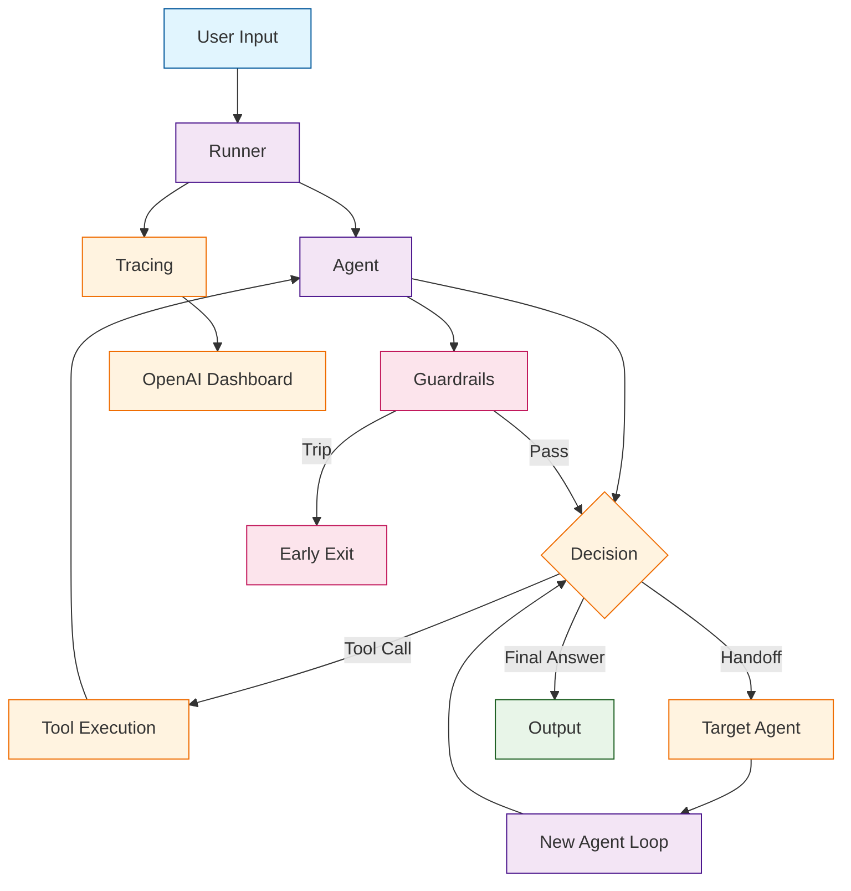

# OpenAI Agents Tutorial: Building Production Multi-Agent Systems

OpenAI Agents SDK[View Repo](https://github.com/openai/openai-agents-python) is the official OpenAI framework for building multi-agent systems in Python. As the production successor to [Swarm](https://github.com/openai/swarm), it provides first-class primitives for agent handoffs, tool use, guardrails, streaming, and tracing — all backed by the OpenAI API and designed for real-world deployment.

The SDK embraces a minimalist, opinionated design: agents are defined declaratively with instructions, tools, and handoff targets, while the `Runner` orchestrates the agentic loop, model calls, and tool execution behind a clean async interface.

## Mental Model

## Why This Track Matters

The OpenAI Agents SDK is increasingly the default choice for Python developers building multi-agent applications on the OpenAI platform. **Latest Release**: The SDK has matured rapidly since its March 2025 launch, with built-in support for GPT-4.1, streaming events, guardrail validation, and first-party tracing integrated with the OpenAI dashboard.

This track focuses on:

- understanding the agent primitive and its declarative configuration
- mastering tool integration and function calling patterns
- building multi-agent systems with handoffs and routing
- implementing guardrails for input/output safety
- using streaming, tracing, and observability for production systems

## Chapter Guide

Welcome to your journey through the OpenAI Agents SDK! This tutorial takes you from first install to production-grade multi-agent systems.

1. **[Chapter 1: Getting Started](01-getting-started.md)** - Installation, configuration, and your first agent
2. **[Chapter 2: Agent Architecture](02-agent-architecture.md)** - The Agent primitive, instructions, models, and lifecycle
3. **[Chapter 3: Tool Integration](03-tool-integration.md)** - Function tools, hosted tools, and custom integrations
4. **[Chapter 4: Agent Handoffs](04-agent-handoffs.md)** - Routing between agents, escalation, and specialization
5. **[Chapter 5: Guardrails & Safety](05-guardrails-safety.md)** - Input/output validation and tripwire patterns
6. **[Chapter 6: Streaming & Tracing](06-streaming-tracing.md)** - Real-time events, spans, and the tracing dashboard
7. **[Chapter 7: Multi-Agent Patterns](07-multi-agent-patterns.md)** - Orchestrator, pipeline, and parallel agent topologies
8. **[Chapter 8: Production Deployment](08-production-deployment.md)** - Scaling, error handling, cost control, and monitoring

## Current Snapshot (auto-updated)

- repository: [`openai/openai-agents-python`](https://github.com/openai/openai-agents-python)
- stars: about **20.7k**
- latest release: [`v0.13.6`](https://github.com/openai/openai-agents-python/releases/tag/v0.13.6) (published 2026-04-09)

## What You Will Learn

By the end of this tutorial, you'll be able to:

- **Build intelligent agents** with declarative instructions, tools, and handoffs
- **Orchestrate multi-agent systems** using handoffs, routing, and specialization
- **Implement safety guardrails** for input validation and output filtering
- **Integrate tools** including function tools, code interpreter, and web search
- **Stream agent responses** with fine-grained event handling
- **Trace and debug** agent runs using built-in tracing and the OpenAI dashboard
- **Design production architectures** with error recovery, cost controls, and monitoring
- **Apply proven patterns** for orchestrator, pipeline, and parallel agent topologies

## Prerequisites

- Python 3.9+ (3.11+ recommended)
- An OpenAI API key with access to GPT-4o or later models
- Basic understanding of async/await in Python
- Familiarity with LLM concepts (prompts, tool calling, function calling)

## What's New

> **Production Successor to Swarm**: The OpenAI Agents SDK brings Swarm's lightweight agent-handoff philosophy into a production-grade framework with built-in tracing, guardrails, and streaming.

Key features:
- **Agent Handoffs**: First-class primitive for routing between specialized agents
- **Guardrails**: Input and output validation with tripwire abort patterns
- **Streaming**: Fine-grained event stream for real-time UIs
- **Tracing**: Built-in OpenTelemetry-compatible tracing with OpenAI dashboard integration
- **Tool Use**: Function tools, hosted tools (code interpreter, web search), and agents-as-tools

## Learning Path

### Beginner Track
Perfect for developers new to multi-agent systems:
1. Chapters 1-2: Setup and agent fundamentals
2. Focus on understanding the agent lifecycle and Runner

### Intermediate Track
For developers building agent applications:
1. Chapters 3-5: Tools, handoffs, and guardrails
2. Learn to build interconnected multi-agent workflows

### Advanced Track
For production multi-agent system development:
1. Chapters 6-8: Streaming, tracing, patterns, and deployment
2. Master enterprise-grade agent orchestration

---

**Ready to build multi-agent systems with OpenAI? Let's begin with [Chapter 1: Getting Started](01-getting-started.md)!**

## Related Tutorials

- [Swarm Tutorial](../swarm-tutorial/)
- [CrewAI Tutorial](../crewai-tutorial/)
- [MetaGPT Tutorial](../metagpt-tutorial/)
- [A2A Protocol Tutorial](../a2a-protocol-tutorial/)

## Navigation & Backlinks

- [Start Here: Chapter 1: Getting Started](01-getting-started.md)
- [Back to Main Catalog](../../README.md#-tutorial-catalog)
- [Browse A-Z Tutorial Directory](../../discoverability/tutorial-directory.md)
- [Search by Intent](../../discoverability/query-hub.md)
- [Explore Category Hubs](../../README.md#category-hubs)

*Generated by [AI Codebase Knowledge Builder](https://github.com/The-Pocket/Tutorial-Codebase-Knowledge)*

## Full Chapter Map

1. [Chapter 1: Getting Started](01-getting-started.md)
2. [Chapter 2: Agent Architecture](02-agent-architecture.md)
3. [Chapter 3: Tool Integration](03-tool-integration.md)
4. [Chapter 4: Agent Handoffs](04-agent-handoffs.md)
5. [Chapter 5: Guardrails & Safety](05-guardrails-safety.md)
6. [Chapter 6: Streaming & Tracing](06-streaming-tracing.md)
7. [Chapter 7: Multi-Agent Patterns](07-multi-agent-patterns.md)
8. [Chapter 8: Production Deployment](08-production-deployment.md)

## Source References

- [View Repo](https://github.com/openai/openai-agents-python)
- [OpenAI Agents Documentation](https://openai.github.io/openai-agents-python/)
- [Swarm (predecessor)](https://github.com/openai/swarm)
