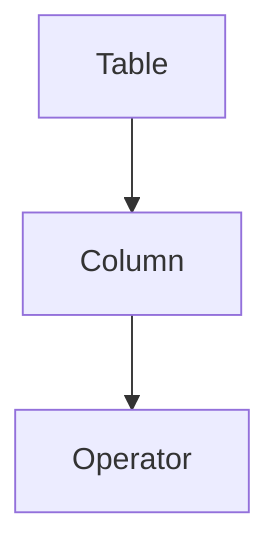

# Chapter 1: Getting Started

Welcome to **Chapter 1: Getting Started**. In this part of **OpenAI Python SDK Tutorial: Production API Patterns**, you will build an intuitive mental model first, then move into concrete implementation details and practical production tradeoffs.


This chapter gets you to a stable baseline with Responses API-first code.

## Install and Configure

```bash
python3 -m venv .venv
source .venv/bin/activate
pip install --upgrade pip
pip install openai
export OPENAI_API_KEY="your_api_key_here"
```

## First Responses API Call

```python
from openai import OpenAI

client = OpenAI()

response = client.responses.create(
    model="gpt-5.2",
    input="Summarize why idempotency matters in API design in 3 bullets."
)

print(response.output_text)
```

## Async Variant

```python
import asyncio
from openai import AsyncOpenAI

async def main():
    client = AsyncOpenAI()
    resp = await client.responses.create(
        model="gpt-5.2",
        input="Give 3 tips for reliable background jobs."
    )
    print(resp.output_text)

asyncio.run(main())
```

## Baseline Production Controls

- set explicit client timeouts
- capture request IDs in logs
- keep secrets out of source control
- fail fast on invalid configuration

## Summary

You now have a working SDK setup with both sync and async Responses API calls.

Next: [Chapter 2: Chat Completions](02-chat-completions.md)

## Depth Expansion Playbook

## Source Code Walkthrough

### `examples/parsing_tools.py`

The `Table` class in [`examples/parsing_tools.py`](https://github.com/openai/openai-python/blob/HEAD/examples/parsing_tools.py) handles a key part of this chapter's functionality:

```py


class Table(str, Enum):
    orders = "orders"
    customers = "customers"
    products = "products"


class Column(str, Enum):
    id = "id"
    status = "status"
    expected_delivery_date = "expected_delivery_date"
    delivered_at = "delivered_at"
    shipped_at = "shipped_at"
    ordered_at = "ordered_at"
    canceled_at = "canceled_at"


class Operator(str, Enum):
    eq = "="
    gt = ">"
    lt = "<"
    le = "<="
    ge = ">="
    ne = "!="


class OrderBy(str, Enum):
    asc = "asc"
    desc = "desc"


```

This class is important because it defines how OpenAI Python SDK Tutorial: Production API Patterns implements the patterns covered in this chapter.

### `examples/parsing_tools.py`

The `Column` class in [`examples/parsing_tools.py`](https://github.com/openai/openai-python/blob/HEAD/examples/parsing_tools.py) handles a key part of this chapter's functionality:

```py


class Column(str, Enum):
    id = "id"
    status = "status"
    expected_delivery_date = "expected_delivery_date"
    delivered_at = "delivered_at"
    shipped_at = "shipped_at"
    ordered_at = "ordered_at"
    canceled_at = "canceled_at"


class Operator(str, Enum):
    eq = "="
    gt = ">"
    lt = "<"
    le = "<="
    ge = ">="
    ne = "!="


class OrderBy(str, Enum):
    asc = "asc"
    desc = "desc"


class DynamicValue(BaseModel):
    column_name: str


class Condition(BaseModel):
    column: str
```

This class is important because it defines how OpenAI Python SDK Tutorial: Production API Patterns implements the patterns covered in this chapter.

### `examples/parsing_tools.py`

The `Operator` class in [`examples/parsing_tools.py`](https://github.com/openai/openai-python/blob/HEAD/examples/parsing_tools.py) handles a key part of this chapter's functionality:

```py


class Operator(str, Enum):
    eq = "="
    gt = ">"
    lt = "<"
    le = "<="
    ge = ">="
    ne = "!="


class OrderBy(str, Enum):
    asc = "asc"
    desc = "desc"


class DynamicValue(BaseModel):
    column_name: str


class Condition(BaseModel):
    column: str
    operator: Operator
    value: Union[str, int, DynamicValue]


class Query(BaseModel):
    table_name: Table
    columns: List[Column]
    conditions: List[Condition]
    order_by: OrderBy

```

This class is important because it defines how OpenAI Python SDK Tutorial: Production API Patterns implements the patterns covered in this chapter.


## How These Components Connect


